#  118：Python中的SQL描述性查询 📊

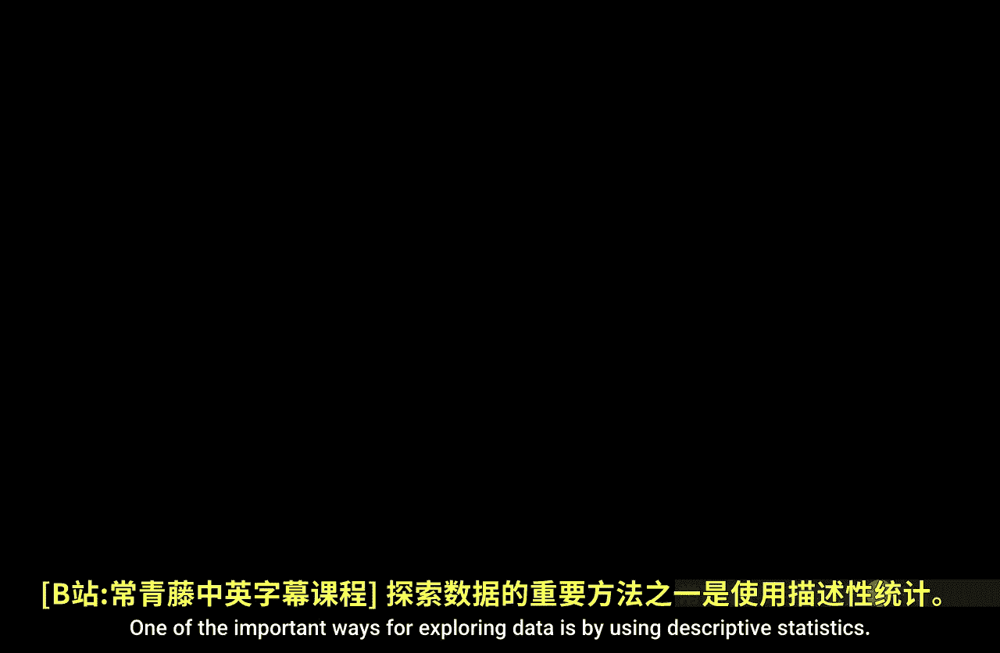

在本节课中，我们将学习如何使用SQL查询来探索数据，特别是通过描述性统计来汇总数据框（DataFrame）中各个列的关键信息。我们将重点介绍如何在不将整个数据库表读入Python环境的情况下，直接使用SQL查询来获取数据的概览，例如总和、最小值、平均值、最大值以及唯一值的数量。

## 连接数据库与查看结构

首先，我们需要连接到SQLite数据库并查看其结构。以下是连接数据库和查看表结构的步骤。

```python
import pandas as pd
import sqlite3

# 建立与数据库的连接
conn = sqlite3.connect('techca.db')
```


接下来，我们获取数据库的模式（schema），以了解其中包含哪些表。

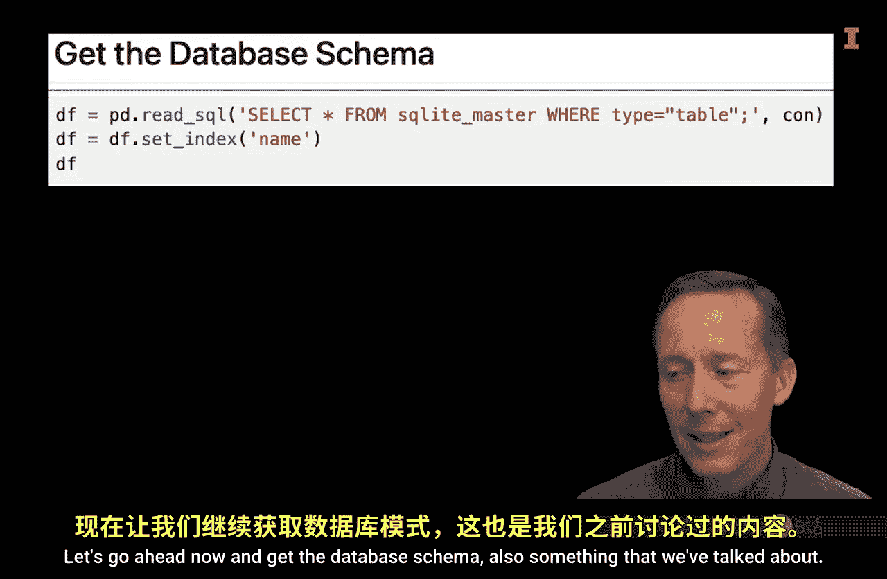

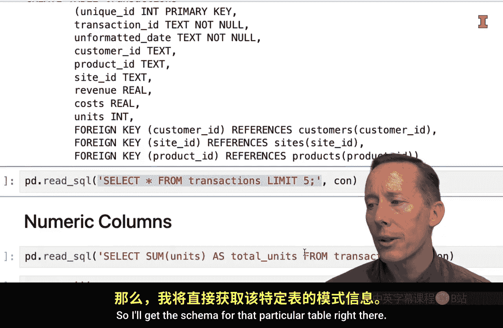

```python
# 获取数据库模式
query_schema = "SELECT name FROM sqlite_master WHERE type='table';"
tables = pd.read_sql(query_schema, conn)
print(tables)
```

假设我们想要探索 `transactions` 表，我们可以进一步查看该表的具体结构。

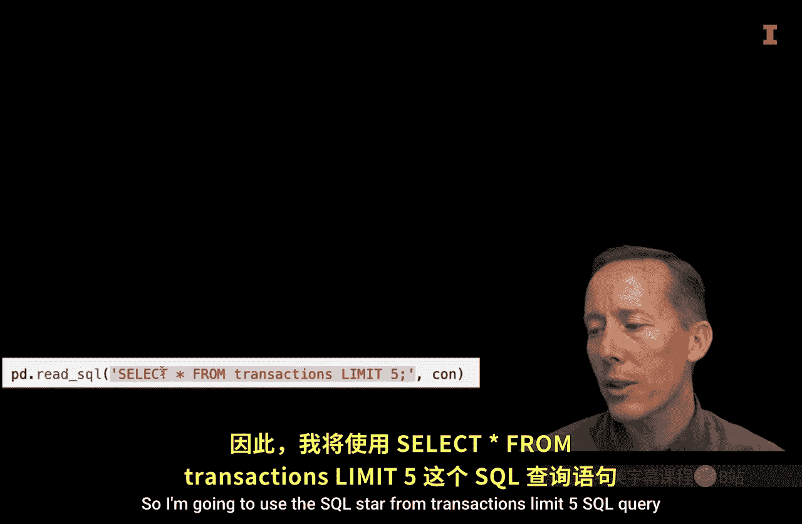

```python
# 获取 transactions 表的模式
query_table_schema = "PRAGMA table_info(transactions);"
table_info = pd.read_sql(query_table_schema, conn)
print(table_info)
```

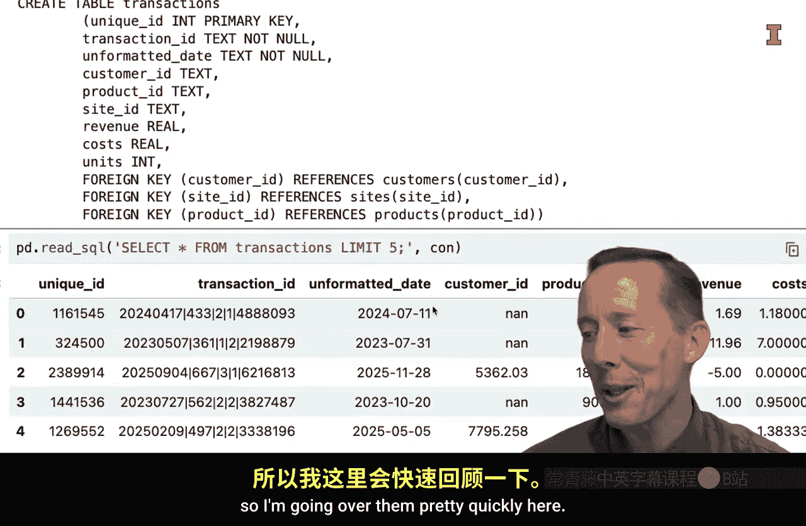

为了对数据有一个初步印象，我们先查看该表的前几行数据。

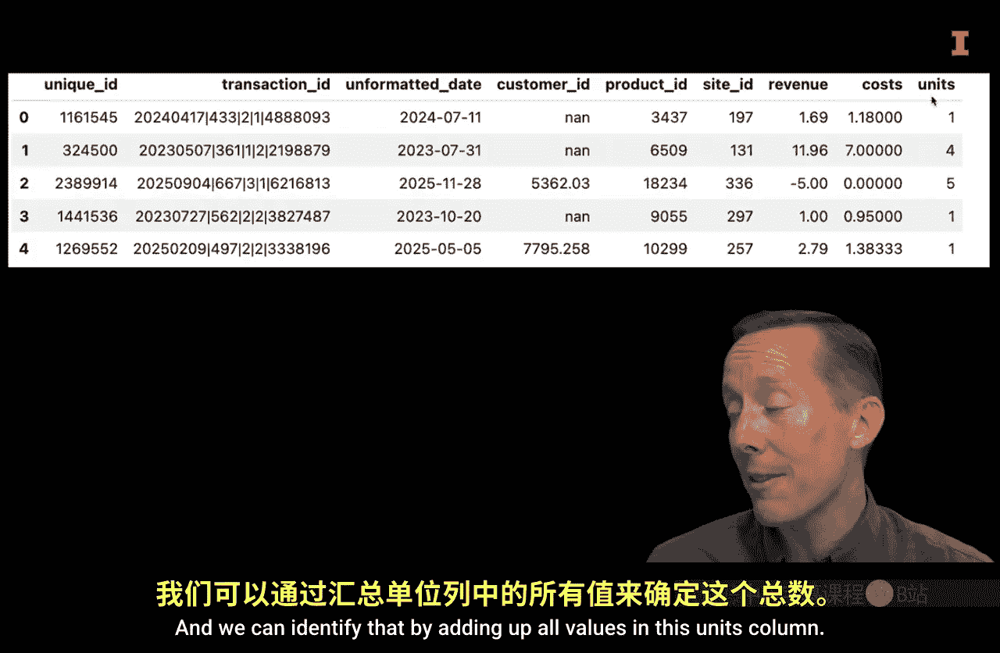

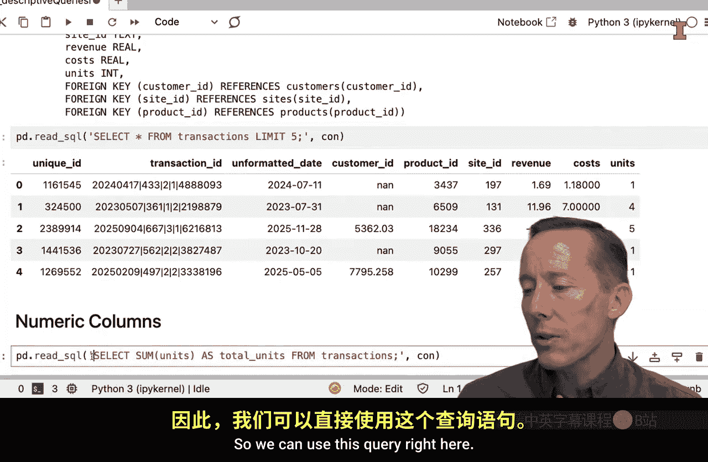

```python
# 查看 transactions 表的前5行
query_first_rows = "SELECT * FROM transactions LIMIT 5;"
first_rows = pd.read_sql(query_first_rows, conn)
print(first_rows)
```

## 对数值列进行描述性统计

上一节我们查看了数据表的结构和样例。本节中，我们来看看如何对数值列（如 `units` 列）进行基本的描述性统计。

以下是计算 `units` 列总和的SQL查询示例。

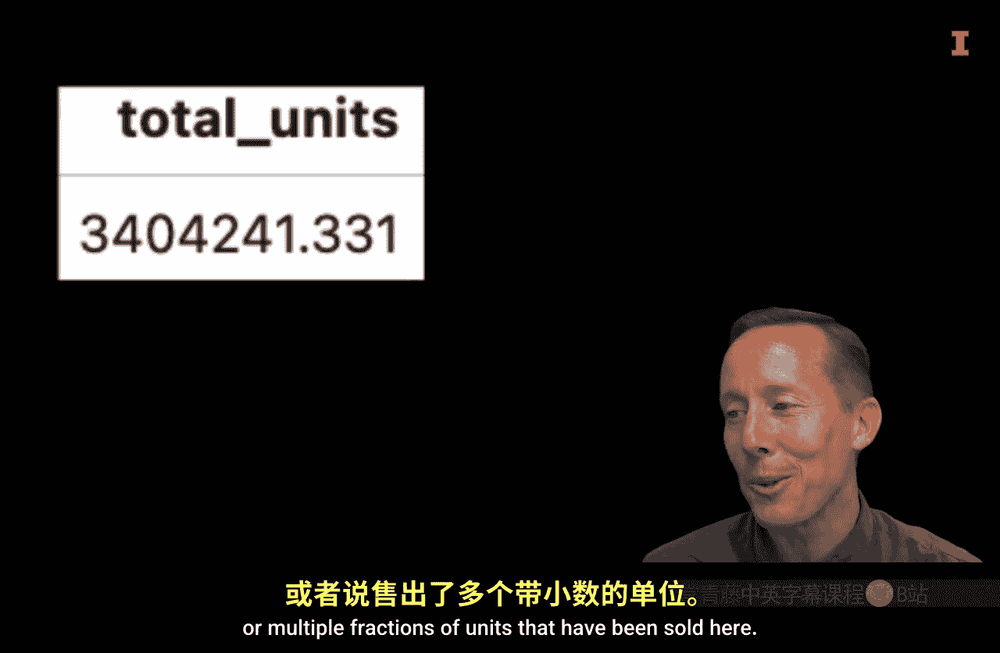

```python
# 计算 units 列的总和
query_total_units = """
SELECT SUM(units) AS total_units
FROM transactions;
"""
total_units = pd.read_sql(query_total_units, conn)
print(total_units)
```

除了总和，我们通常还关心数据的最小值、平均值和最大值。我们可以通过一个查询同时获取这些信息。

```python
# 计算 units 列的总和、最小值、平均值和最大值
query_descriptive_stats = """
SELECT 
    SUM(units) AS total_units,
    MIN(units) AS min_units,
    AVG(units) AS mean_units,
    MAX(units) AS max_units
FROM transactions;
"""
descriptive_stats = pd.read_sql(query_descriptive_stats, conn)
print(descriptive_stats)
```

这些函数同样适用于日期列。例如，我们可以找出 `unformatted_date` 列的时间范围。

```python
# 找出日期列的最小值和最大值
query_date_range = """
SELECT 
    MIN(unformatted_date) AS earliest_date,
    MAX(unformatted_date) AS latest_date
FROM transactions;
"""
date_range = pd.read_sql(query_date_range, conn)
print(date_range)
```

## 对分类列进行探索性分析

在分析了数值列之后，我们转向分类列。对于分类数据，了解其唯一值及其数量至关重要。

首先，我们可以列出 `product_id` 列中的所有不重复值。

```python
# 获取所有不重复的 product_id
query_distinct_ids = """
SELECT DISTINCT product_id
FROM transactions;
"""
distinct_ids = pd.read_sql(query_distinct_ids, conn)
print(distinct_ids.head())  # 仅显示前几行
```

然而，有时我们只关心唯一值的数量，而不是具体是哪些值。这时可以使用 `COUNT` 和 `DISTINCT` 的组合。

```python
# 计算不重复 product_id 的数量
query_count_distinct = """
SELECT COUNT(DISTINCT product_id) AS unique_product_count
FROM transactions;
"""
unique_count = pd.read_sql(query_count_distinct, conn)
print(unique_count)
```

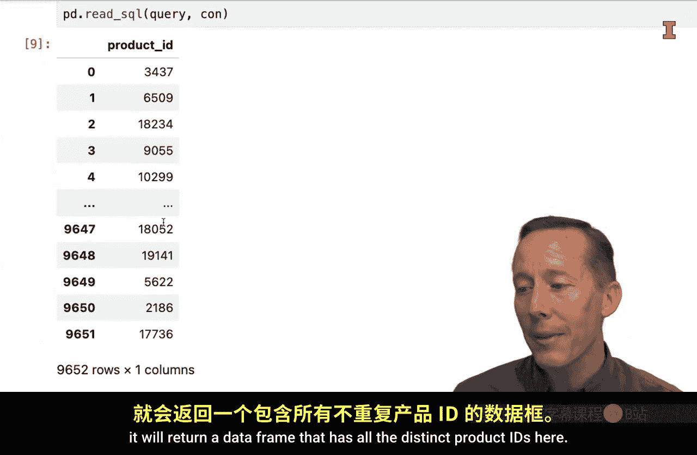

## 关闭数据库连接

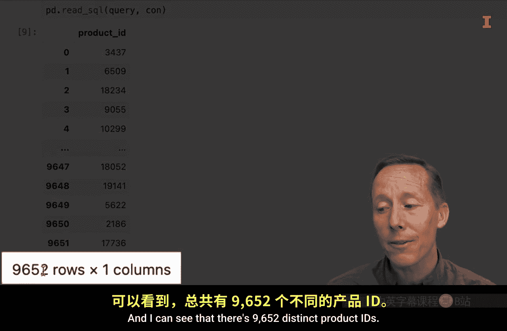

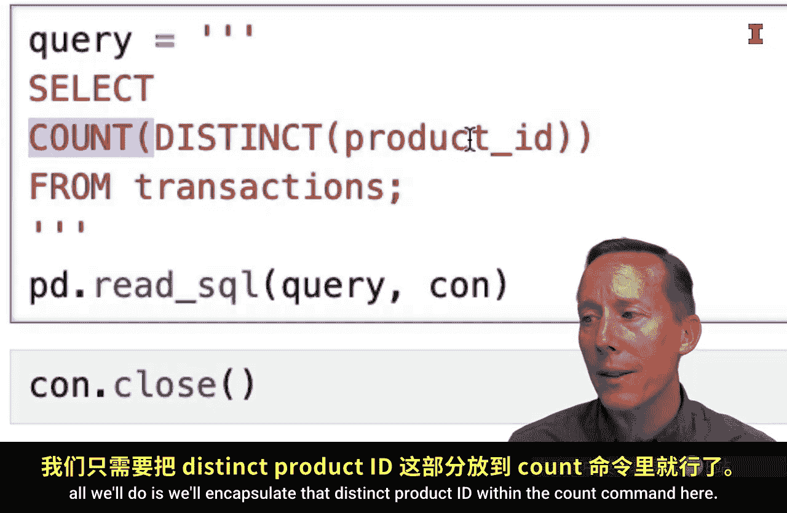

完成所有查询后，记得关闭数据库连接以释放资源。

```python
# 关闭数据库连接
conn.close()
```

## 总结


本节课中，我们一起学习了如何在Python环境中使用SQL查询进行描述性统计分析。我们掌握了如何连接数据库、查看表结构，并对数值列计算总和、最小值、平均值和最大值，以及对分类列找出唯一值及其数量。这些技能对于在数据量过大无法全部读入内存时，进行有效的数据探索和预处理非常有帮助。通过先使用SQL查询了解数据概况，我们可以更有针对性地决定将哪些数据加载到Python中进行后续分析。