#  119：Python中的SQL连接查询 🐍

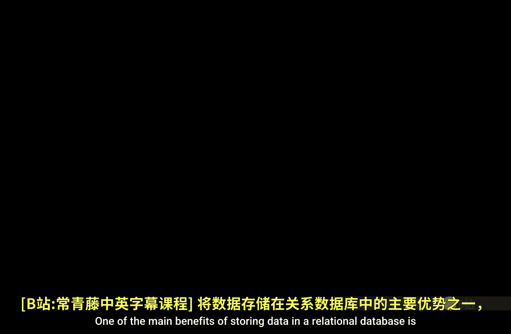

在本节课中，我们将学习如何在Python环境中执行SQL连接查询。关系型数据库的主要优势之一是各个表之间相互关联。这意味着你可以执行SQL查询，将来自不同表的数据连接起来，合并成一个单一的表，然后导出到你正在使用的任何环境中。

我们将演示如何在Python环境中执行连接查询，以创建SQL数据库中原本不存在的组合表。

## 连接数据库与查看结构

首先，我们需要导入必要的模块并连接到数据库。

```python
import pandas as pd
import sqlite3

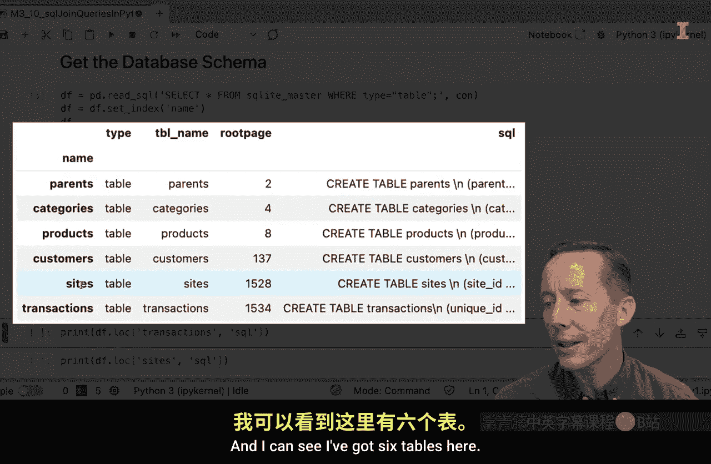

# 创建数据库连接
conn = sqlite3.connect('techca.db')
```

为了了解数据库中有哪些表，我们可以查看其模式。


```python
# 获取数据库模式
query_schema = "SELECT name FROM sqlite_master WHERE type='table';"
tables = pd.read_sql_query(query_schema, conn)
print(tables)
```

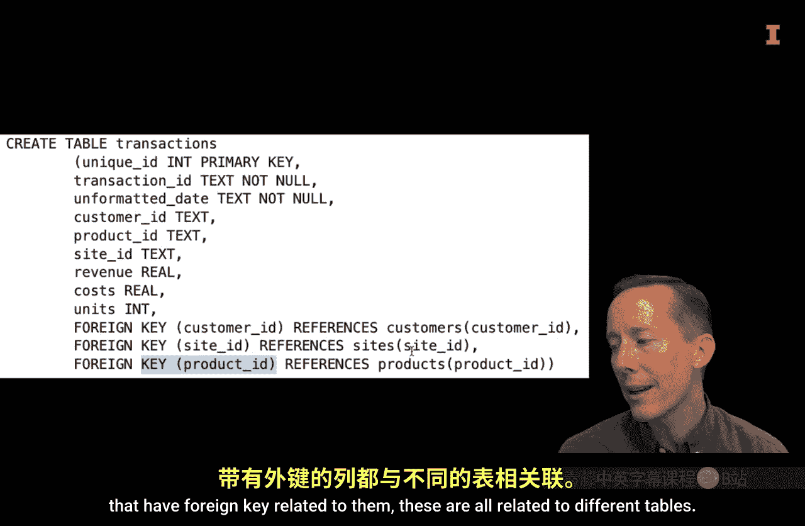

执行后，我们可以看到数据库中有六个表。

接下来，让我们查看`transactions`表的详细信息，以了解其结构。

```python
# 查看transactions表信息
query_trans_info = "PRAGMA table_info(transactions);"
trans_info = pd.read_sql_query(query_trans_info, conn)
print(trans_info)
```

从结果中，我们可以看到该表包含许多列，其中一些列是外键，关联到其他表。为了更好地理解这些关系，查看实体关系图会很有帮助。

从图中可以看到：
*   `product_id`列连接到`products`表。
*   `customer_id`列连接到`customer`表。
*   `site_id`列连接到`sites`表。

此外，通过`product_id`连接到`products`表后，还可以进一步关联到特定的类别和父类。

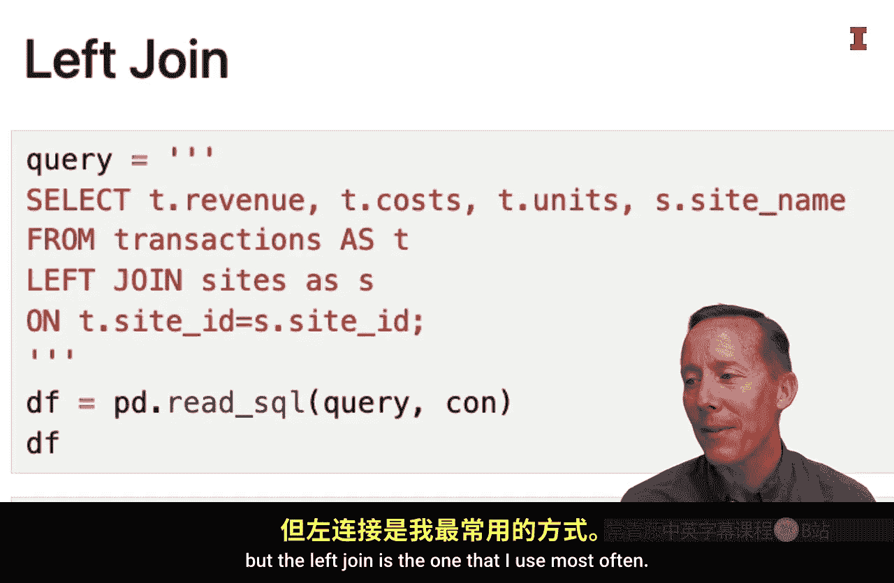

为了进行后续的连接操作，我们也查看一下`sites`表的结构。

```python
# 查看sites表信息
query_sites_info = "PRAGMA table_info(sites);"
sites_info = pd.read_sql_query(query_sites_info, conn)
print(sites_info)
```

现在，我们已经了解了表的结构。我们的目标是从`transactions`表和`sites`表中读取数据，并创建一个单一的数据框。

## 执行左连接查询

我们将使用**左连接**。SQL中还有内连接和外连接，但左连接是最常用的连接类型之一。

左连接的基本逻辑是：以左表（基础表）的所有行为基础，将右表中匹配的行连接过来。如果右表中没有匹配的行，则结果中对应字段为NULL。

以下是执行左连接的SQL查询结构：

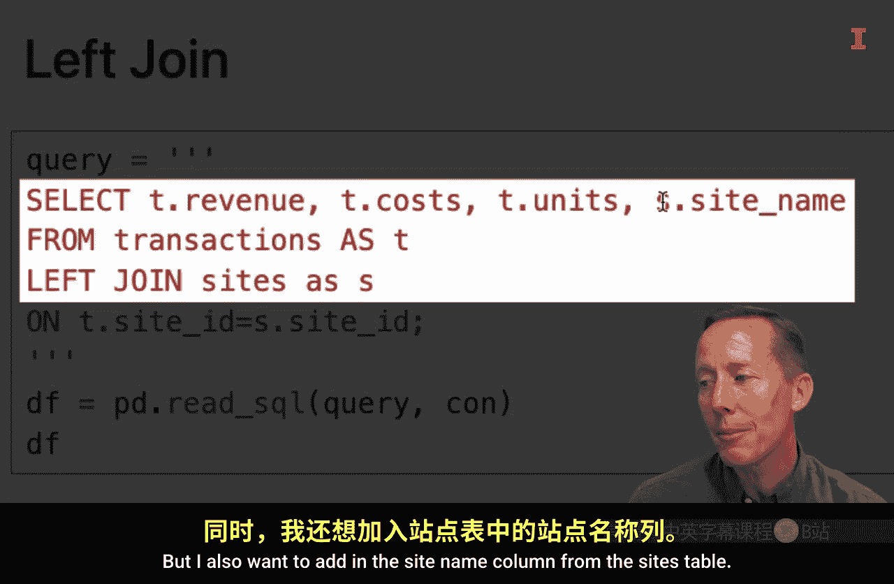

```sql
SELECT
    T.revenue,
    T.cost,
    T.units,
    S.site_name
FROM transactions AS T
LEFT JOIN sites AS S
ON T.site_id = S.site_id;
```

让我们分析一下这个查询：
*   `SELECT`：指定要从结果表中获取的列。
*   `T.revenue, T.cost, T.units`：这些列来自`transactions`表（我们为其指定了别名`T`）。
*   `S.site_name`：这一列来自`sites`表（别名`S`）。
*   `FROM transactions AS T`：指定左表（基础表）是`transactions`，并赋予其别名`T`。
*   `LEFT JOIN sites AS S`：指定要左连接的表是`sites`，并赋予其别名`S`。
*   `ON T.site_id = S.site_id`：指定连接条件，即两个表通过`site_id`列进行匹配。

现在，我们在Python中执行这个查询。

```python
# 执行左连接查询
query_left_join = """
SELECT
    T.revenue,
    T.cost,
    T.units,
    S.site_name
FROM transactions AS T
LEFT JOIN sites AS S
ON T.site_id = S.site_id;
"""
joined_df = pd.read_sql_query(query_left_join, conn)
print(joined_df.head())
print(f"数据框行数: {len(joined_df)}")
```

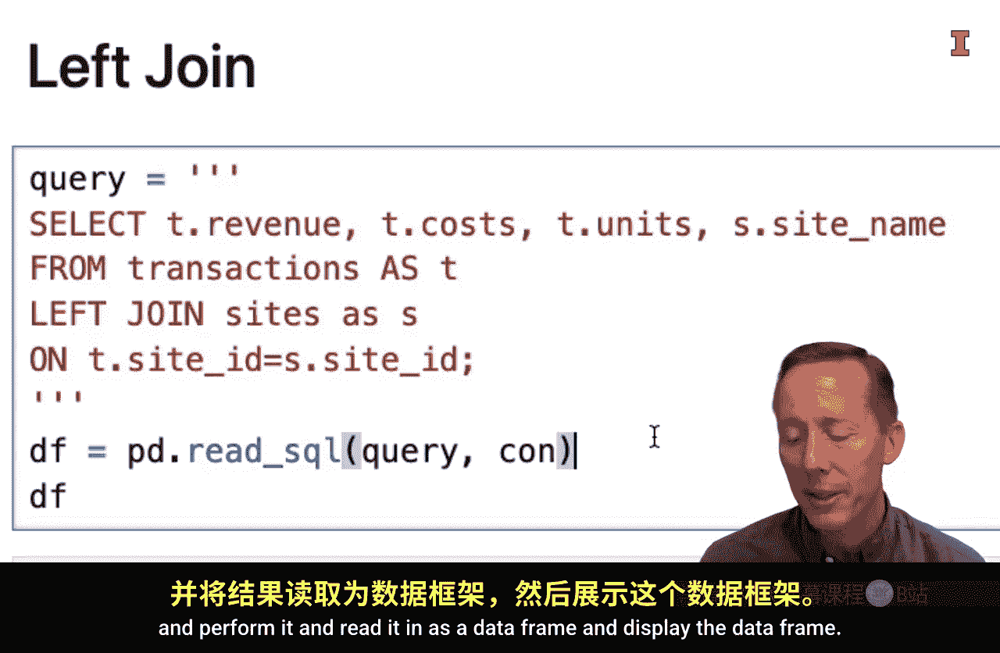

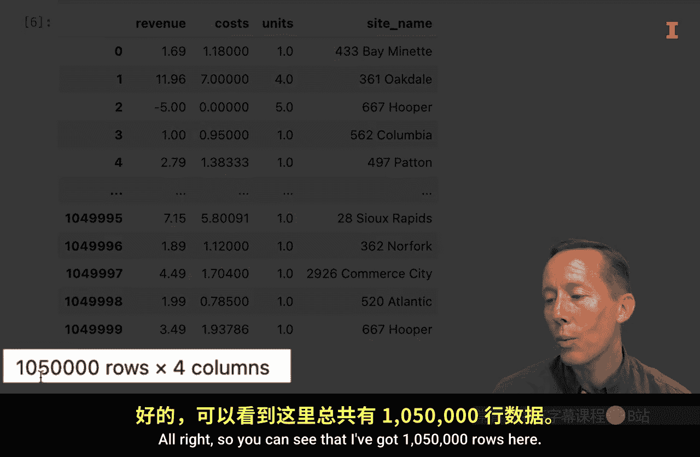

执行后，我们得到了一个包含150，000行的数据框。它保留了`transactions`表中的所有行，并且新增了一个原本不存在的`site_name`列。对于每一行，查询都根据`site_id`去`sites`表中找到对应的`site_name`，并将其添加为新列。

## 为连接查询添加筛选和排序

连接查询的结果可以像普通查询一样进行筛选和排序。我们可以在`WHERE`子句中添加条件，在`ORDER BY`子句中指定排序规则。

例如，我们只想保留站点名为“433 Bay Minet”的行，并按`revenue`列降序排列。

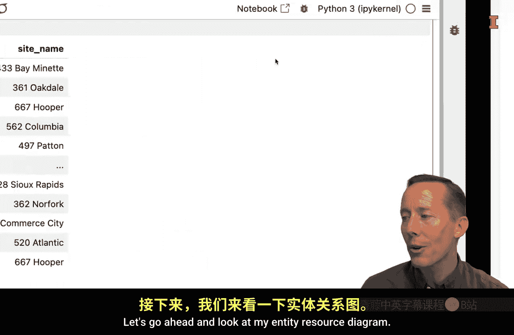

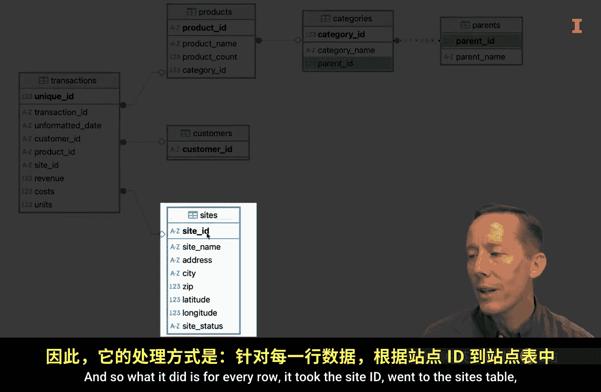

```python
# 带筛选和排序的左连接查询
query_filter_sort = """
SELECT
    T.revenue,
    T.cost,
    T.units,
    S.site_name
FROM transactions AS T
LEFT JOIN sites AS S
ON T.site_id = S.site_id
WHERE S.site_name = '433 Bay Minet'
ORDER BY T.revenue DESC;
"""
filtered_df = pd.read_sql_query(query_filter_sort, conn)
print(filtered_df.head())
print(f"筛选后行数: {len(filtered_df)}")
```

现在，结果中只包含8，451行“433 Bay Minet”站点的数据，并且按收入从高到低排列。

如果想按多个列排序，例如先按`revenue`降序，再按`cost`升序，可以这样写：

```sql
ORDER BY T.revenue DESC, T.cost ASC;
```

如果`revenue`值相同，则会进一步按`cost`排序。

## 执行多表连接

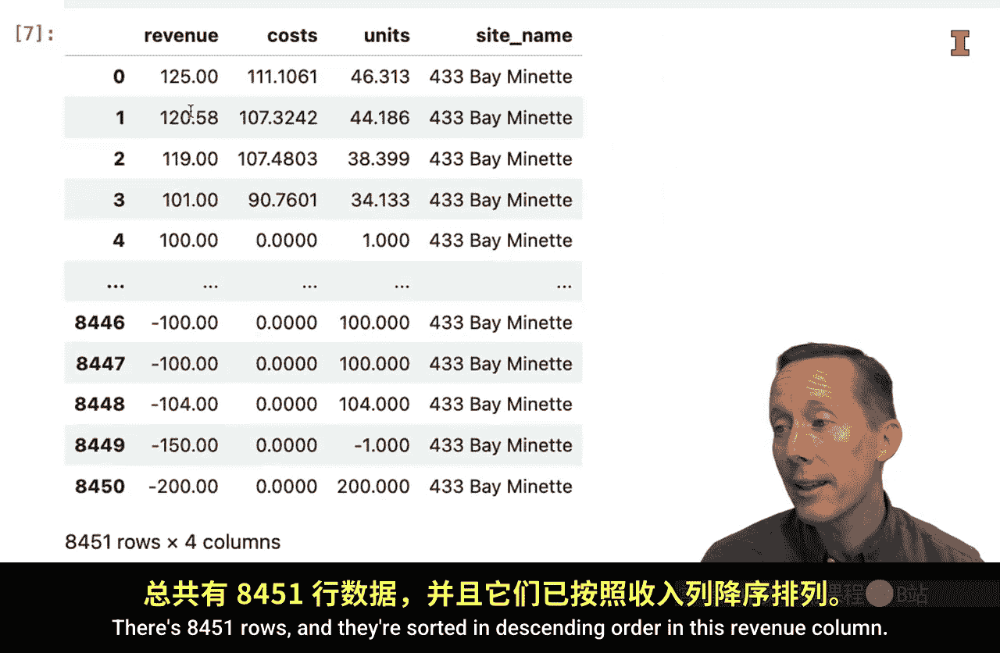


一个查询中可以执行多个连接操作。例如，我们除了连接`sites`表获取站点名，还想连接`products`表获取产品名。

```python
# 执行多表左连接查询
query_multi_join = """
SELECT
    T.revenue,
    T.cost,
    T.units,
    S.site_name,
    P.product_name
FROM transactions AS T
LEFT JOIN sites AS S ON T.site_id = S.site_id
LEFT JOIN products AS P ON T.product_id = P.product_id;
"""
multi_joined_df = pd.read_sql_query(query_multi_join, conn)
print(multi_joined_df.head())
```

这个查询首先将`transactions`表与`sites`表进行左连接，然后再将结果与`products`表进行左连接。最终的数据框包含了来自三个表的信息：交易数据、站点名称和产品名称。

## 关闭数据库连接

完成所有操作后，记得关闭数据库连接。

```python
# 关闭连接
conn.close()
```

## 总结

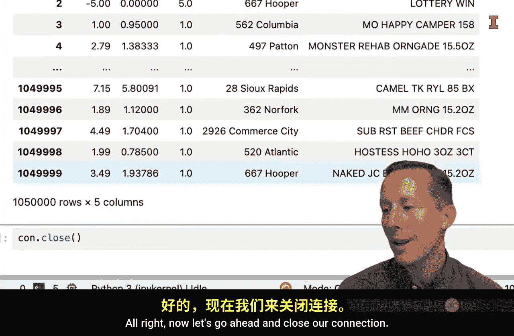

本节课中，我们一起学习了在Python中执行SQL连接查询的方法。

*   我们首先连接了数据库并查看了表结构，理解了表之间的关系。
*   然后，我们重点学习了**左连接**，它能够以左表为基础，合并右表中的匹配信息。
*   我们探讨了如何在连接查询的结果上进行**数据筛选**和**排序**，以获取更精确的数据视图。
*   最后，我们演示了如何在单个查询中执行**多表连接**，从而一次性整合多个来源的数据。


连接查询是与SQL数据库交互的核心技能之一。虽然本节课展示的是一些简单示例，但如果你计划更多地使用SQL数据库，深入探索各种连接查询（如内连接、全外连接）以及更复杂的查询条件，将非常有价值。