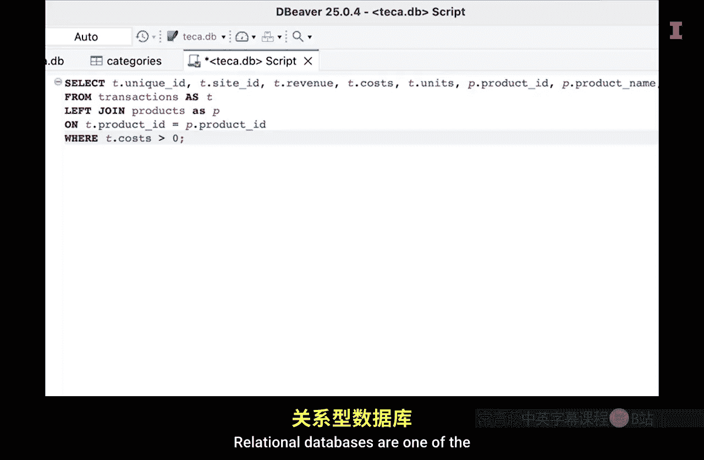
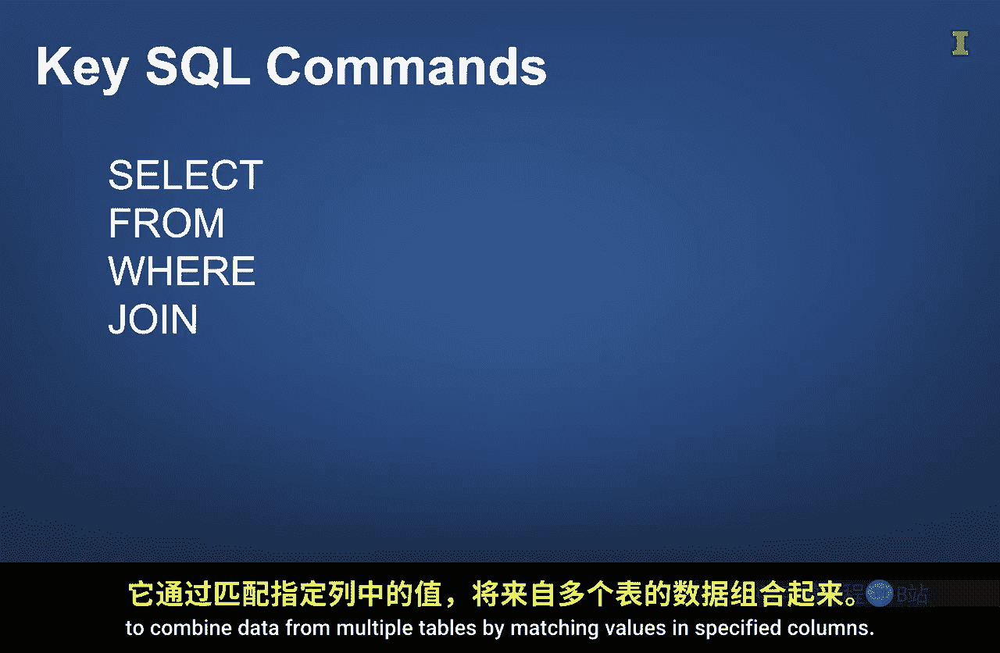

#  120：结论与回顾

在本节课中，我们将对第三模块的核心内容进行总结，回顾关系型数据库与SQL的基础知识，并展望后续的学习路径。

正如海洋蕴藏着丰富的资源，数据库也存储着大量可用于商业目的的数据资源。关系型数据库是企业用来存储大量结构化数据的最常用技术之一。

## 关系型数据库与SQL

上一节我们提到了数据资源的重要性，本节中我们来看看访问这些资源的工具。

关系型数据库由一个或多个相互关联的表组成，并以其可靠性、安全性和处理大量事务的能力而久经考验。正如我们需要船只或冲浪板来航行海洋并获取资源，我们也需要一个工具来导航关系型数据库并获取其中的数据资源。

SQL（结构化查询语言）正是这个工具。它是用于与数据库交互的语言，因其由常用词汇构成而易于理解。我们的重点在于介绍用于从数据库表中检索数据的查询关键词。

以下是本模块介绍的一些基础SQL命令：

*   **`SELECT`**：用于指定你想要查看的列。
    *   **示例**：`SELECT name, email FROM customers;`
*   **`FROM`**：用于指明数据来源的表。
    *   **示例**：`SELECT * FROM orders;`
*   **`WHERE`**：用于限制返回的数据，例如筛选出特定条件的记录。
    *   **示例**：`SELECT * FROM customers WHERE state = 'Illinois';`
*   **`JOIN`**：通过匹配指定列的值，将来自多个表的数据组合起来，这一点非常重要。
    *   **示例**：`SELECT orders.id, customers.name FROM orders JOIN customers ON orders.customer_id = customers.id;`

## SQL与Python的协同

重要的是，我们希望你现在能更好地理解结合使用SQL与Python的益处，以及将这两种语言结合使用的一些技术细节。这只是一个入门介绍，但希望你现已打下坚实的基础，可以在此基础上轻松构建。

当你面对涉及SQL的实际项目时，你将知道下一步该做什么，从而持续提升你的SQL技能。此外，熟能生巧，练习得越多，使用起来就越得心应手。

所以，请持续练习，你必将更流利地掌握这门至关重要的数据语言。

---

本节课中我们一起学习了关系型数据库的核心概念以及SQL的基础查询命令。我们了解到，数据库如同数据的海洋，而SQL是我们获取其中价值的航船。通过掌握`SELECT`、`FROM`、`WHERE`和`JOIN`等命令，你已经具备了从数据库中提取和组合信息的基本能力。记住，将SQL与Python等工具结合使用，能极大提升商业分析的效率。不断实践是精通这门技能的关键。