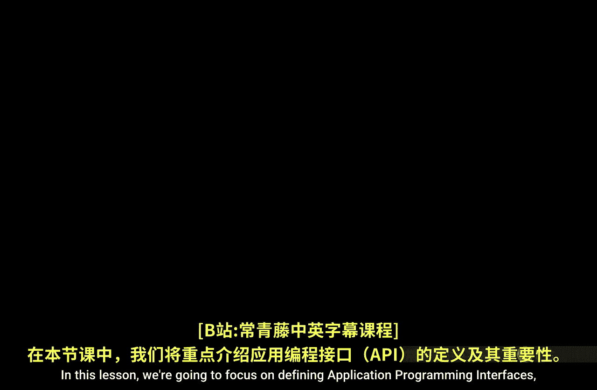
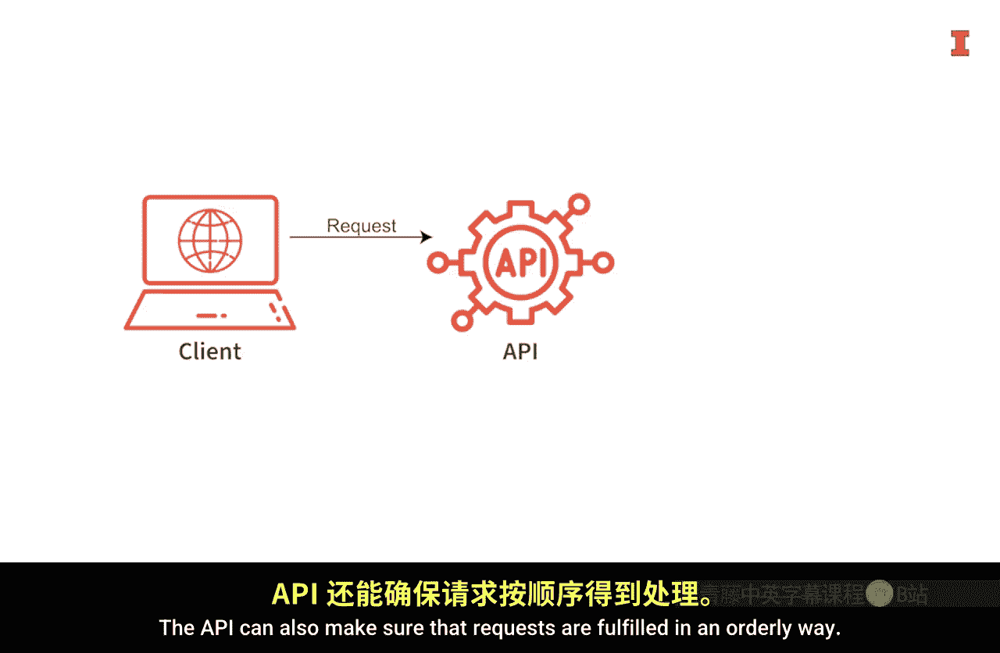
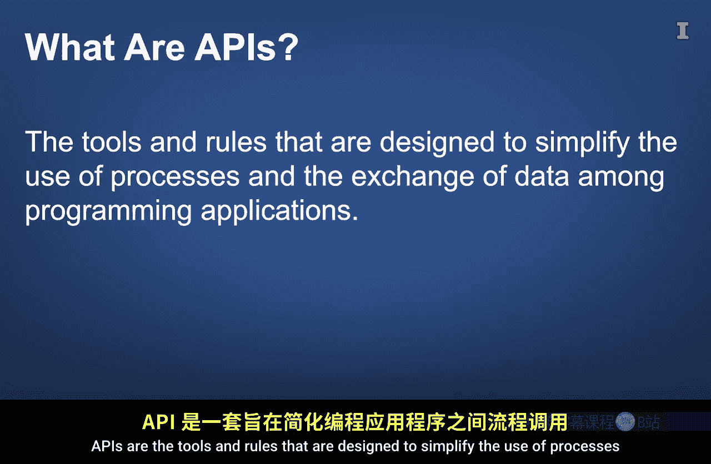
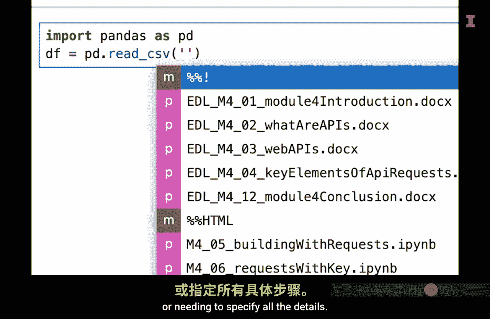
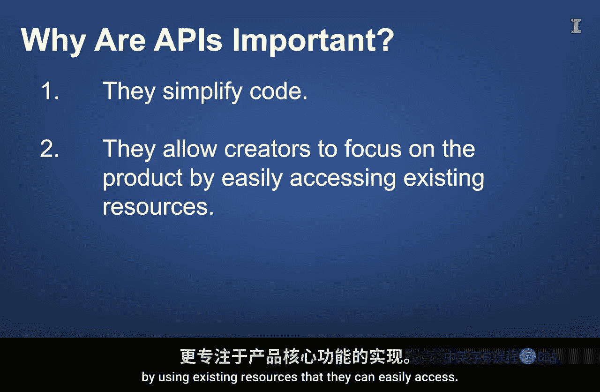
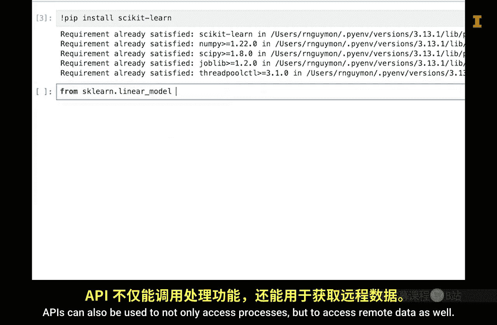
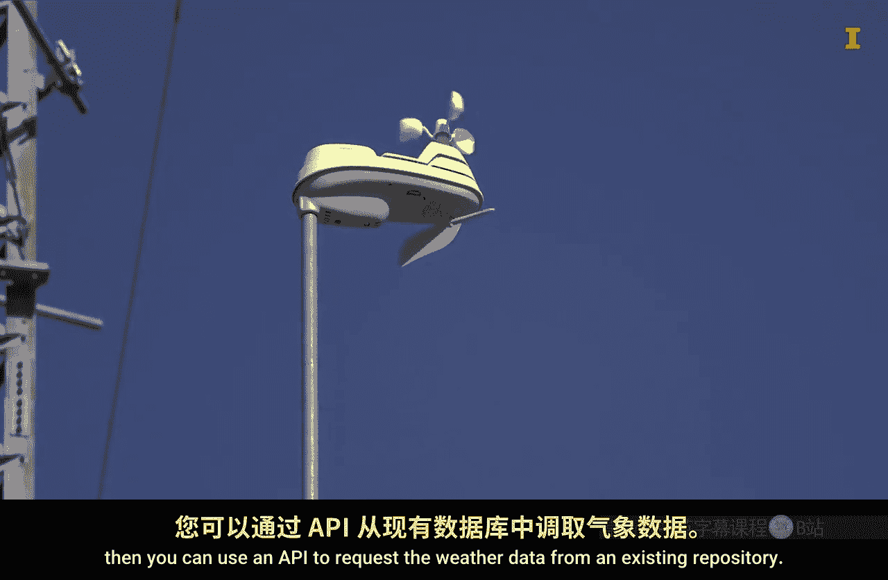

#  122：什么是API 🚀



在本节课中，我们将聚焦于定义应用程序编程接口（API），并探讨其重要性。

## 概述

我们将通过一个餐厅的类比来理解API的核心概念，然后直接探讨其定义、作用，并解释为何API对于软件开发和数据分析至关重要。

## 餐厅类比：理解API的角色

为了清晰地解释API，我们使用一个餐厅的类比。想象一位顾客走进一家餐厅，他想要获得食物，但自己不会做或没有时间做。

以下是点餐过程的分解：

*   **顾客**：这类似于一个计算机应用程序，也称为**客户端**。
*   **菜单**：这代表了应用程序可以请求的服务或数据的列表。
*   **点单**：顾客向服务员下单，这类似于应用程序发出的**API请求**。
*   **服务员**：服务员接收订单，确保订单被正确处理并最终将食物送回给顾客。这个角色就是**API**本身。
*   **厨房**：这代表提供实际服务或数据的后端系统。

如果没有服务员（API），顾客（应用程序）就需要直接与厨房（后端系统）沟通，必须详细说明披萨的每一个制作细节。服务员（API）简化了这个交互过程，确保请求被有序、公平地处理，并返回正确的结果。



## 直接定义API



有了这个类比，我们可以更直接地讨论API。**API是一套旨在简化编程应用程序之间流程使用和数据交换的工具与规则。**

根据这个定义，您很可能已经使用过API。例如，如果您曾经使用过pandas模块中的函数，那么您就已经使用了API。pandas函数允许其他应用程序通过简单地调用函数来访问数据处理能力，而无需了解其背后的实现细节。



## API在代码中的体现

让我们看一个更具体的例子。假设您正在开发一个数据分析应用程序，它需要读取数据并以pandas DataFrame的形式显示前五行。

使用pandas的API，您的应用程序只需几行简单的代码即可完成此任务：

```python
import pandas as pd

# 使用pandas的API读取CSV文件
df = pd.read_csv('data.csv')

# 使用pandas的API显示前5行数据
print(df.head())
```

您的应用程序无需关心连接CSV文件的许多步骤，也无需了解DataFrame在内存中的底层表示。它只需要知道如何通过引用正确的函数来访问这些流程。



因此，pandas API就是用于访问众多流程的函数集合。它使您无需重新编写执行这些流程的底层代码（这些代码可能很复杂，甚至是用另一种语言编写的）。此外，底层流程可能会发生变化（例如为了提高效率），但函数名称可以保持不变。这使得改进可以在不要求应用程序改变其工作方式的情况下进行。

## 为什么API如此重要？

现在您对API有了更好的理解，让我们简要探讨一下为什么API对软件（尤其是数据分析任务）如此重要。

总的来说，API对软件的重要性体现在两个方面：
1.  **简化代码**：API将复杂功能封装成简单的调用。
2.  **聚焦产品**：开发者可以利用现有资源，更专注于产品本身的功能与创新。

具体到数据分析领域，API使我们能够专注于创建易于阅读的数据分析工作流。我们可以通过相对易读的Python脚本，来整合所有数据、计算结果并进行展示。我们无需了解这些流程是如何完成的细节，从而能更专注于发现洞察和做出决策。





例如，如果您需要执行一项不熟悉的任务（如图像识别），您无需从头开始用数千行代码创建自己的算法。相反，您可以简单地安装正确的Python模块（如Scikit-learn或PyTorch），它们提供的API让您通过一个简单的函数就能使用成熟的算法。

API不仅可以用于访问流程，还可以用于访问远程数据。例如，如果您需要评估天气模式的影响，您可以使用API从现有的数据仓库请求天气数据，而无需自己建立气象站并收集数据。

## 总结


在本节课中，我们一起学习了API的核心概念。简而言之，API是使用代码创建任何类型应用程序的重要组成部分。正如餐厅的服务员是顾客与厨房之间必不可少的中介一样，API简化了软件应用程序之间的交互。它将流程打包成一组可以轻松使用的函数。在您继续数据分析之旅的过程中，您将了解更多不同类型的API，以及如何利用它们轻松访问和处理数据。