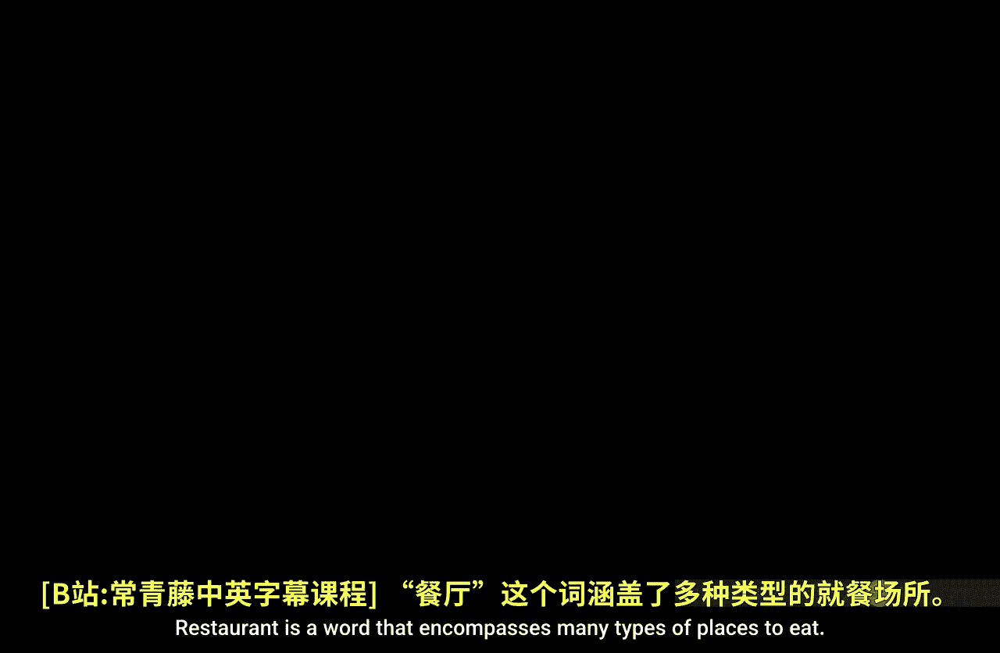
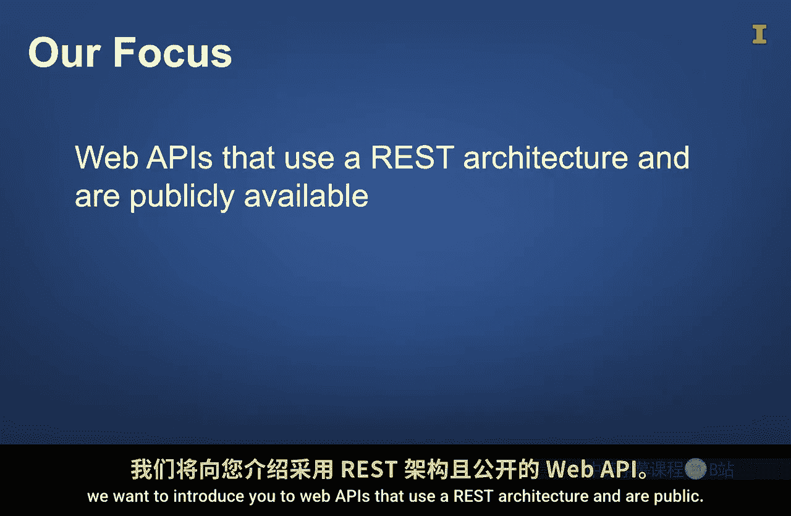
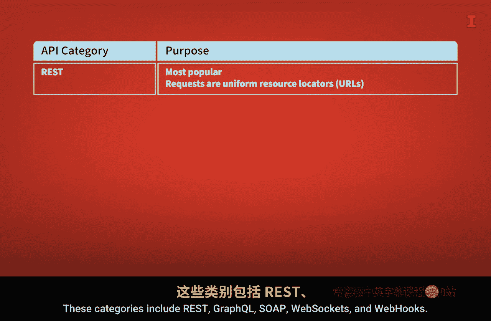
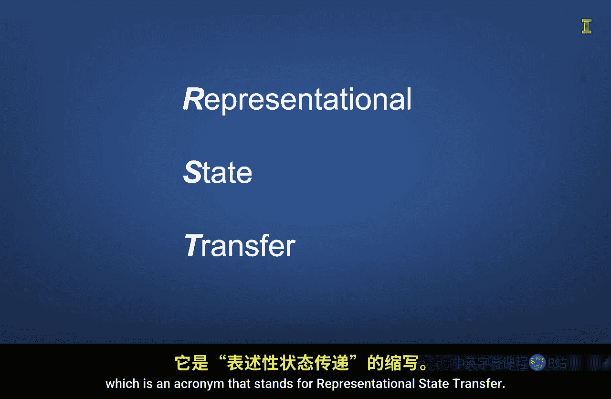
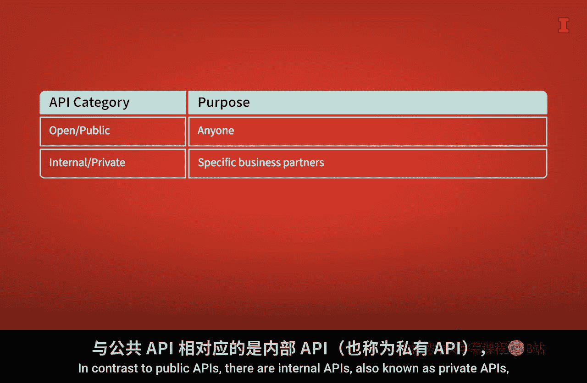

#  123：组装数据的Web API 🧩

在本节课中，我们将要学习应用程序编程接口（API）的基本概念，特别是用于组装数据的Web API。我们将了解API的不同分类方式，并重点介绍一种最常用的架构——REST。

---

“餐厅”这个词涵盖了多种类型的就餐场所。在光谱的一端是高级餐厅，就像我身后这个非常繁忙的南海岸广场里的那些。它们提供由才华横溢的厨师和服务员带来的无可挑剔的服务。在光谱的另一端是快餐店，那里的食物大多是预先准备好的，你可能几乎不需要直接与他人互动。

因为餐厅的种类如此繁多，所以在与他人交流时，明确你心中所想的具体餐厅类别通常很重要。

同样，“应用程序编程接口”或“API”这个词也可以指代许多事物。广义上说，API是简化软件应用程序之间交互方式的工具。在本课中，我们希望重点描述那些常用于组装数据的API。具体来说，我们将向您介绍使用REST架构的、公开可用的Web API。

---

上一节我们提到了“REST架构”等技术术语。本节中，我们将简要介绍三种对API进行分类的方法，以帮助您更好地理解这些术语的含义以及API的整体格局。

让我们从讨论API的不同分类方式开始。

**以下是按用途对API进行分类的方法：**

*   **库API**：其目的是提供一组函数，用于访问特定编程库（如pandas）提供的功能。
*   **操作系统API**：其目的是提供一组命令，用于与计算机操作系统（如更改目录）进行交互。
*   **Web API**：其目的是使软件应用程序能够通过互联网相互交互。Web API之所以重要，是因为它们允许以编程方式在远程应用程序之间交换数据。

例如，假设您想获取一家在美国证券交易所公开交易的公司的财务数据。Web API允许您使用代码访问这些数据，并将其直接导入您的编码环境。您可以从网站手动下载数据，但如果您想用Python分析数据，那么使用Web API通常比手动下载更高效。因为它需要更少的手动导航，更不容易出错，更容易复制，并且该过程可以可靠地扩展到访问其他公司的数据。

---

现在，在Web API这一类别中，有不同的架构结构，每种都适用于不同的目的。

**以下是按架构对Web API进行分类的方法：**

*   **REST**：这是迄今为止最流行的Web API架构，是“表述性状态转移”的缩写。REST是一种成熟的架构，支持良好，相对易于理解，并且对许多应用来说效率很高。它有点像一种通用架构。这种架构通常用于为数据分析应用程序交换数据。使用REST架构，数据请求本质上是通过创建一个看起来像网站地址的统一资源定位符（URL）来发出的。服务器收到请求后，会以多种格式发回相关数据。
*   **GraphQL**：这是一种采用率正在增长的架构，其优点是请求可以结构化以识别精确的数据集。然而，这种精确性的缺点是，当您请求更具体的数据集时，请求可能会变得更加复杂。
*   **SOAP**：这种Web API架构具有内置安全性。它还具有关系数据库的一些特性，例如要求每列数据具有特定的数据类型，以及要求事务要么完全完成，要么完全失败。SOAP也已经存在很长时间了，因此是一种可信赖的技术。由于这些原因，SOAP被依赖安全、可靠传输敏感数据（如金融交易）的企业使用。然而，SOAP的受欢迎程度正在下降。对于许多数据传输需求来说，它通常是大材小用。此外，请求非常冗长，因为它们需要像用于格式化网页的超文本标记语言（HTML）那样的标签结构。
*   **WebSocket**：这种架构非常适合实时双向信息交换，例如聊天应用程序。
*   **Webhook**：这种架构非常适合在事件触发时需要推送通知的情况。

---

现在让我们讨论第三种对API进行分类的方法，即基于目标受众。

**以下是按目标受众对API进行分类的方法：**

*   **开放API**：也称为公共API。就像开源代码一样，公共API可供组织内外的任何人使用。例如，政府可能会创建公共Web API，以便公众更容易以编程方式访问财务数据或天气数据。
*   **内部API**：也称为私有API，旨在供特定的业务合作伙伴使用。例如，公司可能使用内部API来简化库存管理系统和销售系统之间的交互。鉴于私有API通常用于共享专有数据，因此它们比公共API更安全。私有API的文档也不广泛提供。

---

好了，通过以上三种分类方式，我们将要重点关注的API类型是使用REST架构且公开可用的Web API。

我们之所以关注这种特定类型的API，是因为它经常用于获取远程数据。了解如何使用API组装数据可以真正提高您的分析质量，因为您可以将不同的数据集相互结合，从而拓宽寻找变量之间潜在关系的能力。此外，一旦您对这种类型的API有了一些经验，您将拥有一个基础，可以用来学习其他API，例如ChatGPT、Google和Amazon提供的那些。

**总结一下**，API是一个广义术语，包含许多不同的类别。软件应用程序之间所促进的通信类型强烈影响着所使用的API类型。对于许多数据组装目的，您经常会看到使用REST架构的公共Web API。了解其他类型的Web API将帮助您知道如何驾驭多样化的数据组装格局。