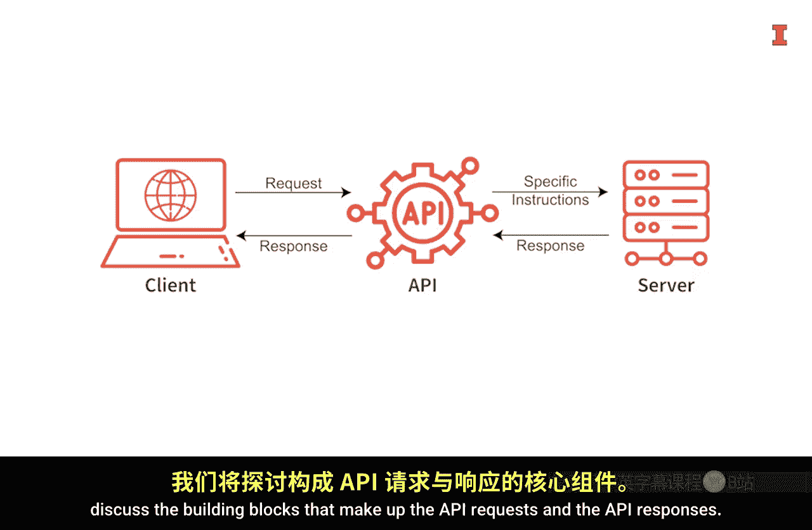
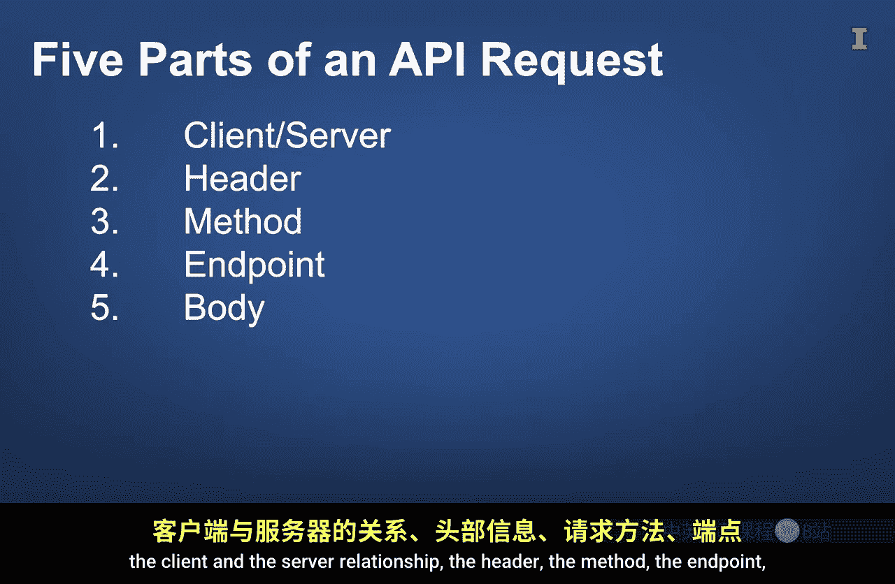
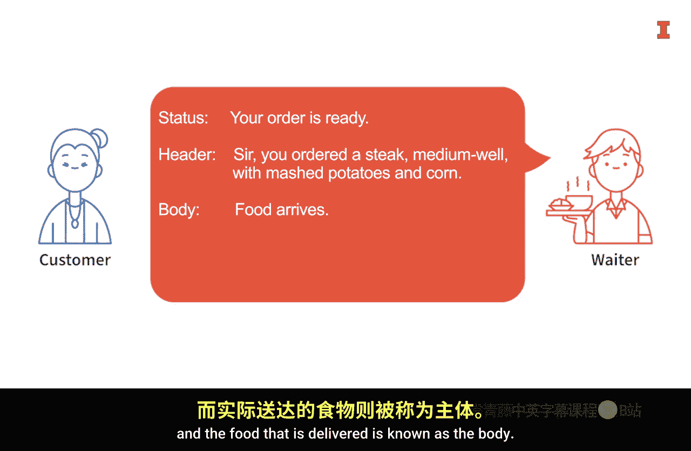
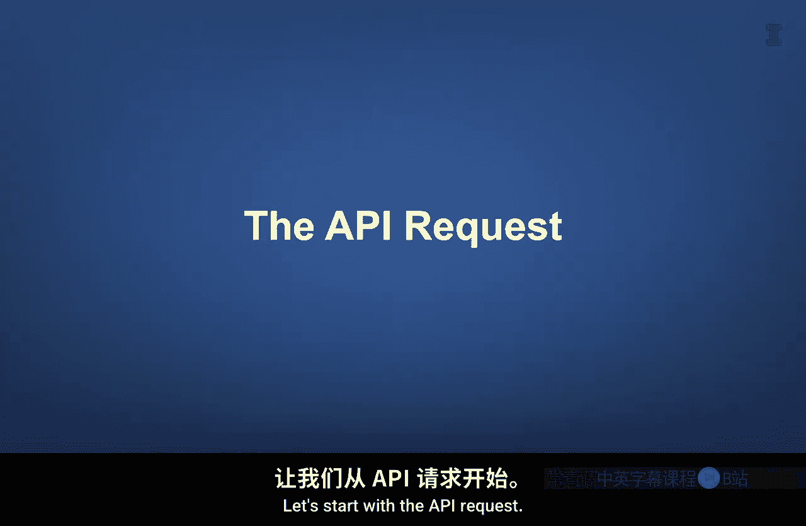
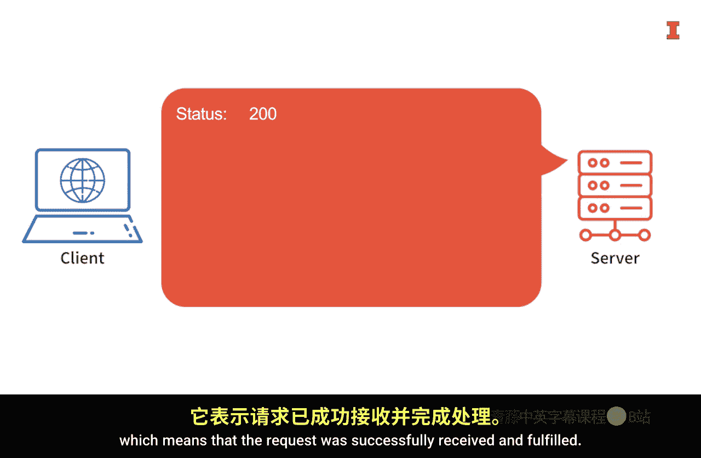
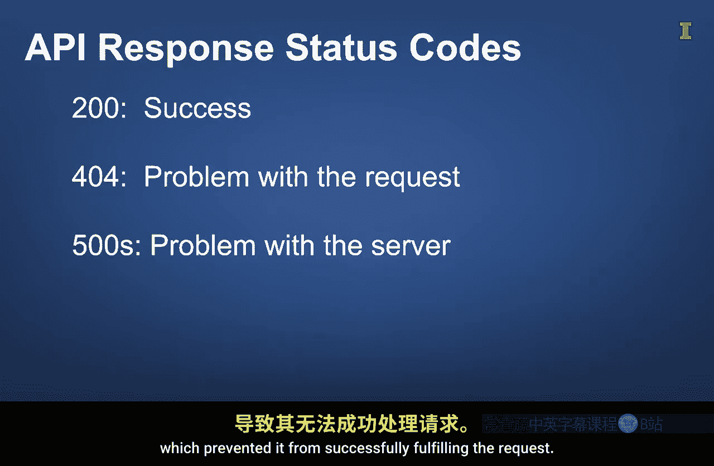
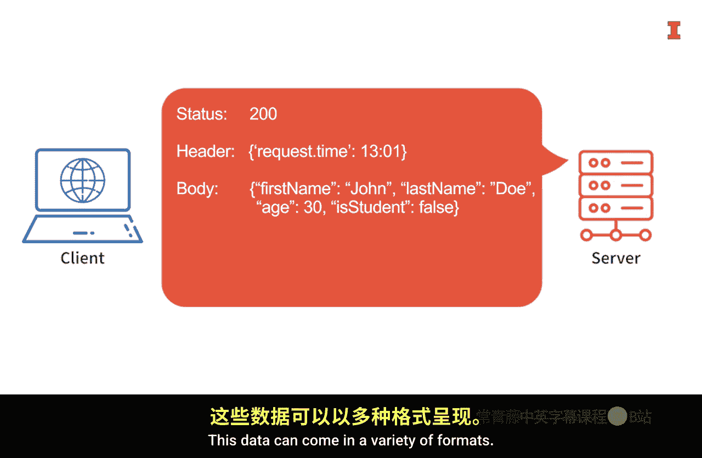

#  124：API 请求与响应的关键要素 🔑


在本节课中，我们将要学习构成API请求与响应的核心要素。通过一个餐厅点餐的类比，我们将清晰地理解客户端如何向服务器发送请求，以及服务器如何返回响应。掌握这些基础知识是进行有效API调用的前提。

上一节我们介绍了API的基本概念，本节中我们来看看构成API交互的具体“积木块”。





## 餐厅点餐的类比

想象一下，你走进一家餐厅（比如我遇到的南加州著名玉米卷店Yukas），阅读菜单，然后向服务员下单。你最终会收到食物。这个过程与API的交互方式非常相似：应用程序（顾客）向API（服务员）发送请求（点单），并接收响应（食物）。

顾客无需知道厨房如何制作食物，只需知道如何与服务员沟通。同样，应用程序无需知道服务器内部如何运作，只需知道如何通过API与之交互。

## API请求的五大组成部分

一个API请求由五个关键部分构成。以下是每个部分的详细说明：



**1. 客户端与服务器关系**
这描述了请求的发起方（客户端）与接收处理方（服务器）之间的连接。就像顾客需要走进餐厅才能与服务员互动一样，客户端（可能是一段代码或一个应用）需要能够通过网络连接到远程服务器。



**2. 请求头**
请求头包含服务器在处理请求前需要了解的特殊指令。在餐厅场景中，这类似于顾客在点餐前告知服务员：“我叫Ron，预订了两人位”或“我需要打包”。在API请求中，常见的头信息包括授权凭证（如API密钥）和期望的数据返回格式。头信息通常以类似Python字典的格式组织。
```python
headers = {
    "Authorization": "Bearer YOUR_API_KEY",
    "Content-Type": "application/json"
}
```

**3. 请求方法**
方法定义了客户端希望服务器执行的具体操作。在RESTful API中，主要有四种方法：
*   **GET**：用于**获取**信息，通常用于从服务器检索数据。
*   **POST**：用于**创建**新项目，向数据仓库添加新数据。
*   **PUT**：用于**更新**特定项目。
*   **DELETE**：用于**删除**特定项目。

**4. 端点**
端点是一个精心构造的URL，它指明了请求的目标资源。它通常由三部分组成：
*   **基础URL**：指向特定组织或服务的固定部分。
*   **资源路径**：指向具体的资源，例如某个产品或用户。
*   **查询参数**：用于筛选数据，例如只请求特定时间段的数据。
一个示例端点如下：`https://api.example.com/products/12345/inventory?start_date=2023-01-01`

**5. 请求体**
请求体包含了需要发送给服务器的其他具体数据细节。在使用GET方法时，请求体通常是空的。但在使用POST、PUT或DELETE等方法修改数据源时，请求体会包含具体的修改信息，通常以JSON格式发送。

## API响应的三大组成部分

当服务器处理完请求后，会返回一个响应。响应通常包含以下三个部分：

**1. 状态码**
状态码是一个数字，用于表示请求的处理结果。最常见的状态码包括：
*   **200**：请求**成功**接收并完成。
*   **404**：服务器收到请求，但**找不到**请求的资源（例如，端点错误）。
*   **5xx**（如500）：服务器端**内部错误**，导致无法完成请求。



**2. 响应头**
响应头提供了关于响应本身的元数据，例如响应的生成时间、内容类型等。





**3. 响应体**
响应体是最重要的部分，它包含了请求所获取的实际数据。数据可以有多种格式：
*   **JSON**：目前最常用的格式，结构类似于Python的字典或列表，使用花括号 `{}` 和方括号 `[]`。
*   **XML**：可扩展标记语言，使用标签定义数据结构。
*   **CSV**：逗号分隔值，一种简单的表格数据格式。
收到数据后，通常需要将其解析并转换为更易用的格式，如Pandas的DataFrame。

## 总结


本节课中我们一起学习了API请求与响应的关键要素。正如餐厅顾客与服务员的交互有可预测的环节一样，基于REST架构的Web API的请求与响应也由标准的组成部分构成。我们详细探讨了请求的五个部分（客户端-服务器关系、请求头、方法、端点、请求体）以及响应的三个部分（状态码、响应头、响应体）。理解这些元素将帮助你在实际编写代码发起API请求和处理响应时，更清楚地知道每一步在做什么。