#  126：构建需要身份验证的 API 请求 🔑


在本节课中，我们将学习如何通过身份验证来执行安全的 API 请求。身份验证类似于密码，但通常被称为令牌或密钥，由数据提供商而非用户设置。我们将以芝加哥市开放数据 API 为例，演示如何获取并使用 API 密钥，以及如何将其添加到请求中以获取更多数据。

## 概述与准备工作

上一节我们介绍了如何构建基础的 API 请求。本节中我们来看看如何为请求添加身份验证，以突破数据行数限制并执行更安全的调用。

与构建 URL 类似，每个 API 生成和使用 API 密钥的方式都不同。因此，我们必须阅读相关文档来了解具体用法。

在之前的课程中，我们演示了如何在不使用任何身份验证的情况下从芝加哥市 API 获取数据，但当时有 1000 行数据的限制。现在，让我们回到该 API 的文档。

## 获取 API 密钥

在文档顶部，提到了“应用令牌”。这里有一个显著的蓝色按钮，提示“注册获取应用令牌”。我们需要点击它进行注册。

这是一个开放数据集，因此你可以免费注册，但注册步骤是必须的。输入你的邮箱地址和密码即可完成注册。

注册后，你需要探索如何获取你的应用令牌或密钥。在当前示例的仪表板中，顶部有“开发者设置 - API 密钥”的选项。

我们正在寻找令牌，因此需要找到标有“应用令牌”的下半部分区域。你可以在此处查看更多信息。

我已经创建了一个令牌。创建方法是点击“创建新应用令牌”，然后为其命名和添加描述。之后，系统会生成一个应用令牌。

**请注意**：这是我的应用令牌，你不应使用它。你可能会好奇我为何与你分享它。实际上，这些令牌可以被删除。我将在你观看此视频前删除它。关键是要认识到你可以获取自己的应用令牌。

获取令牌后，你可以复制它。接下来，我需要知道如何在 API 请求中使用它。

## 了解使用方式

让我们回到文档。文档下方说明，一旦你拥有应用令牌，可以通过两种方式将其包含在请求中：一是使用 `X-App-Token` HTTP 头部，二是通过 URL 中的 `?app_token` 参数传递。

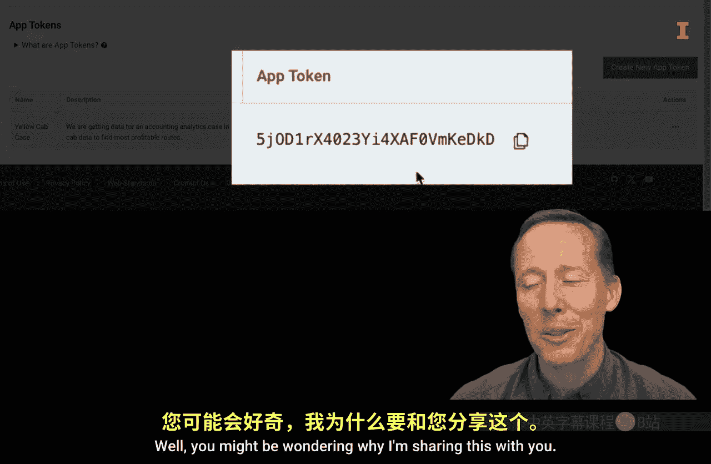

我将演示如何使用头部方法。请记住这个头部字段：`X-App-Token`。

## 在 Python 中实施

现在，让我们进入 Python 环境。

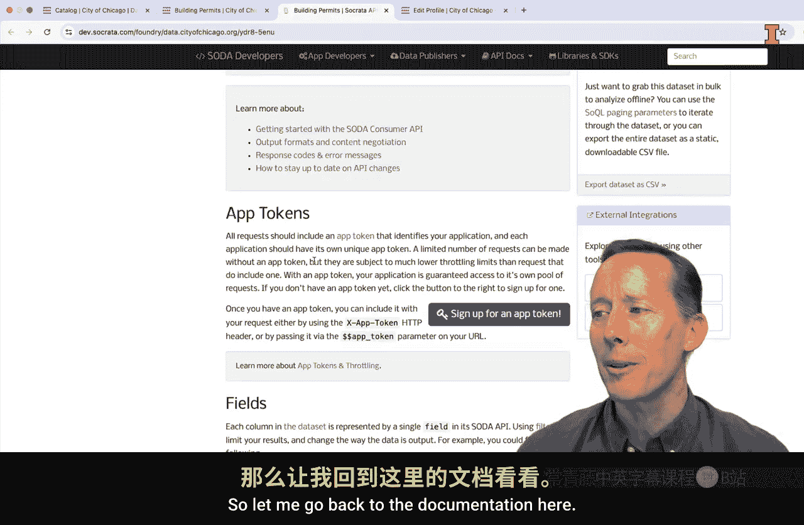

首先，从 pandas 和 requests 模块导入必要的函数。

```python
import pandas as pd
import requests
```

接下来，构建我的请求头部。

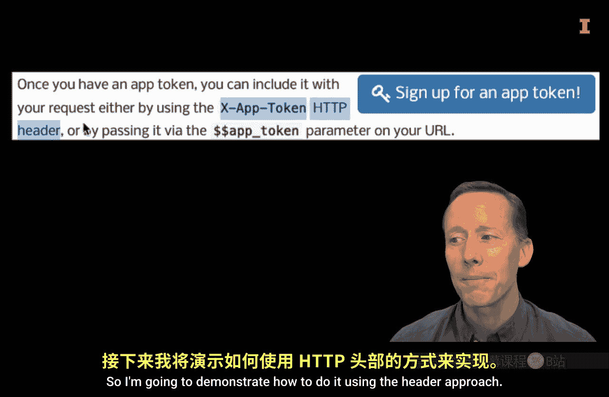

我正在创建一个简单的 Python 字典。字典的键是引号内的 `‘X-App-Token’`，后面跟着一个冒号，然后是我的令牌。我将把这个字典保存为一个名为 `my_header` 的变量。

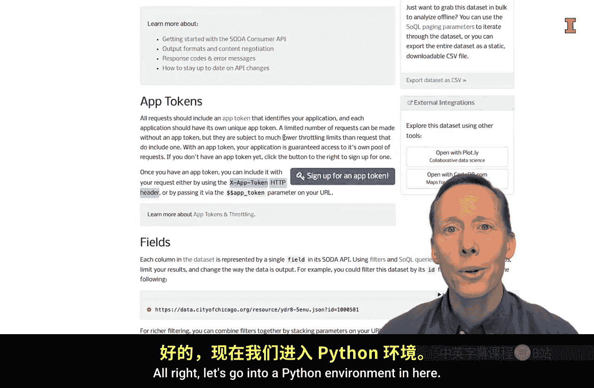

```python
my_header = {'X-App-Token': '你的应用令牌字符串'}
```

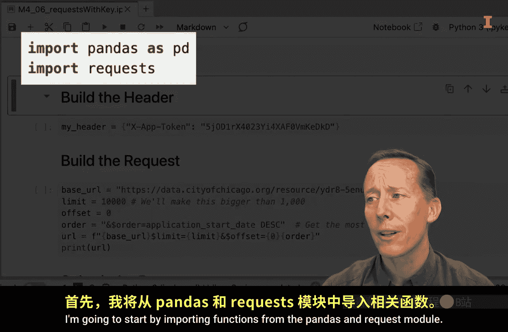

运行这个代码单元格。

现在，开始构建请求。与上一课相比，有几个不同之处。

请求的 URL 是相同的，但第一个不同点是，我将尝试一次性获取 10000 行数据，而不是 1000 行。`$limit` 参数设置为 10000。

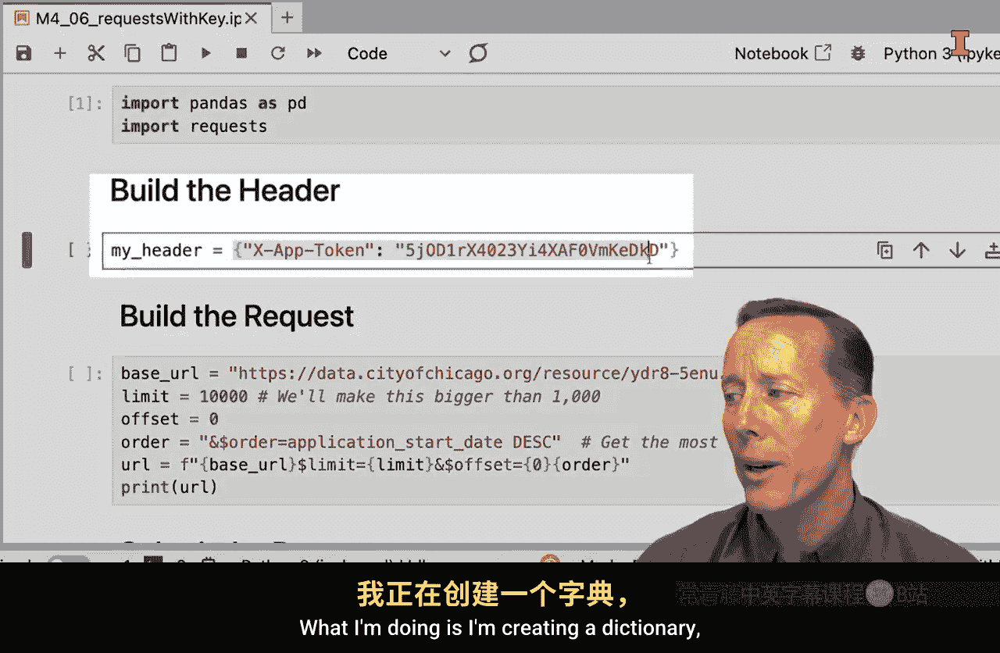

`$offset` 参数相同。`$order` 参数也相同，我希望按降序排列。

另一个不同点是，我没有使用任何修饰符，没有指定必须大于某个特定日期。

最后，我构建我的 URL。

```python
url = “https://data.cityofchicago.org/resource/xxxx.json?$limit=10000&$offset=0&$order=application_start_date DESC”
```

运行这个代码单元格，你可以看到生成的 URL。

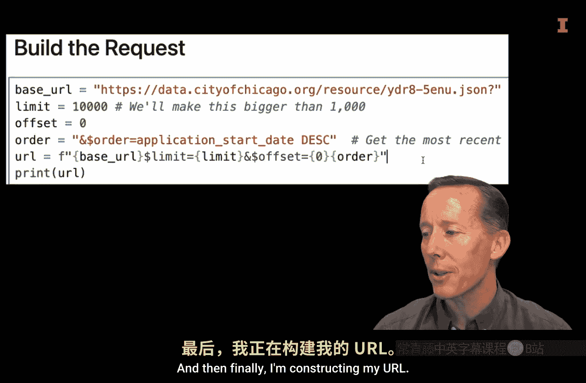

令牌也可以附加在 URL 的末尾。但同样，我将其放在了头部中。

## 执行请求并计时

现在，让我们查看请求。我在这里添加了一个“魔法”命令，这是 Jupyter 允许我们做的功能。我想计时获取 10000 行数据与 1000 行数据所需的时间。

我将再次使用 `requests.get()` 函数，并传入 URL。但现在我多了一个参数 `headers`，我将其设置为之前创建的 `my_header` 变量，该变量包含了我的令牌。

```python
%%time
response = requests.get(url, headers=my_header)
```

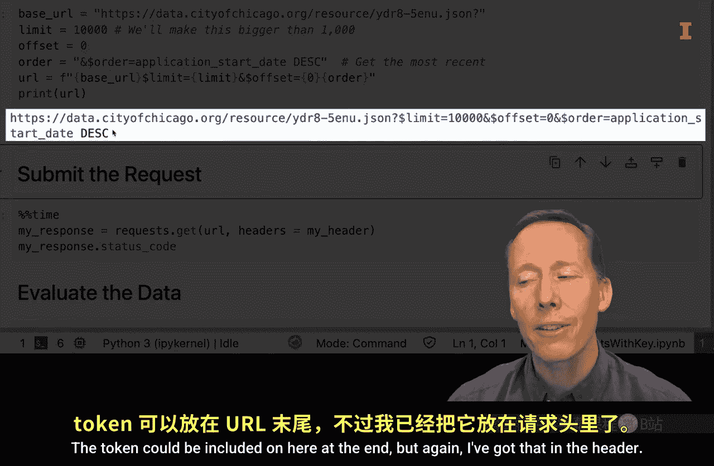

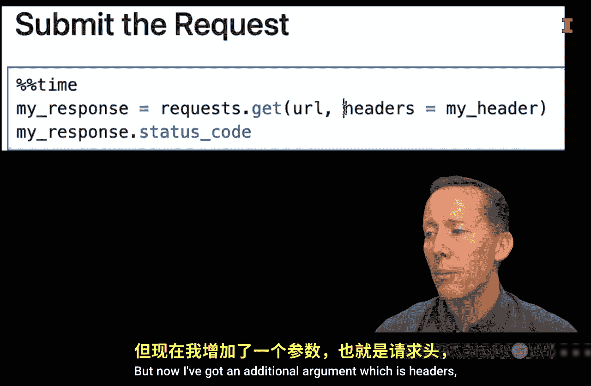

这就是主要的区别。让我们运行它，看看需要多长时间。

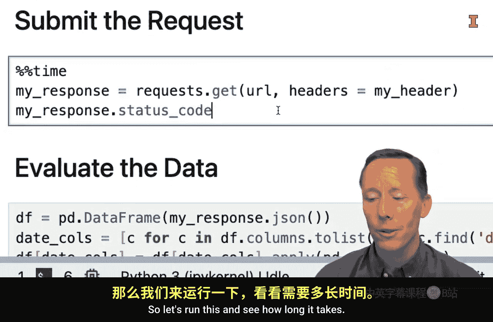

大约花了 2.7 秒。我得到了一个 200 响应类型，说明请求成功了。

## 数据处理与分析

本视频我想强调的关键点就是如何将头部信息添加到你的 API 请求中。

在此之后，我们当然可以继续评估数据。我们可以将其转换为 DataFrame 并创建图表，以便查看数据。

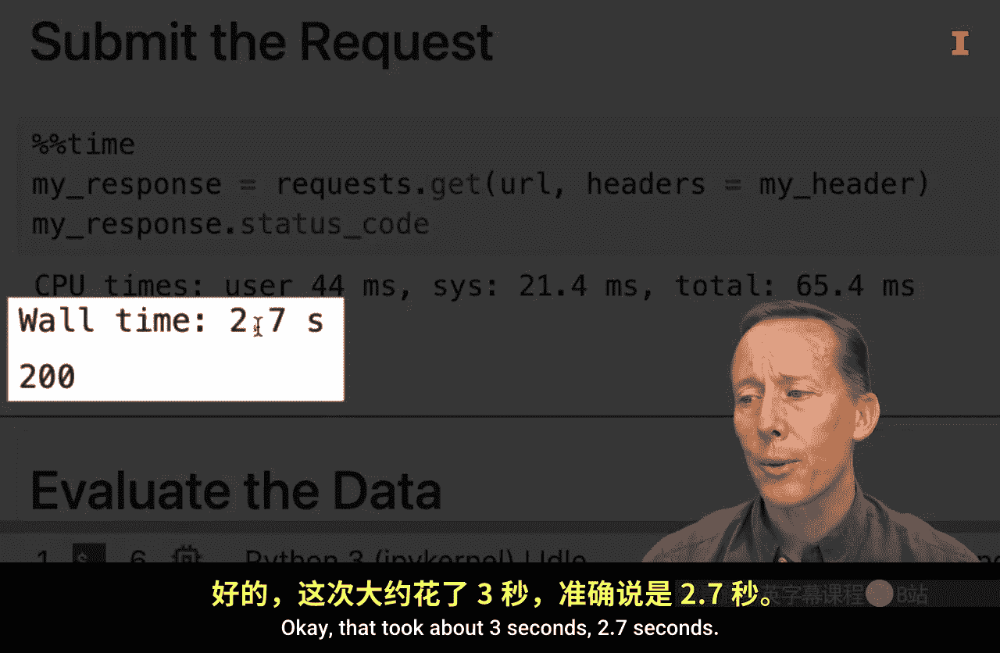

例如，我们可以按申请开始日期绘制每周的总费用，并对其执行一些额外的分析。

```python
df = pd.DataFrame(response.json())
# 进行数据分析和绘图...
```

## 总结


本节课中，我们一起学习了如何将 API 密钥或令牌集成到 API 请求中。你现在已经准备好进行更安全的 API 调用，并能在单次请求中获取更多数据了。记住，始终遵循特定 API 的文档来正确使用身份验证机制。