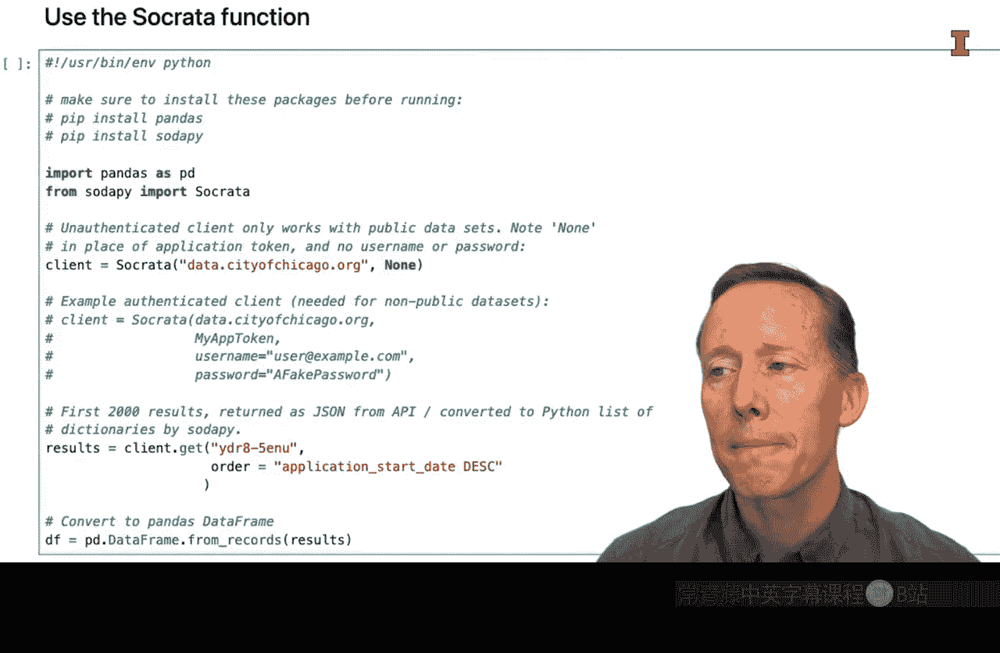
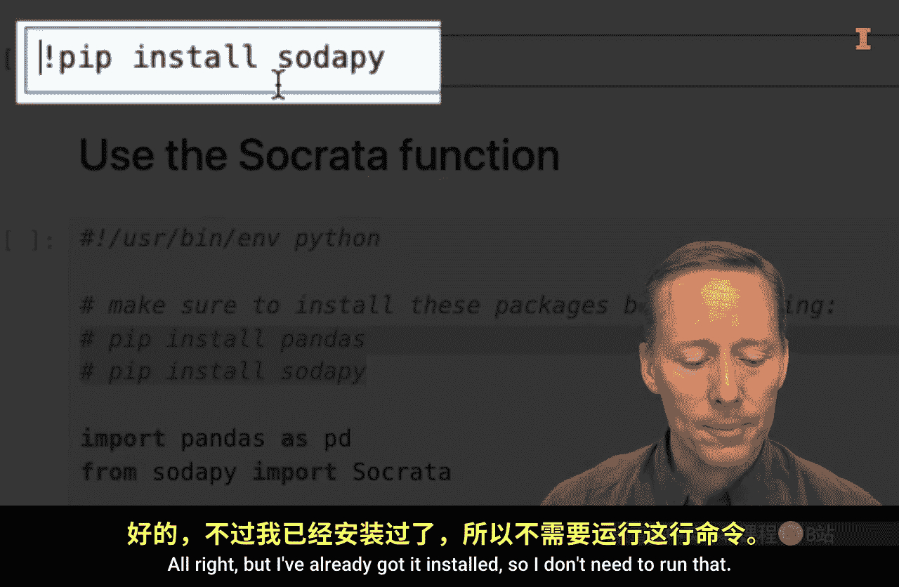
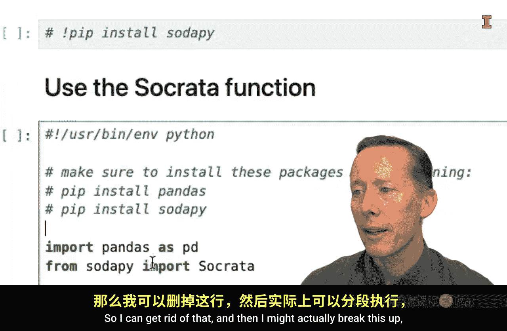
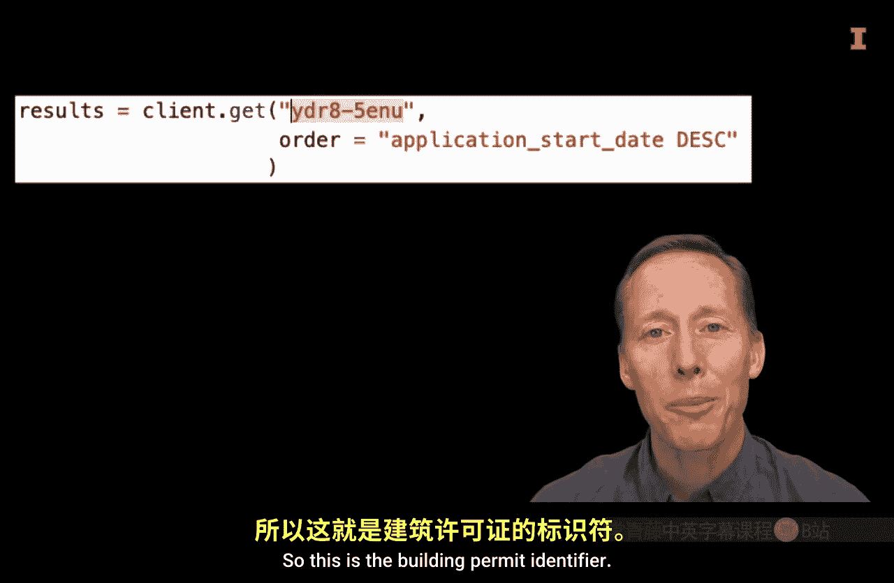
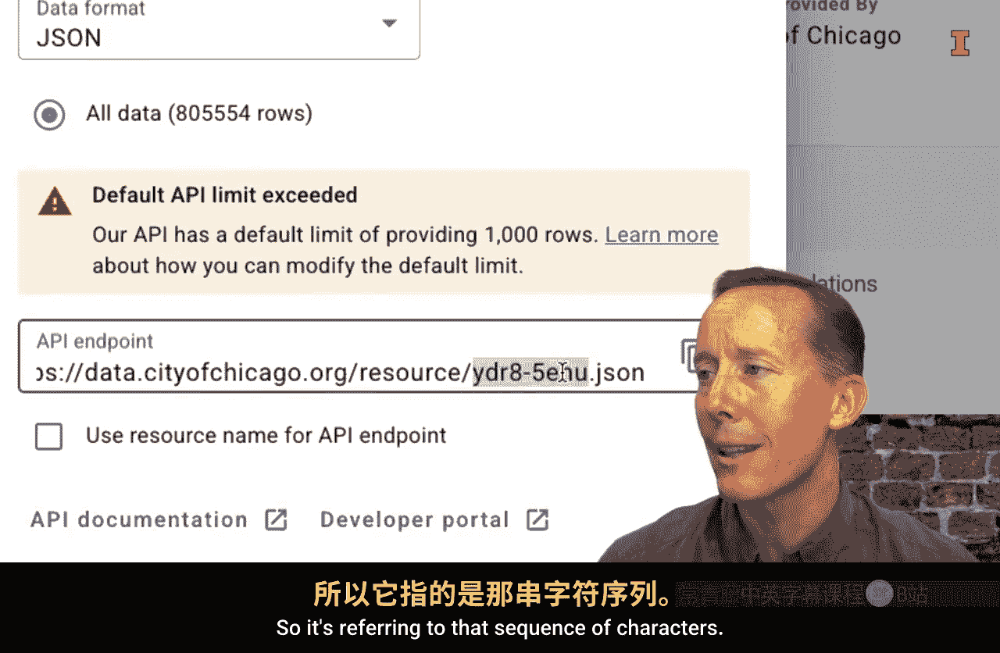
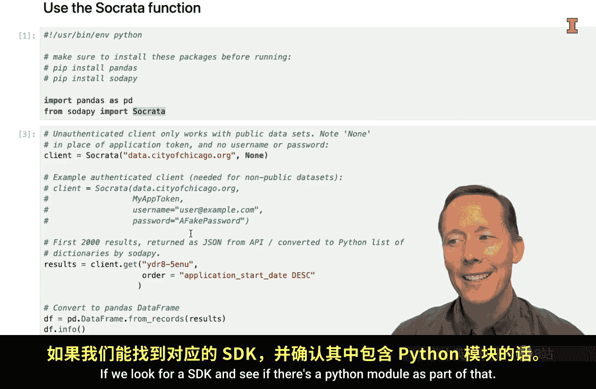

#  127：使用软件开发工具包构建 API 请求 🛠️


在本节课中，我们将学习如何利用软件开发工具包来简化API请求的构建过程，避免手动拼接URL的繁琐与潜在错误。

## 概述

上一节我们介绍了通过直接构建URL来发起API请求。本节中我们来看看一种更便捷的方法：使用软件开发工具包。

如果有一种方法可以让你无需手动构造URL就能执行API请求，这将会非常棒。这能省去很多麻烦，因为你不再需要担心遗漏重要的“&”符号或添加了过多的符号。

许多提供API的数据供应商也会创建软件开发工具包。作为SDK的一部分，他们通常会开发可供下载并安装到计算机上的Python模块。这些模块包含了能极大简化API请求执行的函数。



当然，与API相关的所有事物一样，这并没有统一标准。因此，你需要阅读API的文档，以确认是否存在可用的Python模块。

## 实践：使用芝加哥数据门户的SDK





让我们通过一个例子来练习使用SDK。我们一直以芝加哥数据门户的建筑许可数据为例。

如果我们点击其API文档链接，并滚动到页面底部，可以找到关于SDK的信息。由于Python被广泛使用，通常都会有对应的Python模块。

在文档中，我们可以找到一个名为“Python pandas”的标签页，里面提供了一些可以复制的示例代码。

### 环境准备与代码执行

以下是使用SDK获取数据的关键步骤：





1.  **安装必要模块**：首先，需要确保已安装`pandas`和`sodapy`模块。可以使用终端命令进行安装：
    ```bash
    !pip install sodapy
    ```

2.  **导入模块与创建客户端**：导入必要的函数，并创建一个连接到芝加哥数据门户的客户端。`None`表示不使用应用令牌，若你有令牌，可将其作为第二个参数传入。
    ```python
    from sodapy import Socrata
    import pandas as pd

    client = Socrata("data.cityofchicago.org", None)
    ```

3.  **发起数据请求**：使用客户端的`get`方法，传入数据集标识符（例如建筑许可数据的ID）以及可选的查询参数（如排序）。这种方式比手动拼接URL参数更清晰。
    ```python
    results = client.get("ydr8-5enu", order="application_start_date DESC", limit=1000)
    ```


4.  **转换为数据框并清洗**：将返回的结果转换为Pandas数据框以便分析。通常，初始数据的所有列都是字符串类型，需要进行适当的数据类型转换。
    ```python
    df = pd.DataFrame.from_records(results)
    # 后续进行数据清洗，例如转换日期、数值列
    ```

运行代码后，我们成功获取了1000行数据。与之前一样，每个列最初都是字符串类型，因此需要额外的清洗步骤，将其转换为正确的数据类型，之后才能使用pandas函数进行分析。

## 总结




本节课中我们一起学习了利用软件开发工具包来简化API数据获取流程。关键在于认识到，当我们开始使用某个新的API时，应该主动寻找其SDK，特别是查看是否有Python模块可用。这通常会让你的工作变得更加轻松。记住，在文档中寻找Python模块的踪迹，是提升数据获取效率的重要一步。