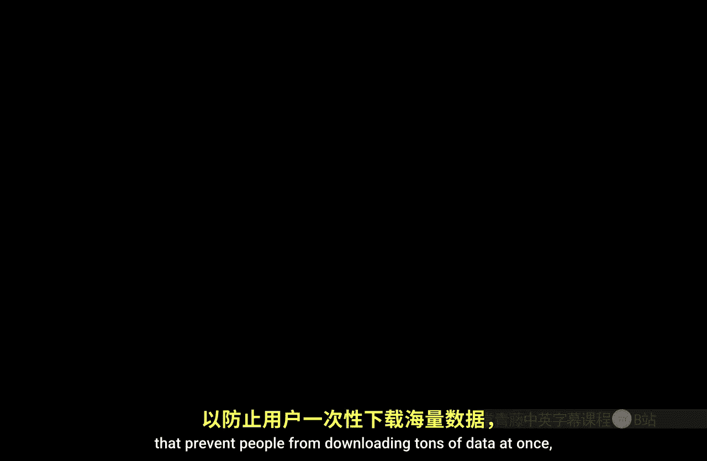
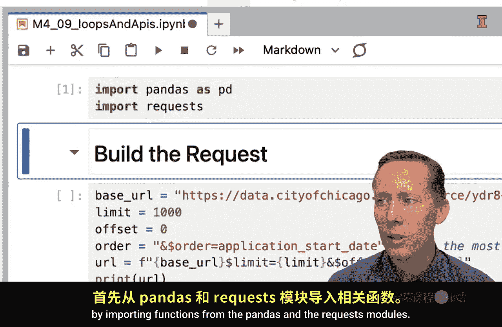
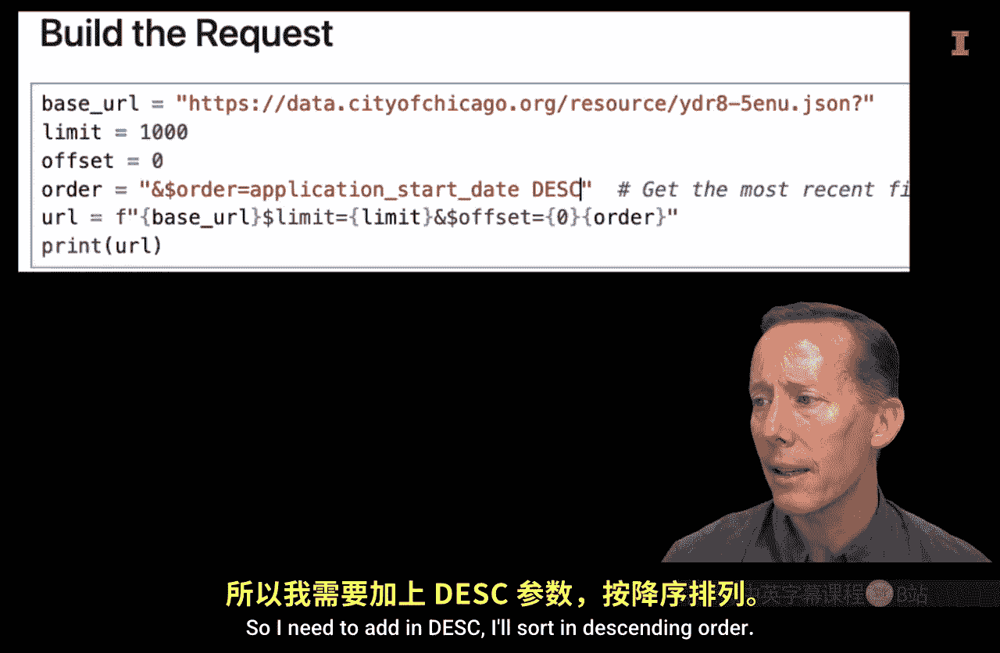
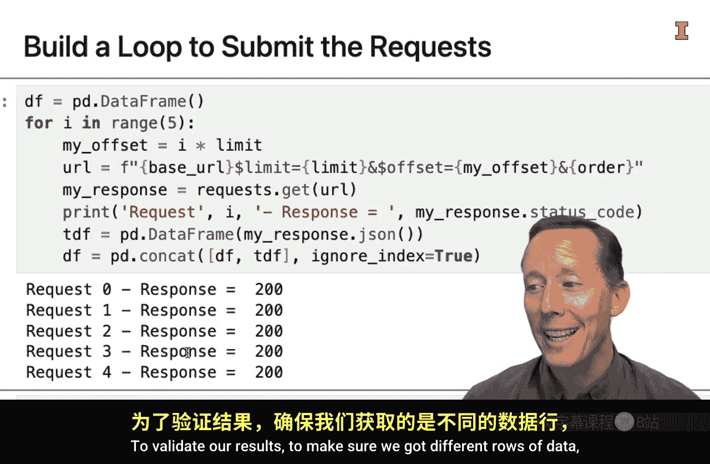
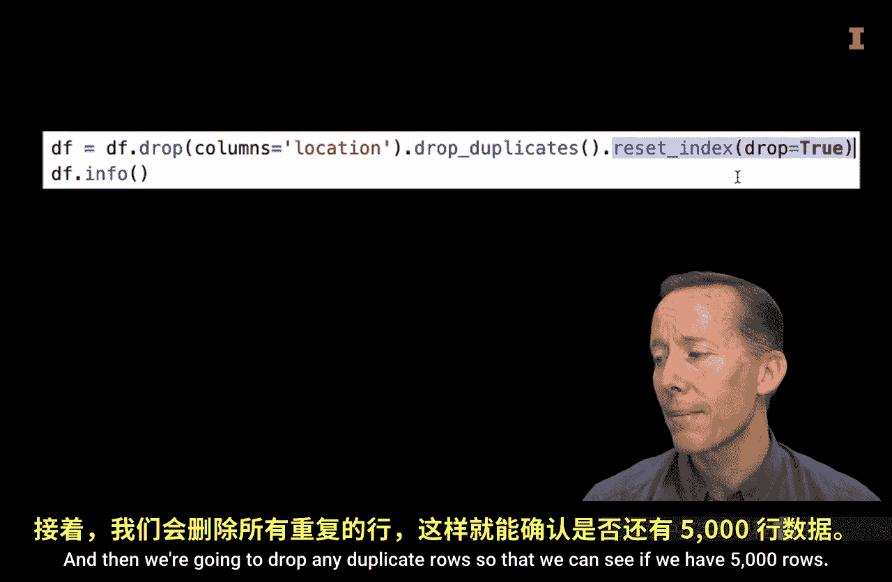
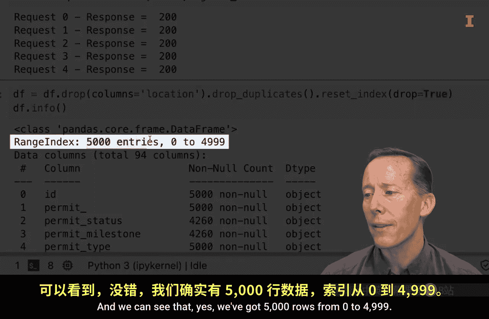
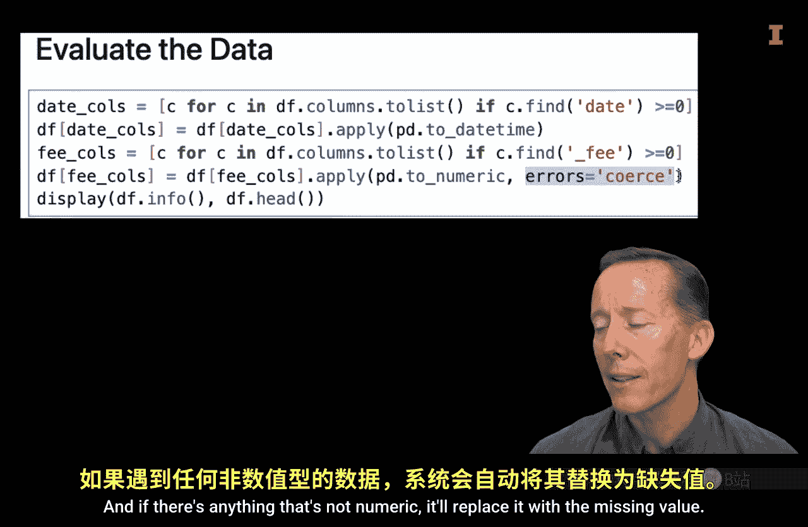
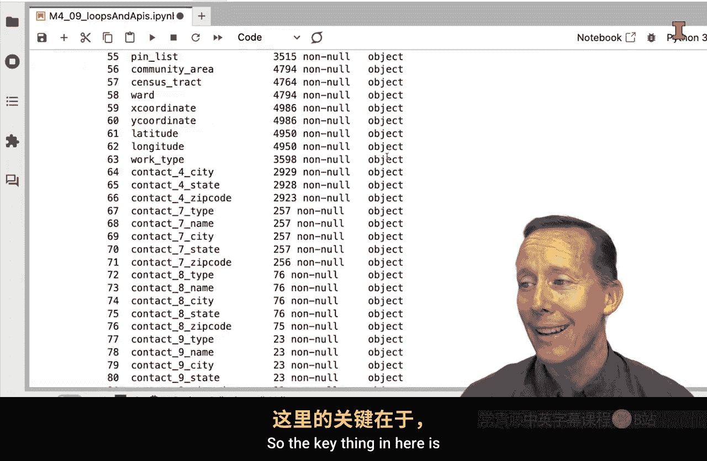

#  129：循环与应用程序接口



在本节课中，我们将学习如何利用循环结构，通过迭代式地向应用程序接口发送请求，来获取超过单次请求限制的大量数据。我们将以芝加哥市建筑许可数据接口为例，演示这一过程。

## 概述



应用程序接口通常会设置控制措施，以防止用户一次性下载过多数据，因为这可能占用全部带宽。因此，接口通常会对可下载的数据行数设置速率限制。本节课将演示如何使用循环执行迭代式API请求，从而下载所需的全部数据。

我们将基于之前使用的例子进行构建，从芝加哥市的API获取数据，具体是建筑许可数据。在没有应用程序令牌的情况下，该API的数据限制为1000行。

## 构建基础请求

首先，我们需要在Python环境中导入必要的模块。

```python
import pandas as pd
import requests
```



接下来，构建我们的初始请求。以下是请求URL的构建方式：

```python
base_url = "https://data.cityofchicago.org/resource/ydr8-5enu.json"
limit = 1000
offset = 0
order_by = "application_start_date DESC"
url = f"{base_url}?$limit={limit}&$offset={offset}&$order={order_by}"
print(url)
```

这个URL以建筑许可数据的端点为基础。问号表示我们将对数据进行筛选。我们将行数限制设置为1000，这是没有应用令牌时的最大值。偏移量从0开始。这两个数字非常重要。我们按“申请开始日期”降序排列数据，以确保首先获取最新的数据。

## 使用循环获取更多数据

我们一次只能获取1000行数据。假设我需要5000行数据，但没有API密钥。即使有API密钥或应用令牌，通常也存在限制。因此，我们将构建一个循环来帮助我们完成这个任务。

以下是应用循环的具体方法：

```python
df = pd.DataFrame()  # 创建一个空的DataFrame
limit = 1000

for i in range(5):
    my_offset = i * limit
    url = f"{base_url}?$limit={limit}&$offset={my_offset}&$order={order_by}"
    response = requests.get(url)
    print(f"Request {i+1} status: {response.status_code}")
    tdf = pd.DataFrame(response.json())
    df = pd.concat([df, tdf], ignore_index=True)
```

首先，创建一个名为`df`的空DataFrame。然后，使用`for i in range(5)`的循环结构，将下面的代码执行五次。在循环内部，我们创建变量`my_offset`。记住URL中的偏移量参数，我们将其设置为`i * limit`。第一次循环时，`i`等于0，所以偏移量为0。第二次循环时，`i`等于1，偏移量变为1000，依此类推。这样，我们就能通过改变偏移量来逐页获取数据。

循环内的其余部分与单次请求类似：执行GET请求并保存响应；打印状态更新以跟踪进度；将获取的数据转换为名为`tdf`的临时DataFrame；最后，将这个临时DataFrame堆叠到主DataFrame `df`的下方。第一次循环时，`df`是空的，`tdf`会添加新行。后续每次循环都会添加更多行。我们忽略索引以避免重复的行名。

运行上述代码，可以看到循环依次执行了五次请求，成功获取了数据。



## 验证与数据清洗



为了验证结果并确保我们获得了不同的数据行，可以进行以下操作：



```python
# 删除包含字典的‘location’列，以便检查重复项
df_clean = df.drop(columns=['location'])
# 删除任何重复的行
df_clean = df_clean.drop_duplicates()
# 重置索引
df_clean = df_clean.reset_index(drop=True)
print(f"Total rows: {len(df_clean)}")
```

运行后，可以看到我们确实获得了5000行不重复的数据，索引从0到4999。这表明循环请求成功了。

接下来可以进行一些额外的数据清洗。这里展示一个列表推导式的应用：

```python
# 找出所有列名中包含‘date’的列，并转换为日期时间格式
date_cols = [c for c in df_clean.columns if 'date' in c.lower()]
df_clean[date_cols] = df_clean[date_cols].apply(pd.to_datetime)

# 找出所有列名中包含‘fee’的列，并转换为数值类型，非数值转换为缺失值
fee_cols = [c for c in df_clean.columns if 'fee' in c.lower()]
df_clean[fee_cols] = df_clean[fee_cols].apply(pd.to_numeric, errors='coerce')
```



这段代码首先循环遍历所有列名。对于每个列名，如果其中包含“date”这个词，就将其加入`date_cols`列表，然后对这个列表中的所有列应用`pd.to_datetime`函数进行转换。接着，用类似的方法找出所有包含“fee”的列，将它们转换为数值类型，无法转换的则替换为缺失值。

运行清洗代码后，可以看到“issue_date”等列已转换为日期时间格式，“building_fee_paid”、“zoning_fee_paid”等列已转换为数值类型。之后，就可以利用Python和pandas的功能来分析这些数据了。

## 总结




本节课中，我们一起学习了如何利用循环结构迭代执行多个API请求，以获取所需的大量数据。关键点在于通过动态调整请求中的偏移量参数来实现数据的分页获取。我们还演示了for循环、列表推导式以及`apply`方法在数据处理中的实际应用，展示了这些工具如何帮助您高效地从API获取并处理数据。希望这个演示对您理解循环在数据获取中的应用有所帮助。