#  130：ChatGPT API 编程调用指南 🚀


在本节课中，我们将学习如何通过 OpenAI 的 API，以编程方式调用 ChatGPT 等人工智能模型。我们将从获取 API 密钥开始，逐步演示如何在 Python 环境中发送文本和图像请求，并获取 AI 的响应。

## 准备工作：获取 API 密钥与阅读文档

要使用 OpenAI 的 API，首先需要一个付费账户并获取 API 密钥。每个 API 的文档都不同，因此仔细阅读官方文档至关重要。

以下是获取和使用 API 密钥的关键步骤：

1.  **访问文档**：搜索并访问 OpenAI 的官方 API 文档网站。
2.  **身份验证**：使用 API 必须进行身份验证。点击“组织设置”查看和管理 API 密钥。
3.  **创建密钥**：在账户中创建新的 API 密钥。出于安全考虑，创建后无法再次查看完整密钥，需要妥善保存。
4.  **查看用量**：在“账单”部分可以查看余额和使用情况。

## 核心概念：发起模型请求

上一节我们介绍了如何获取访问凭证，本节中我们来看看如何发起一个基础的文本请求。OpenAI 提供了详细的代码示例。

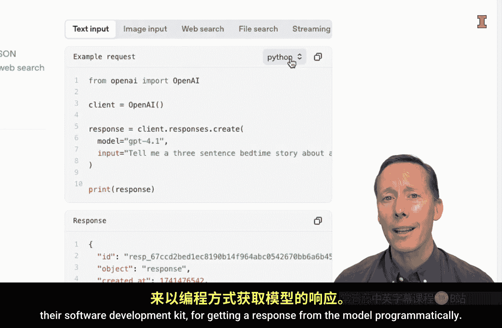

核心步骤是使用其软件开发工具包（SDK）来编程获取模型响应。以下是一个 Python 示例的代码结构：

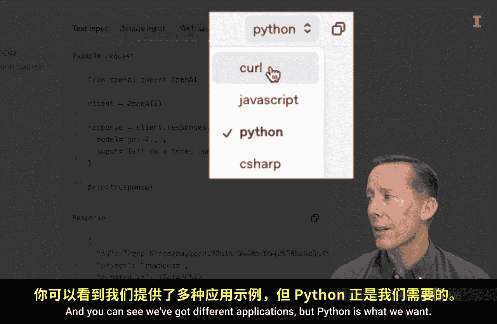

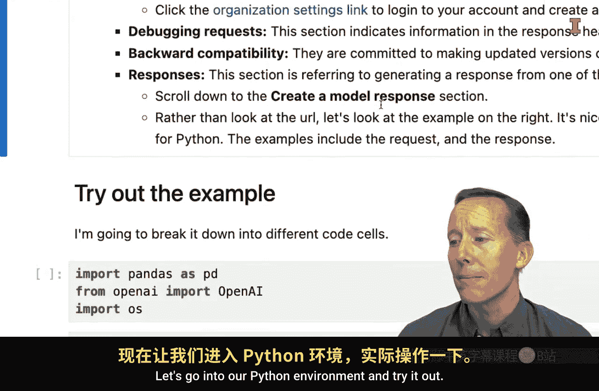

```python
# 导入必要的库
import openai
import os

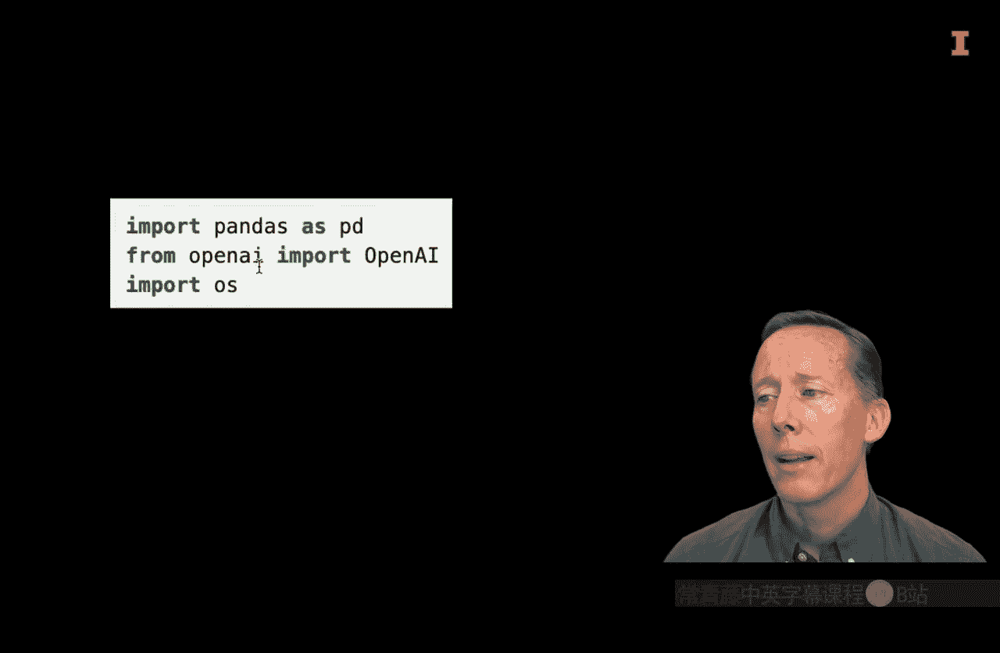

# 安全地从环境变量获取 API 密钥
api_key = os.environ.get("OPENAI_API_KEY")

# 初始化客户端
client = openai.OpenAI(api_key=api_key)

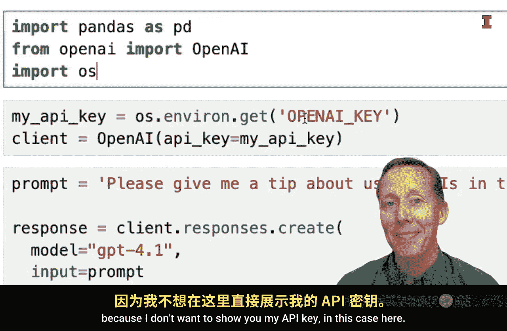

# 创建请求
response = client.chat.completions.create(
    model="gpt-3.5-turbo",
    messages=[
        {"role": "user", "content": "请给我一个关于使用API的提示，用打油诗的形式。"}
    ]
)

# 打印响应
print(response.choices[0].message.content)
```

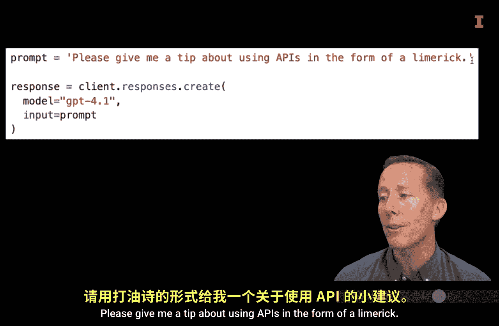

运行上述代码后，可能会得到类似这样的响应：“调用 API 莫心急，文档先读细。端点地址要核对，错误信息需留意，请求频率控制好，否则结果一团糟。”

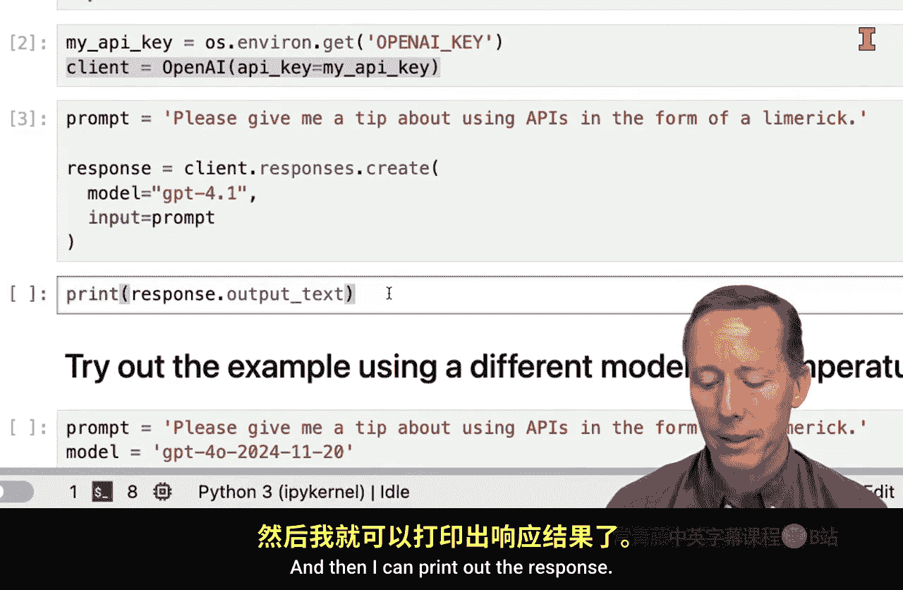

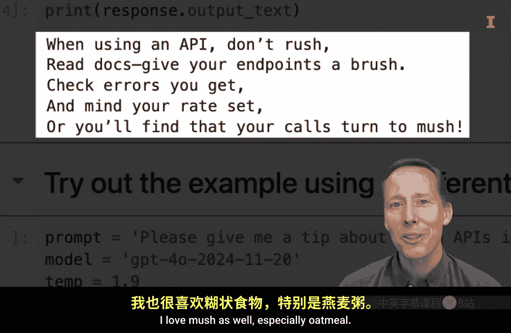

## 功能扩展：处理图像输入

除了文本，OpenAI 的 API 也支持图像分析。这为商业应用（如库存盘点、人群估算）打开了大门。

以下是分析图像内容的代码示例：

```python
# 定义图像URL和问题
image_url = "https://example.com/your-image.jpg"
prompt_text = "这张图片里有什么？"

# 发起视觉请求
response = client.chat.completions.create(
    model="gpt-4-vision-preview",
    messages=[
        {
            "role": "user",
            "content": [
                {"type": "text", "text": prompt_text},
                {"type": "image_url", "image_url": {"url": image_url}},
            ],
        }
    ],
    max_tokens=300,
)

print(response.choices[0].message.content)
```

例如，给 API 一张玉米地的图片并询问“你认为这张图片中的玉米价值多少？”，模型可能会基于视觉信息给出估算，但同时会指出需要更多数据（如田地面积）才能精确计算。

## 模型选择与成本考量

OpenAI 提供了多种模型，性能和价格各不相同。在“快速入门”或“定价”页面可以查看每百万令牌（tokens）的价格。

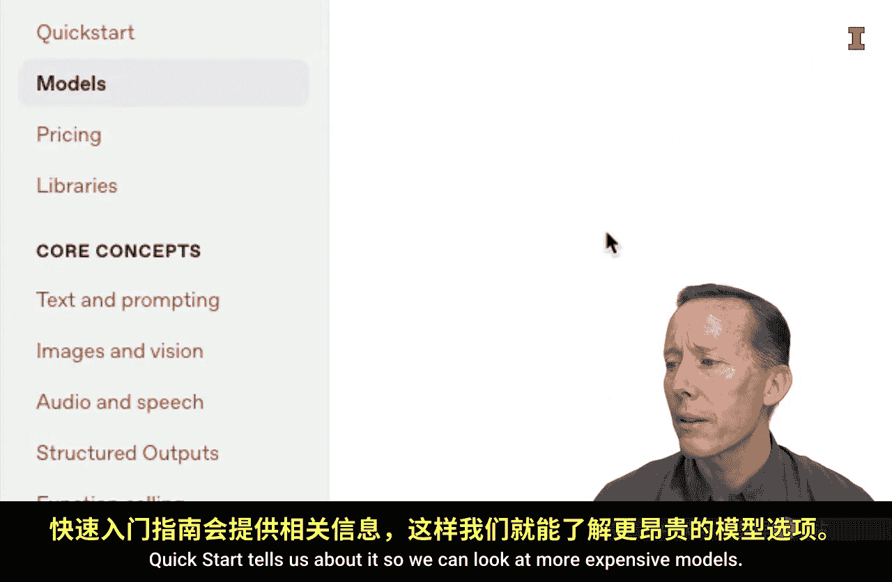

选择模型的公式可以简化为：
**模型选择 = 权衡(任务复杂度， 响应精度要求， 预算成本)**

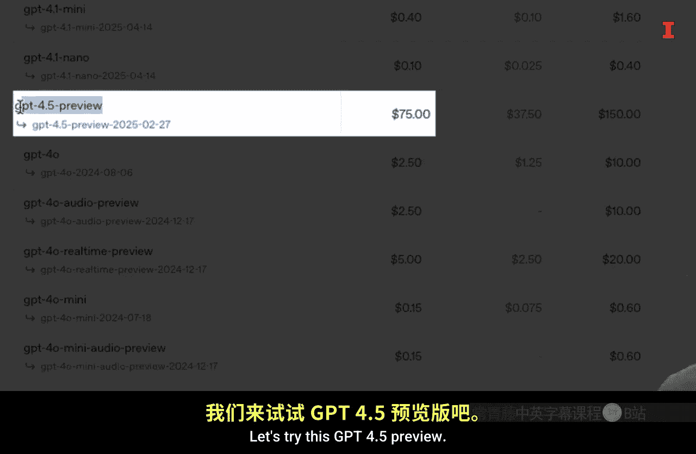

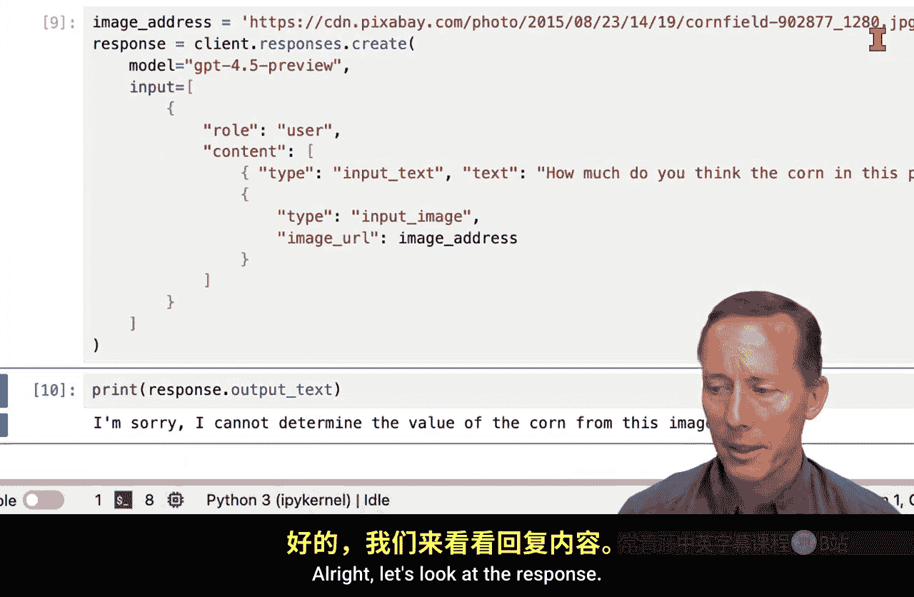

例如，`gpt-4` 系列模型比 `gpt-3.5-turbo` 更强大也更昂贵。在实际应用中，可以根据具体需求进行选择。

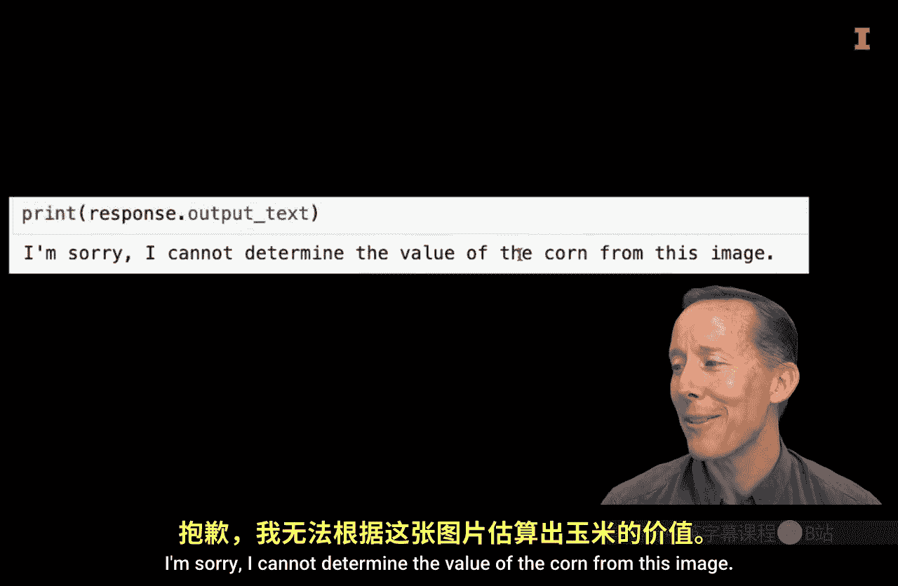

## 总结与展望

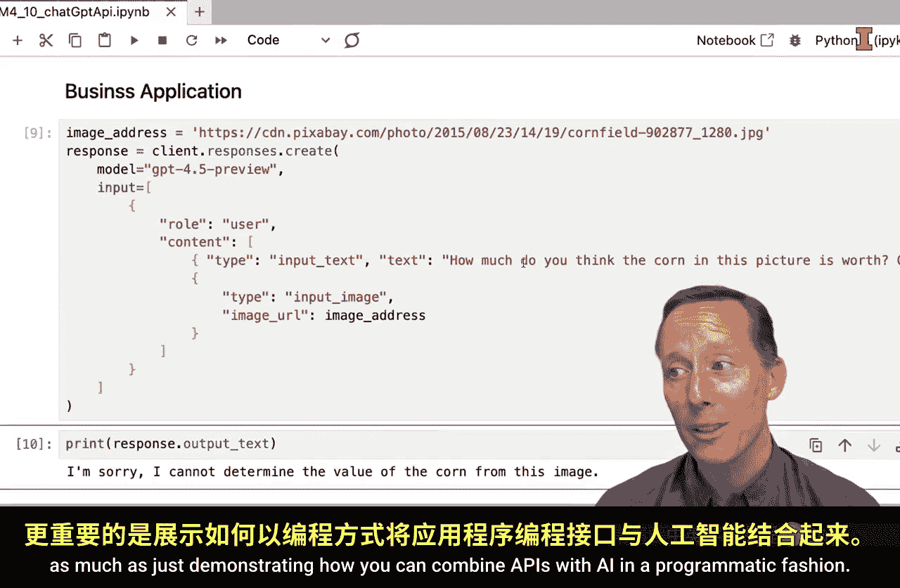


本节课中我们一起学习了如何通过 OpenAI API 以编程方式调用 ChatGPT。
我们从获取 API 密钥开始，实践了发送文本和图像请求，并了解了不同模型的选择。
现在，你已经掌握了将 API 与 AI 能力结合的工具。
接下来，你将创造什么呢？