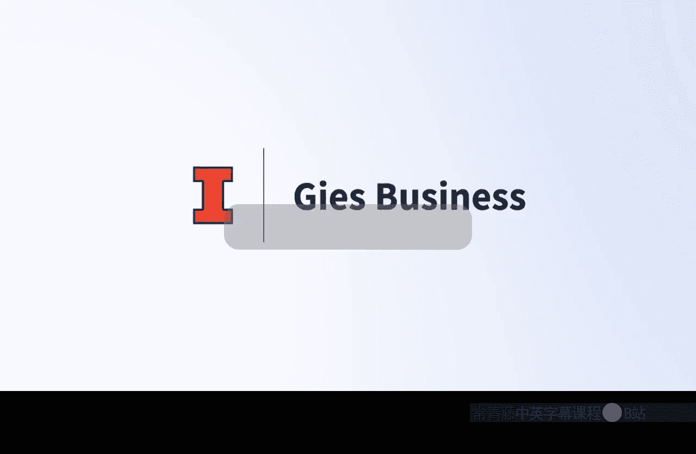
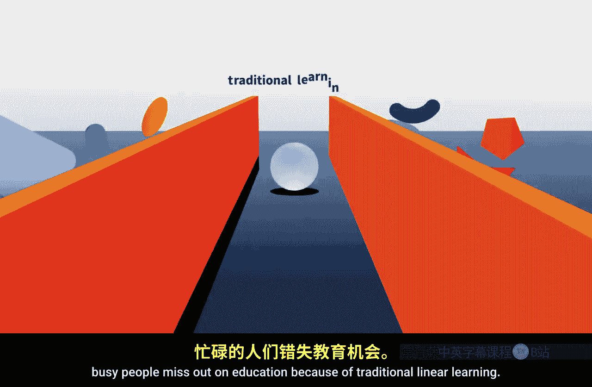
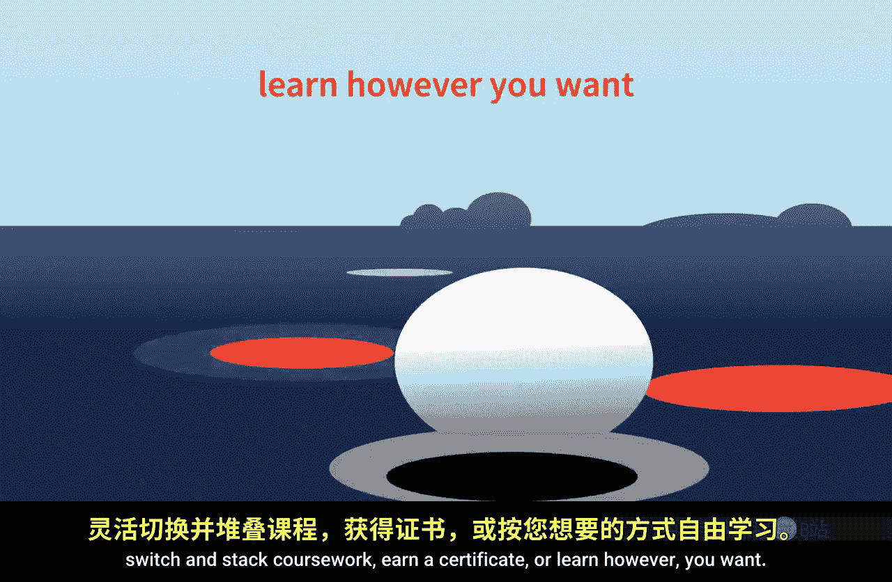
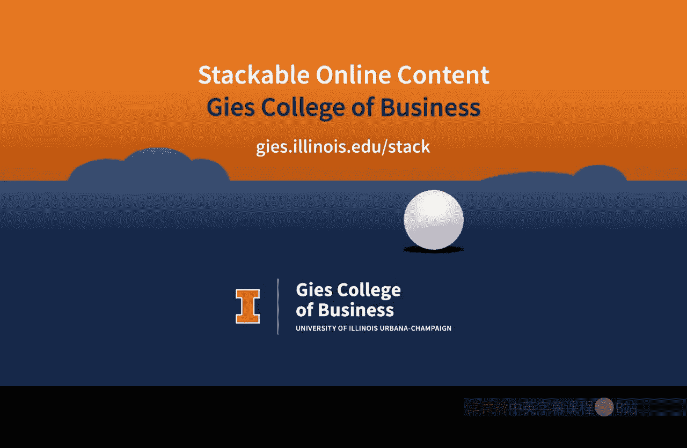

#  133：按你的方式学习

## 概述
在本节课中，我们将了解吉斯商学院如何通过可堆叠的在线内容，打破传统线性学习的限制，让你能够完全按照自己的节奏和方式获取教育。

## 传统学习的局限
过于频繁地，聪明、勤奋、忙碌的人们因为传统的线性学习模式而错失教育机会。

## 吉斯商学院的解决方案
因此，吉斯商学院提供了可堆叠的在线内容，让你能够按照自己的方式学习。

以下是吉斯商学院提供的主要学习方式：
*   你可以参加自定进度的课程。
*   你可以获得可转录的学分。
*   你可以随时暂停学习。
*   你可以最终获得学位。
*   你可以转换和堆叠课程作业。
*   你可以获得证书。
*   或者，你可以以任何你想要的方式学习。

## 学习体验的核心优势
上一节我们列举了灵活的学习方式，本节中我们来看看这些方式带来的核心优势。你将获得由专家引领的教育，并且无论你处于学习旅程的哪个阶段，都能以或大或小的增量进行学习。

## 开始的最佳时机
在吉斯商学院开始学习的最佳时机，就是你认为合适的时间。

## 总结
本节课中，我们一起学习了吉斯商学院如何通过提供灵活、可堆叠的在线学习方案，让每个人都能掌控自己的学习节奏和路径，从而让教育变得更加个性化和便捷。