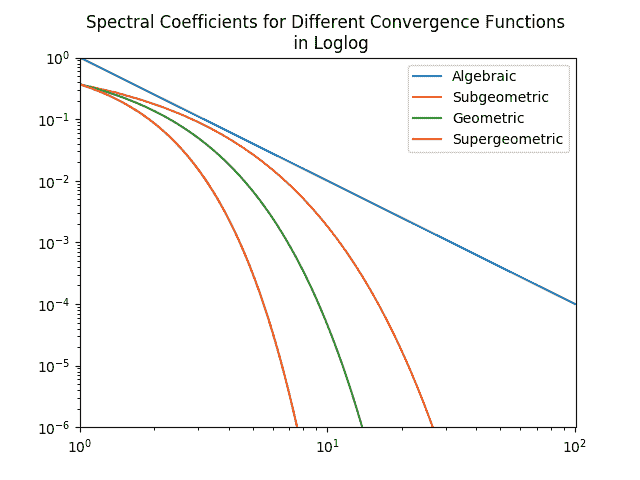
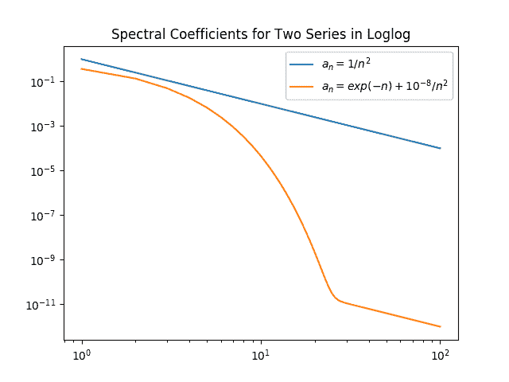
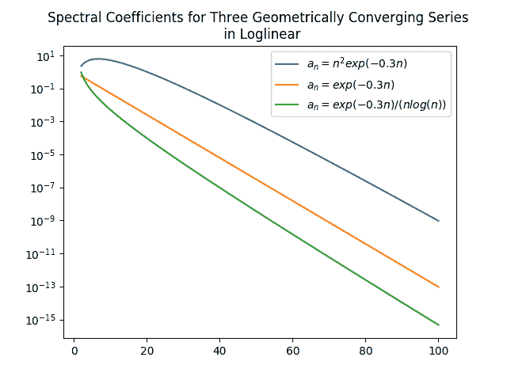

# 误差和复杂性

> 原文：[`cs357.cs.illinois.edu/textbook/notes/error.html`](https://cs357.cs.illinois.edu/textbook/notes/error.html)

查看幻灯片

如果您在这里看不到 PDF，请点击这里下载 PDF。

## 学习目标

+   比较和对比相对误差和绝对误差

+   将成本分类为 $\mathcal{O}(n^p)$

+   将误差分类为 $\mathcal{O}(h^p)$

+   识别代数增长和指数增长与收敛

## 整体情况

+   数值算法以其***成本***和***误差***以及它们之间的权衡而区分。

+   在可能的情况下，本课程中介绍的计算算法或方法会指出它们的误差和成本。这些可能是精确表达式或渐近界限，如 $h \to 0$ 时的 $\mathcal{O}(h²)$ 或 $n \to \infty$ 时的 $\mathcal{O}(n³)$。对于渐近分析，我们总是指明极限。

## 科学记数法

使用科学记数法，一个数可以表示为

$$x = \pm r \times 10^{m}$$

其中 $r$ 是一个在 $1 \leq r < 10$ 范围内的系数，$m$ 是指数。

**示例：**让我们将这些数字转换为科学记数法：

$$\begin{equation} -165.73 = -1.6573 \times 10^{2} \end{equation}$$ $$\begin{equation} 0.00432 = 4.32 \times 10^{-3} \end{equation}$$

## 绝对误差和相对误差

使用数值方法计算的结果是不准确的——它们是真实值的近似。我们可以将一个近似结果表示为真实值和一些误差的组合：

$$\begin{eqnarray} \text{近似结果} = \text{真实值} + \text{误差} \end{eqnarray}$$ $$\hat{x} = x + \Delta x$$

给定这个问题设置，我们可以定义绝对误差为：

$$\begin{equation} \text{绝对误差} = |x - \hat{x}| \end{equation} .$$

这告诉我们我们的近似结果与实际答案有多接近。然而，绝对误差可能会因为 $x$ 的大小而成为一个令人不满意且具有误导性的误差表示。

| 情况 1 | 情况 2 |
| --- | --- |
| $x = 0.1$, $\hat{x} = 0.2$ | $x = 100.0$, $\hat{x} = 100.1$ |
| $\mid x - \hat{x} \mid = 0.1$ | $\mid x - \hat{x} \mid = 0.1$ |

在这两种情况下，绝对误差相同，都是 0.1。然而，我们会直觉地认为情况 2 比情况 1 更准确，因为情况 1 中的近似值是真实值的两倍。因此，我们定义相对误差，这将是一个与大小无关的误差估计。为了获得这个值，我们只需将绝对误差除以真实值的绝对值。

$$\begin{equation} \text{相对误差} = \frac{|x - \hat{x}|}{|x|} \end{equation}$$

如果我们再次考虑这两种情况，我们可以看到相对误差在第二种情况下会低得多，因为相对误差与大小无关。

| 情况 1 | 情况 2 |
| --- | --- |
| $x = 0.1$, $\hat{x} = 0.2$ | $x = 100.0$, $\hat{x} = 100.1$ |
| $\frac{\mid x - \hat{x} \mid}{\mid x \mid} = 1$ | $\frac{\mid x - \hat{x} \mid}{\mid x \mid} = 10^{-3}$ |

### 向量的绝对误差和相对误差

如果我们的计算量是向量，那么我们不用绝对值函数，而可以用范数。因此，我们的公式变为

$$\begin{equation} \text{绝对误差} = \|\mathbf{x} - \mathbf{\hat{x}}\| \end{equation}$$ $$\begin{equation} \text{相对误差} = \frac{\|\mathbf{x} - \mathbf{\hat{x}}\|}{\|\mathbf{x}\|} \end{equation}$$

我们取差分的范数（而不是范数的差），因为我们感兴趣的是这两个量有多远。这样，我们计算差分向量，然后使用向量范数来找到该差分向量的长度。

## 有效数字/数位

**有效数字**是一个数字，它携带有意义的信息。它们是从最左边的非零数字开始，以最右边的“正确”数字结束的数字，包括精确的末尾零。例如：

+   数字 3.14159 有六个有效数字。

+   数字 0.00035 有两个有效数字。

+   数字 0.000350 有三个有效数字。

#### 近似值的有效数字

近似结果 $\hat{x}$ 的 $n$ 个有效数字对应于真实值 $x$，如果绝对误差 $\vert x - \hat{x}\vert$ 在从 $x$ 最左边的非零（首位）数字开始计数的第一个 $n$ 位小数中包含零，然后是 0 到 4 之间的一个数字。

**示例：** 假设 $x = 3.141592653$，假设 $\hat{x}$ 是近似结果：

$$\hat{x} = 3.14159 \longrightarrow |x - \hat{x}| = 0.00000\mathbf{2}653 = 2.653 \times 10^{-6} \longrightarrow \hat{x} \text{ 有 6 个有效数字。}$$ $$\hat{x} = 3.1415 \longrightarrow |x - \hat{x}| = 0.0000\mathbf{9}2653 = 0.92653 \times 10^{-4} \longrightarrow \hat{x} \text{ 有 4 个有效数字。}$$

换句话说，有效数字的数量告诉我们 $x$ 和 $\hat{x}$ 有多少位是相同的。

因此，我们可以观察到绝对误差被以下所限制：

$$|x - \hat{x}| \leq 5 \times 10^{-n}$$

为了找到相对误差的界限，让我们定义 $x$ 和 $\hat{x}$ 如下：

$$\begin{equation} x = q \times 10^p \end{equation}$$ $$\begin{equation} \hat{x} = \hat{q} \times 10^p \end{equation}$$

绝对误差可以这样表述：

$$|x - \hat{x}| = |q - \hat{q}| \times 10^p$$

由于科学记数法，我们知道 $1 \leq q < 10$，所以：

$$\text{相对误差} = \frac{|x - \hat{x}|}{|x|} = \frac{|q - \hat{q}| \times 10^p}{|q| \times 10^p} \leq \frac{5 \times 10^{-n}}{|q|} \leq 5 \times 10^{-n}$$

通常，我们将使用经验法则来计算相对误差的上界：如果一个近似值有 $n$ 个准确的有效数字，那么相对误差是

$$\frac{|x - \hat{x}|}{|x|} \leq 10^{-n+1}$$

## 截断误差与舍入误差

**舍入误差**是在计算中对值进行舍入时产生的误差。由于计算机使用有限精度并且对存储一个数值值的内存有限制，因此这种情况会不断发生。用有限小数展开来近似 $\frac{1}{3} = 0.33333\dots$ 是舍入误差的一个例子。

**截断误差**是在使用近似算法代替精确的数学过程或函数时产生的误差。例如，在评估函数的情况下，我们可能用有限泰勒级数表示我们的函数，直到 $n$ 次方。截断误差是由于没有使用 $n+1$ 次方及以上的项而产生的误差。

## 大 O 表示法

大 O 表示法用于理解和描述渐近行为。在趋近于 0 或$\infty$的情况下的定义如下：

设 $f$ 和 $g$ 是两个函数。那么当 $x \rightarrow \infty$ 时，$f(x) = \mathcal{O}(g(x))$ 当且仅当存在一个值 $M$ 和某个 $x_0$，使得 $|f(x)| \leq M|g(x)|$ 对于所有 $x$ 成立，其中 $x\geq x_0$

设 $f$ 和 $g$ 是两个函数。那么当 $h \rightarrow 0$ 时，$f(h) = \mathcal{O}(g(h))$ 当且仅当存在一个值 $M$ 和某个 $h_0$，使得 $|f(h)| \leq M|g(h)|$ 对于所有 $h$ 成立，其中 $0 < h < h_0$

但如果我们想考虑函数趋近于任意值的情况呢？那么我们可以重新定义表达式如下：

设 $f$ 和 $g$ 是两个函数。那么当 $x \rightarrow a$ 时，$f(x) = \mathcal{O}(g(x))$ 当且仅当存在一个值 $M$ 和某个 $\delta$，使得 $|f(x)| \leq M|g(x)|$ 对于所有 $x$ 成立，其中 $0 < |x − a| < \delta$

### 大 O 分析

由于大 O 表示法用于理解渐近行为，我们感兴趣的是增长最快的项，这些项定义了函数的极限行为。

例如，考虑函数 $f(x) = 2x² + 27x + 1000$

当 $x \rightarrow \infty$ 时，项 $x²$ 是增长最快的，因此它是最重要的，所以 $f(x) = O(x²)$。

最快增长到最慢增长常见项的层次结构，其中 $c$ 是一个常数：

$$\mathcal{O}(n!) > \mathcal{O}(c^n) > \mathcal{O}(n^c) > \mathcal{O}(n²) > \mathcal{O}(n log(n)) > \mathcal{O}(n) > \mathcal{O}(log(n)) > \mathcal{O}(c)$$

### 大 O 表示法示例 - 时间复杂度

我们可以使用大 O 来描述我们算法的时间复杂度。

考虑矩阵-矩阵乘法的情况。如果我们的每个矩阵的大小是 $n \times n$，为了乘法矩阵，我们必须在每个元素上计算内积，这需要 $n$ 次乘法和 $n$ 次求和。在一个 $n \times n$ 的矩阵中，有 $n²$ 个元素，这意味着有 $n² (2n) = 2n³$ 次操作，所以乘法矩阵所需的时间与 $2n³$ 成正比。

然而，在尝试理解时间复杂度时，我们关注的是算法基于输入大小的渐近增长率，因此我们可以这样说，乘矩阵所需的时间是 $\mathcal{O}(n³)$，这意味着 $\text{运行时间} \approx C \cdot n³$。

假设我们知道对于 $n_1=1000$，矩阵-矩阵乘法需要 5 秒。估计如果我们把矩阵的大小加倍到 $2n \times 2n$，需要多少时间。

我们知道：

$$\begin{align*} \text{时间}(2n_1) &\approx C \cdot (2n_1)³ \\ &= C \cdot 2³ \cdot n_1³\\ &= 8 \cdot (C \cdot n_1³) \\ &= 8 \cdot \text{时间}(n_1) \\ &= 40 \text{秒} \end{align*}$$

因此，当我们把矩阵的大小加倍到 $2n \times 2n$ 时，时间变为 $(2n)³ = 8n³$。因此，运行时间将大约是原来的 8 倍。

### 大 O 记号示例 - 截断误差

我们也可以使用大 O 记号来描述截断误差。一个数值方法被称为 $n$ 阶精确，如果其截断误差 $E(h)$ 符合 $E(h) = \mathcal{O}(h^n)$。

#### 示例 1

正弦函数可以表示为一个无穷级数：

$$f(h) = \sin(h) = h - \frac{h³}{6} + \frac{h⁵}{120} - \frac{h⁷}{5040} + \dots$$

假设我们取一个近似值：

$$\hat{f(h)} = h$$

我们可以将截断误差定义为：

$$E = |f(h) - \hat{f(h)} | = | - \frac{h³}{6} + \frac{h⁵}{120} - \frac{h⁷}{5040} + \dots|$$

相反，使用大 O 记号，我们定义截断误差为：

$$E = \mathcal{O}(h³)$$

#### 示例 2

考虑解决一个插值问题。我们有一个长度为 $h$ 的区间，其中我们的插值函数是有效的，并且我们知道我们的近似是 $\mathcal{O}(h²)$ 阶。这意味着，当我们减小 $h$（区间长度）时，我们的误差将呈二次方减少。使用大 O 的定义，我们知道 $\text{误差} = C \cdot h²$，其中 $C$ 是某个常数。

在某些情况下，我们可能不知道 $E(h) = \mathcal{O}(h^n)$ 中的指数。我们可以通过计算 $h$ 的两个不同值处的误差来估计它。假设我们有两个量，$h_1 = 0.5$ 和 $h_2 = 0.25$。我们计算相应的误差为 $E(h_1) = 0.125$ 和 $E(h_2) = 0.015625$。然后，由于 $E(h) = \mathcal{O}(h^n)$，我们有：

$$\begin{eqnarray}\frac{0.125}{0.015625} &=\frac{E(h_1)}{E(h_2)} \\ &\approx\frac{Ch_1^n}{Ch_2^n}\\ &=\left(\frac{h_1}{h_2}\right)^n\\ \end{eqnarray}$$ $$\begin{eqnarray} \implies\log\left(\frac{0.125}{0.015625}\right)= n\log\left(\frac{h_1}{h_2}\right) =n\log\left(\frac{0.5}{0.25}\right) \end{eqnarray}$$

解这个方程得到 $n = 3$。

### 大 O 记号示例 - 常数的作用

在大 O 记号定义中，对常数 $M$ 的过分重视是不重要的；它本质上是不确定的。

假设 $f_1(n) = 10^{-20}n²$ 和 $f_2(n) = 10^{20}n²$。虽然对于所有 $n$ 的值，$f_2$ 都比 $f_1$ 大得多，**但是**它们都是 $\mathcal{O}(n²)$；如果我们选择任何 $M_1 \geq 10^{-20}$ 和 $M_2 \geq 10^{20}$ 的常数，这是显而易见的。

然而，对于任何 $M \geq 10^{40}$ 的常数，$f_2(n) = \mathcal{O}(10^{-20}n²)$ 也是正确的。

$$\begin{eqnarray} f_2(n) = 10^{20}n² = 10^{40} \times 10^{-20}n² \leq M\times 10^{-20}n²\. \end{eqnarray}$$

因此，在 $\mathcal{O}$ 内包含一个常数基本上是没有意义的。

**问题：** 给出 $f_2(n) = \mathcal{O}(g(n))$ 的最紧界函数 $g(n)$ 是什么？

**解答：**答案是 $g(n) = n²$。对于任何 $r < 2$，不存在常数 $M$ 使得对于所有足够大的 $n$，$|f_2(n)| \leq Mn^r$。因此，对于 $r < 2$，$n^r$ 不是 $f_2$ 的上界。对于任何 $q > 2$，存在一对常数 $M_1$ 和 $M_2$，使得对于所有足够大的 $n$：

$$\begin{align*} f_2(n) \leq M_1 n²\leq M_2 n^q. \end{align*}$$

然而，我们**不能**找到一对常数 $M_3$ 和 $M_4$，使得：

$$\begin{align*} f_2(n) \leq M_3 n^q\leq M_4 n²\. \end{align*}$$

因此，我们无法在 $f_2(n)$ 和 $n²$ 之间“拟合”另一个函数，所以 $n²$ 是最紧的上界。

人们可能会想，正确的答案实际上应该是 $g(n) = 10^{20}n²$；然而，这实际上并没有提供关于 $f_2$ 增长的任何额外信息。注意，我们没有在上面的不等式中指定 $M_1$ 和 $M_2$ 是什么。大 $O$ 符号说**什么**关于常数的规模。以下陈述

$$\begin{align*} f_2(n) &= \mathcal{O}(n²),\\ f_2(n) &= \mathcal{O}(10^{20}n²),\\ f_2(n) &= \mathcal{O}(10^{-20}n²), \end{align*}$$

都等价，因为它们都提供了关于 $f_2$ 增长的相同信息，因为常数没有指定。由于 $10^{-20}$ 非常小，可能会诱使人们得出结论，它比其他两个更“紧”，但这并不正确。因此，始终最好避免在 $\mathcal{O}$ 内放置不必要的常数，并且我们期望你在本课程中避免这样做。

## 收敛定义

代数增长/收敛是指我们感兴趣的序列中的系数 $a_n$ 在增长时表现为 $\mathcal{O}(n^{\alpha})$，在收敛时表现为 $\mathcal{O}(1/n^{\alpha})$，其中 $\alpha$ 被称为收敛的代数指数。一个代数增长或收敛的序列在双对数图中是一条直线。

指数增长/收敛是指我们感兴趣的序列的系数 $a_n$ 在增长时表现为 $\mathcal{O}(e^{qn^{\beta}})$，在收敛时表现为 $\mathcal{O}(e^{-qn^{\beta}})$，其中 $q$ 是某个 $\beta > 0$ 的常数。指数增长比代数增长快得多。指数增长/收敛有时也称为谱增长/收敛。在双对数图中，指数增长的序列是一条直线。指数收敛通常进一步分为超几何收敛、几何收敛或亚几何收敛。

来自 J. P. Boyd 的资料，*Chebyshev 和 Fourier 波谱方法*，第 2 版，Dover，纽约，2001 年。

## 复习问题

1.  相对误差的公式是什么？

1.  绝对误差的公式是什么？

1.  通常哪种方法计算误差更好？

1.  如果你有一个 $k$ 个有效数字是准确的，你的相对误差的最紧界限是什么？

1.  给定一个最大相对误差，你能有的最大（或最小）值是多少？

1.  你如何计算向量的相对误差和绝对误差？

1.  什么是截断误差？

1.  什么是舍入误差？

1.  一个算法需要 $O(n³)$ 的时间意味着什么？

1.  你能给出一个操作需要 $O(n²)$ 时间的例子吗？

1.  误差遵循 $O(h⁴)$ 意味着什么？

1.  你能简化 $O(h⁵ + h² + h)$ 吗？你需要做出什么假设？

1.  如果你已知一个操作是 $O(n⁴)$，你能根据已有的输入预测其在未见过的输入上的时间/误差吗？

1.  如果你被给出了一个操作的运行时间或误差数据，你能找到最佳的 $x$ 使得该操作是 $O(n^x)$ 吗？

1.  什么是代数增长/收敛？

1.  什么是指数增长/收敛？

## 其他资源的链接

+   [大 O 符号](https://www.stat.rice.edu/~dobelman/notes_papers/math/big_O.little_o.pdf)

## 变更日志

+   2024 年 3 月 30 日：Kriti Chandak (kritic3) — 添加幻灯片信息并添加示例

+   2022 年 1 月 27 日：Victor Zhao (chenyan4) — 修正准确有效数字的术语，修正经验不等式规则

+   2022 年 1 月 20 日：Victor Zhao (chenyan4) — 更改真实值的表示法

+   

查看剩余条目

    +   2020 年 4 月 25 日：Mariana Silva (mfsilva) — 小幅度文本修订

    +   2020 年 2 月 19 日：Peter Sentz (sentz2) — 添加关于常数的角色章节，将大 O 符号改为 "mathcal"

    +   2020 年 1 月 26 日：Wanjun Jiang (wjiang24) — 添加科学记数法、数字和图表

    +   2018 年 1 月 31 日：Aming Ni (amingni2) — 更改了三个图表

    +   2018 年 1 月 16 日：Yu Meng (yumeng5) — 全文小幅度修正

    +   2017 年 11 月 2 日：Erin Carrier (ecarrie2) — 添加变更日志

    +   2017 年 10 月 26 日：Erin Carrier (ecarrie2) — 添加复习问题，全文小幅度修改以更好地匹配课堂笔记中的术语

    +   2017 年 10 月 23 日：约翰·多赫蒂（jjdoher2）——首次完整草案

    +   2017 年 10 月 17 日：卢克·奥利森（lukeo）——大纲

## 作者

+   CS 357 课程工作人员
