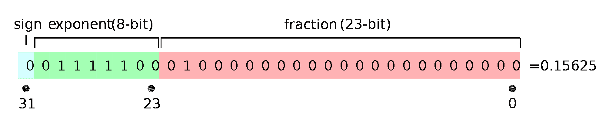
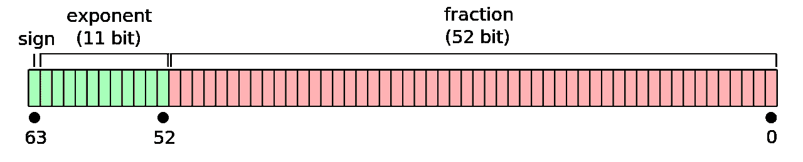
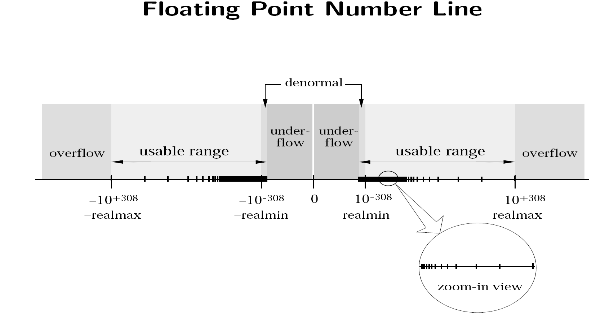

# 浮点表示

> 原文：[`cs357.cs.illinois.edu/textbook/notes/fp.html`](https://cs357.cs.illinois.edu/textbook/notes/fp.html)


查看幻灯片


如果在这里看不到 PDF，请点击这里下载 PDF。

## 学习目标

+   在浮点数系中表示数字

+   评估不同表示的范围、精度和准确性

+   定义机器精度

+   识别可表示的最小和最大浮点数

+   处理特殊情况和非正常数值

## 数制与基数

存在着多种数制，可以用来表示一个数。在常见的基数 10（十进制）系统中，每个数字可以取 0 到 9 之间的 10 个值。在基数 2（二进制）中，每个数字可以取 0 或 1 之间的 2 个值。

对于给定的$\beta$，在$\beta$进制中，我们有：

$$(a_n \ldots a_2 a_1 a_0 . b_1 b_2 b_3 b_4 \dots)_{\beta} = \sum_{k=0}^{n} a_k \beta^k + \sum_{k=1}^\infty b_k \beta^{-k}.$$

一些常用的编号系统基数包括：

+   十进制：$\beta=10$

+   二进制：$\beta=2$

+   八进制：$\beta=8$

+   十六进制 $\beta=16$

### 示例：

十进制基数：$(426.97)_{10}$


**答案**


$\begin{equation}(426.97)_{10} = 4 \times 10² + 2 \times 10¹ + 6 \times 10⁰ + 9 \times 10^{-1} + 7 \times 10^{-2} \end{equation}$

二进制基数：$(1011.001)_{2}$


**答案**


$(1011.001)_{2} = 1 \times 2³ + 0 \times 2² + 1 \times 2¹ + 1 \times 2⁰ + 0 \times 2^{-1} + 0 \times 2^{-2} + 1 \times 2^{-3} = (11.125)_{10}$

## 在十进制和二进制之间转换整数

现代计算机使用晶体管来存储数据。这些晶体管可以是开启状态（1）或关闭状态（0）。为了在计算机中存储整数，我们必须首先将它们转换为二进制。例如，23 的二进制表示为$(10111)_2$。

将整数从二进制表示（基数 2）转换为十进制表示（基数 10）是很容易的。只需将每个数字乘以 2 的递增幂，如下所示：

$$(10111)_2 = 1 \cdot 2⁴ + 0 \cdot 2³ + 1 \cdot 2² + 1 \cdot 2¹ + 1 \cdot 2⁰ = 23$$

将整数从十进制转换为二进制是一个类似的过程，除了不是乘以 2，而是除以 2 并记录余数：

$$\begin{align} 23 // 2 &= 11\ \mathrm{余}\ 1 \\ 11 // 2 &= 5\ \mathrm{余}\ 1 \\ 5 // 2 &= 2\ \mathrm{余}\ 1 \\ 2 // 2 &= 1\ \mathrm{余}\ 0 \\ 1 // 2 &= 0\ \mathrm{余}\ 1 \\ \end{align}$$

因此，$(23)_{10}$在二进制中表示为$(10111)_2$。

您可能发现以下额外资源对复习有帮助：[十进制转二进制 1](https://www.wikihow.com/Convert-from-Decimal-to-Binary) 和 [十进制转二进制 2](http://interactivepython.org/courselib/static/pythonds/BasicDS/ConvertingDecimalNumberstoBinaryNumbers.html)

## 在十进制和二进制之间转换分数

实数增加了额外的复杂性。它们不仅有一个前导整数，还有一个小数部分。现在，我们将十进制数 23.375 表示为 $(10111.011)_2$。当然，实际的机器表示取决于我们使用的是定点表示还是浮点表示，但这一点将在后面的章节中讨论。

将具有小数部分的数字从二进制转换为十进制与转换为整数类似，不同之处在于我们继续对分数部分使用 2 的负幂：

$$(10111.011)_2 = 1 \cdot 2⁴ + 0 \cdot 2³ + 1 \cdot 2² + 1 \cdot 2¹ + 1 \cdot 2⁰ + 0 \cdot 2^{-1} + 1 \cdot 2^{-2} + 1 \cdot 2^{-3} = 23.375$$

将十进制小数转换为二进制，首先将整数部分转换为二进制，如前所述。然后，取小数部分（忽略整数部分）并将其乘以 2。得到的整数部分将是二进制位。丢弃整数部分，并继续乘以 2 的过程，直到小数部分变为 0。例如：

$$\begin{align} 23 &= (10111)_2 \\ 2 \cdot .375 &= 0.75 \\ 2 \cdot .75 &= 1.5 \\ 2 \cdot .5 &= 1.0 \\ \end{align}$$

通过组合整数部分和小数部分，我们发现 $23.375 = (10111.011)_2$。

并非所有分数都可以使用有限位数的二进制表示。例如，如果您尝试使用上述技术对 0.1 这样的数字进行处理，您会发现剩余的分数开始重复：

$$\begin{align} 2 \cdot .1 &= 0.2 \\ 2 \cdot .2 &= 0.4 \\ 2 \cdot .4 &= 0.8 \\ 2 \cdot .8 &= 1.6 \\ 2 \cdot .6 &= 1.2 \\ 2 \cdot .2 &= 0.4 \\ 2 \cdot .4 &= 0.8 \\ 2 \cdot .8 &= 1.6 \\ 2 \cdot .6 &= 1.2 \\ \end{align}$$

如您所见，十进制数 0.1 在二进制中表示为无限重复的小数序列 $(0.00011001100110011…)_2$。浮点数中存储的确切位数取决于我们使用的是单精度还是双精度。

## (无符号)定点表示

在定点表示中，数字使用固定数量的位来存储整数部分，以及固定数量的位来存储小数部分。

假设我们用 64 位来存储一个实数，其中 32 位存储整数部分，32 位存储小数部分。

$$(a_{31}...a_2a_1a_0.b_1b_2b_3...b_{32}) = \sum_{k=0}^{31} a_k 2^k + \sum_{k=1}^{32} b_k 2^{-k}$$ $$\begin{eqnarray} = &a_{31}& \times 2^{31}\ + ... + a_1 \times 2¹ + a_0 \times 2⁰ \\ + &b_1& \times 2^{-1} + b_2 \times 2^{-2}+ ... +\ b_{32} \times 2^{-32} \end{eqnarray}$$

**最小数字**

当 $a_i$ 和 $b_i$ 的所有值都是 $0$ 时，我们得到可表示的最小数字，除了 $b_{32}$。

$$\begin{eqnarray} &a_i =& 0 \ \forall i,\ b_1,\ b_2, ...,\ b_{31} = 0,\ and \ b_{32} = 1 \\ &\implies& 2^{-32} \approx 10^{-9} \end{eqnarray}$$

**最大数字**

当 $a_i$ 和 $b_i$ 的所有值都是 $1$ 时，我们得到可表示的最大数字。

$$\begin{eqnarray} &a_i =& 1 \ \forall i \ and \ b_i = 1 \ \forall i \\ &\implies& 2^{31}\ + ... + 2¹ + 2⁰ + 2^{-1} + 2^{-2}+ ... +\ 2^{-32} \approx 10⁹ \end{eqnarray}$$

### 二进制小数点位置

我们在评估表示时考虑范围和精度。

**范围:** 可能的最大数和最小数之间的差值。

**精度:** 任意两个数之间可能的最小差值。

考虑一个 8 位系统，其中 6 位存储整数部分，2 位存储小数部分。它的范围和精度是多少？


**答案**


**最小的数**

$000000.01 = 0.25$

$000000.10 = 0.5$

**最大的数**

$111111.10 = 63.5$

$111111.11 = 63.75$

**范围**

$63.75 - 0.25 = 63.5$

**精度**

$0.5 - 0.25 = 63.75 - 63.5 = 0.25$

对于一个 8 位系统，其中 2 位存储整数部分，6 位存储小数部分，情况如何？


**答案**


**最小的数**

$00.000001 = 0.015625$

$00.000010 = 0.03125$

**最大的数**

$11.111110 = 3.96875$

$11.111111 = 3.984375$

**范围**

$3.984375 - 0.015625 = 3.96875$

**精度**

$0.03125 - 0.015625 = 3.984375 - 3.96875 = 0.015625$

我们可以看到，增加**整数**位会增加**范围**，而增加**小数**位会增加**精度**。很难决定你需要多少精度和范围。

**修正：让二进制小数点“浮动”**

## 浮点数

二进制数的浮点表示类似于十进制的科学记数法。类似于你可以将 23.375 表示为

$$2.3375 \cdot 10¹,$$

你可以将 $(10111.011)_2$ 表示为

$$1.0111011 \cdot 2⁴.$$

浮点数可以用相同的固定位数表示不同数量级的数（非常大和非常小）。

更正式地说，我们可以将一个浮点数 $x$ 定义为

$$x = \pm q \cdot 2^m,$$

其中：

+   $\pm$ 是符号

+   $q$ 是尾数

+   $m$ 是指数

除了零和下溢数（下面讨论）的特殊情况外，尾数总是以归一化形式存在

$$q = 1.f,$$

其中：

+   $f$ 是尾数的小数部分

每次我们存储一个归一化浮点数时，都假设 1 存在。我们不存储整个尾数，只存储小数部分。这被称为“隐藏位表示”，它提供了额外的精度位。

## 归一化浮点数系统的性质

在归一化的二进制浮点数系统中，一个数 $x$ 的形式为

$$ \begin{equation} x = \pm 1.b_1b_2b_3...b_n \times 2^m = \pm 1.f \times 2^m \end{equation} $$

+   **数字:** $b_i \in {0, 1}$

+   **指数范围:** 整数 $m \in [L,U]$

+   **精度:** $p = n + 1$

+   **最小的正归一化浮点数:** $ 2^L$

+   **最大的正归一化浮点数:** $ 2^{U+1}(1-2^{-p})$

### **示例**

$$\begin{equation} x = \pm 1.b_1b_2 \times 2^m \text{ for } m \in [-4,4] \text{ and } b_i \in \{0,1\} \end{equation} $$

+   任何大于 -28.0 且小于 +28.0 的数都会溢出到无穷大。

任何比 0.0625 更接近零的数都会下溢到零。

+   最大的规范化正数：


**答案**


+   整数范围

+   在这种表示法中，可以精确表示的整数范围是多少？

### 机器精度

或者对于一般的规范化浮点系统 $1.f \times 2^m$，其中 $f$ 用 $n$ 位表示，机器精度定义为：

在编程语言中，这些值通常作为预定义的常量可用。例如，在 C 语言中，这些常量是 `FLT_EPSILON` 和 `DBL_EPSILON`，并在 `float.h` 库中定义。在 Python 中，您可以使用以下代码片段访问这些值。

$$ \begin{equation} (1.00)_2 \times 2^{-4} = 0.0625 \end{equation} $$

$$\epsilon_m = 2^{-n}$$

最小的规范化正数：

```py
import numpy as np
# Single Precision eps_single = np.finfo(np.float32).eps
print("Single precision machine eps = {}".format(eps_single))
# Double Precision eps_double = np.finfo(np.float64).eps
print("Double precision machine eps = {}".format(eps_double)) 
```

*注意:* 在各种资源中，机器精度的定义有很多，例如，最小的数，使得 $\text{fl}(1 + \epsilon_m) \ne 1$。这些其他定义可能根据舍入模式（下一个主题）的不同而给出与上述定义略有不同的值。在本课程中，我们将始终使用上述“间隙”定义中的值。

### $$\pm 1.b_1b_2 \times 2^m\ for \ m \in [-4,4]\ and\ b_i \in \{0, 1\}$$ $$(1.00)_2 \times 2⁰ = 1 \hspace{1.8cm} (1.01)_2 \times 2⁰ = 1.25$$ $$\epsilon_m = (0.01)_2 \times 2⁰ = 0.25$$

我们可以看到，在这个浮点系统中，我们可以表示从 $(1)_{10}$ 到 $(8)_{10}$ 的每一个整数。然而，为了表示 $(9)_{10}$ 或 $(1001)_{2}$，我们需要在分数部分中超过两个位。这种精度限制导致整数范围以上的整数出现跳跃。

$$\pm 1.b_1b_2 \times 2^m\ for \ m \in [-4,4]\ and\ b_i \in \{0, 1\}$$ $$\begin{eqnarray} (1)_2 &=& 1.00 \times 2⁰ &=& 1_{10} \\ (10)_2 &=& 1.00 \times 2¹ &=& 2_{10} \\ (11)_2 &=& 1.10 \times 2¹ &=& 3_{10} \\ (100)_2 &=& 1.00 \times 2² &=& 4_{10} \\ (101)_2 &=& 1.01 \times 2² &=& 5_{10} \\ (110)_2 &=& 1.10 \times 2² &=& 6_{10} \\ (111)_2 &=& 1.11 \times 2² &=& 7_{10} \\ (1000)_2 &=& 1.00 \times 2³ &=& 8_{10} \\ (1001)_2 &=& \_\_\_\_?\_\_\_\_ &=& 9_{10} \\ (1010)_2 &=& 1.01 \times 2³ &=& 10_{10} \\ \end{eqnarray}$$

$$ \begin{equation} (1.11)_2 \times 2⁴ = 28.0 \end{equation} $$

***机器精度*** ($\epsilon_m$) 被定义为 1 和下一个最大的浮点数之间的距离（间隙）。注意这个范围的上线假设为 $1.00 \times 2³$ 的形式，其中 3 代表浮点系统的精度。因此，这个上限由 $2^p$ 给出。

## IEEE-754 单精度

 ^(图片来源：[Fresheneesz 在英语维基百科项目](https://commons.wikimedia.org/wiki/File:Float_example.svg).)

+   $x = (-1)^s 1.f \times 2^m$

+   1-bit 符号，s = 0：正号，s = 1：负号

+   8-bit 指数 $c$，其中 $c = m + 127$，我们需要为特殊情况保留指数数 $ c = (11111111)_2 = 255, c = (00000000)_2 = 0$，因此 $0 < c < 255$

+   23-bit 小数部分 $f$

+   计算机 epsilon：

    +   对于 IEEE-754 **单精度**，$\epsilon_m = 2^{-23}$，如下所示：

        $$\epsilon_m = 1.\underbrace{000000...000}_{\text{22 bits}}{\bf 1} - 1.\underbrace{000000...000}_{\text{22 bits}}{\bf 0} = 2^{-23}$$

+   最小的正规范化浮点数：$UFL = 2^L = 2^{-126} \approx 1.2 \times 10^{-38}$

+   最大的正规范化浮点数：$OFL = 2^{U+1}(1 - 2^{-p}) = 2^{128}(1 - 2^{-24}) \approx 3.4 \times 10^{38}$

指数被移位 127 以避免存储负号。我们不是存储 $m$，而是存储 $c = m + 127$。因此，可能的最大指数是 127，可能的最小指数是-126。

### 示例：

将二进制数 $(100101.101)_2$ 转换为规范化浮点数表示

$$1.f \times 2^m$$ 

**答案**


$(100101.101)_2 = (1.00101101)_2 \times 2⁵$ $s = 0,\quad f = 00101101…00,\quad m = 5$ $c=m + 127 = 132 = (10000100)_2$

规范化浮点数表示：$0 \; 10000100 \; 00101101000000000000000$

关于 [IEEE 浮点数](http://steve.hollasch.net/cgindex/coding/ieeefloat.html) 的更多信息

## IEEE-754 双精度

 ^(图片来源：[Codekaizen](https://commons.wikimedia.org/wiki/File:IEEE_754_Double_Floating_Point_Format.svg).)

+   $x = (-1)^s 1.f \times 2^m$

+   1-bit 符号，s = 0：正号，s = 1：负号

+   11-bit 指数 $c$，其中 $ c = m + 1023$，我们需要为特殊情况保留指数数 $ c = (11111111111)_2 = 2047, c = (00000000000)_2 = 0$，因此 $0 < c < 2047$

+   52-bit 小数部分 $f$

+   计算机 epsilon：

    +   对于 IEEE-754 **双精度**，$\epsilon_m = 2^{-52}$，如下所示：$$\epsilon_m = 1.\underbrace{000000...000}_{\text{51 bits}}{\bf 1} - 1.\underbrace{000000...000}_{\text{51 bits}}{\bf 0} = 2^{-52}$$

+   最小的正规范化浮点数：$UFL = 2^L = 2^{-1022} \approx 2.2 \times 10^{-308}$

+   最大的正规范化浮点数：$OFL = 2^{U+1}(1 - 2^{-p}) = 2^{1024}(1 - 2^{-53}) \approx 1.8 \times 10^{308}$

指数被移位 1023 以避免存储负号。我们不是存储 $m$，而是存储 $c = m + 1023$。因此，可能的最大指数是 1023，可能的最小指数是-1022。

## IEEE-754 中的特殊情况

在浮点数表示中会出现几个边缘情况。

### 零

在我们上面关于浮点数的定义中，我们说总是假设有一个前导 1。这对于大多数浮点数来说是正确的。一个值得注意的例外是零。为了将零存储为浮点数，我们存储指数位和分数位全为 0。请注意，根据符号位，可以有+0 和-0。

### 无穷大

如果浮点计算的结果超出了浮点数可能表示的范围，则该数被认为是无穷大。我们使用指数位全为 1 和分数位全为 0 来存储无穷大。$+\infty$ 和 $-\infty$ 通过符号位来区分。

### NaN

导致非数值结果的操作在浮点数中以指数位全为 1 和非零分数位表示。

## 浮点数数轴

 ^（图片来源：[计算中的不可避免错误](https://www.physics.udel.edu/~bnikolic/teaching/phys660/PDF/unavoidable_errors.pdf)。)

上图显示了 IEEE-754 浮点数系统的数轴。

## 子规格化数

如上所述，一个***正常数***被定义为尾数以 1 开头的浮点数，双精度中最小的正常数是 $1.000… \times 2^{-1022}$。可以表示的最小*正常*数被称为***下溢水平***，或***UFL***。

然而，我们可以通过移除尾数必须以 1 开头的限制来进一步减小数值。这些数被称为***子规格化数***，并且以指数位全为 0 来存储。技术上，零也是一个子规格化数。

重要的是要注意，子规格化数没有正常数那么多有效数字。

**IEEE-754 单精度（32 位）：**

+   $ c = (00000000)_2 = 0 $

+   指数设置为 $m$ = -126

+   最小的正子规格化浮点数：$2^{-23} \times 2^{-126} \approx 1.4 \times 10^{-45}$

**IEEE-754 双精度（64 位）：**

+   $ c = (00000000000)_2 = 0 $

+   指数设置为 $m$ = -1022

+   最小的正子规格化浮点数：$2^{-52} \times 2^{-1022} \approx 4.9 \times 10^{-324}$

使用非规格化数允许更渐进地向零下溢（然而，非规格化数没有规格化数那么多精确位）。

### 示例：

假设你被给定一个形式为（二进制）浮点数系统

$$(-1)^s(1.b_1b_2)_2 \times 2^E$$

其指数范围从 -2 到 5。

我们使用这个浮点数系统来表示以下子规格化数：

$$s = 1$$ $$b_1b_2 = (11)_2$$

将这个子规格化数转换为十进制数。


**答案**


在这个浮点数系统中，子规格化数将表示为

$$x = (-1)^s(0.f)\times2^L.$$

我们将分数部分 $(11)_2$ 转换为十进制数，并使用指数范围的下限 $L = -2$。

$$\begin{eqnarray} x &=& (-1)¹ \times (0.11)_2 \times 2^{-2} \\ &=& (-1) \times (0.11)_2 \times 2^{-2} \\ &=& (-1) \times (0.75)_{10} \times 2^{-2} \\ &=& -0.1875 \end{eqnarray}$$

## 复习问题

1.  将十进制数转换为二进制。

1.  将二进制数转换为十进制。

1.  浮点数和固定点表示有什么区别？

1.  给定一个实数，你将如何将其存储为机器数？

1.  给定一个实数，将其存储为机器数时涉及到的舍入误差是什么？相对误差是什么？

1.  解释浮点数的不同部分：符号、尾数和指数。

1.  机器数的指数实际上是如何存储的？

1.  什么是机器精度？

1.  什么是下溢（UFL）？

1.  什么是溢出？

1.  为什么下溢有时不是问题？

1.  给定一个玩具浮点系统，确定该系统的机器精度和 UFL。

1.  如何将零存储为机器数？

1.  什么是亚正常数？

1.  机器中如何表示亚正常数？

1.  为什么亚正常数有时有帮助？

1.  使用亚正常数有哪些缺点？

## 更新日志

+   2025 年 9 月 1 日：Dev Singh (dsingh14) — 添加图片来源

+   2024 年 4 月 23 日：Apramey Hosahalli (apramey2) — 添加亚正常数示例

+   2024 年 4 月 22 日：Apramey Hosahalli (apramey2) — 修复格式并改进流程

+   

查看剩余条目


    +   2024 年 4 月 2 日：Apramey Hosahalli (apramey2) — 添加整数范围章节和固定机器精度

    +   2024 年 4 月 2 日：Apramey Hosahalli (apramey2) — 调整示例，重新排序章节以匹配幻灯片

    +   2024 年 3 月 31 日：Apramey Hosahalli (apramey2) — 添加二进制小数点位置章节

    +   2024 年 3 月 27 日：Apramey Hosahalli (apramey2) — 更新学习目标并添加固定点表示章节

    +   2020 年 4 月 28 日：Mariana Silva (mfsilva) — 将舍入内容移至单独页面

    +   2020 年 1 月 26 日：Wanjun Jiang (wjiang24) — 添加规范化浮点数和示例

    +   2018 年 1 月 14 日：Erin Carrier (ecarrie2) — 删除演示链接

    +   2017 年 12 月 13 日：Adam Stewart (adamjs5) — 修复数字系统和基数下的错误公式

    +   2017 年 12 月 8 日：Erin Carrier (ecarrie2) — 指定 UFL 为正数

    +   2017 年 11 月 19 日：Matthew West (mwest) — 添加机器精度图

    +   2017 年 11 月 18 日：Erin Carrier (ecarrie2) — 更新机器精度定义

    +   2017 年 11 月 15 日：Erin Carrier (ecarrie2) — 修复整数转换中的错误

    +   2017 年 11 月 14 日：Erin Carrier (ecarrie2) — 澄清何时存储规范化

    +   2017 年 11 月 13 日：Erin Carrier (ecarrie2) — 更新机器精度

    +   2017 年 11 月 13 日：Erin Carrier (ecarrie2) — 更新机器精度定义，修复不一致的大小写

    +   2017 年 11 月 12 日：Erin Carrier (ecarrie2) — 全文小修，添加更新日志，添加不同基数的数制章节

    +   2017 年 11 月 1 日：Adam Stewart (adamjs5) — 第一份完整草案

    +   2017 年 10 月 16 日：Luke Olson (lukeo) — 概述

## 作者

+   CS 357 课程工作人员
