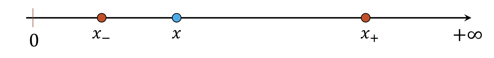
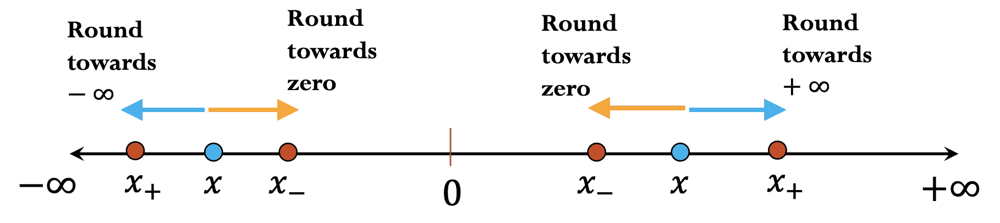
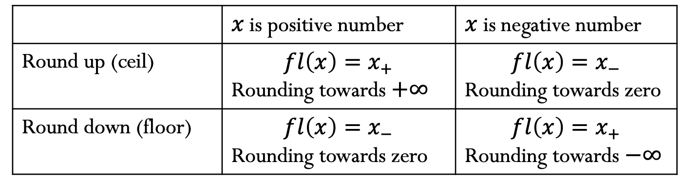

# 取整

> 原文：[`cs357.cs.illinois.edu/textbook/notes/rounding.html`](https://cs357.cs.illinois.edu/textbook/notes/rounding.html)

## 学习目标

+   使用 IEEE-754 浮点数标准理解不可表示数字的取整选项。

+   使用 IEEE-754 浮点数标准测量取整数字的误差

+   理解浮点数算术中的灾难性消去

+   预测浮点数算术中精度损失的结果

+   在一组数学上等价的公式中选择最优的，以最小化浮点误差

## IEEE-754 中的取整选项

并非所有实数都可以精确地存储为浮点数。考虑一个规范化浮点数形式的实数：

$$x = \pm 1.b_1 b_2 b_3 ... b_n ... \times 2^m$$

其中 $n$ 是尾数的位数，$m$ 是给定浮点数系统的指数。如果 $x$ 不能精确地表示为浮点数，它将表示为 $x_{-}$ 或 $x_{+}$，即最近的两个浮点数。

为了不失一般性，我们假设 $x$ 是一个正数。在这种情况下，我们有：

$$x_{-} = 1.b_1 b_2 b_3 ... b_n \times 2^m$$

以及

$$x_{+} = 1.b_1 b_2 b_3 ... b_n \times 2^m + 0.\underbrace{000000...0001}_{n\text{ bits}} \times 2^m$$

注意到 $x_{-}$ 是通过“截断”第 $n$ 位之后的所有位来检索的，而 $x_{+} = x_{-} + {\epsilon}_{m} \times 2^m$，其中 ${\epsilon}_{m}$ 是机器精度。

将一个实数 $x$ 替换为附近的机器数（$x_{-}$ 或 $x_{+}$）的过程称为**取整**，涉及到的误差称为**取整误差**。

IEEE-754 没有指定如何精确地取整浮点数，但有几种不同的选项：

+   向零取整

+   向无穷大取整

+   向上取整

+   向下取整

+   向最近的浮点数取整（向上或向下取整，取最近的那个）

+   通过截断取整

我们将浮点数表示为 $fl(x)$。上述取整规则可以总结如下：

通过截断取整：$fl(x) = x_{-}$

## 取整误差

对于每个不同的指数数 $m \in [L, U]$，两个机器数之间的差距是（注意，$\epsilon_m$ 是机器精度，与 $m$ 无关）：

$$\vert x_{+} - x_{-} \vert = 0.\underbrace{000000...0001}_{n\text{ bits}} \times 2^m = \epsilon_m \times 2^m$$

注意到连续浮点数之间的间隔并不均匀：当数字本身的幅度较小时，间隔较小；当数字变大时，间隔变大。例如，考虑简单的精度：

$$x_{+} \hspace{3mm}\text{和}\hspace{3mm} x_{-} \hspace{3mm}\text{的形式为}\hspace{3mm} q \times 2^{-10}: \vert x_{+} - x_{-} \vert = 2^{-33} \approx 10^{-10}$$ $$x_{+} \hspace{3mm}\text{和}\hspace{3mm} x_{-} \hspace{3mm}\text{的形式为}\hspace{3mm} q \times 2^{4}: \vert x_{+} - x_{-} \vert = 2^{-19} \approx 2 \times 10^{-6}$$ $$x_{+} \hspace{3mm}\text{和}\hspace{3mm} x_{-} \hspace{3mm}\text{的形式为}\hspace{3mm} q \times 2^{20}: \vert x_{+} - x_{-} \vert = 2^{-3} \approx 0.125$$ $$x_{+} \hspace{3mm}\text{和}\hspace{3mm} x_{-} \hspace{3mm}\text{的形式为}\hspace{3mm} q \times 2^{60}: \vert x_{+} - x_{-} \vert = 2^{37} \approx 10^{11}$$

因此，使用机器精度来界定表示实数作为机器数时的误差会更好。

#### 绝对误差：

$$\vert fl(x) - x \vert \le \vert x_{+} - x_{-} \vert = \epsilon_m \times 2^m$$ $$\vert fl(x) - x \vert \le \epsilon_m \times 2^m$$

#### 相对误差：

$$\frac{ \vert fl(x) - x \vert }{ \vert x \vert } \le \frac{ \epsilon_m \times 2^m } { \vert \pm 1.b_1 b_2 b_3 ... b_n ... \times 2^m \vert }$$ $$\frac{ \vert fl(x) - x \vert }{ \vert x \vert } \le \epsilon_m$$

使用这个不等式，观察 IEEE **单精度**浮点数系统：$\frac{ \vert fl(x) - x \vert }{ \vert x \vert } \le 2^{-23} \approx 1.2 \times 10^{-7}$。由于该系统始终引入大约 $10^{-7}$ 的相对误差，单精度浮点系统通常提供大约 **7**（十进制）位准确数字。

类似地，观察 IEEE **双精度**浮点数系统：$\frac{ \vert fl(x) - x \vert }{ \vert x \vert } \le 2^{-52} \approx 2.2 \times 10^{-16}$。由于该系统始终引入大约 $10^{-16}$ 的相对误差，双精度浮点系统通常提供大约 **16**（十进制）位准确数字。

### 示例：确定一个无法表示的数的舍入误差

如果我们四舍五入到最接近的，0.1 的双精度机器表示形式是什么？它引入了多少舍入误差？

**答案**

使用与之前章节中介绍将十进制分数转换为二进制的相同算法，我们构建以下表格：

| 前一个分数部分 $ \times 2 $ | 整数部分 | 当前分数部分 |
| --- | --- | --- |
| 0.2 | 0 | 0.2 |
| 0.4 | 0 | 0.4 |
| 0.8 | 0 | 0.8 |
| 1.6 | 1 | 0.6 |
| 1.2 | 1 | 0.2 |
| 0.4 | 0 | 0.4 |
| 0.8 | 0 | 0.8 |
| 1.6 | 1 | 0.6 |
| 1.2 | 1 | 0.2 |
| ... | ... | ... |

我们可以观察到整数部分序列 $ {0, 0, 1, 1} $ 是循环出现的。

然后，我们有 $ 0.1 = (0.000110011\hspace{1mm}\overline{0011})_2 = (1.10011\hspace{1mm}\overline{0011})_2 \times 2^{-4}$ .

使用最近邻舍入，0.1 的双精度机器表示形式为元组 $ (s, c, f) $，其中 $s$ 是符号位，$c$ 是指数字段，$f$ 是尾数：

$ s = 0 $

$ m = -4 \Rightarrow c = m + 1023 = 1019 = 01111111011$

$ f = 10011...0011...0011010 $

换句话说，0.1 的双精度机器表示是：

$ \bf{0\hspace{2mm}01111111011\hspace{2mm}\underbrace{10011...0011...0011010}_{52\text{ bits}}} $

然后，舍入误差是：

$ fl(0.1) - 0.1 = (0.00011001100110011...11010)_2 - (0.00011001100110011...1100110011\overline{0011})_2$ $= (0.\underbrace{0...0}_{54\text{ 0's}}000110011\overline{0011})_2 = 2^{-54} \times 0.1 = 2^{-2} \times 0.1 \times 2^{-52} = \bf{0.025\epsilon_m}$

### 示例：浮点数相等

假设你正在使用 IEEE 单精度数。找到满足 $2⁸ + a \neq 2⁸$ 的最小可表示数 $a$。

**答案**

在本课程中，为了近似最小的数 $x$，使得 $2^n + x \neq 2^n$，我们使用公式 $x = \epsilon_m \cdot 2^n$.

因此，鉴于 IEEE 单精度中的 $\epsilon_m$ 为 $2^{-23}$，答案是 $\bf{a = 2^{-23} \cdot 2⁸ = 2^{-15}}$.

如果你感兴趣的是 $\textbf{精确}$ 的最小数，这里是有解决方案（你不需要了解这个内容，对于 CS 357 课程，请只使用上述公式完成所有作业）：

注意我们使用默认的舍入模式 - 舍入到最近的表示值。如果结果位于两个可表示值之间，则选择偶数表示值。"偶数"意味着最低位是零。

大于 $2⁸$ 的最小可表示数是 $(2+\epsilon_m)\times 2⁸$.

设 $x_{-} = 2⁸$ 和 $x_{+} = (2+\epsilon_m)\times 2⁸$.

为了使 $2⁸ + a$ 舍入到 $x_{+}$，我们必须有 $a \gt \frac{\vert x_{+} - x_{-} \vert}{2} = \frac{\epsilon_m\times 2⁸}{2} = \frac{2^{-23}\times 2⁸}{2} = 2^{-16}$.

大于 $2^{-16}$ 的最小机器可表示数是 $(1 + \epsilon_m) \times 2^{-16}$.

因此 $\bf{a = \bf{(1 + 2^{-23}) \times 2^{-16}}}$.

### 示例：任何 FPS 中浮点数的非均匀分布

考虑小浮点数系统 $x = \pm 1.b_1 b_2 \times 2^m $ 对于 $m \in [-4, 4]$ 和 $b_i \in \{0, 1\}$:

**详细说明**

 $ (1.00)_2 \times 2^{-4} = 0.0625 $

$ (1.01)_2 \times 2^{-4} = 0.078125 $

$ (1.10)_2 \times 2^{-4} = 0.09375 $

$ (1.11)_2 \times 2^{-4} = 0.109375 $

$ (1.00)_2 \times 2^{-3} = 0.125 $

$ (1.01)_2 \times 2^{-3} = 0.15625 $

$ (1.10)_2 \times 2^{-3} = 0.1875 $

$ (1.11)_2 \times 2^{-3} = 0.21875 $

$ (1.00)_2 \times 2^{-2} = 0.25 $

$ (1.01)_2 \times 2^{-2} = 0.3125 $

$ (1.10)_2 \times 2^{-2} = 0.375 $

$ (1.11)_2 \times 2^{-2} = 0.4375 $

$ (1.00)_2 \times 2^{-1} = 0.5 $

$ (1.01)_2 \times 2^{-1} = 0.625 $

$ (1.10)_2 \times 2^{-1} = 0.75 $

$ (1.11)_2 \times 2^{-1} = 0.875 $

$ (1.00)_2 \times 2^{0} = 1.0 $

$ (1.01)_2 \times 2^{0} = 1.25 $

$ (1.10)_2 \times 2^{0} = 1.5 $

$ (1.11)_2 \times 2^{0} = 1.75 $

$ (1.00)_2 \times 2^{1} = 2.0 $

$ (1.01)_2 \times 2^{1} = 2.5 $

$ (1.10)_2 \times 2^{1} = 3.0 $

$ (1.11)_2 \times 2^{1} = 3.5 $

$ (1.00)_2 \times 2^{2} = 4.0 $

$ (1.01)_2 \times 2^{2} = 5.0 $

$ (1.10)_2 \times 2^{2} = 6.0 $

$ (1.11)_2 \times 2^{2} = 7.0 $

$ (1.00)_2 \times 2^{3} = 8.0 $

$ (1.01)_2 \times 2^{3} = 10.0 $

$ (1.10)_2 \times 2^{3} = 12.0 $

$ (1.11)_2 \times 2^{3} = 14.0 $

$ (1.00)_2 \times 2^{4} = 16.0 $

$ (1.01)_2 \times 2^{4} = 20.0 $

$ (1.10)_2 \times 2^{4} = 24.0 $

$ (1.11)_2 \times 2^{4} = 28.0 $

## 浮点运算的数学特性

+   不一定是结合律：$(x + y) + z \neq x + (y + z)$.

这是因为 $fl(fl(x + y) + z) \neq fl(x + fl(y + z))$.

+   不一定是分配律：$z \cdot (x + y) \neq z \cdot x + z \cdot y$.

这是因为 $fl(z \cdot fl(x + y)) \neq fl(fl(z \cdot x) + fl(z \cdot y))$.

+   不一定是累积性：反复将一个非常小的数加到一个大数上可能没有任何效果。

### 示例：非结合特性

找到 $a$、$b$ 和 $c$，使得在双精度浮点算术中 $(a + b) + c \neq a + (b + c)$.

**答案**

设 $a = \pi, b = 10^{100}, c = -10^{100}$

在双精度浮点算术中：

$(a + b) + c = 10^{100} + (-10^{100}) = 0$

$a + (b + c) = \pi + 0 = \pi$

### 示例：非分配特性

找到 $a$、$b$ 和 $c$，使得在双精度浮点算术中 $c(a + b) \neq ca + cb$.

**答案**

设 $a = 0.1, b = 0.2, c = 100$

在双精度浮点算术中：

$c(a + b) = 100 \times 0.30000000000000004 = 30.000000000000004$

$ca + cb = 10 + 20 = 30$

## 浮点算术

浮点算术的基本思想是首先计算精确结果，然后将结果四舍五入以适应所需的精度：

$$x + y = fl(x + y)$$ $$x \times y = fl(x \times y)$$

## 浮点加法

添加两个浮点数很简单。基本思想是：

1.  将两个数都转换为相同的指数

1.  从系统中的前导位开始进行小学加法，直到你的系统中没有更多的数字

1.  四舍五入结果

考虑一个数制，其中 $x = \pm 1.b_1 b_2 b_3 \times 2^m$ 对于 $m \in [-4, 4]$ 和 $b_i \in \{0, 1\}$，我们从这个系统中进行两个数的加法运算。

### 示例 1：不需要舍入

设 $a = (1.101)_2 \times 2¹$ 和 $b = (1.001)_2 \times 2¹$，求 $c = a + b$.

**答案**

$c = a + b = (10.110)_2 \times 2¹ = (1.011)_2 \times 2²$

### 示例 2：不需要舍入

设 $a = (1.100)_2 \times 2¹$ 和 $b = (1.100)_2 \times 2^{-1}$，求 $c = a + b$.

**答案**

$c = a + b = (1.100)_2 \times 2¹ + (0.011)_2 \times 2¹ = (1.111)_2 \times 2¹$

### 示例 3：需要舍入且精度丢失

设 $a = (1.a_1a_2a_3a_4a_5a_6...a_n...)_2 \times 2⁰$ 和 $b = (1.b_1b_2b_3b_4b_5b_6...b_n...)_2 \times 2^{-8}$，求 $c = a + b$。假设使用单精度系统，且 $n > 23$。

**答案**

在单精度中：

$a = (1.a_1a_2a_3a_4a_5a_6...a_{22}a_{23})_2 \times 2⁰$

$b = (1.b_1b_2b_3b_4b_5b_6...b_{22}b_{23})_2 \times 2^{-8}$

因此 $a + b = (1.a_1a_2a_3a_4a_5a_6...a_{22}a_{23})_2 \times 2⁰ + (0.00000001b_1b_2b_3b_4b_5b_6...b_{14}b_{15})_2 \times 2⁰$

在这个例子中，结果 $c = fl(a+b)$ 只包含来自 $b$ 的 $15$ 位精度，因此也会发生精度丢失。

### 示例 4：需要舍入且精度丢失

设 $a = (1.101)_2 \times 2⁰$ 和 $b = (1.000)_2 \times 2⁰$，求 $c = a + b$。如有必要，向下舍入。

**答案**

$c = a + b = (10.101)_2 \times 2⁰ \approx (1.010)_2 \times 2¹$

### 示例 5：需要舍入且精度丢失

设 $a = (1.101)_2 \times 2¹$ 和 $b = (1.001)_2 \times 2^{-1}$，求 $c = a + b$。如有必要，向下舍入。

**答案**

$$\begin{align} a &= 1.101 \times 2¹ \\ b &= 0.01001 \times 2¹ \\ a + b &= 1.111 \times 2¹ \\ \end{align}$$您会注意到我们添加了两个具有 4 个有效数字的数字，我们的结果也有 4 个有效数字。在浮点数加法中没有有效数字的丢失。

### 示例 6：不需要舍入但精度丢失

设 $a = (1.1011)_2 \times 2¹$ 和 $b = (-1.1010)_2 \times 2¹$，求 $c = a + b$。

**答案**

$c = a + b = (0.0001)_2 \times 2¹ = (1.????)_2 \times 2^{-3}$

不幸的是，没有数据表明缺失的数字应该是什么。结果是，结果中的有效数字数量减少。机器用其最佳猜测来填充，这通常不是很好（通常称为虚假零）。这种现象被称为灾难性舍入。

## 浮点数减法和灾难性舍入

浮点数减法与加法的工作方式基本相同。然而，当您从两个相似大小的数字中减去时，会出现问题。

例如，为了从 $a = (1.1011)_2 \times 2¹$ 中减去 $b = (1.1010)_2 \times 2¹$，这看起来会是这样：

$$\begin{align} a &= 1.1011???? \times 2¹ \\ b &= 1.1010???? \times 2¹ \\ a - b &= 0.0001???? \times 2¹ \\ \end{align}$$

当我们对结果进行归一化时，我们得到 $1.???? \times 2^{-3}$。没有数据表明缺失的数字应该是什么。尽管浮点数将以小数点后 4 位存储，但它只能精确到单个有效数字。这种有效数字的丢失被称为 ***灾难性舍入***。

更严格地，考虑一个一般情况，当 $x \approx y$。不失一般性，我们假设 $x, y > 0$（如果 $x$ 和 $y$ 是负数，那么 $y - x = -(x - y) = -x - (-y)$，其中 $-x$ 和 $-y$ 都是正数并且大小相似）。假设我们已知以下条件来计算 $fl(y - x)$：

$$x = 1.a_1 a_2 a_3 ... a_{n-2} a_{n-1}0 a_{n+1} a_{n+2} ... \times 2^m$$ $$y = 1.a_1 a_2 a_3 ... a_{n-2} a_{n-1}1 b_{n+1} b_{n+2} ... \times 2^m$$

可以证明，对于所有 $n > 1$，精度损失会发生，并且当 $n$ 增加时（换句话说，当 $x$ 和 $y$ 更相似时），它变得更加灾难性。然后，考虑当 $n = 23$ 并且使用单精度浮点系统时，那么 $fl(y - x) = 1.????... \times 2^{-23+m}$，其中小数点前的“1”成为唯一的显著性数字。注意，浮点系统可能会产生 $fl(y - x) = 1.000... \times 2^{-n+m}$，但小数点后的所有数字都是“猜测”的，并且不是显著性数字。实际上，精度损失不是由于 $fl(y-x)$ 而是由于从开始对 $x, y$ 进行舍入以获得浮点系统可表示的数字。

#### 示例：使用数学上等效的公式来防止舍入误差

考虑函数 $f(x) = \sqrt{x^{2} + 1} - 1$. 当我们评估 $f(x)$ 在 $x$ 接近零的值时，可能会因为浮点数减法而遇到显著性损失。如果 $x = 10^{-3}$，使用五位小数运算，$f(10^{-3}) = \sqrt{10^{-6} + 1} - 1 = 0$。我们如何找到一个替代公式来执行数学上等效的计算，而不发生灾难性的舍入误差？

**答案**

避免显著性数字损失的一种方法是消除减法：

$ f(x) = \sqrt{x^{2} + 1} - 1 = \frac{ (\sqrt{x^{2} + 1} - 1) \cdot (\sqrt{x^{2} + 1} + 1) } { \sqrt{x^{2} + 1} + 1 } = \frac{ x^{2} } { (\sqrt{x^{2} + 1} + 1) } $

因此，对于 $x = 10^{-3}$，使用五位小数运算，$ f(10^{-3}) = \frac{ 10^{-6} } { 2 } $.

#### 示例：当发生舍入时计算相对误差

如果 $x = 0.3721448693$ 和 $y = 0.3720214371$，在具有五位小数精度的计算机上计算 $(x − y)$ 的相对误差是多少？

**答案**

使用五位小数的精度，数字被四舍五入如下：

$fl(x) = 0.37214$ 和 $fl(y) = 0.37202$

然后进行减法运算：

$fl(x) − fl(y) = 0.37214 − 0.37202 = 0.00012 $

操作的结果是：

$fl(x − y) = 1.20000 × 10^{−2}$

注意到最后四位数字被填充了虚假的零。

精确解和计算机解之间的相对误差由以下公式给出：

$\frac{\vert (x - y) - fl(x - y) \vert}{\vert (x - y) \vert} = \frac{0.0001234322 − 0.00012}{0.000123432} = \frac{0.0000034322}{0.000123432} \approx \bf{3 \times 10^{-2}} $

注意，与舍入的相对误差相比，减法引起的误差的幅度较大，其相对误差为：

$ \frac{\vert x - fl(x) \vert}{\vert x \vert} \approx 1.3 \times 10^{-5} $

## 复习问题

1.  给定一个实数，将其存储为机器数时涉及到的舍入误差是什么？相对误差是多少？

1.  我们如何界定将实数表示为归一化机器数时的相对误差？

1.  什么是消去？为什么它是一个问题？

1.  哪些类型的操作会导致灾难性消去？

1.  给定两个用于评估相同值的方程，你能确定哪个在特定的 x 值上更准确，以及为什么吗？

## 更新日志

+   2024 年 3 月 31 日：Kaiyao Ke (kaiyaok2) — 将笔记与幻灯片对齐，添加了示例并重构了现有笔记

+   2022 年 1 月 30 日：Yuxuan Chen (yuxuan19) — 添加了新的 FP 内容；添加了 FP 减法示例

+   2020 年 4 月 28 日：Mariana Silva (mfsilva) — 从 FP 页面内容开始；添加了新的舍入文本

+   

查看剩余条目

## 作者

+   CS 357 课程工作人员
