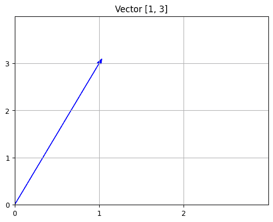

# 向量、矩阵和范数

> 原文：[`cs357.cs.illinois.edu/textbook/notes/vec-mat.html`](https://cs357.cs.illinois.edu/textbook/notes/vec-mat.html)

## 学习目标

+   理解向量空间

+   识别线性变换

+   识别特殊矩阵

+   执行矩阵-向量乘法

+   将线性变换表示为矩阵

+   计算向量和矩阵的范数

## 向量和向量空间

### 向量

一个 \***向量*** 是一个表示大小和方向的数字数组。一个 n 维向量有 n 个分量。向量是向量空间的一个元素。

$$\text{n-向量: } \mathbf{x} = \begin{bmatrix} \mathbf{x}_{1} \\ \mathbf{x}_{2} \\ \vdots \\ \mathbf{x}_{n}\end{bmatrix}$$

#### 示例

这是一个二维向量的例子。

$$\mathbf{v} = \begin{bmatrix} 1 \\ 3 \end{bmatrix}\hspace{5mm}$$

### 向量空间

一个 \***向量空间*** 是一个向量集 $V$ 和一个域 $F$（$F$ 的元素称为标量）的集合，具有以下两个运算：

1.  向量加法：$\forall \mathbf{v},\mathbf{w} \in V$，$\mathbf{v} + \mathbf{w} \in V$

1.  数乘：$\forall \alpha \in F, \mathbf{v} \in V$，$\alpha \mathbf{v} \in V$

满足以下条件：

1.  结合律（向量）：$\forall \mathbf{u}, \mathbf{v}, \mathbf{w} \in V$，$(\mathbf{u} + \mathbf{v}) + \mathbf{w} = \mathbf{u} + (\mathbf{v}+\mathbf{w})$

1.  零向量：存在一个向量 $\mathbf{0} \in V$，使得 $\forall \mathbf{u} \in V, \mathbf{0} + \mathbf{u} = \mathbf{u}$

1.  加法逆元（负数）：对于每个 $\mathbf{u} \in V$，存在 $\mathbf{-u} \in V$，使得 $\mathbf{u} + \mathbf{-u} = \mathbf{0}$。

1.  结合律（标量）：$\forall \alpha, \beta \in F, \mathbf{u} \in V$，$(\alpha \beta) \mathbf{u} = \alpha (\beta \mathbf{u})$

1.  分配律：$\forall \alpha, \beta \in F, \mathbf{u} \in V$，$(\alpha + \beta) \mathbf{u} = \alpha \mathbf{u} + \beta \mathbf{u}$

1.  单位性：$\forall \mathbf{u} \in V$，$1 \mathbf{u} = \mathbf{u}$

如果存在一组向量 $\mathbf{v}_1,\mathbf{v}_2\dots, \mathbf{v}_n$，使得任何向量 $\mathbf{x}\in V$ 都可以写成 \***线性组合*** 的形式

$$\mathbf{x} = c_1\mathbf{v}_1+ c_2\mathbf{v}_2 + \dots + c_n\mathbf{v}_n$$

具有唯一确定的标量 $c_1,\dots,c_n$，集合 ${\mathbf{v}_1,\dots, \mathbf{v}_n}$ 被称为 $V$ 的 \***基***。基的大小 $n$ 被称为 $V$ 的 \***维度***。

向量空间的典型例子是 $V=\mathbb{R}^n$，其中 $F=\mathbb{R}$。在 $\mathbb{R}^n$ 中的向量可以表示为一个数字数组：

$$\mathbf{x} = \begin{bmatrix} x_1\\ x_2 \\ \vdots \\ x_n \end{bmatrix} = \begin{bmatrix} x_1 & x_2 & \cdots & x_n\end{bmatrix}^T$$

$\mathbb{R}^n$ 的维度是 $n$。$\mathbb{R}^n$ 的标准基向量可以表示为

$$\mathbf{e}_1 = \begin{bmatrix} 1\\ 0 \\ \vdots \\ 0 \end{bmatrix}\hspace{5mm} \mathbf{e}_2 = \begin{bmatrix} 0 \\ 1 \\ \vdots \\ 0\end{bmatrix}\ \dots\hspace{5mm} \mathbf{e}_n = \begin{bmatrix} 0 \\ 0 \\ \vdots \\ 1\end{bmatrix}.$$

一组向量 $\mathbf{v}_1,\dots,\mathbf{v}_k$ 被称为 **线性无关**，如果方程 $\alpha_1\mathbf{v}_1 + \alpha_2\mathbf{v}_2 + \dots + \alpha_k\mathbf{v}_k = \mathbf{0}$ 在未知数 $\alpha_1,\dots,\alpha_k$ 中只有 **平凡解** $\alpha_1=\alpha_2 = \dots = \alpha_k = 0$。否则，这些向量是 **线性相关** 的，并且至少有一个向量可以写成该集合中其他向量的线性组合。基总是线性无关的。

### 内积

令 $V$ 为一个实向量空间。那么，一个 **内积** 是一个函数 $\langle\cdot, \cdot \rangle: V \times V \rightarrow \mathbb{R}$（即它接受两个向量并返回一个实数），它满足以下四个性质，其中 $\mathbf{u}, \mathbf{v}, \mathbf{w} \in V$ 和 $\alpha, \beta \in \mathbb{R}$：

1.  正定性：$\langle \mathbf{u}, \mathbf{u} \rangle \geq 0$

1.  正定性：$\langle \mathbf{u}, \mathbf{u} \rangle = 0$ 当且仅当 $\mathbf{u} = 0$

1.  对称性：$\langle \mathbf{u}, \mathbf{v} \rangle = \langle \mathbf{v}, \mathbf{u} \rangle$

1.  线性：$\langle \alpha \mathbf{u} + \beta \mathbf{v}, \mathbf{w} \rangle = \alpha \langle \mathbf{u}, w \rangle + \beta \langle \mathbf{v}, \mathbf{w} \rangle$

内积直观地表示两个向量之间的相似性。如果 $\langle \mathbf{u}, \mathbf{v} \rangle = 0$，则称向量 $\mathbf{u}, \mathbf{v} \in V$ 为 **正交**。

在 $\mathbb{R}^n$ 上的标准内积是点积：$\langle \mathbf{x}, \mathbf{y}\rangle = \mathbf{x}^T\mathbf{y} = \sum_{i=1}^nx_i y_i.$

有关 [内积定义](http://mathworld.wolfram.com/InnerProduct.html) 的更多信息

## 线性变换和矩阵

两个向量空间 $V$ 和 $W$ 之间的函数 $f: V \to W$ 被称为 **线性**，如果

1.  $f(\mathbf{u} + \mathbf{v}) = f(\mathbf{u}) + f(\mathbf{v})$，对于任何 $\mathbf{u},\mathbf{v} \in V$

1.  $f(c\mathbf{v}) = cf(\mathbf{v})$，对于所有 $\mathbf{v} \in V$ 和所有标量 $c$

$f$ 通常被称为 **线性变换**。

如果 $n$ 和 $m$ 分别是 $V$ 和 $W$ 的维度，那么 $f$ 可以表示为一个 $m\times n$ 的矩形数组或 **矩阵**

$$\mathbf{A} = \begin{bmatrix} a_{11} & a_{12} & \dots & a_{1n} \\ a_{21} & a_{22} & \dots & a_{2n} \\ \vdots & \vdots & \ddots & \vdots \\ a_{m1} & a_{m2} & \dots & a_{mn} \end{bmatrix}.$$

这里有一些重要的矩阵类型。

### 特殊矩阵

#### 零矩阵

$m \times n$ 的 **零矩阵** 表示为 ${\bf 0}_{mn}$ 并且所有项都等于零。例如，$3 \times 4$ 的零矩阵是

$${\bf 0}_{34} = \begin{bmatrix} 0 & 0 & 0 & 0 \\ 0 & 0 & 0 & 0 \\ 0 & 0 & 0 & 0 \end{bmatrix}.$$

#### 单位矩阵

$n \times n$ 的 ***单位矩阵*** 用 ${\bf I}_n$ 表示，除了对角线上的元素都为 1 之外，其余元素都为 0。例如，$4 \times 4$ 的单位矩阵是

$${\bf I}_4 = \begin{bmatrix} 1 & 0 & 0 & 0 \\ 0 & 1 & 0 & 0 \\ 0 & 0 & 1 & 0 \\ 0 & 0 & 0 & 1 \end{bmatrix}.$$

**单位矩阵的性质：**

任何方阵与其对应的单位矩阵相乘都会得到原始矩阵。

$$\mathbf{AI} = \mathbf{A}$$ $$\begin{bmatrix} 7 & 1 & 6 \\ 4 & 0 & 5 \\ 1 & 2 & 3 \end{bmatrix} \begin{bmatrix} 1 & 0 & 0 \\ 0 & 1 & 0 \\ 0 & 0 & 1 \end{bmatrix} \mathbf{\ =\ } \begin{bmatrix} 7 & 1 & 6 \\ 4 & 0 & 5 \\ 1 & 2 & 3 \end{bmatrix}$$

#### 对角矩阵

一个 $n \times n$ 的 ***对角矩阵*** 除了对角线元素外，其余元素都为零。我们通常用 ${\bf D}$ 表示对角矩阵。例如，$4 \times 4$ 的对角矩阵具有以下形式

$$\begin{bmatrix} d_{11} & 0 & 0 & 0 \\ 0 & d_{22} & 0 & 0 \\ 0 & 0 & d_{33} & 0 \\ 0 & 0 & 0 & d_{44} \end{bmatrix}.$$

#### 三角矩阵

一个 ***下三角矩阵*** 是一个上三角矩阵，其对角线以上的所有元素都是 0。我们通常用 ${\bf L}$ 表示下三角矩阵。例如，$4 \times 4$ 的下三角矩阵具有以下形式

$${\bf L} = \begin{bmatrix} \ell_{11} & 0 & 0 & 0 \\ \ell_{21} & \ell_{22} & 0 & 0 \\ \ell_{31} & \ell_{32} & \ell_{33} & 0 \\ \ell_{41} & \ell_{42} & \ell_{43} & \ell_{44} \end{bmatrix}.$$

一个 ***上三角矩阵*** 是一个方阵，其对角线以下的元素都是 0。我们通常用 ${\bf U}$ 表示上三角矩阵。例如，$4 \times 4$ 的上三角矩阵具有以下形式

$${\bf U} = \begin{bmatrix} u_{11} & u_{12} & u_{13} & u_{14} \\ 0 & u_{22} & u_{23} & u_{24} \\ 0 & 0 & u_{33} & u_{34} \\ 0 & 0 & 0 & u_{44} \end{bmatrix}.$$

**三角矩阵的性质：**

1.  一个 $n \times n$ 的三角矩阵有 $n(n-1)/2$ 个必须为零的条目，以及 $n(n+1)/2$ 个允许非零的条目。

1.  零矩阵、单位矩阵和对角矩阵都是既是下三角矩阵又是上三角矩阵。

#### 交换矩阵

一个 ***交换矩阵*** 是一个方阵，除了每行和每列中有一个元素为 1 之外，其余元素都为 0。我们通常用 ${\bf P}$ 表示交换矩阵。一个 $4 \times 4$ 的交换矩阵的例子是

$${\bf P} = \begin{bmatrix} 0 & 1 & 0 & 0 \\ 0 & 0 & 0 & 1 \\ 1 & 0 & 0 & 0 \\ 0 & 0 & 1 & 0 \end{bmatrix}.$$

交换矩阵的性质：

1.  精确地有 $n$ 个条目不为零。

1.  用一个交换矩阵乘以一个向量会重新排列向量中元素的顺序。例如，使用上面的 ${\bf P}$ 和 $x = [1, 2, 3, 4]^T$，乘积是 ${\bf Px} = [2, 4, 1, 3]^T$。

1.  如果 $P_{ij} = 1$，则 $({\bf Px})_i = x_j$。

1.  置换矩阵的逆是其转置，所以 ${\bf PP}^T = {\bf P}^T{\bf P} = {\bf I}$。

#### 分块矩阵

**分块形式** 的矩阵是将矩阵划分为块的矩阵。块简单地是一个子矩阵。例如，考虑

$${\bf M} = \begin{bmatrix} {\bf A} & {\bf B} \\ {\bf C} & {\bf D} \end{bmatrix}$$

其中 ${\bf A}$，${\bf B}$，${\bf C}$ 和 ${\bf D}$ 是子矩阵。

分块形式中也有特殊的矩阵。例如，**块对角** 矩阵是一个对角块为零矩阵的分块矩阵。

### 矩阵秩

矩阵的 **秩** 是矩阵中线性无关列的数量。也可以证明矩阵具有相同数量的线性无关行。如果 $\mathbf{A}$ 是一个 $m \times n$ 的矩阵，那么

1.  $\text{rank}(\mathbf{A}) \leq \text{min}(m,n)$。

1.  如果 $\text{rank}(\mathbf{A}) = \text{min}(m,n)$，那么 $\mathbf{A}$ 是 **满秩** 的。否则，$\mathbf{A}$ 是 **秩亏缺** 的。

一个 $n\times n$ 的方阵 $\mathbf{A}$ 是 **可逆的** 如果存在一个方阵 $\mathbf{B}$ 使得 $\mathbf{AB} = \mathbf{BA} = \mathbf{I}$，其中 $\mathbf{I}$ 是 $n\times n$ 的单位矩阵。矩阵 $\mathbf{B}$ 表示为 $\mathbf{A}^{-1}$。一个方阵是可逆的当且仅当它具有满秩。一个不可逆的方阵称为 **奇异的** 矩阵。

### 矩阵-向量乘法

设 $\mathbf{A}$ 是一个 $m\times n$ 的实数矩阵。我们也可以用 $\mathbf{A}\in\mathbb{R}^{m\times n}$ 作为简写。如果 $\mathbf{x}$ 是 $\mathbb{R}^n$ 中的一个向量，那么矩阵-向量乘积 $\mathbf{A}\mathbf{x} = \mathbf{b}$ 是一个 $\mathbf{R}^m$ 中的向量，定义为：

$$b_i = \sum_{j=1}^na_{ij}x_j \hspace{6mm} \text{for } i = 1,2,\dots, m.$$

我们可以有两种方式来解释矩阵-向量乘法。在整个在线教科书的参考中，我们将使用 ${\bf a}_i$ 来指代矩阵 ${\bf A}$ 的第 $i$ 列，以及 ${\bf a}^T_i$ 来指代矩阵 ${\bf A}$ 的第 $i$ 行。

1) 将矩阵-向量乘法表示为 ${\bf A}$ 的行的内积：

$$\mathbf{A}\mathbf{x} = \begin{bmatrix} \mathbf{a}_{1}^T \cdot \mathbf{x} \\ \mathbf{a}_{2}^T \cdot \mathbf{x} \\ \vdots \\ \mathbf{a}_{m}^T\cdot \mathbf{x}\end{bmatrix}$$

2) 将矩阵-向量乘法表示为 ${\bf A}$ 的列的线性组合：

$\mathbf{A}\mathbf{x} = x_1\mathbf{a}_{1} + x_2\mathbf{a}_{2} + \dots x_n\mathbf{a}_{n} = x_1\begin{bmatrix}a_{11} \\ a_{21} \\ \vdots \\ a_{m1}\end{bmatrix} + x_2\begin{bmatrix}a_{12} \\ a_{22} \\ \vdots \\ a_{m2}\end{bmatrix} + \dots + x_n\begin{bmatrix}a_{1n} \\ a_{2n} \\ \vdots \\ a_{mn}\end{bmatrix}$

正是这种表示法使我们能够用矩阵表达有限维向量空间之间的任何线性变换。

#### 示例

$${\bf A} = \begin{bmatrix} 1 & 7 & 8 & 4\\ -5 & 3 & 2 & 2\\ 0 & 5 & 6 & 6\end{bmatrix}, {\bf x} = \begin{bmatrix}1 \\ 2 \\ 0 \\ -4\end{bmatrix}$$

执行矩阵-向量乘法 ${\bf Ax}$。

**答案**

$\begin{eqnarray} {\bf Ax} &=& \begin{bmatrix} 1 & 7 & 8 & 4\\ -5 & 3 & 2 & 2\\ 0 & 5 & 6 & 6\end{bmatrix} \begin{bmatrix}1 \\ 2 \\ 0 \\ -4\end{bmatrix} \\ \\ &=& 1 \begin{bmatrix} 1 \\ -5 \\ 0 \end{bmatrix} + 2 \begin{bmatrix} 7 \\ 3 \\ 5 \end{bmatrix} + 0 \begin{bmatrix} 8 \\ 2 \\ 6 \end{bmatrix} + -4 \begin{bmatrix} 4 \\ 2 \\ 6 \end{bmatrix} \\ \\ &=& \begin{bmatrix} 1 \\ -5 \\ 0 \end{bmatrix} + \begin{bmatrix} 14 \\ 6 \\ 10 \end{bmatrix} + \begin{bmatrix} 0 \\ 0 \\ 0 \end{bmatrix} + \begin{bmatrix} -16 \\ -8 \\ -24 \end{bmatrix} \\ \\ &=& \begin{bmatrix} 1 + 14 + 0 -16 \\ -5 + 6 + 0 - 8\\ 0 + 10 + 0 - 24\end{bmatrix} \\ \\ &=& \begin{bmatrix} -1 \\ -7\\ -14\end{bmatrix} \end{eqnarray}$

### 线性变换的矩阵表示

设 $\mathbf{e}_1,\mathbf{e}_2,\dots,\mathbf{e}_n$ 为 $\mathbb{R}^n$ 的标准基。如果我们定义向量 $\mathbf{z}_j = \mathbf{A}\mathbf{e}_j$，那么利用矩阵-向量乘积作为 $\mathbf{A}$ 的列的线性组合的解释，我们有：

$$\mathbf{z}_j = \mathbf{A}\mathbf{e}_j = \begin{bmatrix}a_{1j} \\ a_{2j} \\ \vdots \\ a_{mj}\end{bmatrix} = a_{1j}\begin{bmatrix}1 \\ 0 \\ \vdots \\ 0\end{bmatrix} + a_{2j}\begin{bmatrix}0 \\ 1 \\ \vdots \\ 0\end{bmatrix} + \dots + a_{mj}\begin{bmatrix}0 \\ 0 \\ \vdots \\ 1\end{bmatrix} = \sum_{i=1}^m a_{ij}\hat{\mathbf{e}}_i,$$

其中，我们将 $\mathbb{R}^m$ 的标准基写为 $\hat{\mathbf{e}}_1,\hat{\mathbf{e}}_2,\dots,\hat{\mathbf{e}}_m$。

换句话说，如果 $\mathbf{z}_j = \mathbf{A}\mathbf{e}_j$ 被写成 $\mathbb{R}^m$ 的基向量的线性组合，那么元素 $a_{ij}$ 是对应于 $\hat{\mathbf{e}}_{i}$ 的系数。

#### 示例

假设 $V$ 是一个由 $\mathbf{v}_1,\mathbf{v}_2,\mathbf{v}_3$ 构成的向量空间，而 $W$ 是一个由 $\mathbf{w}_1,\mathbf{w}_2$ 构成的向量空间。那么 $V$ 和 $W$ 的维度分别是 3 和 2。因此，任何线性变换 $f: V \to W$ 都可以表示为一个 $2\times 3$ 的矩阵。我们可以引入列向量表示法，使得向量 $\mathbf{v} = \alpha_1\mathbf{v}_1 + \alpha_2\mathbf{v}_2 + \alpha_3\mathbf{v}_3$ 和 $\mathbf{w} = \beta_1\mathbf{w}_1 + \beta_2\mathbf{w}_2$ 可以写成

$$\mathbf{v} = \begin{bmatrix}\alpha_1 \\ \alpha_2 \\ \alpha_3\end{bmatrix},\hspace{6mm} \mathbf{w} = \begin{bmatrix}\beta_1 \\ \beta_2\end{bmatrix}.$$

我们没有指定向量空间 $V$ 和 $W$ 的具体内容，但如果我们将它们视为 $\mathbb{R}³$ 和 $\mathbb{R}²$ 的元素，那就没问题。

假设以下关于线性变换 $f$ 的性质是已知的：

+   $f(\mathbf{v}_1) = \mathbf{w}_1$

+   $f(\mathbf{v}_2) = 5\mathbf{w}_1 - \mathbf{w}_2$

+   $f(\mathbf{v}_3) = 2\mathbf{w}_1 + 2\mathbf{w}_2$

使用上述提供的信息，确定 $f$ 的矩阵表示。

**答案**

第一个方程告诉我们 $ \mathbf{w}_1 = f(\mathbf{v}_1) \implies \begin{bmatrix} 1 \\ 0\end{bmatrix} = \begin{bmatrix} a_{11} & a_{12} & a_{13}\\ a_{21} & a_{22} & a_{23}\end{bmatrix}\begin{bmatrix} 1 \\ 0 \\ 0\end{bmatrix} = \begin{bmatrix} a_{11} \\ a_{21} \end{bmatrix}. $ 因此我们知道 $a_{11} = 1,\ a_{21} = 0.$ 第二个方程告诉我们 $ 5\mathbf{w}_1 - \mathbf{w}_2 = f(\mathbf{v}_2) \implies \begin{bmatrix} 5 \\ -1\end{bmatrix} = \begin{bmatrix} 1 & a_{12} & a_{13}\\ 0 & a_{22} & a_{23}\end{bmatrix}\begin{bmatrix} 0 \\ 1 \\ 0\end{bmatrix} = \begin{bmatrix} a_{12} \\ a_{22} \end{bmatrix}. $ 因此我们知道 $a_{12} = 5,\ a_{22} = -1.$ 最后，第三个方程告诉我们 $ 2\mathbf{w}_1 + 2\mathbf{w}_2 = f(\mathbf{v}_2) \implies \begin{bmatrix} 2 \\ 2\end{bmatrix} = \begin{bmatrix} 1 & 5 & a_{13}\\ 0 & -1 & a_{23}\end{bmatrix}\begin{bmatrix} 0 \\ 0 \\ 1\end{bmatrix} = \begin{bmatrix} a_{13} \\ a_{23} \end{bmatrix}. $ 因此，$a_{13} = 2,\ a_{23} = 2$，线性变换 $f$ 可以表示为矩阵：$ \begin{bmatrix} 1 & 5 & 2\\ 0 & -1 & 2\end{bmatrix}. $ 重要的是要注意，矩阵表示不仅取决于 $f$，还取决于我们选择的基。如果我们为向量空间 $V$ 和 $W$ 选择不同的基，$f$ 的矩阵表示也会改变。

### 矩阵作为算子

#### 旋转算子

这个旋转矩阵以逆时针方向旋转点 $\theta$。

$${y_1 \choose y_2} = \begin{bmatrix} {\bf \cos(\theta)} & {\bf -\sin(\theta)} \\ {\bf \sin(\theta)} & {\bf \cos(\theta)} \end{bmatrix} {x_1 \choose x_2}$$

#### 缩放算子

缩放算子将点在 x 方向上按 a 缩放或缩小，在 y 方向上按 b 缩放或缩小。

$${y_1 \choose y_2} = \begin{bmatrix} a & { 0} \\ { 0} & { b} \end{bmatrix} {x_1 \choose x_2}$$

#### 反射算子

反射矩阵将点沿 x 或 y 轴反射。以下示例展示了点沿 x 和 y 轴的反射。

$${y_1 \choose y_2} = \begin{bmatrix} { -1} & { 0} \\ { 0} & { -1} \end{bmatrix} {x_1 \choose x_2}$$

#### 平移算子

平移或平移算子将点在 x 方向上移动 a 个单位，在 y 方向上移动 b 个单位。这不是一个线性变换。

$${y_1 \choose y_2} = \begin{bmatrix} { 1} & { 0} \\ { 0} & { 1} \end{bmatrix} {x_1 \choose x_2} + {a \choose b}$$

## 向量范数

**向量范数**是一个函数 $\| \mathbf{u} \|: V \rightarrow \mathbb{R}^+_0$（即，它接受一个向量并返回一个非负实数），它满足以下性质，其中 $\mathbf{u}, \mathbf{v} \in V$ 且 $\alpha \in \mathbb{R}$：

1.  正定性：$\| \mathbf{u}\| \geq 0$

1.  正定性：$\|\mathbf{u}\| = 0$ 当且仅当 $\mathbf{u} = \mathbf{0}$

1.  同质性：$\|\alpha \mathbf{u}\| = \vert\alpha\vert \|\mathbf{u}\|$

1.  三角不等式：$\|\mathbf{u} + \mathbf{v}\| \leq \|\mathbf{u}\| + \|\mathbf{v}\|$

范数是“绝对值”的推广，用于衡量输入向量的“大小”。

### p-范数

**p-范数**定义为

$\|\mathbf{w}\|_p = (\sum_{i=1}^N \vert w_i \vert^p)^{\frac{1}{p}}$.

当$p \geq 1$时，定义是一个有效的范数。如果$0 \leq p < 1$，则它不是一个有效的范数，因为它违反了三角不等式。

当$p=2$（2-范数）时，这被称为***欧几里得范数***，它对应于向量的长度。

### 向量范数示例

考虑$\mathbf{w} = [-3, 5, 0, 1]$的情况。计算$\mathbf{w}$的 1，2 和$\infty$范数。

**答案**

对于 1-范数：$\|\mathbf{w}\|_1 = (\sum_{i=1}^N |w_i|¹)^{\frac{1}{1}}$ $\|\mathbf{w}\|_1 = \sum_{i=1}^N |w_i|$ $\|\mathbf{w}\|_1 = |-3| + |5| + |0| + |1|$ $\|\mathbf{w}\|_1 = 3 + 5 + 0 + 1$ $\|\mathbf{w}\|_1 = 9$ 对于 2-范数：$\|\mathbf{w}\|_2 = (\sum_{i=1}^N |w_i|²)^{\frac{1}{2}}$ $\|\mathbf{w}\|_2 = \sqrt{\sum_{i=1}^N w_i²}$ $\|\mathbf{w}\|_2 = \sqrt{(-3)² + (5)² + (0)² + (1)²}$ $\|\mathbf{w}\|_2 = \sqrt{9 + 25 + 0 + 1}$ $\|\mathbf{w}\|_2 = \sqrt{35} \approx 5.92$ 对于$\infty$-范数：$\|\mathbf{w}\|_\infty = \lim_{p\to\infty}(\sum_{i=1}^N |w_i|^p)^{\frac{1}{p}}$ $\|\mathbf{w}\|_\infty = \max_{i=1,\dots,N} |w_i|$ $\|\mathbf{w}\|_\infty = \max(|-3|, |5|, |0|, |1|)$ $\|\mathbf{w}\|_\infty = \max(3, 5, 0, 1)$ $\|\mathbf{w}\|_\infty = 5$

### 范数与误差

在计算向量结果时计算误差，可以应用范数。

$$\begin{eqnarray} 绝对误差 &=& \|\mathbf{True\ Value} - \mathbf{Approximate\ Value}\|\\ \\ 相对误差 &=& \frac{\|\mathbf{True\ Value} - \mathbf{Approximate\ Value}\|}{\|\mathbf{True\ Value}\|} \end{eqnarray}$$

> **注意：** 范数不是可加的
> 
> $\|\mathbf{True\ Value} - \mathbf{Approximate\ Value}\|\\ \neq \|\mathbf{True\ Value} \| - \|\mathbf{Approximate\ Value} \|$

#### 示例

$$真实向量 =\begin{bmatrix} 0 \\ 6 \\ -4 \end{bmatrix}\ \ \ \ 近似向量 =\begin{bmatrix} 0 \\ 5 \\ -3 \end{bmatrix}$$

根据上述真实向量和近似向量计算 1-范数误差。

**答案**

$\begin{eqnarray} 绝对误差 &=& \left\|\begin{bmatrix} 0 \\ 6 \\ -4 \end{bmatrix} - \begin{bmatrix} 0 \\ 5 \\ -3 \end{bmatrix}\right\|_{1}\\ \\ &=& \left\|\begin{bmatrix} 0 \\ 1 \\ -1 \end{bmatrix}\right\|_{1}\\ \\ &=& |0| + |1| + |-1|\\ \\ &=& 2 \end{eqnarray}$ $\begin{eqnarray} 相对误差 &=& \frac{\left\|\begin{bmatrix} 0 \\ 6 \\ -4 \end{bmatrix} - \begin{bmatrix} 0 \\ 5 \\ -3 \end{bmatrix}\right\|_{1}}{\left\|\begin{bmatrix} 0 \\ 6 \\ -4 \end{bmatrix}\right\|_{1}}\\ \\ &=& \frac{2}{|0| + |6| + |-4|}\\ \\ &=& \frac{2}{10}\\ \\ &=& \frac{1}{5}\\ \\ \end{eqnarray}$

## 矩阵范数

一个 ***通用矩阵范数*** 是一个满足以下性质的实值函数 $\| {\bf A} \|$： 

1.  正定性：$\|{\bf A}\| \geq 0$

1.  正定性：$\|{\bf A}\| = 0$ 当且仅当 ${\bf A} = 0$

1.  同质性：对于所有标量 $\lambda$，$\|\lambda {\bf A}\| = \vert\lambda\vert \|{\bf A}\|$

1.  三角不等式：$\|{\bf A} + {\bf B}\| \leq \|{\bf A}\| + \|{\bf B}\|$

***诱导（或算子）矩阵范数*** 与特定的向量范数 $\| \cdot \|$ 相关，并定义为：

$$\|{\bf A}\| := \max_{\|\mathbf{x}\|=1} \|{\bf A}\mathbf{x}\|.$$

诱导矩阵范数是一般矩阵范数的特定类型。诱导矩阵范数告诉我们任何向量乘以矩阵时范数的最大放大倍数。注意，上述定义与以下定义等价

$$\|{\bf A}\| = \max_{\|\mathbf{x}\| \neq 0} \frac{\| {\bf A} \mathbf{x}\|}{\|x\|}.$$

除了上述一般矩阵范数的性质外，诱导矩阵范数还满足以下子乘性条件：

$$\| {\bf A} \mathbf{x} \| \leq \|{\bf A}\| \|\mathbf{x}\|$$ $$\|{\bf A} {\bf B}\| \leq \|{\bf A}\| \|{\bf B}\|$$

### Frobenius 范数

Frobenius 范数简单地是矩阵中每个平方元素的平方和的平方根，这相当于将向量 $2$-范数应用于展平的矩阵，

$$\|{\bf A}\|_F = \sqrt{\sum_{i,j} a_{ij}²}.$$

Frobenius 范数是通用矩阵范数的一个例子，它不是诱导范数。

#### 示例

$${\bf Q }=\begin{bmatrix} 1 & 4 \\ 6 & 5 \end{bmatrix}$$

计算矩阵 ${\bf Q}$ 的 Frobenius 范数。

**答案**

$\begin{eqnarray} \|{\bf Q}\|_{\bf F} &=& \sqrt{1² + 4² + 6² + 5²}\\ &=& \sqrt{78}\\ &\approx& 8.83 \end{eqnarray}$

### 矩阵 p-范数

矩阵 p-范数是由向量的 p-范数诱导的。它是

$$\|{\bf A}\|_p := \max_{\|\mathbf{x}\|_p=1} \|{\bf A}\mathbf{x}\|_p.$$

有三种特殊情况：

#### 1-范数

1-范数简化为矩阵的最大绝对列和，即，

$$\|{\bf A}\|_1 = \max_j \sum_{i=1}^n \vert a_{ij} \vert.$$

#### 2-范数

2-范数简化为矩阵的最大奇异值。

$$\|{\bf A}\|_{2} = \max_k \sigma_k$$

#### $\infty$-范数

$\infty$-范数简化为矩阵的最大绝对行和。

$$\|{\bf A}\|_{\infty} = \max_i \sum_{j=1}^n \vert a_{ij} \vert.$$

#### 示例

$${\bf C} = \begin{bmatrix} 3 & -2 \\ -1 & 3 \\ \end{bmatrix}$$

计算矩阵 ${\bf C}$ 的 1-范数、2-范数和 $\infty$-范数。

**答案**

矩阵$\bf C$的列和的绝对值是 $ |3| + |-1| = 4, |-2| + |3| = 5\. $ 因此，$\begin{eqnarray} \|{\bf C}\|_1 &=& \max (4, 5)\\ &=& 5\. \end{eqnarray}$ 稀疏值是矩阵 ${\bf C}^T {\bf C}$ 的特征值的平方根。你还可以通过计算矩阵的奇异值分解来找到最大的奇异值。$\|{\bf C}\|_2 = \max_{\|\mathbf{x}\|_2=1} \|{\bf C}\mathbf{x}\|_2$ $det({\bf C}^T {\bf C} - \lambda {\bf I}) = 0$ $ det( \begin{bmatrix} 3 & -1 \\ -2 & 3 \\ \end{bmatrix} \begin{bmatrix} 3 & -2 \\ -1 & 3 \\ \end{bmatrix} - \lambda {\bf I}) = 0 $ $ det( \begin{bmatrix} 9+1 & -6-3 \\ -3-6 & 4+9 \\ \end{bmatrix} - \lambda {\bf I}) = 0 $ $ det( \begin{bmatrix} 10 - \lambda & -9 \\ -9 & 13 - \lambda \\ \end{bmatrix} ) = 0 $ $(10-\lambda)(13-\lambda) - 81 = 0$ $\lambda² - 23\lambda + 130 - 81 = 0$ $\lambda² - 23\lambda + 49 = 0$ $(\lambda-\frac{1}{2}(23+3\sqrt{37}))(\lambda-\frac{1}{2}(23-3\sqrt{37})) = 0$ $\|{\bf C}\|_2 = \sqrt{\lambda_{max}} = \sqrt{\frac{1}{2}(23+3\sqrt{37})} \approx 4.54.$ 矩阵$\bf C$的行和的绝对值是 $ |3| + |-2| = 5, |-1| + |3| = 4\. $ 因此，$\begin{eqnarray} \|{\bf C}\|_{\infty} &=& \max (4, 5)\\ &=& 5\. \end{eqnarray}$

## 复习问题

1.  什么是向量空间？

1.  内积是什么？

1.  给定一个特定的函数$f(\mathbf{x})$，$f(\mathbf{x})$可以被认为是内积吗？

1.  什么是向量范数？（一个函数要成为向量范数必须满足哪些性质？）

1.  给定一个特定的函数$f(\mathbf{x})$，$f(\mathbf{x})$可以被认为是范数吗？

1.  诱导矩阵范数的定义是什么？它们测量什么？

1.  诱导矩阵范数满足哪些性质？哪些是次可乘性质？能够应用所有这些性质。

1.  对于一个诱导矩阵范数，给定$\|\mathbf{x}\|$和$\|{\bf A}\mathbf{x}\|$对于几个向量，你能确定$\|{\bf A}\|$的下界吗？

1.  什么是 Frobenius 矩阵范数？

1.  对于给定的向量，计算向量的 1，2 和$\infty$范数。

1.  对于给定的矩阵，计算矩阵的 1，2 和$\infty$范数。

1.  了解特殊矩阵的规范（例如，对角矩阵、正交矩阵等的范数）

## 脚注

1. 在一个凸空间（实数和复数都是）上。

## 更新日志

+   2025 年 10 月 2 日：Dev Singh（dsingh14）——修复范数计算中的错误

+   2024 年 2 月 20 日：Dev Singh（dsingh14）——添加关于范数可加性的警告

+   2024 年 2 月 17 日：Apramey Hosahalli（apramey2）——添加错误示例，格式化矩阵 p-范数示例

+   

查看剩余条目

    +   2024 年 2 月 16 日：陈宇轩（yuxuan19）——改进示例结构，更新了复习问题

    +   2024 年 2 月 15 日：Apramey Hosahalli（apramey2）——改进过渡，添加了矩阵向量乘法的示例，以及矩阵作为算子的简要说明

    +   2024 年 2 月 13 日：Apramey Hosahalli (apramey2) — 为向量添加章节，并为 Frobenius 范数和 p-范数章节添加示例

    +   2024 年 2 月 10 日：Apramey Hosahalli (apramey2) — 根据讲座顺序重新排列章节并更改学习目标

    +   2022 年 3 月 1 日：Arnav Shah (arnavss2) — 添加了规范和误差章节

    +   2022 年 2 月 22 日：Arnav Shah (arnavss2) — 添加了矩阵作为算子的章节

    +   2020 年 4 月 27 日：Mariana Silva (mfsilva) — 更新了符号和矩阵-向量章节

    +   2020 年 2 月 1 日：Peter Sentz () — 从当前幻灯片添加更多文本

    +   2018 年 3 月 14 日：Adam Stewart (adamjs5) — 阐明 Frobenius 范数的定义

    +   2017 年 11 月 10 日：Erin Carrier (ecarrie2) — 修复示例的索引范围，添加线性函数定义

    +   2017 年 10 月 29 日：Erin Carrier (ecarrie2) — 添加块形式

    +   2017 年 10 月 29 日：Erin Carrier (ecarrie2) — 添加复习问题，完成向量空间定义，重写矩阵范数章节，进行其他小修订

    +   2017 年 10 月 29 日：Erin Carrier (ecarrie2) — 更改内积符号，对诱导范数与一般范数进行额外评论

    +   2017 年 10 月 28 日：John Doherty (jjdoher2) — 第一份完整草案

    +   2017 年 10 月 16 日：Matthew West (mwest) — 第一份完整草案

## 作者

+   CS 357 课程工作人员
