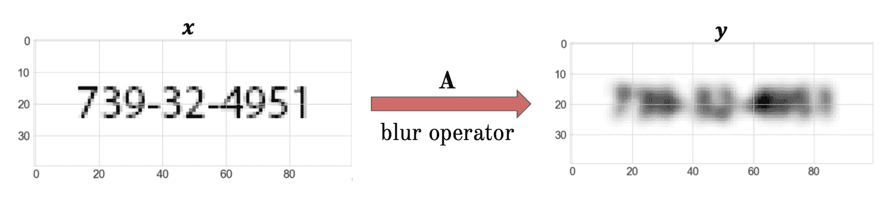
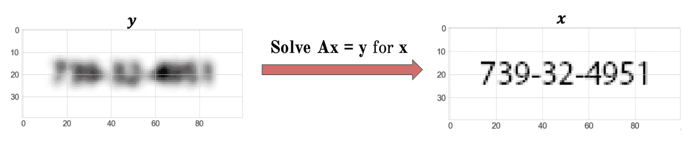
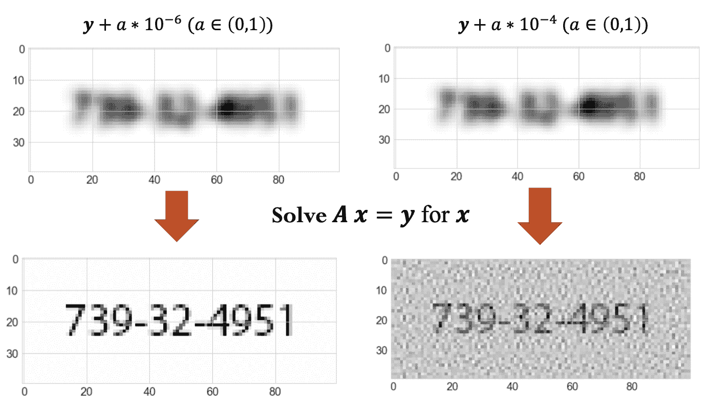
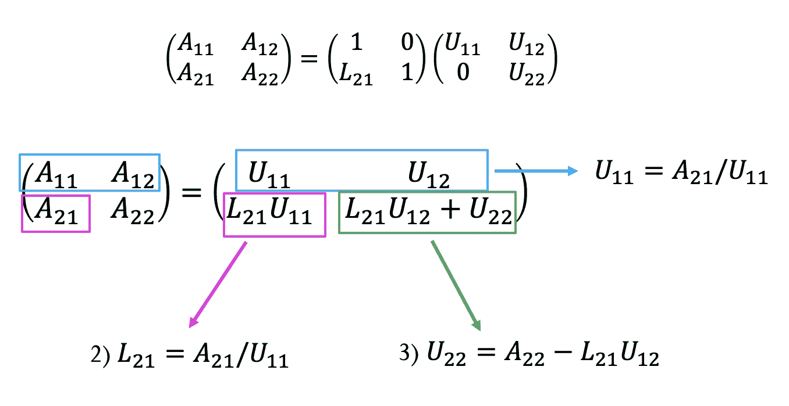
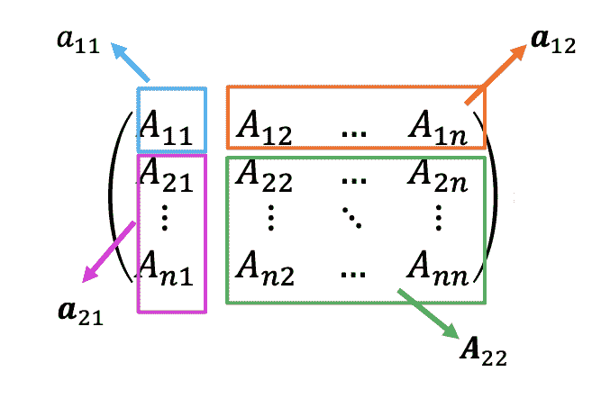
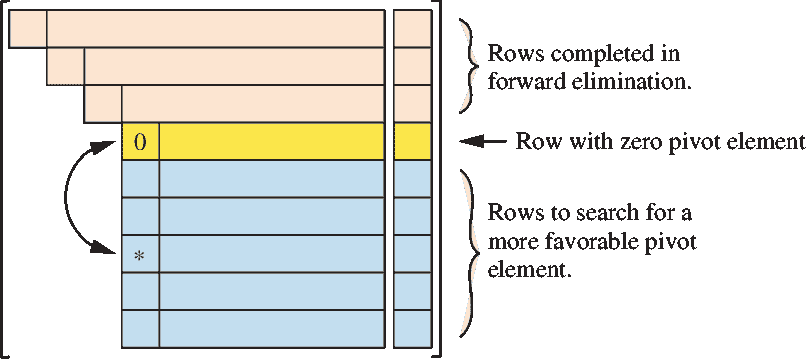
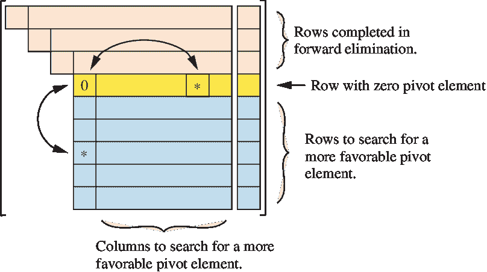

# LU 分解求解线性方程

> 原文：[`cs357.cs.illinois.edu/textbook/notes/linsys.html`](https://cs357.cs.illinois.edu/textbook/notes/linsys.html)

## 学习目标

+   理解线性方程组的使用。

+   使用已知数据为实际问题设置线性方程组。

+   描述矩阵 ${\bf A} = {\bf LU}$ 的分解。

+   比较 LU 分解与其他操作（如矩阵-矩阵乘法）的成本。

+   实现 LU 分解算法。

+   给定 ${\bf A}$ 的 LU 分解，求解方程组 ${\bf Ax} = {\bf b}$。

+   给出需要行交换的矩阵的例子。

+   实现 LUP 分解算法。

+   手动计算 LU 和 LUP 分解。

+   使用库函数计算并使用 LU 分解。

## 基本思想：线性操作的“撤销”按钮

矩阵-向量乘法：给定数据 ${\bf x}$ 和算子 ${\bf A}$，我们可以找到 ${\bf y}$ 使得 ${\bf y = Ax}$：

$$\bf{x} \hspace{5mm} {\xRightarrow[transformation]{A}} \hspace{5mm} \bf{y}$$

如果我们知道 ${\bf y}$ 但不知道 ${\bf x}$ 会怎样？我们需要“撤销”转换：

$$\bf{y} \hspace{5mm} {\xRightarrow[?]{A^{-1}}} \hspace{5mm} \bf{x} \hspace{3cm} \textbf{求解} \hspace{3mm} Ax=y \hspace{3mm}\text{对于} \hspace{3mm}\bf{x}$$

### 示例：撤销转换

假设我们已知算子 ${\bf A}$，已知数据 ${\bf y}$，以及满足关系 ${\bf y = Ax}$ 的未知数据 ${\bf x}$。${\bf A}$ 和 ${\bf y}$ 的值如下所示。

$$\textbf{A} = \begin{bmatrix} 1 & 2 \\ 3 & 4 \end{bmatrix}\hspace{5mm} \textbf{x} = \begin{bmatrix} x_1 \\ x_2 \end{bmatrix} \hspace{5mm} \text{和} \hspace{5mm} \textbf{y} = \begin{bmatrix} 5 \\ 11 \end{bmatrix} .$$

我们如何求解 $\textbf{x} = [x_1, x_2]^T$？


**答案**

我们构建以下线性方程组：$ \begin{cases} x_1 + 2x_2 = 5\\ 3x_1 + 4x_2 = 11 \end{cases} \hspace{5mm} $ 然后解为：$ \begin{cases} x_1 = 1\\ x_2 = 2 \end{cases} \hspace{5mm} \text{，或者} \hspace{5mm} \textbf{x} = \begin{bmatrix} 1 \\ 2 \end{bmatrix} $

### 示例：图像模糊与恢复

原始图像显示 SSN 号码存储为介于 $0$ 和 $1$ 之间的实数 $2D$ 数组（$0$ 表示白色像素，$1$ 表示黑色像素）。它有 $40$ 行像素和 $100$ 列像素。我们可以将 $2D$ 数组展平为包含 $1D$ 数据的 $1D$ 数组 $\bf{x}$，其维度为 $4000$。然后我们可以对数据 $\bf{x}$ 应用模糊操作，即

$$\bf{y} = \bf{A}\bf{x}$$

其中 $\bf{A}$ 是模糊算子，$\bf{y}$ 是模糊图像：



要“撤销”模糊以恢复原始图像，我们使用模糊算子 $\bf{A}$ 和模糊图像 $\bf{y}$ 求解线性方程组。以下图表显示了当 $\bf{y}$ 没有任何噪声（“干净数据”）时的转换：



在一定程度上，也有可能从带有噪声的 $\bf{x}$ 中恢复：



要回答“我们能够添加多少噪声，仍然能够从原始图像中恢复有意义的信息？”以及“在哪个点上这种逆变换失败？”这些问题，我们需要了解本课程后面将介绍的“撤销”操作敏感性信息。

## 上三角系统的后向替换算法

要实际求解 ${\bf A x} = {\bf b}$，我们可以从一个“更简单”的方程组开始。让我们考虑三角矩阵——**后向替换算法**解决了 ${\bf U x} = {\bf b}$ 的线性系统，其中 ${\bf U}$ 是一个上三角矩阵。

上三角线性系统 ${\bf U}{\bf x} = {\bf b}$ 可以写成矩阵形式：

$$\begin{bmatrix} U_{11} & U_{12} & \ldots & U_{1n} \\ 0 & U_{22} & \ldots & U_{2n} \\ \vdots & \vdots & \ddots & \vdots \\ 0 & 0 & \ldots & U_{nn} \\ \end{bmatrix} \begin{bmatrix} x_1 \\ x_2 \\ \vdots \\ x_n \end{bmatrix} = \begin{bmatrix} b_1 \\ b_2 \\ \vdots \\ b_n \end{bmatrix}.$$

注意到上三角系统 ${\bf U}x = b$ 可以写成以下线性方程组：

$$\begin{matrix} U_{11} x_1 & + & U_{12} x_2 & + & \ldots & + & U_{1n} x_n & = & b_1 \\ & & U_{22} x_2 & + & \ldots & + & U_{2n} x_n & = & b_2 \\ & & & & \ddots & & \vdots & = & \vdots \\ & & & & & & U_{nn} x_n & = & b_n. \end{matrix}$$

后向替换解法从下往上工作，得到：

$$\begin{aligned} x_n &= \frac{b_n}{U_{nn}} \\ x_{n-1} &= \frac{b_{n-1} - U_{n-1,n} x_n}{U_{n-1,n-1}} \\ &\vdots \\ x_1 &= \frac{b_1 - \sum_{j=2}^n U_{1j} x_j}{U_{11}}. \end{aligned}$$

因此，解的一般形式是：

$$x_n = \frac{b_n}{U_{nn}}; \hspace{1cm} x_i = \frac{b_i - \sum_{j=i+1}^n U_{ij} x_j}{U_{ii}} \hspace{5mm} \text{for i = n-1, n-2, ..., 1}$$

注意到有 $n$ 次除法，$\frac{n(n-1)}{2}$ 次减法/加法，以及 $\frac{n(n-1)}{2}$ 次乘法，因此计算复杂度是 $\bf{O(n²)}$。

或者，我们也可以将 ${\bf U}x = b$ 写成 $\bf{U}$ 的列的线性组合：

$$x_1 \hspace{1mm} \textbf{U}[:\hspace{1mm},1] + x_2 \hspace{1mm} \textbf{U}[:\hspace{1mm},2] + \ldots + x_{n} \hspace{1mm} \textbf{U}[:\hspace{1mm},n] = \textbf{b}$$

后向替换算法的性质是：

1.  如果任何对角元素 $U_{ii}$ 为零，则该系统是奇异的，无法求解。

1.  如果 ${\bf U}$ 的所有对角元素都不为零，则该系统有唯一解。

1.  后向替换算法的操作次数为 $O(n²)$，当 $n \to \infty$ 时。

解决 ${\bf U x} = {\bf b}$ 的后向替换算法的代码是：

```py
import numpy as np
def back_sub(U, b):
    """x = back_sub(U, b) is the solution to U x = b
       U must be an upper-triangular matrix
       b must be a vector of the same leading dimension as U
    """
    n = U.shape[0]
    x = np.zeros(n)
    for i in range(n-1, -1, -1):
        tmp = b[i]
        for j in range(i+1, n):
            tmp -= U[i,j] * x[j]
        x[i] = tmp / U[i,i]
    return x 
```

### 示例：上三角系统的后向替换

$$\begin{bmatrix} 2 & 3 & 1 & 1 \\ 0 & 2 & 2 & 3 \\ 0 & 0 & 6 & 4 \\ 0 & 0 & 0 & 2 \\ \end{bmatrix} \begin{bmatrix} x_1 \\ x_2 \\ x_3 \\ x_4 \end{bmatrix} = \begin{bmatrix} 2 \\ 2 \\ 6 \\ 4 \end{bmatrix}.$$

我们如何求解 $x = [x_1, x_2, x_3, x_4]^T$？


**答案**

$ 2x_4 = 4 \Rightarrow x_4 = \frac{4}{2} = 2 $ $ 6x_3 + 4x_4 = 6 \Rightarrow x_3 = \frac{6 - 4(2)}{6} = -\frac{1}{3} $ $ 2x_2 + 2x_3 + 3x_4 = 2 \Rightarrow x_2 = \frac{2 - 2(-\frac{1}{3}) - 3(2)}{2} = -\frac{5}{3} $ $ 2x_1 + 3x_2 + x_3 + x_4 = 2 \Rightarrow x_1 = \frac{2 - 3(-\frac{5}{3}) - (-\frac{1}{3}) - 2}{2} = \frac{8}{3} $

## 下三角系统前向替换算法

**前向替换算法**解决了线性系统 ${\bf Lx} = {\bf b}$，其中 ${\bf L}$ 是一个下三角矩阵。它是回代法的逆过程。

下三角线性系统 ${\bf L}{\bf x} = {\bf b}$ 可以写成矩阵形式：

$$\begin{bmatrix} L_{11} & 0 & \ldots & 0 \\ L_{21} & L_{22} & \ldots & 0 \\ \vdots & \vdots & \ddots & 0 \\ L_{n1} & L_{n2} & \ldots & L_{nn} \\ \end{bmatrix} \begin{bmatrix} x_1 \\ x_2 \\ \vdots \\ x_n \end{bmatrix} = \begin{bmatrix} b_1 \\ b_2 \\ \vdots \\ b_n \end{bmatrix}.$$

这也可以写成以下线性方程组：

$$\begin{matrix} L_{11} x_1 & & & & & & & = & b_1 \\ L_{21} x_1 & + & L_{22} x_2 & & & & & = & b_2 \\ \vdots & + & \vdots & + & \ddots & & & = & \vdots \\ L_{n1} x_1 & + & L_{n2} x_2 & + & \ldots & + & L_{nn} x_n & = & b_n. \end{matrix}$$

前向替换算法通过从上到下工作并依次求解每个变量来解决下三角线性系统。在数学上，这表示为：

$$\begin{aligned} x_1 &= \frac{b_1}{L_{11}} \\ x_2 &= \frac{b_2 - L_{21} x_1}{L_{22}} \\ &\vdots \\ x_n &= \frac{b_n - \sum_{j=1}^{n-1} L_{nj} x_j}{L_{nn}}. \end{aligned}$$

因此，解的一般形式是：

$$x_1 = \frac{b_1}{L_{11}}; \hspace{1cm} x_i = \frac{b_i - \sum_{j=1}^{i-1} L_{ij} x_j}{L_{ii}} \hspace{5mm} \text{for i = 2, 3, ..., n}$$

注意，这里也有 $n$ 次除法，$\frac{n(n-1)}{2}$ 次减法/加法，以及 $\frac{n(n-1)}{2}$ 次乘法，因此计算复杂度为 $\bf{O(n²)}$。

前向替换算法的性质：

1.  如果矩阵 ${\bf L}$ 的任何对角元素 $L_{ii}$ 为零，则该系统是奇异的，无法求解。

1.  如果矩阵 ${\bf L}$ 的所有对角元素均非零，则该系统有唯一解。

1.  当 $n \to \infty$ 时，前向替换算法的操作次数为 $O(n²)$。

解决 ${\bf L x} = {\bf b}$ 的前向替换算法的代码是：

```py
import numpy as np
def forward_sub(L, b):
    """x = forward_sub(L, b) is the solution to L x = b
       L must be a lower-triangular matrix
       b must be a vector of the same leading dimension as L
    """
    n = L.shape[0]
    x = np.zeros(n)
    for i in range(n):
        tmp = b[i]
        for j in range(i):
            tmp -= L[i,j] * x[j]
        x[i] = tmp / L[i,i]
    return x 
```

### 示例：下三角系统的前向替换

$$\begin{bmatrix} 2 & 0 & 0 & 0 \\ 3 & 2 & 0 & 0 \\ 1 & 2 & 6 & 0 \\ 1 & 3 & 4 & 2 \\ \end{bmatrix} \begin{bmatrix} x_1 \\ x_2 \\ x_3 \\ x_4 \end{bmatrix} = \begin{bmatrix} 2 \\ 2 \\ 6 \\ 4 \end{bmatrix}.$$

我们如何求解 $x = [x_1, x_2, x_3, x_4]^T$？


**答案**

$ 2x_1 = 2 \Rightarrow x_1 = 1 $ $ 3x_1 + 2x_2 = 2 \Rightarrow x_2 = \frac{2-3}{2} = -0.5 $ $ 1x_1 + 2x_2 + 6x_3 = 6 \Rightarrow x_3 = \frac{6-1+1}{6} = 1 $ $ 1x_1 + 3x_2 + 4x_3 + 2x_4 = 4 \Rightarrow x_4 = \frac{4-1+1.5-4}{2} = 0.25 $

## LU 分解定义

当 $\bf{A}$ 是一个非三角矩阵时，为了求解 ${\bf A x} = {\bf b}$，我们可以执行 LU 分解：给定一个 $n \times n$ 的矩阵 $\bf{A}$，矩阵 ${\bf A}$ 的 ***LU 分解*** 是一对矩阵 ${\bf L}$ 和 ${\bf U}$，使得：

1.  ${\bf A} = {\bf LU}$

1.  ${\bf L}$ 是一个对角线元素都等于 1 的下三角矩阵

1.  ${\bf U}$ 是一个上三角矩阵。

$$\begin{bmatrix} 1 & 0 & \ldots & 0 \\ L_{21} & 1 & \ldots & 0 \\ \vdots & \vdots & \ddots & \vdots \\ L_{n1} & L_{n2} & \ldots & 1 \\ \end{bmatrix} \begin{bmatrix} u_{11} & U_{12} & \ldots & U_{1n} \\ 0 & U_{22} & \ldots & U_{2n} \\ \vdots & \vdots & \ddots & \vdots \\ 0 & 0 & \ldots & U_{nn} \\ \end{bmatrix} = \begin{bmatrix} A_{11} & A_{12} & \ldots & A_{1n} \\ A_{21} & A_{22} & \ldots & A_{2n} \\ \vdots & \vdots & \ddots & \vdots \\ A_{n1} & A_{n2} & \ldots & A_{nn} \\ \end{bmatrix}$$

LU 分解的性质是：

1.  矩阵 ${\bf A}$ 的 LU 分解可能不存在。

1.  如果 LU 分解存在，则它是唯一的。

1.  LU 分解提供了一种有效求解线性方程的方法。

1.  ${\bf L}$ 的所有对角线元素都设置为 1 的原因是这意味着 LU 分解是唯一的。这种选择是有些任意的（我们本可以决定${\bf U}$的对角线必须为 1），但它是一个标准的选择。

1.  我们使用“分解”和“因式分解”这两个术语可以互换，意味着将一个矩阵表示为两个或更多其他矩阵的乘积，通常具有一些定义好的性质（如下三角/上三角）。

### 示例：LU 分解

考虑一个 $3 \times 3$ 的矩阵 $A = \begin{bmatrix} 1 & 2 & 2 \\ 4 & 4 & 2 \\ 4 & 6 & 4 \end{bmatrix} .$

LU 分解是 ${\bf A} = {\bf LU} = \begin{bmatrix} 1 & 0 & 0 \\ 4 & 1 & 0 \\ 4 & 0.5 & 1 \end{bmatrix} \begin{bmatrix} 1 & 2 & 2 \\ 0 & -4 & -6 \\ 0 & 0 & -1 \end{bmatrix}.$

## 求解 LU 分解的线性系统

知道矩阵 ${\bf A}$ 的 LU 分解，我们可以通过前向和后向替换的组合来求解线性系统 ${\bf A x} = {\bf b}$。在方程中，这表示为：

$$\begin{aligned} {\bf A x} &= {\bf b} \\ {\bf L U x} &= {\bf b} \\ {\bf U x} &= {\bf L}^{-1} {\bf b} \\ {\bf x} &= {\bf U}^{-1} ({\bf L}^{-1} {\bf b}), \end{aligned}$$

其中我们首先使用前向替换来评估 ${\bf L}^{-1} {\bf b}$，然后使用后向替换来评估 ${\bf x} = {\bf U}^{-1} ({\bf L}^{-1} {\bf b})$。

一种等效的写法是引入一个新的向量 ${\bf y}$，定义为 $\bf{y} = {\bf U x}$。假设矩阵 $\bf{A}$ 的 LU 分解已知，我们可以求解一般系统

$$\bf{LU \hspace{1mm} x = b}$$

通过解两个三角形系统：

$$\bf{Ly=b} \hspace{5mm} {\xRightarrow{\text{Solve for } \bf{y}}} \hspace{5mm} \text{Forward substitution with complexity } O(n²)$$ $$\bf{Ux=y} \hspace{5mm} {\xRightarrow{\text{Solve for } \bf{x}}} \hspace{5mm} \text{Back substitution with complexity } O(n²)$$

因此，我们将 ${\bf A x} = {\bf b}$ 替换为*两个*线性系统：${\bf L y} = {\bf b}$ 和 ${\bf U x} = {\bf y}$。然后，可以使用前向和后向替换依次求解这两个线性系统。

LU 求解算法的操作次数为 $O(n²)$，当 $n \to \infty$ 时。

解决线性系统 ${\bf L U x} = {\bf b}$ 的***LU 求解算法***代码是：

```py
import numpy as np
def lu_solve(L, U, b):
    """x = lu_solve(L, U, b) is the solution to L U x = b
       L must be a lower-triangular matrix
       U must be an upper-triangular matrix of the same size as L
       b must be a vector of the same leading dimension as L
    """
    y = forward_sub(L, b)
    x = back_sub(U, y)
    return x 
```

## LU 分解算法

给定一个矩阵 ${\bf A}$，有许多不同的算法可以找到用于 LU 分解的矩阵 ${\bf L}$ 和 ${\bf U}$。在这里，我们将使用***递归主行列 LU 算法***。让我们首先考虑一个简单的情况，即当 ${\bf A}$ 是一个 $2\times 2$ 矩阵时：

*勘误**上面的图实际上是损坏的（我们正在修复它）。它应该是 U11 = A11 和 U12 = A12\.* *使用类似的思想，当 ${\bf A}$ 是一个 $n\times n$ 矩阵时，将 ${\bf A}$ 写成块形式：



然后，${\bf A} = {\bf LU}$ 可以重新写为：

$$\begin{aligned} \begin{bmatrix} a_{11} & \boldsymbol{a}_{12} \\ \boldsymbol{a}_{21} & {\bf A}_{22} \end{bmatrix} &= \begin{bmatrix} 1 & \boldsymbol{0} \\ \boldsymbol{\ell}_{21} & {\bf L}_{22} \end{bmatrix} \begin{bmatrix} u_{11} & \boldsymbol{u}_{12} \\ \boldsymbol{0} & {\bf U}_{22} \end{bmatrix} \\ &= \begin{bmatrix} u_{11} & \boldsymbol{u}_{12} \\ u_{11} \boldsymbol{\ell}_{21} & (\boldsymbol{\ell}_{21} \boldsymbol{u}_{12} + {\bf L}_{22} {\bf U}_{22}) \end{bmatrix}. \end{aligned}$$

在上述 $n \times n$ 矩阵 ${\bf A}$ 的块形式中，项 $a_{11}$ 是一个标量，$\boldsymbol{a}_{12}$ 是一个 $1 \times (n-1)$ 行向量，$\boldsymbol{a}_{12}$ 是一个 $(n-1) \times 1$ 列向量，而 ${\bf A}_{22}$ 是一个 $(n-1) \times (n-1)$ 矩阵。

比较上述块矩阵方程的左右两侧的项，我们注意到：

$$\begin{aligned} a_{11} &= u_{11} \\ \boldsymbol{a}_{12} &= \boldsymbol{u}_{12} \\ \boldsymbol{a}_{21} &= u_{11} \boldsymbol{\ell}_{21} \\ A_{22} &= \boldsymbol{\ell}_{21} \boldsymbol{u}_{12} + {\bf L}_{22} {\bf U}_{22}. \end{aligned}$$

这四个方程可以重新排列，以求解 ${\bf L}$ 和 ${\bf U}$ 矩阵的分量：

$$\begin{aligned} u_{11} &= a_{11}\\ \boldsymbol{u}_{12} &= \boldsymbol{a}_{12} \\ \boldsymbol{\ell}_{21} &= \frac{1}{u_{11}} \boldsymbol{a}_{21} \\ {\bf L}_{22} {\bf U}_{22} &= \underbrace{ {\bf A}_{22} - \boldsymbol{a}_{21} (a_{11})^{-1} \boldsymbol{a}_{12}}_{\text{Schur 补 } S_{22}}. \end{aligned}$$

注意：

1.  $\bf{U}$ 的第一行是 $\bf{A}$ 的第一行。

1.  $\bf{L}$ 的第一列是 $\frac{\text{矩阵 }\textbf{A} \text{ 的第一列}}{u_{11}}$。

1.  ${\bf L}_{22} {\bf U}_{22}$ 需要另一个分解。

换句话说，上面的前三个方程可以立即计算出来，给出 ${\bf L}$ 和 ${\bf U}$ 的第一行和第一列。然后可以计算最后一个方程的右侧，这将给出 ${\bf A}$ 的 ***Schur 补*** $S_{22}$。因此，我们得到方程 ${\bf L}_{22} {\bf U}_{22} = {\bf S}_{22}$，这是一个 $(n-1) \times (n-1)$ 的 LU 分解问题，我们可以递归地解决。

找到 ${\bf A} = {\bf LU}$ 的 ${\bf L}$ 和 ${\bf U}$ 的 ***递归主行主列 LU 算法*** 代码如下：

```py
import numpy as np
def lu_decomp(A):
    """(L, U) = lu_decomp(A) is the LU decomposition A = L U
       A is any square matrix
       L will be a lower-triangular matrix with 1 on the diagonal
       U will be an upper-triangular matrix
    """
    n = A.shape[0]

    # Initialize L and U as zero matrices of the same shape as A
    L = np.eye(n)  # L is initialized with 1s on the diagonal
    U = np.zeros((n, n))

    for i in range(n):
        # Compute the U matrix (upper triangular)
        for j in range(i, n):
            U[i, j] = A[i, j] - np.dot(L[i, :i], U[:i, j])

        # Compute the L matrix (lower triangular)
        for j in range(i + 1, n):
            if U[i, i] == 0:
                raise ZeroDivisionError("Zero pivot encountered. Cannot factorize.")
            L[j, i] = (A[j, i] - np.dot(L[j, :i], U[:i, i])) / U[i, i]

    return L, U 
```

除法次数：$(n-1)+(n-2)+\ldots+1=\frac{n(n-1)}{2}$

乘法次数：$(n-1)²+(n-2)²+\ldots+1²=\frac{n³}{3} - \frac{n²}{2} + \frac{n}{6}$

减法次数：$(n-1)²+(n-2)²+\ldots+1²=\frac{n³}{3} - \frac{n²}{2} + \frac{n}{6}$

因此，递归主行主列 LU 分解算法的操作次数为 $\bf{O(n³)}$，当 $n \to \infty$ 时。

### 示例：LU 分解

考虑矩阵 $\bf{A} = \begin{bmatrix} 2 & 8 & 4 & 1 \\ 1 & 2 & 3 & 3 \\ 1 & 2 & 6 & 2 \\ 1 & 3 & 4 & 2 \end{bmatrix} .$

我们如何找到这个矩阵的 LU 分解？


**答案**

注意，我们使用 $\bf {M}$ 来跟踪需要递归分解的矩阵（例如第一步中的 $\bf {L_{22}U_{22}}$）。

$\bf{U}$ 的第一行是 $\bf{A}$ 的第一行。

$\bf{L}$ 的第一列是 $\frac{\text{矩阵 }\textbf{A} \text{ 的第一列}}{u_{11}}$。

此外，由于 ${\bf L}_{22} {\bf U}_{22} = {\bf A}_{22} - \boldsymbol{a}_{21} (a_{11})^{-1} \boldsymbol{a}_{12}$，在第一步之后我们得到以下结果（注意我们使用张量积运算符 "$\otimes$" 来表示两个向量的外积）：$ \textbf{L} = \begin{bmatrix} 1 & 0 & 0 & 0 \\ \textbf{0.5} & 1 & 0 & 0 \\ \textbf{0.5} & ? & 1 & 0 \\ \textbf{0.5} & ? & ? & 1 \end{bmatrix}; \hspace{5mm} \textbf{U} = \begin{bmatrix} 2 & \textbf{8} & \textbf{4} & \textbf{1} \\ 0 & ? & ? & ? \\ 0 & 0 & ? & ? \\ 0 & 0 & 0 & ? \end{bmatrix}; \hspace{5mm} \textbf{M} = \begin{bmatrix} 2 & 3 & 3 \\ 2 & 6 & 2 \\ 3 & 4 & 2 \end{bmatrix} - \begin{bmatrix} 0.5 \\ 0.5 \\ 0.5 \end{bmatrix} \otimes \begin{bmatrix} 8 \\ 4 \\ 1 \end{bmatrix} = \begin{bmatrix} -2 & 1 & 2.5 \\ -2 & 4 & 1.5 \\ -1 & 2 & 1.5 \end{bmatrix} $ 类似地，在第二步（递归）中：$ \textbf{L} = \begin{bmatrix} 1 & 0 & 0 & 0 \\ 0.5 & 1 & 0 & 0 \\ 0.5 & \textbf{1} & 1 & 0 \\ 0.5 & \textbf{0.5} & ? & 1 \end{bmatrix}; \hspace{5mm} \textbf{U} = \begin{bmatrix} 2 & 8 & 4 & 1 \\ 0 & -2 & \textbf{1} & \textbf{2.5} \\ 0 & 0 & ? & ? \\ 0 & 0 & 0 & ? \end{bmatrix}; \hspace{5mm} \textbf{M} = \begin{bmatrix} 4 & 1.5 \\ 2 & 1.5 \end{bmatrix} - \begin{bmatrix} 1 \\ 0.5 \end{bmatrix} \otimes \begin{bmatrix} 1 \\ 2.5 \end{bmatrix} = \begin{bmatrix} 3 & -1 \\ 1.5 & 0.25 \end{bmatrix} $ 下一步是：$ \textbf{L} = \begin{bmatrix} 1 & 0 & 0 & 0 \\ 0.5 & 1 & 0 & 0 \\ 0.5 & 1 & 1 & 0 \\ 0.5 & 0.5 & \textbf{0.5} & 1 \end{bmatrix}; \hspace{5mm} \textbf{U} = \begin{bmatrix} 2 & 8 & 4 & 1 \\ 0 & -2 & 1 & 2.5 \\ 0 & 0 & 3 & \textbf{-1} \\ 0 & 0 & 0 & ? \end{bmatrix}; \hspace{5mm} \textbf{M} = \begin{bmatrix} 0.25 \end{bmatrix} - \begin{bmatrix} 0.5 \end{bmatrix} \otimes \begin{bmatrix} -1 \end{bmatrix} = \begin{bmatrix} 0.75 \end{bmatrix} $ 因此，最终结果是：$ \textbf{L} = \begin{bmatrix} 1 & 0 & 0 & 0 \\ 0.5 & 1 & 0 & 0 \\ 0.5 & 1 & 1 & 0 \\ 0.5 & 0.5 & 0.5 & 1 \end{bmatrix}; \hspace{5mm} \textbf{U} = \begin{bmatrix} 2 & 8 & 4 & 1 \\ 0 & -2 & 1 & 2.5 \\ 0 & 0 & 3 & -1 \\ 0 & 0 & 0 & 0.75 \end{bmatrix} $

### 示例：LU 分解失败的矩阵

一个没有 LU 分解的矩阵的例子是

$${\bf A} = \begin{bmatrix} 2 & 8 & 4 & 1 \\ 1 & 4 & 3 & 3 \\ 1 & 2 & 6 & 2 \\ 1 & 3 & 4 & 2 \end{bmatrix}$$

为什么？


**答案**

LU 分解的第一步是（注意我们使用张量积运算符"$\otimes$"来表示两个向量的外积）：$ \textbf{L} = \begin{bmatrix} 1 & 0 & 0 & 0 \\ \textbf{0.5} & 1 & 0 & 0 \\ \textbf{0.5} & ? & 1 & 0 \\ \textbf{0.5} & ? & ? & 1 \end{bmatrix}; \hspace{5mm} \textbf{U} = \begin{bmatrix} 2 & 8 & 4 & 1 \\ 0 & ? & ? & ? \\ 0 & 0 & ? & ? \\ 0 & 0 & 0 & ? \end{bmatrix}; \hspace{5mm} \bf{L_{22}U_{22}} = \begin{bmatrix} 4 & 3 & 3 \\ 2 & 6 & 2 \\ 3 & 4 & 2 \end{bmatrix} - \begin{bmatrix} 0.5 \\ 0.5 \\ 0.5 \end{bmatrix} \otimes \begin{bmatrix} 8 \\ 4 \\ 1 \end{bmatrix} = \begin{bmatrix} \textbf{0} & 1 & 2.5 \\ -2 & 4 & 1.5 \\ -1 & 2 & 1.5 \end{bmatrix} $ 下一个更新将导致除以零。LU 分解失败，因此$\bf A$没有正常的 LU 分解。

## 使用 LU 分解求解线性系统

我们可以将上述部分组合起来，生成求解系统${\bf A x} = {\bf b}$的算法，其中我们首先计算${\bf A}$的 LU 分解，然后使用前向和后向替换来求解${\bf x}$。

该算法的性质包括：

1.  即使${\bf A}$是可逆的，算法也可能失败。

1.  随着 n 趋向于无穷大，算法中的操作数是$\mathcal{O}(n³)$。

使用 LU 分解的***线性求解器代码***是：

```py
import numpy as np
def linear_solve_without_pivoting(A, b):
    """x = linear_solve_without_pivoting(A, b) is the solution to A x = b (computed without pivoting)
       A is any matrix
       b is a vector of the same leading dimension as A
       x will be a vector of the same leading dimension as A
    """
    (L, U) = lu_decomp(A)
    x = lu_solve(L, U, b)
    return x 
```

## 旋转

当矩阵${\bf A}$的左上角元素为零或与其他元素相比非常小的时候，LU 分解可能会失败。***旋转***是一种通过重新排列${\bf A}$的行和/或列，将较大的元素放置在左上角位置来减轻这种问题的策略。

有许多不同的旋转算法。其中最常见的是***完全旋转***、***部分旋转***和***缩放部分旋转***。我们只将详细讨论***部分旋转***。

1) ***部分旋转***只重新排列${\bf A}$的行，并保持列不变。



2) ***完全旋转***重新排列行和列。



3) ***缩放部分旋转***在不实际重新排列列的情况下近似完全旋转。

## 部分旋转 LU 分解

$n \times n$矩阵${\bf A}$的***部分旋转 LU 分解（LUP）***是矩阵${\bf L}$、${\bf U}$和${\bf P}$的三元组，使得：

1.  ${\bf P A} = {\bf LU} $

1.  ${\bf L}$是一个$n \times n$的下三角矩阵，所有对角线元素都等于 1。

1.  ${\bf U}$是一个$n \times n$的上三角矩阵。

1.  ${\bf P}$是一个$n \times n$的置换矩阵。

LUP 分解的性质包括：

1.  置换矩阵 ${\bf P}$ 作用于 ${\bf A}$ 的行。这试图将大项放在 ${\bf A}$ 的左上角位置以及递归中的每个子矩阵中，以避免需要除以小或零元素。

1.  对于矩阵 ${\bf A}$，LUP 分解总是存在的。

1.  矩阵 ${\bf A}$ 的 LUP 分解不是唯一的。

1.  LUP 分解提供了一种比没有选主元的 LU 分解更鲁棒的求解线性系统的方法，并且其成本大致相同。

带部分选主元的 LU 分解可以对任何矩阵 A 完成：假设你处于第 k 阶段，并且在第 k 列的对角线以下没有非零项。在这种情况下，你无法再进行其他操作，因此算法在 U 的对角线位置留下一个零。请注意，矩阵 U 是奇异的，矩阵 A 也是奇异的。使用 U 进行后续的回代将失败，但 LU 分解本身仍然完成。

## 解决 LUP 分解线性系统

知道矩阵 ${\bf A}$ 的 LUP 分解允许我们通过首先应用 ${\bf P}$，然后使用 LU 求解器来解决线性系统 ${\bf A x} = {\bf b}$。在方程中，我们首先取 ${\bf A x} = {\bf b}$，并将两边乘以 ${\bf P}$，得到

$$\begin{aligned} {\bf Ax} &= {\bf b} \\ {\bf PAx} &= {\bf Pb} \\ {\bf LUx} &= {\bf Pb}. \end{aligned}$$

解决线性系统 ${\bf L U x} = {\bf P b}$ 的 ***LUP 解算法*** 代码如下：

```py
import numpy as np
def lup_solve(L, U, P, b):
    """x = lup_solve(L, U, P, b) is the solution to L U x = P b
       L must be a lower-triangular matrix
       U must be an upper-triangular matrix of the same shape as L
       P must be a permutation matrix of the same shape as L
       b must be a vector of the same leading dimension as L
    """
    z = np.dot(P, b)
    x = lu_solve(L, U, z)
    return x 
```

LUP 解算法的操作次数为 $\mathcal{O}(n²)$，当 $n \to \infty$ 时。

## LUP 分解算法

正如存在不同的 LU 分解算法一样，也存在不同的 LUP 分解算法。这里我们使用 ***递归主行主列 LUP 算法***。

此算法是寻找 ${\bf L}$，${\bf U}$ 和 ${\bf P}$ 的递归方法，使得 ${\bf P A} = {\bf L U}$。它包括以下步骤。

1.  首先选择 $i$，使得 ${\bf A}$ 的第 $i$ 行具有最大的绝对第一个元素。也就是说，对于所有 $j$，$\vert A_{i1}\vert \ge \vert A_{j1}\vert$。设 ${\bf P}_1$ 为将第 $i$ 行旋转（移动）到第一行，并保持所有其他行顺序的置换矩阵。我们可以明确写出 ${\bf P}_1$ 为

    $${\bf P}_1 = \begin{bmatrix} 0_{1(i-1)} & 1 & 0_{1(n-i)} \\ I_{(i-1)(i-1)} & 0 & 0_{(i-1)(n-i)} \\ 0_{(n-i)(i-1)} & 0 & I_{(n-i)(n-i)} \end{bmatrix} = \begin{bmatrix} 0 & \ldots & 0 & 1 & 0 & \ldots & 0 \\ 1 & \ldots & 0 & 0 & 0 & \ldots & 0 \\ \vdots & \ddots & \vdots & \vdots & \vdots & \ldots & 0 \\ 0 & \ldots & 1 & 0 & 0 & \ldots & 0 \\ 0 & \ldots & 0 & 0 & 1 & \ldots & 0 \\ \vdots & \ddots & \vdots & \vdots & \vdots & \ldots & 0 \\ 0 & \ldots & 0 & 0 & 0 & \ldots & 1 \end{bmatrix}.$$

1.  用 $\bar{ {\bf A} }$ 表示选主元的 ${\bf A}$ 矩阵，因此 $\bar{ {\bf A} } = {\bf P}_1 {\bf A}$。

1.  设 ${\bf P}_2$ 为一个置换矩阵，它保持第一行不变，但交换所有其他行。我们可以将 ${\bf P}_2$ 写成 ${\bf P}_2 = \begin{bmatrix} 1 & \boldsymbol{0} \\ \boldsymbol{0} & P_{22} \end{bmatrix},$ 其中 ${\bf P}_{22}$ 是一个 $(n-1) \times (n-1)$ 的置换矩阵。

1.  将（未知的）完整置换矩阵 ${\bf P}$ 分解为 ${\bf P}_2$ 和 ${\bf P}_1$ 的乘积，即 ${\bf P} = {\bf P}_2 {\bf P}_1$。这意味着 ${\bf P} A = {\bf P}_2 {\bf P}_1 A = {\bf P}_2 \bar{ {\bf A} }$，这首先将 ${\bf A}$ 的第 $i$ 行移到顶部，然后交换剩余的行。这是一个完全一般的置换矩阵 ${\bf P}$，但这种分解对于实现递归算法至关重要。

1.  使用因式分解 ${\bf P} = {\bf P}_2 {\bf P}_1$，现在将 LUP 分解写成块形式

    $$\begin{aligned} {\bf P A} &= {\bf L U} \\ {\bf P_2} \bar{ {\bf A} } &= {\bf L U} \\ \begin{bmatrix} 1 & \boldsymbol{0} \\ \boldsymbol{0} & {\bf P}_{22} \end{bmatrix} \begin{bmatrix} \bar{a}_{11} & \bar{\boldsymbol{a}}_{12} \\ \bar{\boldsymbol{a}}_{21} & \bar{ {\bf A} }_{22} \end{bmatrix} &= \begin{bmatrix} 1 & \boldsymbol{0} \\ \boldsymbol{\ell}_{21} & {\bf L}_{22} \end{bmatrix} \begin{bmatrix} u_{11} & \boldsymbol{u}_{12} \\ \boldsymbol{0} & {\bf U}_{22} \end{bmatrix} \\ \begin{bmatrix} \bar{a}_{11} & \bar{\boldsymbol{a}}_{12} \\ {\bf P}_{22} \bar{\boldsymbol{a}}_{21} & {\bf P}_{22} \bar{ {\bf A} }_{22} \end{bmatrix} &= \begin{bmatrix} u_{11} & \boldsymbol{u}_{12} \\ u_{11} \boldsymbol{\ell}_{21} & (\boldsymbol{\ell}_{21} \boldsymbol{u}_{12} + {\bf L}_{22} {\bf U}_{22}) \end{bmatrix} \end{aligned}$$

1.  将上述矩阵中的对应项相等，得到方程

    $$\begin{aligned} \bar{a}_{11} &= u_{11} \\ \bar{\boldsymbol{a}}_{12} &= \boldsymbol{u}_{12} \\ {\bf P}_{22} \bar{\boldsymbol{a}}_{21} &= u_{11} \boldsymbol{\ell}_{21} \\ {\bf P}_{22} \bar{A}_{22} &= \boldsymbol{\ell}_{21} \boldsymbol{u}_{12} + {\bf L}_{22} {\bf U}_{22}. \end{aligned}$$

1.  将上述前三个方程代入最后一个方程并重新排列得到

    $${\bf P}_{22} \underbrace{\Bigl(\bar{A}_{22} - \bar{\boldsymbol{a}}_{21} (\bar{a}_{11})^{-1} \bar{\boldsymbol{a}}_{12}\Bigr)}_{\text{Schur complement } {\bf S}_{22}} = {\bf L}_{22} {\bf U}_{22}.$$

1.  递归求解 $S_{22}$ 的 LUP 分解，得到满足上述方程的 ${\bf L}_{22}$，${\bf U}_{22}$ 和 ${\bf P}_{22}$。

1.  使用上述方程求解 ${\bf L}$ 和 ${\bf U}$ 的第一行和列，得到

    $$\begin{aligned} u_{11} &= \bar{a}_{11} \\ \boldsymbol{u}_{12} &= \bar{\boldsymbol{a}}_{12} \\ \boldsymbol{\ell}_{21} &= \frac{1}{\bar{a}_{11}} {\bf P}_{22} \bar{\boldsymbol{a}}_{21}. \end{aligned}$$

1.  最后，从组成部分重建完整的矩阵 ${\bf L}$，${\bf U}$ 和 ${\bf P}$。

在代码中，用于找到 ${\bf A}$ 的 LU 分解的带部分主元选择的递归主行主列 LUP 算法为：

```py
import numpy as np
def lup_decomp(A):
    """(L, U, P) = lup_decomp(A) is the LUP decomposition P A = L U
       A is any matrix
       L will be a lower-triangular matrix with 1 on the diagonal, the same shape as A
       U will be an upper-triangular matrix, the same shape as A
       P will be a permutation matrix, the same shape as A
    """
    n = A.shape[0]
    if n == 1:
        L = np.array([[1]])
        U = A.copy()
        P = np.array([[1]])
        return (L, U, P)

    i = np.argmax(A[:,0])
    A_bar = np.vstack([A[i,:], A[:i,:], A[(i+1):,:]])

    A_bar11 = A_bar[0,0]
    A_bar12 = A_bar[0,1:]
    A_bar21 = A_bar[1:,0]
    A_bar22 = A_bar[1:,1:]

    S22 = A_bar22 - np.dot(A_bar21, A_bar12) / A_bar11

    (L22, U22, P22) = lup_decomp(S22)

    L11 = 1
    U11 = A_bar11

    L12 = np.zeros(n-1)
    U12 = A_bar12.copy()

    L21 = np.dot(P22, A_bar21) / A_bar11
    U21 = np.zeros(n-1)

    L = np.block([[L11, L12], [L21, L22]])
    U = np.block([[U11, U12], [U21, U22]])
    P = np.block([
        [np.zeros((1, i-1)), 1,                  np.zeros((1, n-i))],
        [P22[:,:(i-1)],      np.zeros((n-1, 1)), P22[:,i:]]
    ])
    return (L, U, P) 
```

递归主行主列 LUP 分解算法的特性包括：

1.  当 $n \to \infty$ 时，该算法的计算复杂度（操作次数）为 $\mathcal{O}(n³)$。

1.  代码中计算 ${\bf P}$ 的最后一步并不是通过构造和乘以 ${\bf P}_2$ 和 ${\bf P}_1$ 来实现的。这是因为这将是一个 $\mathcal{O}(n³)$ 的步骤，使得整个算法变为 $\mathcal{O}(n⁴)$。相反，我们利用 ${\bf P}_2$ 和 ${\bf P}_1$ 的特殊结构，以 $\mathcal{O}(n²)$ 的工作量来计算 ${\bf P}$。

## 使用 LUP 分解求解一般线性方程组

正如普通的 LU 分解一样，我们可以使用 LUP 分解来解决线性方程组 ${\bf A x }= {\bf b}$。这是使用 LUP 分解的线性求解器算法。

该算法的特性包括：

1.  该算法可能会失败。特别是如果 ${\bf A}$ 是奇异的（或在有限精度下是奇异的），U 的对角线上将会有一个零。

1.  由于 LU 分解有 $\mathcal{O}(n³)$ 次操作，而求解 $Ly = b$ 和 $Ux = y$ 都有 $\mathcal{O}(n²)$ 次操作，因此当 $n \to \infty$ 时，该算法的总操作次数为 $\bf{\mathcal{O}(n³)}$。

1.  我们将分解步骤与实际求解步骤解耦，因为在某些工程应用中，在求解多个线性方程组时，可能可以重用同一矩阵的 LU 分解。

使用 LUP 分解的线性求解器的代码为：

```py
import numpy as np
def linear_solve(A, b):
    """x = linear_solve(A, b) is the solution to A x = b (computed with partial pivoting)
       A is any matrix
       b is a vector of the same leading dimension as A
       x will be a vector of the same leading dimension as A
    """
    (L, U, P) = lup_decomp(A)
    x = lup_solve(L, U, P, b)
    return x 
```

### 示例：LUP 分解

考虑矩阵 $\bf{A} = \begin{bmatrix} 2 & 1 & 1 & 0 \\ 4 & 3 & 3 & 1 \\ 8 & 7 & 9 & 5 \\ 6 & 7 & 9 & 8 \end{bmatrix} .$

我们如何找到这个矩阵的 LUP 分解？


**答案**

注意，我们使用 ${\bf {\overline{M}}}$ 来跟踪需要递归分解的矩阵（例如第一步中的 $\bf L_{22} U_{22}$），并且使用张量积运算符 "$\otimes$" 来表示两个向量的外积。在第一步中：$ \bf{P\overline{M}} = \begin{bmatrix} 0 & 0 & 1 & 0 \\ 0 & 1 & 0 & 0 \\ 1 & 0 & 0 & 0 \\ 0 & 0 & 0 & 1 \end{bmatrix} \begin{bmatrix} 2 & 1 & 1 & 0 \\ 4 & 3 & 3 & 1 \\ 8 & 7 & 9 & 5 \\ 6 & 7 & 9 & 8 \end{bmatrix} = \begin{bmatrix} 8 & 7 & 9 & 5 \\ 4 & 3 & 3 & 1 \\ 2 & 1 & 0 & 0 \\ 6 & 7 & 9 & 8 \end{bmatrix} $ $ \textbf{L} = \begin{bmatrix} 1 & 0 & 0 & 0 \\ \textbf{0.5} & 1 & 0 & 0 \\ \textbf{0.25} & ? & 1 & 0 \\ \textbf{0.75} & ? & ? & 1 \end{bmatrix}; \hspace{5mm} \textbf{U} = \begin{bmatrix} 8 & \textbf{7} & \textbf{9} & \textbf{5} \\ 0 & ? & ? & ? \\ 0 & 0 & ? & ? \\ 0 & 0 & 0 & ? \end{bmatrix}; \hspace{5mm} \bf{\overline{M}} = \begin{bmatrix} 3 & 3 & 1 \\ 1 & 0 & 0 \\ 7 & 9 & 8 \end{bmatrix} - \begin{bmatrix} 0.5 \\ 0.25 \\ 0.75 \end{bmatrix} \otimes \begin{bmatrix} 7 \\ 9 \\ 5 \end{bmatrix} = \begin{bmatrix} -0.5 & -1.5 & -1.5 \\ -0.75 & -1.25 & -1.25 \\ 1.75 & 2.25 & 4.25 \end{bmatrix} $ 类似地，在第二步（递归）中：$ \bf{P\overline{M}} = \begin{bmatrix} 0 & 0 & 1 \\ 0 & 1 & 0 \\ 1 & 0 & 0 \end{bmatrix} \begin{bmatrix} -0.5 & -1.5 & -1.5 \\ -0.75 & -1.25 & -1.25 \\ 1.75 & 2.25 & 4.25 \end{bmatrix} = \begin{bmatrix} 1.75 & 2.25 & 4.25 \\ -0.75 & -1.25 & -1.25 \\ -0.5 & -1.5 & -1.5 \end{bmatrix} $ $ \textbf{L} = \begin{bmatrix} 1 & 0 & 0 & 0 \\ \textbf{0.75} & 1 & 0 & 0 \\ 0.25 & \textbf{-0.428} & 1 & 0 \\ \textbf{0.5} & \textbf{-0.285} & ? & 1 \end{bmatrix}; \hspace{5mm} \textbf{U} = \begin{bmatrix} 8 & 7 & 9 & 5 \\ 0 & \textbf{1.75} & \textbf{2.25} & \textbf{4.25} \\ 0 & 0 & ? & ? \\ 0 & 0 & 0 & ? \end{bmatrix} $ $ \bf{\overline{M}} = \begin{bmatrix} -1.25 & -1.25 \\ -1.5 & -1.5 \end{bmatrix} - \begin{bmatrix} -0.428 \\ -0.285 \end{bmatrix} \otimes \begin{bmatrix} 2.25 \\ 4.25 \end{bmatrix} = \begin{bmatrix} -0.287 & 0.569 \\ -0.8587 & -0.2887 \end{bmatrix} $ 下一步是：$ \bf{P\overline{M}} = \begin{bmatrix} 0 & 1 \\ 1 & 0 \end{bmatrix} \begin{bmatrix} -0.287 & 0.569 \\ -0.8587 & -0.2887 \end{bmatrix} = \begin{bmatrix} -0.8587 & -0.2887 \\ -0.287 & 0.569 \end{bmatrix} $ $ \textbf{L} = \begin{bmatrix} 1 & 0 & 0 & 0 \\ 0.75 & 1 & 0 & 0 \\ \textbf{0.5} & \textbf{-0.285} & 1 & 0 \\ \textbf{0.25} & \textbf{-0.428} & \textbf{0.334} & 1 \end{bmatrix}; \hspace{5mm} \textbf{U} = \begin{bmatrix} 8 & 7 & 9 & 5 \\ 0 & 1.75 & 2.25 & 4.25 \\ 0 & 0 & \textbf{-0.86} & \textbf{-0.29} \\ 0 & 0 & 0 & ? \end{bmatrix}; \hspace{5mm} \bf{\overline{M}} = \begin{bmatrix} 0.569 \end{bmatrix} - \begin{bmatrix} 0.334 \end{bmatrix} \otimes \begin{bmatrix} -0.29 \end{bmatrix} = \begin{bmatrix} 0.67 \end{bmatrix} $ 因此，最终结果是：$ \textbf{L} = \begin{bmatrix} 1 & 0 & 0 & 0 \\ 0.75 & 1 & 0 & 0 \\ 0.5 & -0.285 & 1 & 0 \\ 0.25 & -0.428 & 0.334 & 1 \end{bmatrix}; \hspace{5mm} \textbf{U} = \begin{bmatrix} 8 & 7 & 9 & 5 \\ 0 & 1.75 & 2.25 & 4.25 \\ 0 & 0 & -0.86 & -0.29 \\ 0 & 0 & 0 & 0.67 \end{bmatrix}; \hspace{5mm} \textbf{P} = \begin{bmatrix} 0 & 0 & 1 & 0 \\ 0 & 0 & 0 & 1 \\ 0 & 1 & 0 & 0 \\ 1 & 0 & 0 & 0 \end{bmatrix} $

### 示例：LUP 分解成功但 LU 分解失败的矩阵

考虑一个没有 LU 分解的矩阵：

$${\bf A} = \begin{bmatrix} 0 & 1 \\ 2 & 1 \end{bmatrix}.$$

我们如何找到这个矩阵的 LUP 分解？


**答案**

要找到 $\bf A$ 的 LUP 分解，我们首先写出置换矩阵 ${\bf P}$，将第二行移到顶部，使得左上角的元素具有最大的可能幅度。这给出 $ \overbrace{\begin{bmatrix} 0 & 1 \\ 1 & 0 \end{bmatrix}}^{P} \overbrace{\begin{bmatrix} 0 & 1 \\ 2 & 1 \end{bmatrix}}^{A} = \overbrace{\begin{bmatrix} 2 & 1 \\ 0 & 1 \end{bmatrix}}^{\bar{A}} = \overbrace{\begin{bmatrix} 1 & 0 \\ 0 & 1 \end{bmatrix}}^{L} \overbrace{\begin{bmatrix} 2 & 1 \\ 0 & 1 \end{bmatrix}}^{U}. $

## 复习问题

1.  给定分解 ${\bf P A} = {\bf LU}$，你将如何解方程 ${\bf A}\mathbf{x} = \mathbf{b}$？

1.  理解解三角系统的过程。解一个示例三角系统。

1.  识别和理解实现前向替换、后向替换和 LU 分解的 Python 代码。

1.  LU 分解何时存在？

1.  LUP 分解何时存在？

1.  ${\bf P}$，${\bf L}$ 和 ${\bf U}$ 有哪些特殊性质？

1.  我们能否找到一个奇异矩阵的 LUP 分解？

1.  如果我们尝试用奇异矩阵 ${\bf A}$ 解方程 ${\bf A}\mathbf{x} = \mathbf{b}$，会发生什么？

1.  通过手工计算一个小矩阵的 LU 分解。

1.  为什么在解线性系统时使用主元？

1.  我们如何选择主元元素？

1.  给定的置换矩阵乘以另一个矩阵时有什么影响？

1.  矩阵-矩阵乘法的成本是多少？

1.  计算 LU 或 LUP 分解的成本是多少？

1.  前向替换或后向替换的成本是多少？

1.  解一般矩阵 ${\bf A}\mathbf{x} = \mathbf{b}$ 的成本是多少？

1.  解三角矩阵 ${\bf A}\mathbf{x} = \mathbf{b}$ 的成本是多少？

1.  使用相同的矩阵 ${\bf A}$ 和几个右端向量 $\mathbf{b}_i$ 解 ${\bf A}\mathbf{x} = \mathbf{b_i}$ 的成本是多少？

1.  给定一个时间复杂度为 $\mathcal{O}(n^k)$ 的过程，如果我们加倍输入大小（即加倍 $n$），运行时间会发生什么变化？如果我们三倍输入大小呢？

## 更新日志

+   2024 年 10 月 2 日：Dev Singh (dsingh14) — 修复 lu_decomp

+   2024 年 9 月 30 日：Kaiyao Ke (kaiyaok2) — 修复小错误

+   2024 年 2 月 13 日：Kaiyao Ke (kaiyaok2) — 将笔记与幻灯片对齐，添加示例并重构现有笔记

+   

查看剩余条目


    +   2023 年 10 月 20 日：Yuxuan Chen (yuxuan19) — 更新 lu_decomp() 代码

    +   2018 年 2 月 28 日：Erin Carrier (ecarrie2) — 修复 ludecomp() 代码中的错误

    +   2018 年 2 月 22 日：Erin Carrier (ecarrie2) — 更新使用 LUP 解决属性

    +   2018 年 1 月 14 日：Erin Carrier (ecarrie2) — 删除演示链接

    +   2017 年 11 月 2 日：Arun Lakshmanan (lakshma2) — 在 lup_solve() 中进行小修，添加变更日志

    +   2017 年 11 月 2 日：John Doherty (jjdoher2) — 修复回代中的错别字

    +   2017 年 10 月 25 日：Nathan Bowman (nlbowma2) — 添加复习问题

    +   2017 年 10 月 23 日：Erin Carrier (ecarrie2) — 修复链接

    +   2017 年 10 月 20 日：Matthew West (mwest) — 在 back_sub() 中进行小修

    +   2017 年 10 月 19 日：Nathan Bowman (nlbowma2) — 小修 LUP 的存在性

    +   2017 年 10 月 17 日：Erin Carrier (ecarrie2) — 修复

    +   2017 年 10 月 17 日：Luke Olson (lukeo) — 更新链接

    +   2017 年 10 月 16 日：Matthew West (mwest) — 完成初稿

## 作者

+   CS 357 课程工作人员*
