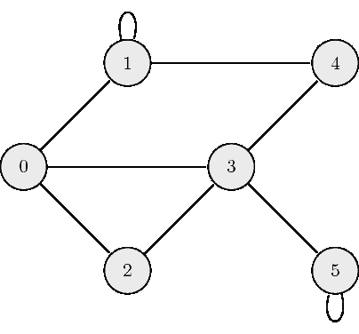
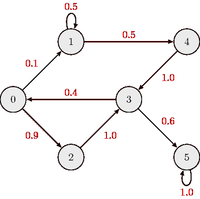
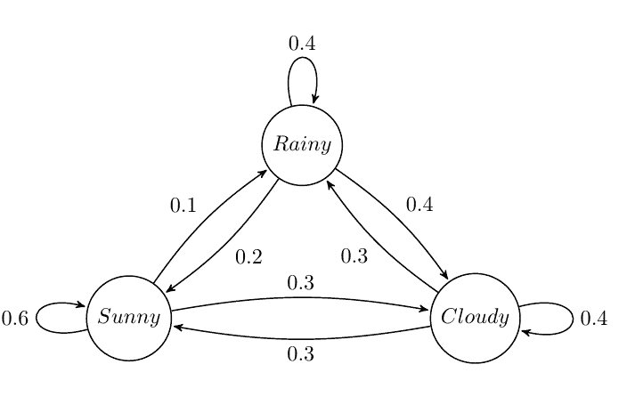
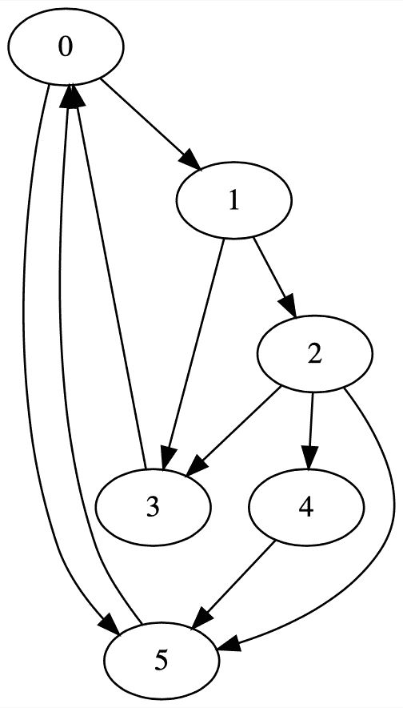

# 马尔可夫链

> 原文：[`cs357.cs.illinois.edu/textbook/notes/markov.html`](https://cs357.cs.illinois.edu/textbook/notes/markov.html)

## 学习目标

+   为无向图、有向图和加权图创建邻接矩阵。

+   识别并表示随机模型为马尔可夫链。

+   实现 PageRank 算法。

## 图

#### 图作为矩阵：

在抽象层面上，图是一组对象，其中对象对以某种方式相关。在这里，图简单地表现为节点（顶点）和连接它们的边。将这种信息——节点之间的关系——存储在矩阵中可能非常有帮助。为此，我们使用**邻接矩阵**。

#### 无向图：

以下是一个无向图的示例：

无向图的邻接矩阵 ${\bf A}$ 总是**对称**的，定义为：

$$a_{ij} = \begin{cases} 1 \quad \mathrm{if} \ (\mathrm{node}_i, \mathrm{node}_j) \ \textrm{are connected} \\ 0 \quad \mathrm{otherwise} \end{cases},$$

其中 $a_{ij}$ 是 ${\bf A}$ 的 $(i,j)$ 元素。描述上述示例图的邻接矩阵为：

$$ {\bf A} = \begin{bmatrix} 0 & 1 & 1 & 1 & 0 & 0 \\ 1 & 1 & 0 & 0 & 1 & 0 \\ 1 & 0 & 0 & 1 & 0 & 0 \\ 1 & 0 & 1 & 0 & 1 & 1 \\ 0 & 1 & 0 & 1 & 0 & 0 \\ 0 & 0 & 0 & 1 & 0 & 1 \end{bmatrix}.$$

#### 有向图：

以下是一个有向图的示例：

有向图的邻接矩阵 ${\bf A}$ 定义为：

$$ a_{ij} = \begin{cases} 1 \quad \mathrm{if} \ \mathrm{node}_i \leftarrow \mathrm{node}_j \\ 0 \quad \mathrm{otherwise} \end{cases}, $$

其中 $a_{ij}$ 是 ${\bf A}$ 的 $(i,j)$ 元素。这个矩阵通常是反对称的，因此遵守定义很重要。**注意**，虽然我们实际上使用列来表示“从”节点，行来表示“到”节点，但这并不一定是标准的，你可能会遇到相反的方向。描述上述示例图的邻接矩阵为：

$$ {\bf A} = \begin{bmatrix} 0 & 0 & 0 & 1 & 0 & 0 \\ 1 & 1 & 0 & 0 & 0 & 0 \\ 1 & 0 & 0 & 0 & 0 & 0 \\ 0 & 0 & 1 & 0 & 1 & 0 \\ 0 & 1 & 0 & 0 & 0 & 0 \\ 0 & 0 & 0 & 1 & 0 & 1 \end{bmatrix}.$$

#### 加权有向图：

以下是一个加权有向图的示例：

加权有向图的邻接矩阵 ${\bf A}$ 定义为：

$$ a_{ij} = \begin{cases} w_{ij} \quad \mathrm{if} \ \mathrm{node}_i \leftarrow \mathrm{node}_j \\ 0 \quad \ \ \mathrm{otherwise} \end{cases}, $$

其中 $a_{ij}$ 是 ${\bf A}$ 的 $(i,j)$ 元素，$w_{ij}$ 是连接节点 $i$ 和 $j$ 的边的链接权重。描述上述示例图的邻接矩阵为：

$$ {\bf A} = \begin{bmatrix} 0 & 0 & 0 & 0.4 & 0 & 0 \\ 0.1 & 0.5 & 0 & 0 & 0 & 0 \\ 0.9 & 0 & 0 & 0 & 0 & 0 \\ 0 & 0 & 1.0 & 0 & 1.0 & 0 \\ 0 & 0.5 & 0 & 0 & 0 & 0 \\ 0 & 0 & 0 & 0.6 & 0 & 1.0 \end{bmatrix}.$$

通常，当我们讨论加权有向图时，是在马尔可夫链的转移矩阵的上下文中，其中每列的链接权重之和为 $1$。

## 马尔可夫链

**马尔可夫链**是一种随机模型，其中未来（下一个）状态的概率只依赖于最近（当前）状态。这种随机过程的记忆性特性被称为**马尔可夫性质**。从概率的角度来看，马尔可夫性质意味着未来状态的条件概率分布（基于过去和当前状态）只依赖于当前状态。

**马尔可夫性质**，更正式地可以写成：

$$P(X_{n+1} = x_{n+1} | X_0 = x_0, X_1 = x_1, ..., X_n = x_n) = P(X_{n+1} = x_{n+1} | X_n = x_n)$$

## 马尔可夫矩阵

**马尔可夫/转移/随机矩阵**是一个用于描述马尔可夫链转移的方阵。它的每个条目都是一个非负实数，代表一个概率。基于马尔可夫性质，下一个状态向量 ${\bf x}_{k+1}$ 是通过将马尔可夫矩阵 ${\bf M}$ 左乘以当前状态向量 ${\bf x}_k$ 得到的。

$$ {\bf x}_{k+1} = {\bf M} {\bf x}_k $$

在本课程中，除非特别说明，我们定义转移矩阵 ${\bf M}$ 为一个左马尔可夫矩阵，其中每一列的和为 $1$。或者，我们可以说每一列的 $1\text{-}范数$ 为 $1$。

**注意**：外部资源中的其他定义可能将 ${\bf M}$ 表示为右马尔可夫矩阵，其中 ${\bf M}$ 的每一行之和为 $1$，并且下一个状态是通过右乘 ${\bf M}$ 得到的，即 ${\bf x}_{k+1}^T = {\bf x}_k^T {\bf M}$。

一个稳态向量 ${\bf x}^*$ 是一个概率向量（条目非负且总和为 $1$），在马尔可夫矩阵 $M$ 的操作下保持不变，即

$$ {\bf M} {\bf x}^* = {\bf x}^* $$

因此，稳态向量 ${\bf x}^*$ 是对应于矩阵 ${\bf M}$ 的特征值 $\lambda=1$ 的特征向量。如果有多个特征值 $\lambda=1$ 的特征向量，那么相应稳态向量的加权平均值也将是一个稳态向量。因此，马尔可夫链的稳态向量可能不是唯一的，并且可能依赖于初始状态向量。

总结来说，状态向量 ${\bf x}$ 与马尔可夫矩阵 ${\bf M}$ 从左向右的重复乘法收敛到特征值 $\lambda=1$ 的向量。这应该会让你想起幂迭代方法。马尔可夫矩阵按大小排序的特征值总是 1。

## 马尔可夫链示例：天气

假设我们想要为 UIUC 夏季的天气预测构建一个马尔可夫链模型。我们观察到：

+   一个晴天有 $60\%$ 的可能性接着又是晴天，$10\%$ 的可能性接着是雨天，$30\%$ 的可能性接着是阴天；

+   一个雨天有 $40\%$ 的可能性接着又是雨天，$20\%$ 的可能性接着是晴天，$40\%$ 的可能性接着是阴天；

+   一个阴天有 $40\%$ 的可能性接着又是阴天，$30\%$ 的可能性接着是雨天，$30\%$ 的可能性接着是晴天。

状态图如下所示：

马尔可夫矩阵是

$$ {\bf M} = \begin{bmatrix} 0.6 & 0.2 & 0.3 \\ 0.1 & 0.4 & 0.3 \\ 0.3 & 0.4 & 0.4 \end{bmatrix}. $$

如果已知第 $0$ 天的天气是雨天，那么

$$ {\bf x}_0 = \begin{bmatrix} 0 \\ 1 \\ 0 \end{bmatrix}; $$

我们可以通过以下方式确定第 $1$ 天的概率向量：

$$ {\bf x}_1 = {\bf M} {\bf x}_0\. $$

第 $n$ 天天气的概率分布由以下给出

$$ {\bf x}_n = {\bf M}^{n} {\bf x}_0\. $$

## 马尔可夫链示例：Page Rank

Page Rank 是一个简单的算法，它被 Google 搜索推广，用于网页排名。它试图通过假设一个随机访问者会连续随机点击链接来模拟用户行为。因此，一个网页的重要性由随机用户最终到达该页面的概率决定。

让上面的图表示网站为节点，出站链接为有向边。首先，我们创建一个邻接矩阵。

$$ {\bf A} = \begin{bmatrix} 0 & 0 & 0 & 1 & 0 & 1 \\ 1 & 0 & 0 & 0 & 0 & 0 \\ 0 & 1 & 0 & 0 & 0 & 0 \\ 0 & 1 & 1 & 0 & 0 & 0 \\ 0 & 0 & 1 & 0 & 0 & 0 \\ 1 & 0 & 1 & 0 & 1 & 0 \\ \end{bmatrix} $$

接下来，我们取一个给定页面的累积权重（影响力），并将其平均分配到每个出站链接。这是一个马尔可夫矩阵。和之前一样，我们可以对一个随机状态向量进行重复迭代，直到达到稳态，以找到用户最有可能到达的页面。

$$ {\bf A} = \begin{bmatrix} 0 & 0 & 0 & 1.0 & 0 & 1.0 \\ 0.5 & 0 & 0 & 0 & 0 & 0 \\ 0 & 0.5 & 0 & 0 & 0 & 0 \\ 0 & 0.5 & 0.33 & 0 & 0 & 0 \\ 0 & 0 & 0.33 & 0 & 0 & 0 \\ 0.5 & 0 & 0.33 & 0 & 1.0 & 0 \\ \end{bmatrix} $$

如果一个站点被其他“重要”站点链接，那么这个站点就会变得“重要”。直觉上大致可以这样理解：如果一个站点 $s$ 被嵌入在一个很少被嵌入的另一个站点中，那么站点 $s$ 的排名不会增加太多。相反，如果一个站点 $s$ 被嵌入在更受欢迎的站点中，它的排名将会增加。

#### Naive Page Rank：缺点

这种 Page Rank 的简单实现的一个弱点是，不能保证有唯一解。**布林-佩奇（1990 年代）**提出了：

> “PageRank 可以被视为用户行为的一个模型。我们假设有一个随机访问者，他被随机分配到一个网页，并持续点击链接，从不点击“后退”，**但最终会感到无聊并开始访问另一个随机页面**。”

$${\bf{M}} = d{\bf{A}} + \frac{1-d}{n}\bf{1} $$

我们引入一个常数，或阻尼系数，$d$，以模拟随机跳跃。设$n$为图中节点的数量。在这里，冲浪者以概率$d$点击当前页面上的链接，以概率$1-d$打开一个随机页面。此模型使得 M 的所有条目都大于零，并保证有唯一解。

## 复习问题

+   给定一个无向或有向图（加权或无权），确定图的邻接矩阵。

+   什么是转移矩阵？给定表示转换或问题描述的图，确定转移矩阵。

## 更新日志

+   2024 年 3 月 3 日：Pascal Adhikary (pascala2) — 添加幻灯片信息，页面排名

+   2018 年 4 月 1 日：Erin Carrier (ecarrie2) — 进行小规模重组和格式更改

+   2018 年 3 月 25 日：Yu Meng (yumeng5) — 添加马尔可夫链

+   

查看剩余条目

    +   2018 年 3 月 1 日：Erin Carrier (ecarrie2) — 添加更多复习问题

    +   2018 年 1 月 14 日：Erin Carrier (ecarrie2) — 删除演示链接

    +   2017 年 11 月 2 日：Erin Carrier (ecarrie2) — 添加更新日志，修复 COO 行索引错误

    +   2017 年 10 月 25 日：Arun Lakshmanan (lakshma2) — 第一份完整草案

    +   2017 年 10 月 25 日：Erin Carrier (ecarrie2) — 添加复习问题，进行小修和格式更改

    +   2017 年 10 月 16 日：Luke Olson (lukeo) — 概述

## 作者

+   CS 357 课程工作人员
