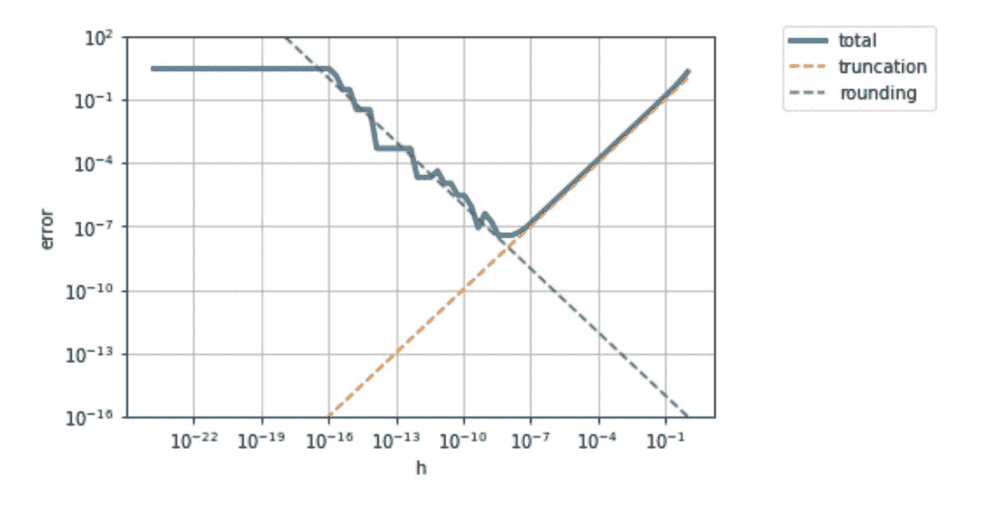

# 有限差分方法

> 原文：[`cs357.cs.illinois.edu/textbook/notes/finite-difference.html`](https://cs357.cs.illinois.edu/textbook/notes/finite-difference.html)

## 学习目标

+   使用有限差分法近似导数

## 有限差分近似

#### 动机

对于一个给定的光滑函数 $f(x)$，我们想要计算 $x$ 的给定值处的导数 $f'(x)$。

然而，有时我们不知道如何计算 $f'(x)$ 的解析表达式，或者计算成本太高。

有限差分方法可以帮助找到 $f'(x)$ 的近似值。

#### 定义

对于一个可微函数 $f(x):\mathbb{R} \rightarrow \mathbb{R}$，导数的定义是

$$f'(x) = \lim_{h \rightarrow 0} \frac{f(x+h)-f(x)}{h} $$

我们将前向有限差分近似，$df(x)$，定义为第一导数

$$f'(x) \approx df(x) = \frac{f(x+h)-f(x)}{h} $$

其中 $h$ 通常被称为“扰动”，即对变量 $x$ 的“小”变化（与 $x$ 的大小相比是小）。

通过泰勒定理，我们可以写出

$$f(x+h) = f(x) + f'(x)\, h + f''(x) \frac{h²}{2} + f'''(x) \frac{h³}{6} + ... $$$$f(x+h) =f(x) + f'(x)\, h + O(h²) $$$$f'(x) = \frac{f(x+h)-f(x)}{h} + O(h) $$

重新排列上述公式，我们得到导数 $f'(x)$ 作为前向有限差分近似 $df(x)$ 的函数：

$$f'(x) = df(x) + O(h) $$

#### 错误

因此，前向有限差分近似的截断误差被限制在以下范围内：

$$Mh \geq |f'(x) - df(x)| $$

其中 $M$ 是 $h$ 值的一个常数界限。

如果 $h$ 非常小，我们将会遇到舍入误差，其界限为：

$$\frac{\epsilon_m|f(x)|}{h} \geq df(x) $$

其中 $\epsilon_m$ 是机器精度。

为了找到使总误差最小化的 $h$：

$$error \approx \frac{\epsilon_m|f(x)|}{h} + Mh $$$$h = \sqrt{\frac{\epsilon_m |f(x)|}{M}} $$

使用 $f(x) = e^x - 2$ 上的前向有限差分近似，我们可以从下面的图中看到总误差、截断误差和舍入误差的值，这取决于选择的扰动 $h$。

因此，我们可以看到使总误差最小化的最优 $h$ 是截断误差和舍入误差相交的地方。

使用类似的方法，我们可以总结以下有限差分近似：

### 前向有限差分法

$$df(x) = \frac{f(x+h)-f(x)}{h}$$

除了计算 $f(x)$ 之外，这种方法还需要额外的计算成本，即对一个给定的扰动 $f(x+h)$ 进行一次函数评估，并且具有截断阶 $O(h)$。

#### 示例

假设 $f(x) = 2x² + 15x + 1$ 并且我们试图在 $x = 10, h = 0.01$ 处找到 $df(x)$。

$$f(x) = f(10) = 2 \times 10² + 15 \times 10+ 1 = 351 $$$$f(x+h) = f(10+0.01) = 2 \times (10.01)² + 15 \times (10.01)+ 1 = 351.5502 $$$$df(x) = df(10) = \frac {351.5502 - 351}{0.01} = 55.02 $$

我们可以通过以下方式找到绝对截断误差：

$$f'(x) = 4x + 15, f'(10) = 55 $$$$error = |f'(x) - df(x)| = |55 - 55.02| = 0.02 $$

### 后向有限差分法

$$df(x) = \frac{f(x)-f(x-h)}{h}$$

除了计算 $f(x)$ 的值之外，这种方法还需要额外的计算一个函数值 $f(x-h)$ 的成本，对于一个给定的扰动，并且具有截断阶数 $O(h) $。

#### 示例

假设 $f(x) = 2x² + 15x + 1$，我们试图在 $x = 10, h = 0.01$ 处找到 $df(x)$。

$$f(x) = f(10) = 2 \times 10² + 15 \times 10+ 1 = 351 $$$$f(x-h) = f(10-0.01) = 2 \times (9.99)² + 15 \times (9.99)+ 1 = 350.4502 $$$$df(x) = df(10) = \frac {351 - 350.4502}{0.01} = 54.98 $$

我们可以通过以下方式找到绝对截断误差：

$$f'(x) = 4x + 15, f'(10) = 55 $$$$error = |f'(x) - df(x)| = |55 - 54.98| = 0.02 $$

### 中央有限差分法

$$df(x) = \frac{f(x+h)-f(x-h)}{2h}$$

这种方法需要一个额外的函数评估成本（$f(x+h)$ 和 $f(x-h)$），对于一个给定的扰动，并且具有截断阶数 $O(h²) $。因此，我们可以看到中央有限差分近似提供了更好的精度，但可能增加了计算成本。

#### 示例

假设 $f(x) = 2x² + 15x + 1$，我们试图在 $x = 10, h = 0.01$ 处找到 $df(x)$。

$$f(x+h) = f(10+0.01) = 2 \times (10.01)² + 15 \times (10.01)+ 1 = 351.5502 $$$$f(x-h) = f(10-0.01) = 2 \times (9.99)² + 15 \times (9.99)+ 1 = 350.4502 $$$$df(x) = df(10) = \frac {351.5502 - 350.4502}{2 \times 0.01} = 55.0 $$

我们可以通过以下方式找到绝对截断误差：

$$f'(x) = 4x + 15, f'(10) = 55 $$$$error = |f'(x) - df(x)| = |55 - 55| = 0.0$$

### 梯度近似

考虑一个可微函数 $f(x_1, \dots, x_n):\mathbb{R^n} \rightarrow \mathbb{R}$，其中导数定义为梯度，或者

$$\nabla f(x) = \begin{bmatrix} \frac{\partial f}{\partial x_1} \\ \frac{\partial f}{\partial x_2} \\ \vdots \\ \frac{\partial f}{\partial x_n} \end{bmatrix} $$

我们定义梯度有限差分近似为

$$\nabla_{FD} f(x) = \begin{bmatrix} df(x_1) \\ df(x_2) \\ \vdots \\ df(x_n) \end{bmatrix} = \begin{bmatrix} \frac{f(x+h \delta_1) - f(x)}{h} \\ \frac{f(x+h \delta_2) - f(x)}{h} \\ \vdots \\ \frac{f(x+h \delta_n) - f(x)}{h} \end{bmatrix}$$

使用前向有限差分法，其中 $\delta_i $ 是一个在位置 $i$ 有 $1$ 而其他地方为 $0$ 的向量。

注意：$df(x) $ 可以使用任何有限差分方法定义。

#### 示例

假设 $f(x_1, x_2) = 2x_1 + x_1²x_2 + x_2³$，我们试图在 $x_1 = 1.3, x_2 = 4.9$ 处，当 $h = 0.05$ 时找到前向有限差分梯度的近似值。

$$\nabla_{FD} f(x) = \begin{bmatrix} df(x_1) \\ df(x_2) \end{bmatrix} = \begin{bmatrix} 14.985 \\ 74.4575 \end{bmatrix} $$$$\ df(x_1) = \frac{f(x_1 + h, x_2) - f(x_1, x_2)}{h} = \frac{f(1.3 + 0.05, 4.9) - f(1.3, 4.9)}{0.05} = 14.985 $$$$\ df(x_2) = \frac{f(x_1, x_2 + h) - f(x_1, x_2)}{h} = \frac{f(1.3, 4.9 + 0.05) - f(1.3, 4.9)}{0.05} = 74.4575 $$

我们可以通过以下方式找到绝对截断误差：

$$\nabla f(x) = \begin{bmatrix} \frac{\partial f}{\partial x_1} \\ \frac{\partial f}{\partial x_2} \end{bmatrix} = \begin{bmatrix} 2 x_1 x_2 + 2 \\ x_1² + 3 x_2² \end{bmatrix} \ = \begin{bmatrix} 14.74 \\ 73.72 \end{bmatrix} $$$$error = |\nabla f(x) - \nabla_{FD} f(x)| = \begin{bmatrix} |14.985 - 14.74| \\ | 74.4575 - 73.72| \end{bmatrix} \ = \begin{bmatrix} .245 \\ .7375 \end{bmatrix} \ $$

### 雅可比近似

考虑一个可微函数 $f = \begin{bmatrix} f_1(x) & f_2(x) & \dots & f_n(x) \end{bmatrix}:\mathbb{R^n} \rightarrow \mathbb{R^m}$，其中导数定义为雅可比矩阵，或者

$$\mathbb{J}(x) = \begin{bmatrix} \frac{\partial f_1}{\partial x_1} & \frac{\partial f_1}{\partial x_2} & \dots & \frac{\partial f_1}{\partial x_n}\\ \frac{\partial f_2}{\partial x_1} & \frac{\partial f_2}{\partial x_2} & \dots & \frac{\partial f_2}{\partial x_n} \\ & \ddots \\ \frac{\partial f_m}{\partial x_1} & \frac{\partial f_m}{\partial x_2} & \dots & \frac{\partial f_m}{\partial x_n} \end{bmatrix} $$

我们定义雅可比有限差分近似为

$$\mathbb{J_{FD}}(x) = \begin{bmatrix} df_1(x_1) & df_1(x_2) & \dots & df_1(x_n)\\ df_2(x_1) & df_2(x_2) & \dots & df_2(x_n) \\ & \ddots \\ df_m(x_1) & df_m(x_2) & \dots & df_m(x_n) \end{bmatrix} $$

其中 $df_i(x_j) $ 是使用任何有限差分方法在 $x_j$ 处对 $f_i$ 的近似。

#### 示例

假设 $f = \begin{bmatrix} f_1(x) = 2x_1² + 6x_1x_2 & f_2(x) = 3x_1 + 7x_2 \end{bmatrix}$ 并且我们试图在 $x_1 = 3, x_2 = 7$ 时，当 $h = 0.1$ 时找到前向有限差分梯度近似。

$$\nabla_{FD} f(x) = \begin{bmatrix} df_1(x_1) && df_1(x_2) \\ df_2(x_1) && df_2(x_2) \end{bmatrix} = \begin{bmatrix} 54.2 && 18 \\ 3 && 7 \end{bmatrix} $$$$\ df_1(x_1) = \frac{f_1(x_1 + h, x_2) - f_1(x_1, x_2)}{h} = \frac{f_1(3 + 0.1, 7) - f_1(3, 7)}{0.1} = 54.2 $$$$\ df_1(x_2) = \frac{f_1(x_1, x_2 + h) - f_1(x_1, x_2)}{h} = \frac{f_1(3, 7 + 0.1) - f_1(3, 7)}{0.1} = 18 $$$$\ df_2(x_1) = \frac{f_2(x_1 + h, x_2) - f_2(x_1, x_2)}{h} = \frac{f_2(3 + 0.1, 7) - f_2(3, 7)}{0.1} = 3 $$$$\ df_2(x_2) = \frac{f_2(x_1, x_2 + h) - f_2(x_1, x_2)}{h} = \frac{f_2(3, 7 + 0.1) - f_2(3, 7)}{0.1} = 7 $$

我们可以通过以下方式找到绝对截断误差：

$$\nabla f(x) = \begin{bmatrix} \frac{\partial f_1}{\partial x_1} & \frac{\partial f_1}{\partial x_2} \\ \frac{\partial f_2}{\partial x_1} & \frac{\partial f_2}{\partial x_2} \end{bmatrix} = \begin{bmatrix} 4 x_1 + 6 x_2 & 6 x_1 \\ 3 & 7 \end{bmatrix} \ = \begin{bmatrix} 54 & 18 \\ 3 & 7 \end{bmatrix} $$$$error = |\nabla f(x) - \nabla_{FD} f(x)| = \begin{bmatrix} |54.2 - 54| & | 18 - 18| \\ | 3 - 3| & |7-7| \end{bmatrix} \ = \begin{bmatrix} 0.2 & 0.0 \\ 0.0 & 0.0 \end{bmatrix} \ $$

*参考文献：Michael Heath 所著的 "Scientific Computing: an introductory survey"*

## 复习问题

1.  泰勒级数的一般形式是什么？

1.  你如何使用泰勒级数来近似给定点的函数？

1.  你如何使用泰勒级数近似函数的导数？

1.  你如何使用泰勒级数近似函数的积分？

1.  给定一个函数和一个中心点，你能写出$n$次度的泰勒多项式吗？

1.  对于一个$n$次度的泰勒多项式，你的近似误差作为距离中心的函数的界限是多少？

1.  对于简单函数，你能在泰勒误差界限中找到常数$C$吗？

1.  能够确定为了使泰勒级数近似误差小于某个给定值，需要多少项。

## 更新日志

+   2024 年 2 月 24 日：Kriti Chandak（kritic3）——从幻灯片和视频中添加了信息，并添加了额外的示例

+   2021 年 1 月 20 日：Mariana Silva（mfsilva）——将 FD 内容从泰勒部分移动到这个新部分

+   

查看剩余条目

## 作者

+   CS 357 课程工作人员
