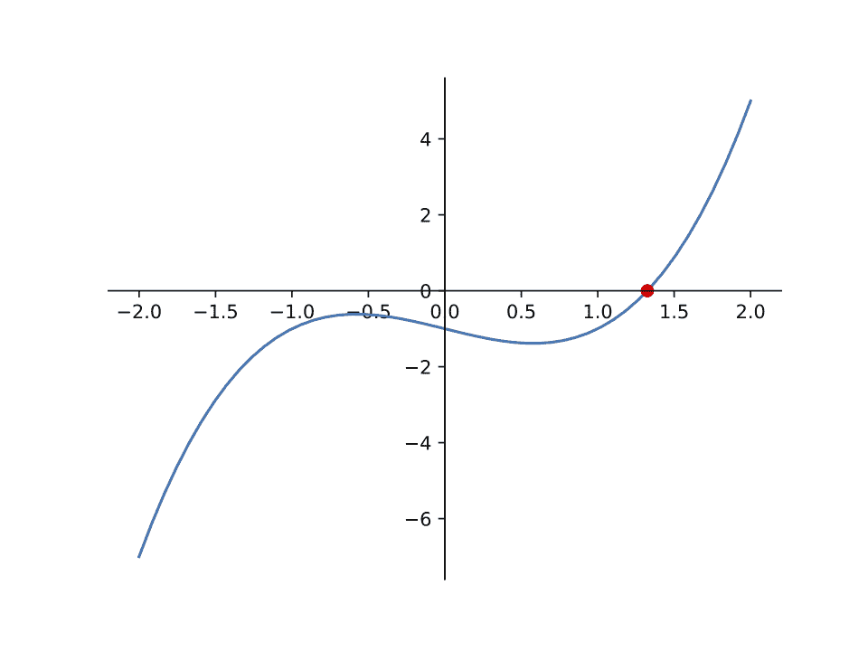
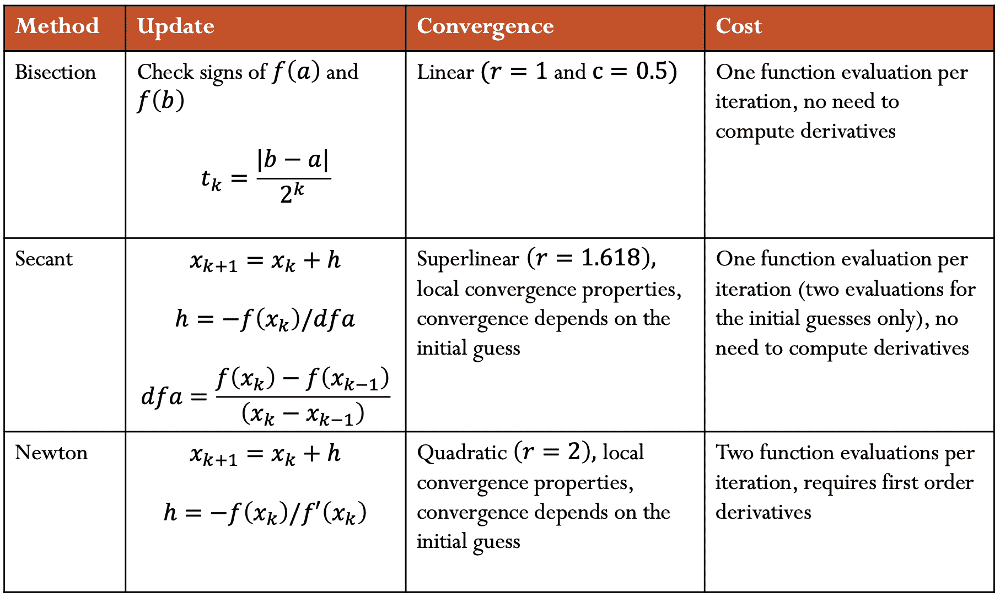

# 求解非线性方程

> 原文：[`cs357.cs.illinois.edu/textbook/notes/solve_nd.html`](https://cs357.cs.illinois.edu/textbook/notes/solve_nd.html)

## 学习目标

+   评估二分法、牛顿法和割线法求解一维非线性方程

+   应用牛顿法求解非线性方程组

## 函数的根

考虑一个函数 $f : \mathbb{R} \to \mathbb{R}$。如果 $f(x) = 0$，则 $x \in \mathbb{R}$ 被称为 $f$ 的 ***根***。

## 方程的求解

找到 $f(x) = 0$ 的 $x$ 值对于许多应用很有用，但一个更一般的目标是找到 $f(x) = y$ 的 $x$ 值。用于找到函数根的技术可以用来通过操纵函数来解方程，如下所示：

$$\tilde{f}(x) = f(x) - y = 0$$

新函数 $\tilde{f}(x)$ 在原方程 $f(x) = y$ 的解处有一个根。

## 一维非线性方程

线性函数很容易求解，如果你记住了二次公式，二次函数也容易求解。然而，高次多项式和非多项式函数的求解要困难得多。求解这些类型方程的最简单技术是使用迭代求根技术。我们不会直接找出 $f(x) = 0$ 的位置，而是从一个初始猜测开始，并在多个步骤中逐步改进，直到我们的 *残差* $f(x)$ 足够小。

### 收敛性

一个迭代方法以 $\mathbf r$ 的速率收敛，如果：

$$\lim_{k\to\infty} \frac{\|e_{k + 1}\|}{\|e_{k}\|^{\mathbf r}} = C, \quad 0 < C < \infty$$

其中 $e_k$ 是第 k 次迭代的误差。

$$\begin{eqnarray} \mathbf{r} &=& 1: 线性收敛\\ \\ 1 < \mathbf{r} &<& 2: 超线性收敛\\ \\ \mathbf{r} &=& 2: 二次收敛\\ \end{eqnarray}$$

**线性收敛**每一步增加一个常数数量的准确数字（误差线性减小）。当 $C$ 接近 1 时，收敛速度慢。

**二次收敛**使每一步的准确数字数量加倍（误差呈二次减小）。然而，它只有在 $\|e^k\|$ 很小的时候才有意义，而 C 并不重要。

#### 示例

**幂迭代**的收敛速率是多少？


**答案**


从幂迭代方法中回忆

$$\lim_{k\to\infty} \frac{\|e_{k + 1}\|}{\|e_{k}\|^{\mathbf 1}} = |\frac{\lambda_{2}} {\lambda_{1}}| = C$$

我们看到当 ${\mathbf r} = 1$ 时，我们得到两个连续迭代之间的比值为常数。因此幂迭代具有线性收敛。

### 二分法

二分法是最简单的求根技术。

#### 算法

二分法的算法类似于二分查找：

1.  在根的两侧取两个点，$a$ 和 $b$，使得 $f(a)$ 和 $f(b)$ 符号相反。

1.  计算中点 $c = \frac{a + b}{2}$

1.  评估 $f(c)$ 并使用 $c$ 替换 $a$ 或 $b$，保持端点的符号相反。

使用这个算法，我们每次迭代都依次将包含根的区间的长度减半。我们可以重复这个过程，直到区间的长度小于我们想要知道根的容差。

#### 收敛性

二分法不估计 $x_{k}$，即所需根 $x$ 的近似值。它而是找到一个包含根的区间（小于给定的容差）。

因此，迭代 k 的误差定义为 k 次迭代时区间的长度，或 $\frac{(b - a)}{2^k}$。

$$\lim_{k\to\infty} \frac{\|e_{k + 1}\|}{\|e_{k}\|^{\mathbf r}} = \lim_{k\to\infty} \frac{\|\frac{(b - a)}{2^{k + 1}}\|}{\|\frac{(b - a)}{2^k}\|} = 0.5$$

这给出了线性收敛，常数为 $\frac{1}{2}$。

#### 计算成本

从概念上讲，二分法在每次迭代中使用 2 次函数评估。然而，在每一步中，$a$ 或 $b$ 中的一个保持不变。因此，在每次迭代（第一次迭代之后），在之前的迭代中已经计算了 $f(a)$ 或 $f(b)$ 中的一个。因此，二分法每次迭代只需要进行一次新的函数评估。根据函数评估的成本，这可以节省显著的成本。

#### 缺点

二分法要求我们对我们所研究的函数有一定的了解。具体来说，$f(x)$ 必须是连续的，并且我们必须有一个区间 $[a, b]$，使得

$$\mathrm{sgn}(f(a)) = -\mathrm{sgn}(f(b)).$$

然后，根据介值定理，我们知道在区间 $[a,b]$ 内必须有一个根。

这个限制意味着二分法不能求解 $x²$ 的根，因为它永远不会穿过 x 轴并变为负数。

#### 示例

$$f(x) = x³ - x - 1$$ 

**答案**




从上面的图中，我们可以看到 $f(x)$ 在 1 和 2 之间有一个根。很难确切知道根是什么，但我们可以使用二分法来近似它。具体来说，我们可以将 $a = 1$ 和 $b = 2$。

**迭代 1**

$$\begin{flalign*} &\hspace{0.4cm}a = 1 \hspace{6.5cm} f(a) = f(1) = -1&\\ &\hspace{0.4cm}b = 2 \hspace{6.5cm} f(b) = f(2) = 5&\\ &\hspace{0.4cm}c = \frac{a + b}{2} = \frac{3}{2} = 1.5 \hspace{3cm} f(c) = f(1.5) = 1.5³ - 1.5 - 1 = 0.875& \end{flalign*}$$

由于 $f(b)$ 和 $f(c)$ 都是正数，我们将用 $c$ 替换 $b$ 并进一步缩小我们的区间。

**迭代 2**

$$\begin{flalign*} &\hspace{0.4cm}a = 1 \hspace{6.5cm} f(a) = f(1) = -1&\\ &\hspace{0.4cm}b = 1.5 \hspace{6.2cm} f(b) = f(1.5) = 0.875&\\ &\hspace{0.4cm}c = \frac{a + b}{2} = \frac{2.5}{2} = 1.25 \hspace{2.5cm} f(c) = f(1.25) = 1.25³ - 1.25 - 1 = -0.296875& \end{flalign*}$$

由于 $f(a)$ 和 $f(c)$ 都是负数，我们将用 $c$ 替换 $a$ 并进一步缩小我们的区间。

注意，如上所述，我们不需要重新计算 $f(a)$ 或 $f(b)$，因为我们已经在之前的迭代中计算了它们。重用这些值可以显著节省成本。

**迭代 3**

$$\begin{flalign*} &\hspace{0.4cm}a = 1.25 \hspace{6.0cm} f(a) = f(1.25) = -0.296875&\\ &\hspace{0.4cm}b = 1.5 \hspace{6.25cm} f(b) = f(1.5) = 0.875&\\ &\hspace{0.4cm}c = \frac{a + b}{2} = \frac{1.25 + 1.5}{2} = 1.375 \hspace{0.9cm} f(c) = f(1.375) = 1.375³ - 1.375 - 1 = 0.224609375& \end{flalign*}$$

由于 $f(b)$ 和 $f(c)$ 都是正的，我们将用 $c$ 替换 $b$，并进一步缩小我们的区间。

**…**

**迭代 n**

当运行下面的二分法代码时，得到的近似根为 $1.324717957244502$。使用二分法，我们可以将根近似到所需的公差（上面的值是默认公差）。

**代码**

以下 Python 代码调用 SciPy 的 `bisect` 方法：

```py
import scipy.optimize as opt

def f(x):
    return x**3 - x - 1

root = opt.bisect(f, a=1, b=2) 
```

### 牛顿法

牛顿-拉夫森方法（又称牛顿法）使用函数的泰勒级数近似来寻找一个近似解。具体来说，它取前两项：

$$f(x_k + h) \approx f(x_k) + f'(x_k)h$$

#### 算法

从上面的泰勒级数开始，我们可以这样找到这个新函数的根：

$$f(x_k) + f'(x_k)h = 0$$ $$h = - \frac{f(x_k)}{f'(x_k)}$$

这个 $h$ 值被称为 **牛顿步**。现在，$h$ 可以用来执行 **牛顿更新**，以找到更接近 $f$ 的根的 $x$ 值：

$$\begin{eqnarray} x_{k+1} &=& x_k + h \\ &=& x_k - \frac{f(x_k)}{f'(x_k)} \end{eqnarray}$$

几何上，$(x_{k+1}, 0)$ 是 x 轴与 $(x_k, f(x_k))$ 处图形的切线的交点。

通过重复此过程，我们可以越来越接近实际的根。

#### 计算成本

使用牛顿法，在每次迭代中，我们必须评估 $f(x)$ 和 $f'(x)$。

#### 收敛

尽管牛顿法比二分法成本更高，但它收敛得更快。

$$\lim_{k\to\infty} \frac{\|e_{k + 1}\|}{\|e_{k}\|^{\mathbf 2}} = C$$

这给我们带来了二次收敛。然而，正如我们在下一节中看到的，这取决于初始猜测。

#### 缺点

评估导数的额外成本使得每次迭代计算速度变慢。

许多函数不易微分，因此牛顿法并不总是可行。即使在可以评估导数的情况下，它可能也相当昂贵。

收敛只有在您已经接近根的情况下才有效。具体来说，如果起始位置离根太远，牛顿法可能根本不会收敛。

#### 示例

$$\begin{align*} f(x) &= x³ - x - 1 \\ f'(x) &= 3x² - 1 \end{align*}$$ 

**答案**


从上面的图中，我们可以看到根大约在 $x = 1$ 附近。我们将使用 $x_0$ 作为我们的起始位置。

**迭代 1**

$\begin{flalign*} \hspace{2cm} x_1 &= x_0 - \frac{f(x_0)}{f'(x_0)} \\ &= 1 - \frac{f(1)}{f'(1)} &\\ &= 1 - \frac{1³ - 1 - 1}{3 \cdot 1² - 1} \\ &= 1 + \frac{1}{2} \\ &= 1.5 \end{flalign*}$

**迭代 2**

$\begin{flalign*} \hspace{2cm} x_2 &= x_1 - \frac{f(x_1)}{f'(x_1)} \\ &= 1.5 - \frac{f(1.5)}{f'(1.5)} &\\ &= 1.5 - \frac{1.5³ - 1.5 - 1}{3 \cdot 1.5² - 1} \\ &= 1.5 - \frac{0.875}{5.75} \\ &= 1.3478260869565217 \end{flalign*}$

**迭代 3**

$$\begin{flalign*} \hspace{2cm} x_3 &= x_2 - \frac{f(x_2)}{f'(x_2)} \\ &= 1.3478260869565217 - \frac{f(1.3478260869565217)}{f'(1.3478260869565217)}& \\ &= 1.3478260869565217 - \frac{1.3478260869565217³ - 1.3478260869565217 - 1}{3 \cdot 1.3478260869565217² - 1} \\ &= 1.3478260869565217 - \frac{0.10068217309114824}{4.449905482041588} \\ &= 1.325200398950907 \end{flalign*}$$

如您所见，牛顿法已经比二分法收敛得快得多。

**…**

**迭代 n**

当运行以下牛顿法代码时，得到的近似根为 $1.324717957244746$。

**代码**

以下 Python 代码调用 SciPy 的 `newton` 方法：

```py
import scipy.optimize as opt

def f(x):
    return x**3 - x - 1

def fprime(x):
    return 3 * x**2 - 1

root = opt.newton(f, x0=1, fprime=fprime) 
```

### 切线法

与牛顿法类似，切线法使用泰勒级数来找到解。然而，您可能并不总是能够对函数求导。切线法通过近似导数来解决这个问题：

$$f'(x_k) \approx \frac{f(x_k) - f(x_{k-1})}{x_k - x_{k-1}}$$

#### 算法

切线法涉及的步骤与牛顿法相同，只是将导数替换为切线斜率的近似值。

#### 计算成本

与二分法类似，尽管切线法在概念上需要每迭代一次进行两次函数评估，其中一次函数评估已在上一迭代中计算并可以重用。因此，切线法每迭代一次需要 1 个新的函数评估（第一次迭代之后）。

#### 收敛性

切线法具有超线性收敛性。

更具体地说，收敛率 $r$ 是：

$$r = \frac{1 + \sqrt{5}}{2} \approx 1.618$$

这恰好是黄金比例。

#### 缺点

这种技术与牛顿法有许多相同的缺点，但不需要导数。它的收敛速度不如牛顿法快。它还需要两个接近根的起始猜测值。

#### 示例

$$f(x) = x³ - x - 1$$ 

**答案**


让我们从 $x_0 = 1$ 和 $x_{-1} = 2$ 开始。

**迭代 1**

首先，找到导数（斜率）的近似值：

$$\begin{flalign*} \hspace{0.5cm}f'(x_0) &\approx \frac{f(x_0) - f(x_{-1})}{x_0 - x_{-1}} \\ &= \frac{f(1) - f(2)}{1 - 2} &\\ &= \frac{(1³ - 1 - 1) - (2³ - 2 - 1)}{1 - 2} \\ &= \frac{(-1) - (5)}{1 - 2} \\ &= 6 \end{flalign*}$$

然后，用这个结果来应用牛顿法：

$\begin{flalign*} \hspace{0.5cm}x_1 &= x_0 - \frac{f(x_0)}{f'(x_0)} \\ &= 1 - \frac{f(1)}{f'(1)} &\\ &= 1 - \frac{1³ - 1 - 1}{6} \\ &= 1 + \frac{1}{6} \\ &= 1.1666666666666667 \end{flalign*}$

**迭代 2**

$$\begin{flalign*} \hspace{0.5cm}f'(x_1) &\approx \frac{f(x_1) - f(x_0)}{x_1 - x_0} \\ &= \frac{f(1.1666666666666667) - f(1)}{1.1666666666666667 - 1} &\\ &= \frac{(1.1666666666666667³ - 1.1666666666666667 - 1) - (1³ - 1 - 1)}{1.1666666666666667 - 1} \\ &= \frac{(-0.5787037037037035) - (-1)}{1.1666666666666667 - 1} \\ &= 2.5277777777777777 \end{flalign*}$$

$\begin{flalign*} \hspace{0.5cm}x_2 &= x_1 - \frac{f(x_1)}{f'(x_1)} \\ &= 1.1666666666666667 - \frac{f(1.1666666666666667)}{f'(1.1666666666666667)} &\\ &= 1.1666666666666667 - \frac{1.1666666666666667³ - 1.1666666666666667 - 1}{2.5277777777777777} \\ &= 1.1666666666666667 - \frac{-0.5787037037037035}{2.5277777777777777} \\ &= 1.3956043956043955 \end{flalign*}$

**迭代 3**

$$\begin{flalign*} \hspace{0.5cm}f'(x_2) &\approx \frac{f(x_2) - f(x_1)}{x_2 - x_1} \\ &= \frac{f(1.3956043956043955) - f(1.1666666666666667)}{1.3956043956043955 - 1.1666666666666667} &\\ &= \frac{(1.3956043956043955³ - 1.3956043956043955 - 1) - (1.1666666666666667³ - 1.1666666666666667 - 1)}{1.3956043956043955 - 1.1666666666666667} \\ &= \frac{(0.3226305152401032) - (-0.5787037037037035)}{1.3956043956043955 - 1.1666666666666667} \\ &= 3.9370278683465503 \end{flalign*}$$ $$\begin{flalign*} \hspace{0.5cm}x_3 &= x_2 - \frac{f(x_2)}{f'(x_2)} \\ &= 1.3956043956043955 - \frac{f(1.3956043956043955)}{f'(1.3956043956043955)} &\\ &= 1.3956043956043955 - \frac{1.3956043956043955³ - 1.3956043956043955 - 1}{3.9370278683465503} \\ &= 1.3956043956043955 - \frac{0.3226305152401032}{3.9370278683465503} \\ &= 1.3136566609098987 \end{flalign*}$$

**…**

**迭代 n**

当运行以下割线法的代码时，确定的近似根为 $1.324717957244753$。

**代码**

SciPy 的`newton`方法具有双重功能。如果给定一个函数 $f$ 和一个一阶导数 $f'$，它将使用牛顿法。如果没有给定导数，它将改用割线法来近似它：

```py
import scipy.optimize as opt

def f(x):
    return x**3 - x - 1

root = opt.newton(f, x0=1) 
```

### 1D 总结



## 非线性方程组

与一维的根查找类似，我们也可以在 $n$ 维中进行多方程的根查找。从数学上讲，我们试图求解 $\boldsymbol{f(x) = 0}$ 对于 $\boldsymbol{f} : \mathbb{R}^n \to \mathbb{R}^n$。换句话说，$\boldsymbol{f(x)}$ 现在是一个向量值函数

$$\boldsymbol{f(x)} = \begin{bmatrix} f_1(\boldsymbol{x}) \\ \vdots \\ f_n(\boldsymbol{x}) \end{bmatrix} = \begin{bmatrix} f_1(x_1, \ldots, x_n) \\ \vdots \\ f_n(x_1, \ldots, x_n) \end{bmatrix}$$

如果我们正在寻找 $\boldsymbol{f(x) = y}$ 的解，我们可以重新设计我们的函数如下：

$$\boldsymbol{\tilde{f}(x)} = \boldsymbol{f(x)} - \boldsymbol{y} = \boldsymbol{0}$$

我们可以将每个方程视为一个描述曲面的函数。我们正在寻找描述这些曲面交点的向量。

### 雅可比矩阵

给定 $\boldsymbol{f} : \mathbb{R}^n \to \mathbb{R}^n$，我们定义雅可比矩阵 ${\bf J}_f$ 为：

$${\bf J}_f(\boldsymbol{x}) = \begin{bmatrix} \frac{\partial f_1}{\partial x_1} & \ldots & \frac{\partial f_1}{\partial x_n} \\ \vdots & \ddots & \vdots \\ \frac{\partial f_n}{\partial x_1} & \ldots & \frac{\partial f_n}{\partial x_n} \end{bmatrix}$$

### 牛顿法

牛顿法的多维等价形式涉及将函数近似为：

$$\boldsymbol{f(x + s)} \approx \boldsymbol{f(x)} + {\bf J}_f(\boldsymbol{x})\boldsymbol{s}$$

其中 ${\bf J}_f$ 是 $\boldsymbol{f}$ 的 ***雅可比矩阵***。

通过将其设置为 $\mathbf{0}$ 并重新排列，我们得到：

$$\begin{align*} {\bf J}_f(\boldsymbol{x})\boldsymbol{s} &= -\boldsymbol{f(x)} \qquad \qquad (1) \\ \boldsymbol{s} &= - {\bf J}_f(\boldsymbol{x})^{-1} \boldsymbol{f(x)} \end{align*}$$

注意，在实践中，我们实际上不会求雅可比矩阵的逆，而是会求解 $(1)$ 中的线性系统以确定步长。

#### 算法

与我们在一维中求解 $x_{k+1}$ 的方式类似，我们可以求解：

$\boldsymbol{x_{k+1}} = \boldsymbol{x_k} + \boldsymbol{s_k}$ 其中 $\boldsymbol{s_k}$ 通过求解线性系统 ${\bf J}_f(\boldsymbol{x_k})\boldsymbol{s_k} = -\boldsymbol{f(x_k)}$ 确定。

#### 缺点

就像在一维中一样，牛顿法只在局部收敛。在每次迭代中计算 ${\bf J}_f$ 也可能很昂贵，并且我们必须在每次迭代中求解一个线性系统。

#### 示例

求解

$$\boldsymbol{f}(x, y) = \begin{bmatrix} x + 2y - 2 \\ x² + 4y² - 4 \end{bmatrix}$$

相应的雅可比矩阵和逆雅可比矩阵为：

$${\bf J}_f(\boldsymbol{x}) = \begin{bmatrix} 1 & 2 \\ 2x & 8y \end{bmatrix}$$ $${\bf J}_f^{-1} = \frac{1}{x - 2y} \begin{bmatrix} -2y & \frac{1}{2} \\ \frac{x}{2} & - \frac{1}{4} \end{bmatrix}$$

在这个例子中，由于雅可比矩阵是一个 $2 \times 2$ 矩阵，其逆简单，我们明确地使用逆矩阵，即使在实际问题中我们不会明确地计算逆矩阵。

让我们从 $\boldsymbol{x_0} = \begin{bmatrix}1 \\ 1\end{bmatrix}$ 开始。

**迭代 1**

$\begin{flalign*} \hspace{2cm}\boldsymbol{x_1} &= \boldsymbol{x_0} - {\bf J}_f(\boldsymbol{x_0})^{-1} \boldsymbol{f(x_0)} \\ &= \begin{bmatrix}1 \\ 1\end{bmatrix} - \frac{1}{1 - 2}\begin{bmatrix}-2 & \frac{1}{2} \\ \frac{1}{2} & - \frac{1}{4}\end{bmatrix} \begin{bmatrix}1 \\ 1\end{bmatrix} &\\ &= \begin{bmatrix}1 \\ 1\end{bmatrix} + \begin{bmatrix}-1.5 \\ 0.25\end{bmatrix} \\ &= \begin{bmatrix}-0.5 \\ 1.25\end{bmatrix} \end{flalign*}$

**迭代 2**

$\begin{flalign*} \hspace{2cm}\boldsymbol{x_2} &= \boldsymbol{x_1} - {\bf J}_f(\boldsymbol{x_1})^{-1} \boldsymbol{f(x_1)} \\ &= \begin{bmatrix}-0.5 \\ 1.25\end{bmatrix} - \frac{1}{-0.5 - 2.5}\begin{bmatrix}-2.5 & \frac{1}{2} \\ - \frac{1}{4} & - \frac{1}{4}\end{bmatrix} \begin{bmatrix}0 \\ 2.5\end{bmatrix} &\\ &= \begin{bmatrix}-0.5 \\ 1.25\end{bmatrix} + \frac{1}{3}\begin{bmatrix}1.25 \\ -0.625\end{bmatrix} \\ &= \begin{bmatrix}-0.08333333 \\ 1.04166667\end{bmatrix} \end{flalign*}$

**迭代 3**

$$\begin{flalign*} \hspace{2cm}\boldsymbol{x_3} &= \boldsymbol{x_2} - {\bf J}_f(\boldsymbol{x_2})^{-1} \boldsymbol{f(x_2)} \\ &= \begin{bmatrix}-0.08333333 \\ 1.04166667\end{bmatrix} - \frac{1}{-0.08333333 - 2.08333334}\begin{bmatrix}-2.08333334 & 0.5 \\ -0.041666665 & -0.25\end{bmatrix} \begin{bmatrix}9.99999993922529 \cdot 10^{-9} \\ 0.34722224944444413\end{bmatrix} &\\ &= \begin{bmatrix}-0.08333333 \\ 1.04166667\end{bmatrix} + \frac{1}{2.1666666699999997}\begin{bmatrix}0.1736111 \\ -0.08680556\end{bmatrix} \\ &= \begin{bmatrix}-0.00320513 \\ 1.00160256\end{bmatrix} \end{flalign*}$$

**…**

**迭代 n**

在运行以下牛顿法的代码时，确定的近似根为 $\begin{bmatrix}-2.74060567 \cdot 10^{-16} & 1\end{bmatrix}^\top.$

**代码**

```py
import numpy as np
import scipy.optimize as opt

def f(xvec):
    x, y = xvec
    return np.array([
        x + 2*y - 2,
        x**2 + 4*y**2 - 4
    ])

def Jf(xvec):
    x, y = xvec
    return np.array([
        [1, 2],
        [2*x, 8*y]
    ])

sol = opt.root(f, x0=[1, 1], jac=Jf)
root = sol.x 
```

## 复习问题

1.  你如何使用根查找方法来解决非线性方程的某个非根值？

1.  对于一个给定的非线性方程（1D），你应该能够运行几个步骤：

    1) 二分法

    2) 梯度法

    3) 牛顿法

1.  二分法每迭代需要多少次函数评估？

1.  二分法的收敛率是多少？它总是会收敛吗？

1.  使用二分法，给定一个特定的初始区间 $[a,b]$ 和一个给定的容差 $tol$，需要多少次迭代才能使近似根达到给定的容差精度？

1.  1D 牛顿法根查找每迭代需要多少次函数评估？哪些函数必须被评估？

1.  牛顿法在 1D 根查找中的收敛率是多少？

1.  梯度法每迭代需要多少次函数评估？

1.  割线法的收敛率是多少？它总是会收敛吗？

1.  二分法、牛顿法和割线法的优缺点是什么？（例如，为什么你会选择其中一个而不是另一个？）

1.  对于给定的向量值函数 $\mathbf{f}(\mathbf{x})$，雅可比矩阵（在一般情况和特定点上的计算）是什么。

1.  对于一个简单的非线性方程组，你应该能够运行一步 $n$ 维牛顿法。

1.  牛顿法在 $n$ 维根查找中的收敛率是多少？它总是会收敛吗？

1.  在 $n$ 维中，牛顿法每迭代需要哪些操作？

## 变更日志

+   2024 年 2 月 24 日：Apramey Hosahalli (apramey2) — 对齐方程，添加讲座中的收敛性描述，并添加总结图像

+   2024 年 2 月 24 日：Apramey Hosahalli (apramey2) — 修改示例格式，添加收敛性章节

+   2017 年 12 月 25 日：Adam Stewart (adamjs5@illinois.edu) — 第一份完整草案

+   

查看剩余条目


    +   2017 年 12 月 2 日：Erin Carrier (ecarrie2) — 添加复习问题，添加更多成本信息，一些其他小修复

    +   2017 年 10 月 17 日：Luke Olson (lukeo) — 概要

## 作者

+   CS 357 课程工作人员
