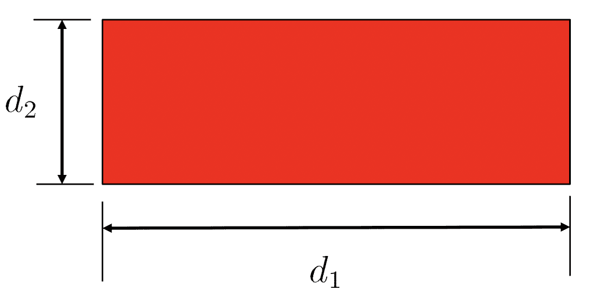
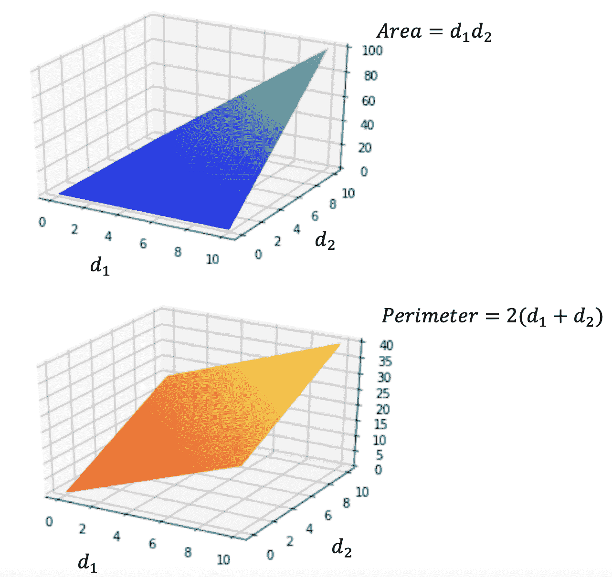
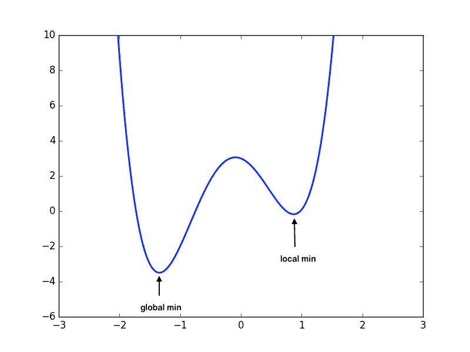
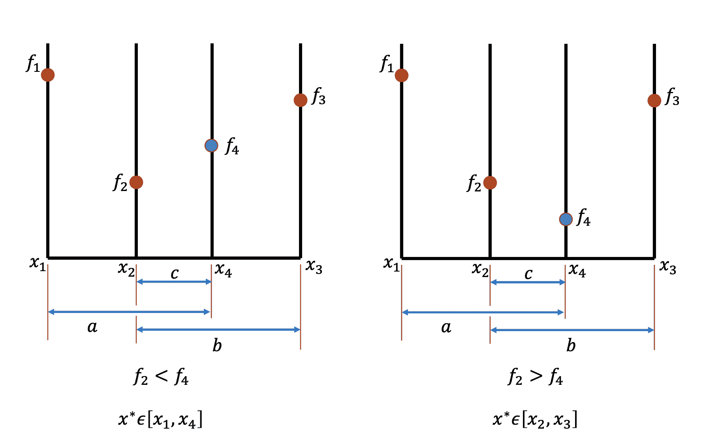
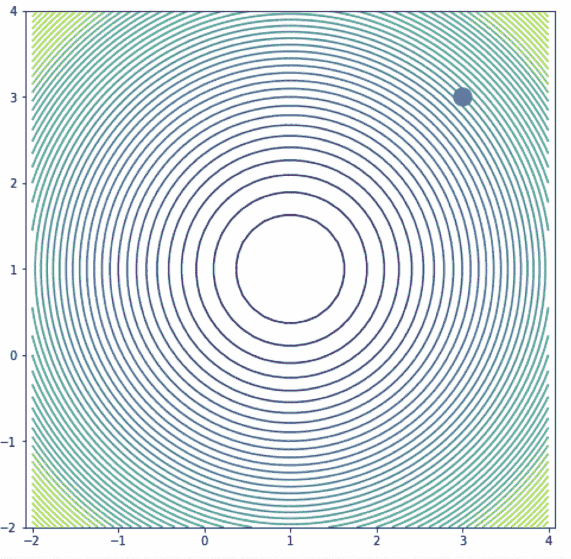

# 优化

> 原文：[`cs357.cs.illinois.edu/textbook/notes/optimization.html`](https://cs357.cs.illinois.edu/textbook/notes/optimization.html)

## 学习目标

+   识别优化的目标：寻找函数最小值的近似值

+   理解基本的优化方法

+   将问题设定为 *优化* 问题

+   理解一维优化的两种方法：*黄金分割搜索* 和 *牛顿法（一维）*

+   理解多维优化的两种方法：*最速下降法* 和 *牛顿法（多维）*

+   确定优化中的挑战

## 优化：寻找函数的最小值

优化的目标是找到函数定义域中的点，使得函数最小化。

考虑一个函数 $f:\;S\to \mathbb{R}$，其中 $S\subset\mathbb{R}^n$。如果 $\boldsymbol{x}^*\in S$ 是 $f$ 的最小值或最小化点，当且仅当 $f(\boldsymbol{x}^*)\leq f(\boldsymbol{x}) \, \forall x\in S$。

优化有两种类型：

+   无约束优化：找到 $\boldsymbol{x}^*$ 使得 $f(\boldsymbol{x}^*) = \underset{\boldsymbol{x}}{\mathrm{min}}\hspace{1mm}f(\boldsymbol{x})$

+   约束优化：找到 $\boldsymbol{x}^*$ 使得 $f(\boldsymbol{x}^*) = \underset{\boldsymbol{x}}{\mathrm{min}}\hspace{1mm}f(\boldsymbol{x})$

    $\hspace{2cm} \text{such that: } \boldsymbol{g}(\boldsymbol{x}) = 0 \hspace{5mm} \leftarrow \hspace{5mm} \text{\small “等式约束”}$ $\hspace{2cm} \text{and / or: } \boldsymbol{h}(\boldsymbol{x}) \leq 0 \hspace{5mm} \leftarrow \hspace{5mm} \text{\small “不等式约束”}$

    for some other functions $\boldsymbol{g}$ and/or $\boldsymbol{h}$.

注意，如果优化问题的定义域 $S$ 是无限的，则不一定存在解决方案。

在本主题的其余部分，我们试图找到一个函数的最小值。注意，如果我们想要一个函数 $\boldsymbol{f}$ 的最大化者 $\boldsymbol{y}^*$，使得 $f(\boldsymbol{y}^{*}) = \underset{\boldsymbol{y}}{\mathrm{max}}\hspace{1mm}f(\boldsymbol{y})$，我们可以通过解决最小化问题来找到最小化者 $\boldsymbol{x}^*$，其中 $\boldsymbol{x}^*$ 满足 $f(\boldsymbol{x}^*) = \underset{\boldsymbol{x}}{\mathrm{min}}(\hspace{1mm}-f(\boldsymbol{x}))$。

### 示例：微积分问题

给定 $d_1, d_2 \gt 0$，找到：

$$\boxed{ \begin{aligned} \underset{\boldsymbol{d \in \mathbb{R}²}}{\mathrm{max}}\hspace{1mm}f(d_1, d_2) &= d_1 \times d_2 \\ \text{\small such that} \quad g(d_1, d_2) &= 2(d_1+d_2) - 20 \leq 0 \end{aligned} }$$

注意到 $\underset{\boldsymbol{d \in \mathbb{R}²}}{\mathrm{max}}\hspace{1mm}f(d_1, d_2) = \underset{\boldsymbol{d \in \mathbb{R}²}}{\mathrm{min}}\hspace{1mm}(-f(d_1, d_2))$，因此我们可以解决以下优化问题：

$$\boxed{ \begin{aligned} \underset{\boldsymbol{d \in \mathbb{R}²}}{\mathrm{min}}\hspace{1mm}(-f(d_1, d_2)) &= -(d_1 \times d_2) \\ \text{\small such that} \quad g(d_1, d_2) &= 2(d_1+d_2) - 20 \leq 0 \end{aligned} }$$ 

**更多详情**

 实际上，这个问题是要求在周长约束（20）下最小化矩形的面积。下面的红色区域给出了一个示例：



下面是 $d_1$ 和 $d_2$ 之间面积和周长的关系的可视化：



## 局部最小值与全局最小值

考虑一个域 $S\subset\mathbb{R}^n$，以及 $f:S\to\mathbb{R}$。

+   **局部最小值**：如果对所有在 $\boldsymbol{x}^*$ 的某个邻域内的可行 $\boldsymbol{x}$，$\boldsymbol{x}^*$ 是一个**局部最小值**，则 $f(\boldsymbol{x}^*)\leq f(\boldsymbol{x})$。

+   **全局最小值**：如果对所有 $\boldsymbol{x}\in S$，$\boldsymbol{x}^*$ 是一个**全局最小值**，则 $f(\boldsymbol{x}^*)\leq f(\boldsymbol{x})$。

注意，找到局部最小值比找到全局最小值更容易。给定一个函数，在域上找到全局最小值是否存在本身就是一个非平凡的问题。因此，我们将限制自己寻找函数的局部最小值。

此外，请注意，一个函数可以总是有多个最小值。



## 解决一维优化问题的两种方法类型

首先，让我们了解一些解决一维优化问题的技术。

给定一个非线性、连续且光滑的函数 $f:\;\mathbb{R}\to \mathbb{R}$ 和优化问题 $f(\boldsymbol{x}^*) = \underset{\boldsymbol{x \in S}}{\mathrm{min}}\hspace{1mm}f(\boldsymbol{x})$，我们将在这个课程中介绍两种类型的方法：

+   无导数方法：只需在 $S$ 中的一组 $x \in S$ 上评估 $f(\boldsymbol{x})$。特别是，我们涵盖了**黄金分割搜索**方法。

+   二阶导数方法：需要评估 $f(\boldsymbol{x})$、$f'(\boldsymbol{x})$ 和 $f''(\boldsymbol{x})$，以及 $S$ 中的一组 $x \in S$。特别是，我们涵盖了**一维牛顿法**。

## 1-D 局部最小值的准则

在一维优化情况下，我们需要找到一个连续且光滑的函数 $f:\;\mathbb{R} \to \mathbb{R}$ 的最小值。回顾微积分，当 $f'(x^*) = 0$ 时，如果 $f''(x^*) < 0$，则得到一个局部最大值；如果 $f''(x^*) > 0$，则得到一个局部最小值。（注意，如果 $f''(x^*) = 0$，我们无法得出任何结论）。然后，我们可以通过获取一阶和二阶导数的值来判断点 $x^* \in S$ 是否是局部最小值（即找到 $\boldsymbol{x}^*$ 使得 $f(\boldsymbol{x}^*) = \underset{\boldsymbol{x}}{\mathrm{min}}\hspace{1mm}f(\boldsymbol{x})$）。具体来说，

1.  （一阶）必要条件：$f'(x^*) = 0$

1.  （二阶）充分条件：$f'(x^*) = 0$ 和 $f''(x^*) > 0$。

### 示例：一维优化问题

考虑函数 $f(x) = x³ - 6x² + 9x -6$。

我们如何找到它的局部最小值？


**答案**

一阶和二阶导数如下：$f'(x) = 3x²-12x+9$ $f''(x) = 6x-12$ 驻点如下表所示：

| ${x}$ | ${f'(x)}$ | ${f''(x)}$ | 特征 |
| --- | --- | --- | --- |
| 3 | 0 | $6$ | 局部最小值 |
| 1 | 0 | $-6$ | 局部最大值 |

从表中可以看出，$x=3$ 满足局部最小值的充分条件。

### 示例：找出 1-D 函数的所有驻点

考虑函数 $f(x) = \frac{x⁴}{4} - \frac{x³}{3} - 11x² + 40x$。

找到驻点并检查充分条件。


**答案**

$f$ 的梯度向量和 Hessian 矩阵如下：$f'(x) = \frac{4x³}{4} - \frac{3x²}{3} - 22x +40 = x³ - x² - 22x + 40$ $f''(x) = 3x² - 2x - 22$ 解 $f'(x) = 0$ 得到三个可能的解，即 $x_1 = -5, x_2 = 2, \text{和 }x_3 = 4$。

现在，观察以下：

(1) $f''(x_1) = 3 \times (-5)² - 2 \times (-5) - 22 \gt 0$ $\rightarrow$ $\bf{x_1 = -5}$ 是一个局部 $\textbf{最小值}$。

(2) $f''(x_2) = 3 \times (2)² - 2 \times 2 - 22 \lt 0$ $\rightarrow$ $\bf{x_2 = 2}$ 是一个局部 $\textbf{最大值}$。

(3) $f''(x_3) = 3 \times (4)² - 2 \times 4 - 22 \gt 0$ $\rightarrow$ $\bf{x_3 = 4}$ 是一个局部 $\textbf{最小值}$。

## 单峰函数

让我们考虑一个特殊的函数族，它使得优化任务更容易：

一个函数 $f:\mathbb{R}\to \mathbb{R}$ 在区间 $[a,b]$ 上是**单峰**的，如果这个函数在该区间 $[a,b]$ 上有一个唯一的（全局）最小值。

更严格地说，一个一维函数 $f: S\to\mathbb{R}$，如果在区间 $[a,b]$ 上存在唯一的 $\bf{x}^* \in [a, b]$ 使得 $f(\bf{x}^*)$ 是 $[a, b]$ 中的最小值，并且对于所有 $x_1, x_2 \in [a, b]$ 且 $x_1 \lt x_2$，以下两个性质成立，则称该函数在区间 $[a, b]$ 上是单峰的：

$$x_2 < x^*\Rightarrow f(x_1)>f(x_2)$$ $$x^* < x_1\Rightarrow f(x_1)<f(x_2)$$

区间上单峰函数的一些例子：

1.  $f(x) = x²$ 在区间 $[-1,1]$ 上是单峰的。

1.  $f(x) = \begin{cases} x, \text{ for } x \geq 0, \\ 0, \text{ for } x < 0 \end{cases}$ 在 $[-1,1]$ 上不是单峰的，因为全局最小值不是唯一的。这是一个凸函数但不是单峰函数的例子。

1.  $f(x) = \begin{cases} x, \text{ for } x > 0, \\ -100, \text{ for } x = 0,\\ 0 \text{ for } x < 0\end{cases}$ 在 $[-1,1]$ 上不是单峰的。它在 $x=0$ 处有一个唯一的最小值，但当你从 $-1$ 移动到 $0$ 时，它并不持续减少（即单调减少）。

1.  $f(x) = cos(x)$ 在区间 $[-\pi/2, 2\pi]$ 上不是单峰的，因为它在 $[-\pi/2, 0]$ 上是增加的。

为了简化，我们将考虑我们的目标函数是**单峰**的，因为它保证了我们有一个唯一的解来最小化问题。

注意到，给定一个单峰函数 $f$ 和一个域 $[a, b]$，我们可以将 $[a, b]$ 划分为 $[x_1, x_2, x_4, x_3]$，其中 $x_1 = a, x_3 = b$，且 $x_2 - x_1 = x_4 - x_2 = x_3 - x_4$。然后我们可以很容易地验证，如果 $f_2 = f(x_2) \lt f(x_4) = f_4$，则极小值 $x^* \in [x_1, x_4]$。同样，如果 $f_2 = f(x_2) \gt f(x_4) = f_4$，则极小值 $x^* \in [x_2, x_3]$。因此，我们可以递归地对较小的区间应用这种“划分”过程，直到收敛到最小值。请注意，这种方法与求根时的二分法类似。下面是这种想法的演示图：



然而，请注意，这种方法通常需要每迭代一次进行 2 次新的函数评估。让我们看看黄金分割搜索如何改进这个算法，使其每步只需要进行一次函数评估。

## 黄金分割搜索（一维）

受上述算法的启发，我们定义了一种用于寻找函数最小值的 *区间缩减* 方法。与二分法（用于求根）类似，我们在二分法中缩减区间，使得缩减后的区间始终包含根，在 *黄金分割搜索* 中，我们缩减区间，使得区间始终在我们的域中有一个唯一的极小值。

**算法用于寻找 $f: [a, b] \to \mathbb{R}$ 的最小值**：

我们的目标是引入“内部”点 $x_1$ 和 $x_2$，并将域缩减到 $[x_1, x_2]$ 以便：

1.  如果 $f(x_1) > f(x_2)$，则我们的新区间将是 $[x_1, b]$

1.  如果 $f(x_1) \leq f(x_2)$，则我们的新区间将是 $[a, x_2]$

由于我们不希望每步进行两次函数评估，我们需要确保在下一步：

+   如果输入域是 $[a, x_2]$，则重用 $x_1$ 作为 2 个新的“内部”点之一，因为它位于 $[a, x_2]$ 之间，并且 $f(x_1)$ 已经被评估过。

+   类似地，如果输入域是 $[x_1, b]$，则重用 $x_2$ 作为 2 个新的“内部”点之一，因为它位于 $[x_1, b]$ 之间，并且 $f(x_2)$ 已经被评估过。

设置 $h_0 = b - a$ 和 $h_1 = b - x_1 = x_2 - a$.

由于我们希望确保要检查的区间以一致的速度“缩小”，我们需要一个常数 $\tau$，使得 $h_1 = \tau h_0$（或者更一般地，对于所有 $k \in \mathbb{N}$，$h_{k+1} = \tau h_k$）。

由于我们希望“重用” $x_1$ 或 $x_2$，它必须满足 $\tau h_1 = (1 - \tau)h_0$（您可以使用上面的演示图来验证）。将 $h_1$ 替换为 $\tau h_0$，我们得到：

$$\tau \tau h_0 = (1 - \tau)h_0$$ $$\tau ² = (1 - \tau)$$ $$\bf{\tau} = \frac{\sqrt{5}-1}{2} \approx \textbf{0.618}$$

注意到：

$$x_1 = a + (1-\tau)(b-a)$$ $$x_2 = a + \tau(b-a)$$

由于每次缩减区间时都按固定因子进行，可以观察到该方法 **线性收敛**：

$$\lim_{k \to \infty} \frac{\vert e_{k+1} \vert}{\vert e_k \vert} = \tau \approx 0.618$$

数字 $\frac{\sqrt{5}-1}{2}$ 是“黄金比例”的倒数，因此这个算法被称为黄金分割搜索。

在黄金分割搜索中，我们不需要评估 $f(x)$ 的任何导数。在每次迭代中，我们需要 $f(x_1)$ 和 $f(x_2)$，其中 $x_1$ 或 $x_2$ 中的一个将与前一次迭代相同，因此每次迭代只需要额外评估 1 个函数（第一次迭代之后）。

### 示例：黄金分割搜索“区间长度”

考虑在一个单峰函数上运行黄金分割搜索。如果黄金分割搜索从初始区间 $[-10, 10]$ 开始，经过 1 次迭代后新区间的长度是多少？


**答案**

$(10 - (-10)) \times \tau \approx 12.36$

## 牛顿法（一维）

使用泰勒展开，我们可以将函数 $f$ 在 $x_0$ 处用二次函数来近似：

$$f(x) \approx f(x_0) + f'(x_0)(x - x_0) + \frac{1}{2}f''(x_0)(x - x_0)²$$

我们希望使用一阶必要条件找到二次函数的最小值：

$$f'(x) = 0 \Rightarrow f'(x_0) + f''(x_0)(x - x_0) = 0$$ $$h = (x - x_0) \Rightarrow h = \frac{-f'(x_0)}{f''(x_0)}$$

注意，这与牛顿法求解非线性方程 $f'(x) = 0$ 的步骤相同

我们知道，为了找到局部最小值，我们需要找到函数导数的根。受牛顿法求根的启发，我们定义如下迭代方案：

$$\bf{x_0} = \textbf{起始猜测}$$ $$\bf{x_{k+1}} = x_k - \frac{f'(x_k)}{f''(x_k)}$$

只要 $x_k$ 足够接近局部最小值，该方法通常**二次收敛**。换句话说，牛顿法具有局部收敛性，可能无法收敛，或者收敛到最大值或拐点。

对于一维优化中的牛顿法，我们需要评估 $f'(x_k)$ 和 $f''(x_k)$，因此每次迭代需要评估 2 个函数。

### 示例：一维牛顿法

考虑函数 $f(x) = 4x³ + 2x² + 5x + 40$。如果我们使用初始猜测 $x_0 = 2$，那么经过牛顿法一次迭代后 $x$ 的值是多少？


**答案**

要应用牛顿法优化的一步，我们使用迭代公式得到：$$ x_1 = x_0 - \frac{f'(x_0)}{f''(x_0)} $$ 给定函数 $ f(x) = 4x³ + 2x² + 5x + 40 $，其第一导数 $ f'(x) $ 为：$$ f'(x_0) = 12x² + 4x + 5 $$ 因此 $$ f'(2) = 12(2)² + 4(2) + 5 = 12(4) + 8 + 5 = 48 + 8 + 5 = 61 $$ 其第二导数 $ f''(x) $ 为：$$ f''(x) = 24x + 4 $$ 因此 $$ f''(x_0) = 24(2) + 4 = 48 + 4 = 52 $$ 最后，应用牛顿法公式：$$ x_1 = 2 - \frac{61}{52} \approx 0.827 $$

## 梯度和 Hessian 矩阵的定义

现在我们来修订一些在解决多维优化问题中有用的关键概念：

给定 $f:\mathbb{R}^n\to \mathbb{R}$，我们定义梯度函数 $\nabla f: \mathbb{R}^n\to\mathbb{R}^n$ 为：

$$\nabla f(\boldsymbol{x}) = \begin{bmatrix} \dfrac{\partial f}{\partial x_1} \\ \dfrac{\partial f}{\partial x_2} \\ \vdots \\ \dfrac{\partial f}{\partial x_n} \\ \end{bmatrix}$$

给定 $f:\mathbb{R}^n\to \mathbb{R}$，我们定义赫斯矩阵 ${\bf H}_f: \mathbb{R}^n\to\mathbb{R}^{n\times n}$ 为：

$${\bf H}_f(\boldsymbol{x}) = \begin{bmatrix} \dfrac{\partial² f}{\partial x_1²} & \dfrac{\partial² f}{\partial x_1 \partial x_2} & \ldots & \dfrac{\partial² f}{\partial x_1 \partial x_n} \\ \dfrac{\partial² f}{\partial x_2 \partial x_1} & \dfrac{\partial² f}{\partial x_2²} & \ldots & \dfrac{\partial² f}{\partial x_2 \partial x_n} \\ \vdots & \vdots & \ddots & \vdots \\ \dfrac{\partial² f}{\partial x_n \partial x_1} & \dfrac{\partial² f}{\partial x_n \partial x_2} & \ldots & \dfrac{\partial² f}{\partial x_n²} \end{bmatrix}$$

## 解决 N 维优化问题的两种方法

给定一个非线性、连续且光滑的函数 $f:\;\mathbb{R}^n\to \mathbb{R}$ 以及优化问题 $f(\boldsymbol{x}^*) = \underset{\boldsymbol{x \in S}}{\mathrm{min}}\hspace{1mm}f(\boldsymbol{x})$，本课程将介绍两种方法：

+   梯度（一阶导数）方法：需要评估 $f(\boldsymbol{x})$ 和 $\nabla f(\boldsymbol{x})$ 在集合 $x \in S$ 中的 $x$。特别是，我们将介绍**最速下降法**。

+   赫斯（二阶导数）方法：需要评估 $f(\boldsymbol{x})$、$\nabla f(\boldsymbol{x})$ 和 ${\nabla}² f(\boldsymbol{x})$ 以及集合 $x \in S$ 中的 $x$。特别是，我们将介绍**N 维牛顿法**。

其中：

$$\boldsymbol{x} = \begin{bmatrix}x_1, x_2, \ldots, x_n\end{bmatrix}$$ $$f(\boldsymbol{x}) = f(\begin{bmatrix}x_1, x_2, \ldots, x_n\end{bmatrix})$$ $$\nabla f(\boldsymbol{x}) = \text{\small gradient} (x) = \begin{bmatrix} \dfrac{\partial f}{\partial x_1} \\ \dfrac{\partial f}{\partial x_2} \\ \vdots \\ \dfrac{\partial f}{\partial x_n} \\ \end{bmatrix}$$ $${\nabla}² f(\boldsymbol{x}) = {\bf H}_f(\boldsymbol{x}) = \begin{bmatrix} \dfrac{\partial² f}{\partial x_1²} & \dfrac{\partial² f}{\partial x_1 \partial x_2} & \ldots & \dfrac{\partial² f}{\partial x_1 \partial x_n} \\ \dfrac{\partial² f}{\partial x_2 \partial x_1} & \dfrac{\partial² f}{\partial x_2²} & \ldots & \dfrac{\partial² f}{\partial x_2 \partial x_n} \\ \vdots & \vdots & \ddots & \vdots \\ \dfrac{\partial² f}{\partial x_n \partial x_1} & \dfrac{\partial² f}{\partial x_n \partial x_2} & \ldots & \dfrac{\partial² f}{\partial x_n²} \end{bmatrix}$$

## N 维局部最小值的判据

在 n 维优化问题中，我们需要找到一个连续且光滑的函数 $f:\;\mathbb{R}^n \to \mathbb{R}$ 的最小值。我们可以通过考虑梯度和赫 essian 矩阵的值来判断一个点 $x^* \in S$ 是否是局部最小值。注意，N-D 梯度等价于 1-D 导数，赫 essian 矩阵在零梯度点的性质如下：

| $ H_f(x^*) $ | $ H_f(x^*) $ 的特征值 | 临界点 $ x^* $ |
| --- | --- | --- |
| 正定 | 所有正值 | 最小值 |
| 负定 | 所有负值 | 最大值 |
| 不定 | 不定 | 鞍点 |

因此，以下是要找到 $\boldsymbol{x}^*$ 使得 $f(\boldsymbol{x}^*) = \underset{\boldsymbol{x}}{\mathrm{min}}\hspace{1mm}f(\boldsymbol{x})$ 的条件：

1.  必要条件：梯度 $\nabla f(\boldsymbol{x}^*) = \boldsymbol{0}$

1.  充分条件：梯度 $\nabla f(\boldsymbol{x}^*) = \boldsymbol{0}$ 且赫 essian 矩阵 $H_f(\boldsymbol{x^*})$ 是正定的。

### 示例：找到 N 维函数的所有驻点

考虑以下函数

$$f(x_1, x_2) = 2x_1³ + 4x_2² + 2x_2 - 24x_1$$

找到驻点并检查充分条件。


**答案**

梯度如下：$$ \nabla f(\boldsymbol{x}) = \text{\small gradient} (x) = \begin{bmatrix} 6x_1² - 24 \\ 8x_2 + 2 \\ \end{bmatrix} $$ 解方程 $\nabla f = 0 \text{ 得到 }6x_1² - 24 = 0\text{ 和 }8x_2 + 2 = 0\text{，因此 }x_1 = \pm 2 \text{ 和 } x_2 = -0.25$.

赫 essian 矩阵如下：$$ {\bf H}\_f(\boldsymbol{x}) = \begin{bmatrix} 12x_1 & 0\\ 0 & 8 \\ \end{bmatrix} $$ $\textbf{情况 1：}$

$$ x^_ = \begin{bmatrix} 2 \\ -0.25 \\ \end{bmatrix} \rightarrow {\bf H}\_f = \begin{bmatrix} 24 & 0 \\ 0 & 8 \\ \end{bmatrix} $$ 赫 essian 矩阵是正定的（只包含正特征值），因此 $x^_ = \begin{bmatrix} 2 \\ -0.25 \\ \end{bmatrix}$ 是一个 $\textbf{局部最小值}$。

$\textbf{情况 2：}$

$$ x^_ = \begin{bmatrix} -2 \\ -0.25 \\ \end{bmatrix} \rightarrow {\bf H}\_f = \begin{bmatrix} -24 & 0 \\ 0 & 8 \\ \end{bmatrix} $$ 赫 essian 矩阵是不定的，因此 $x^_ = \begin{bmatrix} 2 \\ -0.25 \\ \end{bmatrix}$ 是一个 $\textbf{鞍点}$。

## 最陡下降（N-D）

可微函数 $f: \mathbb{R}^n\to\mathbb{R}$ 的负梯度指向下坡（即指向域内具有较低值的点）。换句话说，给定一个函数 $f:\mathbb{R}^n\to \mathbb{R}$ 在点 $\bf{x}$，函数将在“最陡下降”方向 $\bf{-\nabla f}$ 上减小其值。

这提示我们在寻找最小值的过程中沿着 $-\nabla f$ 的方向移动，直到我们达到 $\nabla f(\boldsymbol{x}) = \boldsymbol{0}$ 的点。严格地说，对于任意点 $\boldsymbol{x}$，方向“$-\nabla f(\boldsymbol{x})$”被称为最速下降方向。如果我们以迭代方法解决这个问题，那么在第 $\bf{k^{th}}$ 次迭代中，我们定义当前近似 $\boldsymbol{x_k}$ 的当前最速下降方向：

$$\boldsymbol{s_{k}} = -\nabla f(\boldsymbol{x_k})$$

我们知道我们需要移动的方向以接近最小值，但我们仍然不知道我们需要移动多少距离才能接近最小值。我们需要在最速下降方向中进行“线性搜索”。如果 $\boldsymbol{x_k}$ 是我们之前的位置，那么我们通过将其移动到负梯度的方向来选择下一个猜测：

$$\boldsymbol{x_{k+1}} = \boldsymbol{x_k} + \alpha(-\nabla f(\boldsymbol{x_k})).$$

下一个问题将是找到 $\boldsymbol{\alpha}$，我们使用一维优化算法来找到所需的 $\boldsymbol{\alpha}$。对于当前的 $\boldsymbol{x_k}$，以下方程定义了 $\boldsymbol{\alpha_k}$，这是将 $\boldsymbol{x_{k+1}}$ 带到线性搜索中的最小点的最优 $\boldsymbol{\alpha}$ 选择：

$$\boldsymbol{\alpha_k} = \underset{\alpha}{\mathrm{argmin}}\left( f\left(\boldsymbol{x_k} + \alpha \boldsymbol{s_k}\right)\right)$$

因此，在每次迭代中我们计算：

$$\bf{x_{k+1} = x_k + \alpha _k s_k}$$

最速下降算法可以形式化为：

+   初始猜测：$\bf{x_0}$

+   评估最速下降：$\bf{s_k = -\nabla f(x_k)}$

+   执行线性搜索以获得 $\alpha _k$（例如，黄金分割搜索）：$\alpha_k = \underset{\alpha}{\mathrm{argmin}} f(\bf{x_k} + \alpha \bf{s_k})$

+   更新：$\bf{x_{k+1} = x_k + \alpha _k s_k}$

通常，*最速下降*方法**线性收敛**。

将此算法翻译成 Python：

```py
import numpy.linalg as la
import scipy.optimize as opt
import numpy as np

def obj_func(alpha, x, s):
    # code for computing the objective function at (x+alpha*s)
    return f_of_x_plus_alpha_s

def gradient(x):
    # code for computing gradient
    return grad_x

def steepest_descent(x_init):
    x_new = x_init
    x_prev = np.random.randn(x_init.shape[0])
    while(la.norm(x_prev - x_new) > 1e-6):
        x_prev = x_new
        s = -gradient(x_prev)
        alpha = opt.minimize_scalar(obj_func, args=(x_prev, s)).x
        x_new = x_prev + alpha*s

    return x_new 
```

侧记：观察 $x_{k+1} = \bf{x_k} - \alpha _k \nabla f(x_k)$，因此 $\frac{dx_{k+1}}{d\alpha} = -\nabla f(x_k)$。由于 $\alpha_k = \underset{\alpha}{\mathrm{argmin}} f(\bf{x_k} + \alpha \bf{s_k})$，线性搜索的一个必要条件是 $\frac{df}{d\alpha} = 0$。然后根据链式法则：

$$\frac{df}{d\alpha} = \frac{df}{dx_{k+1}}\frac{dx_{k+1}}{d\alpha} = -\nabla f(x_{k+1})^T \nabla f(x_k) = 0$$

因此 $\nabla f(x_{k+1})$ 与 $\nabla f(x_k)$ 正交。

### 示例：最速下降方向

考虑函数 $f(x_1, x_2) = 10(x_1)³ - (x_2)² + x_1 - 1$。在起始猜测 $x_1 = 2, x_2 = 2$ 时，最速下降方向是什么？


**答案**

$$ -\nabla f(\begin{bmatrix} x_1 \\ x_2 \end{bmatrix}) = - \begin{bmatrix} 30x_1² + 1 \\ -2x_2 \end{bmatrix} $$ $$ -\nabla f(\begin{bmatrix} 2 \\ 2 \end{bmatrix}) = - \begin{bmatrix} 30 \times 4 + 1 \\ -2 \times 2 \end{bmatrix} = \begin{bmatrix} -121 \\ 4 \end{bmatrix} $$

### 示例：最速下降迭代

考虑函数 $f(x_1, x_2) = (x_1 - 1)² + (x_2 - 1)²$。在起始猜测 $y_0 = \begin{bmatrix} 3 \\ 3 \end{bmatrix}^T$ 处的最速下降方向是什么？如果我们选择 $\alpha_0 = 1$，$y_1$ 将会是什么？


**答案**

$$ y_1 = y_0 - \alpha_0 \nabla f(x_0) $$ $$ -\nabla f(x) = - \begin{bmatrix} 2(y_1 - 1) \\ 2(y_2 - 1) \end{bmatrix} = \begin{bmatrix} -4 \\ -4 \end{bmatrix} $$ $$ y_1 = - \begin{bmatrix} 3 \\ 3 \end{bmatrix} + 1 \times \begin{bmatrix} -4 \\ -4 \end{bmatrix} = \begin{bmatrix} -1 \\ -1 \end{bmatrix} $$

### 示例：步长大小

考虑相同的函数 $f(x_1, x_2) = (x_1 - 1)² + (x_2 - 1)²$ 和初始猜测 $y_0 = \begin{bmatrix} 3 \\ 3 \end{bmatrix}^T$。现在给出了这个函数的等高线图可视化。$\alpha$的理想选择是什么？



**答案**

从等高线图中观察，$f$ 在 $\begin{bmatrix} 1 \\ 1 \end{bmatrix}$ 处有一个局部最小值。回忆一下上一个问题，$\nabla f(\bf{y_0}) = \begin{bmatrix} -4 \\ -4 \end{bmatrix}$

很明显，当 $\alpha = 0.5$ 时，$$ \bf{y_1} = \begin{bmatrix} 3 \\ 3 \end{bmatrix} - 0.5 \times \begin{bmatrix} 4 \\ 4 \end{bmatrix} = \begin{bmatrix} 1 \\ 1 \end{bmatrix} $$ 因此，当 $\bf{\alpha = 0.5}$ 时，最速下降算法在恰好 1 次迭代后收敛到最小值。

## 牛顿法（N 维）

$n$ 维牛顿法与 $n$ 维根查找的牛顿法类似，只是我们将 $n$ 维函数替换为梯度，将雅可比矩阵替换为海森矩阵。我们可以通过考虑函数的泰勒展开来得到结果。

$$f(\boldsymbol{x}+s) \approx f(\boldsymbol{x}) + \nabla f(\boldsymbol{x})^Ts + \frac{1}{2}s^T {\bf H}_f(\boldsymbol{x})s = \hat{f}(s)$$

我们求解 $\nabla \hat{f}(\boldsymbol{s}) = \boldsymbol{0}$ 对于 $\boldsymbol{s}$。因此，方程可以翻译为：

$$\nabla f(\boldsymbol{x}) + \frac{1}{2}\cdot 2 {\bf H}_f(\boldsymbol{x})s = 0$$ $${\bf H}_f(\boldsymbol{x})\boldsymbol{s} = -\nabla f(\boldsymbol{x})$$

这变成了一组线性方程，我们需要求解牛顿步 $\boldsymbol{s}$。

优化中 N 维牛顿法的步骤可以形式化描述如下：

+   初始猜测：$\boldsymbol{x_0}$

+   求解：${\bf H}_f(\boldsymbol{x_k})\boldsymbol{s_k} = -\nabla f(\boldsymbol{x_k})$

+   更新：$\bf{x_{k+1}} = \bf{x_k} + \bf{s_k}$

注意，Hessian 与曲率有关，因此包含有关步长应该多大的信息。

该算法的一些性质：

+   在正常情况下，具有二次收敛性。

+   需要二阶导数 L。

+   局部收敛（需要起始猜测接近解）。

+   当 Hessian 矩阵接近不定时，表现不佳。

+   每次迭代的成本：$O(n³)$。

该算法可以表示为以下 Python 函数：

```py
import numpy as np
import numpy.linalg as la

def hessian(x):
    # Computes the hessian matrix corresponding the given objective function
    return hessian_matrix_at_x

def gradient(x):
    # Computes the gradient vector corresponding the given objective function
    return gradient_vector_at_x

def newtons_method(x_init):
    x_new = x_init
    x_prev = np.random.randn(x_init.shape[0])
    while(la.norm(x_prev-x_new)>1e-6):
        x_prev = x_new
        s = -la.solve(hessian(x_prev), gradient(x_prev))
        x_new = x_prev + s
    return x_new 
```

### 示例：N 维优化中牛顿法的单步

要找到函数 $f(x, y) = 3x² +2y²$ 的最小值，牛顿法的一步表达式是什么？


**答案**

函数 $ f(x, y) $ 的梯度由以下给出：$$ \nabla f(x, y) = \begin{bmatrix} \frac{\partial f}{\partial x} \\ \frac{\partial f}{\partial y} \end{bmatrix} $$ 并且函数 $ f(x, y) $ 的 Hessian 矩阵由以下给出：$$ H_f(x, y) = \begin{bmatrix} \frac{\partial² f}{\partial x²} & \frac{\partial² f}{\partial x \partial y} \\ \frac{\partial² f}{\partial y \partial x} & \frac{\partial² f}{\partial y²} \end{bmatrix} $$ N 维优化的牛顿算法的求解步骤为：$$ H*f(x_k, y_k)\boldsymbol{s_k} = -\nabla f(x*{k}, y\_{k})$$ 这在数学上等同于：$${\bf{s_k}} = - H_f(x_k, y_k)^{-1} \nabla f(x_k, y_k) $$ 因此，N 维优化的牛顿算法的更新步骤为：$$ \begin{bmatrix} x*{k+1} \\ y*{k+1} \end{bmatrix} = \begin{bmatrix} x_k \\ y_k \end{bmatrix} - H_f(x_k, y_k)^{-1} \nabla f(x_k, y_k) $$ 给定函数 $ f(x, y) = 3x² + 2y² $，其梯度 $ \nabla f(x_k, y_k) $ 和 Hessian 矩阵 $ H_f(x_k, y_k) $ 为：$$ \nabla f(x_k, y_k) = \begin{bmatrix} \frac{\partial f}{\partial x_k} \\ \frac{\partial f}{\partial y_k} \end{bmatrix} = \begin{bmatrix} 6x_k \\ 4y_k \end{bmatrix} $$ $$ H_f(x_k, y_k) = \begin{bmatrix} \frac{\partial² f}{\partial {x_k}²} & \frac{\partial² f}{\partial x_k \partial y_k} \\ \frac{\partial² f}{\partial y_k \partial x_k} & \frac{\partial² f}{\partial {y_k}²} \end{bmatrix} = \begin{bmatrix} 6 & 0 \\ 0 & 4 \end{bmatrix} $$ 因此，答案是：$$ \begin{bmatrix} x*{k+1} \\ y*{k+1} \end{bmatrix} = \begin{bmatrix} x_k \\ y_k \end{bmatrix} - {\begin{bmatrix} 6 & 0 \\ 0 & 4 \end{bmatrix}}^{-1} \begin{bmatrix} 6x_k \\ 4y_k \end{bmatrix} $$

### 示例：N 维优化中牛顿法的收敛性

当使用牛顿法寻找函数 $f(x, y) = 0.5x² +2.5y²$ 的最小值时，估计收敛所需的迭代次数？


**答案**

答案：$\textbf{1}$。

原因：注意到 N 维优化中的牛顿法是从截断到二次项的泰勒级数推导出来的（即，$\frac{1}{2}s^T {\bf H}\_f(\boldsymbol{x})s$)。这意味着它对二次函数是准确的。

## 复习问题

1.  一维中，一个点成为局部最小值的必要和充分条件是什么？

1.  在 ${n}$ 维度中，一个点成为局部最小值的必要和充分条件是什么？

1.  如何将极值分类为最小值、最大值或鞍点？

1.  局部最小值和全局最小值之间有什么区别？

1.  函数单峰意味着什么？

1.  函数需要具备哪些特殊属性，才能使黄金分割搜索找到最小值？

1.  执行一次黄金分割搜索的迭代。

1.  计算函数的梯度（函数有多个输入，一个输出）

1.  计算函数的雅可比矩阵（函数有多个输入，多个输出）。

1.  计算函数的海森矩阵。

1.  在最速下降/梯度下降中找到搜索方向。

1.  为什么梯度下降的每一步都必须执行线搜索？

1.  在一维中执行牛顿法的一次迭代。

1.  在 ${n}$ 维度中执行牛顿法的一次迭代。

1.  牛顿法何时无法收敛到最小值？

1.  黄金分割搜索每次迭代需要执行哪些操作？

1.  在一维中，牛顿法每次迭代需要执行哪些操作？

1.  在 ${n}$ 维度中，牛顿法每次迭代需要执行哪些操作？

1.  牛顿法的收敛速度是多少？

## 更新日志

+   2025 年 11 月 12 日：Dev Singh (dsingh14) — 修复代码片段

+   2024 年 10 月 31 日：Dev Singh (dsingh14) — 修复梯度计算

+   2024 年 3 月 17 日：Kaiyao Ke (kaiyaok2) — 调整笔记顺序

+   

查看剩余条目


    +   2024 年 3 月 1 日：Kaiyao Ke (kaiyaok2) — 将笔记与幻灯片对齐，添加示例并重构现有笔记

    +   2020 年 8 月 8 日：Jerry Yang (jiayiy7) — 添加单峰示例

    +   2020 年 4 月 26 日：Mariana Silva (mfsilva) — 小幅度文本修订

    +   2018 年 4 月 25 日：Adam Stewart (adamjs5) — 修复 `newtons_method` 中缺失的括号

    +   2017 年 11 月 25 日：Adam Stewart (adamjs5) — 修复海森矩阵中缺失的偏导数

    +   2017 年 11 月 20 日：Erin Carrier (ecarrie2) — 删除 Gauss-Newton/LM，全文小幅度修改和调整

    +   2017 年 11 月 20 日：Nate Bowman (nlbowma2) — 添加复习问题

    +   2017 年 11 月 20 日：Kaushik Kulkarni (kgk2) — 修复表格格式

    +   2017 年 10 月 25 日：Arun Lakshmanan (lakshma2) — 第一份完整草案

    +   2017 年 10 月 25 日：Kaushik Kulkarni (kgk2) — 第一份完整草案

    +   2017 年 10 月 17 日：Luke Olson (lukeo) — 概述

## 作者

+   CS 357 课程工作人员
