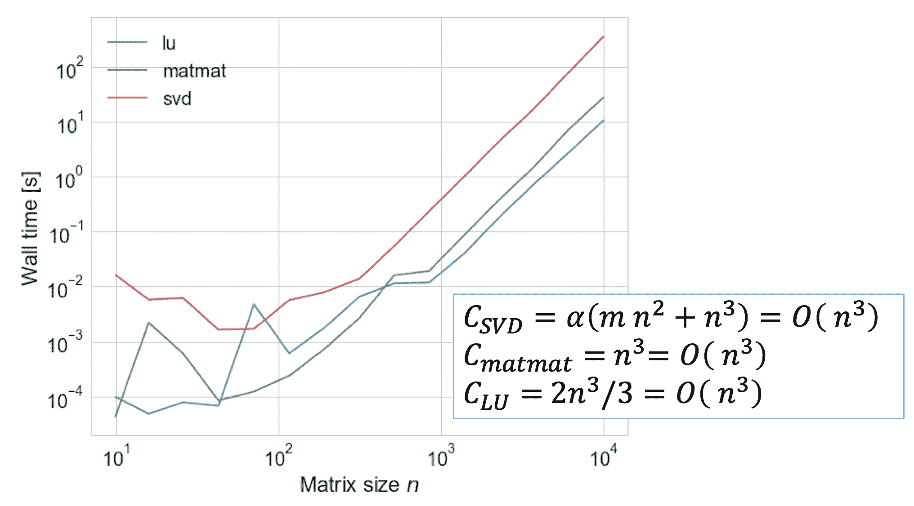
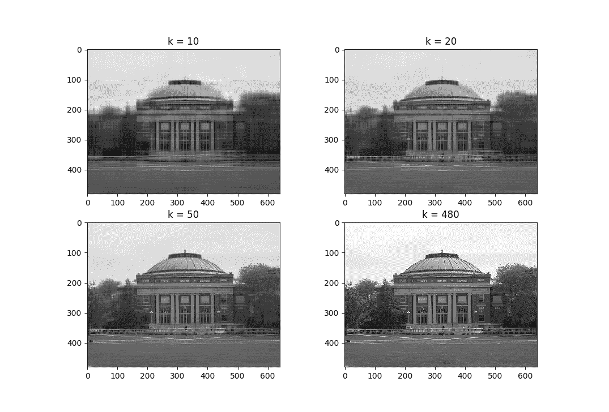

# 奇异值分解 (SVD)

> [`cs357.cs.illinois.edu/textbook/notes/svd.html`](https://cs357.cs.illinois.edu/textbook/notes/svd.html)

## 学习目标

+   构建矩阵的奇异值分解

+   识别奇异值分解的各个部分

+   使用奇异值分解解决问题

## 概述

在之前，我们探索了一类方向由矩阵保持不变的向量。我们发现，对于任何 **方阵**，如果存在 $n$ 个线性无关的特征向量，我们就可以将 $\bf A$ 对角化为 $\bf{AX = XD}$ 的形式，其中 $\bf X$ 是 $\mathbb{R}^n$ 的一个基，其中 $\bf{Ax_i = \lambda_ix_i}$。

对于 **任何** $m \times n$ 矩阵，都存在一个形式为 $\bf{AV = U{\Sigma}}$ 或 $\bf{A=U{\Sigma}V^T}$ 的奇异值分解。为了得到这种组合，我们需要 $\bf U$ 作为 $\mathbb{R}^m$ 的正交基，$\bf V$ 作为 $\mathbb{R}^n$ 的正交基，$\bf{\Sigma}$ 作为 $m \times n$ 的对角矩阵，其中 $\bf{Av_i = \sigma_iu_i}$。

+   $\bf U$ 由 $\bf{AA^T}$ 的特征向量作为其列组成。

+   $\bf V$ 由 $\bf{A^TA}$ 的特征向量作为其列组成。

+   $\bf \Sigma$ 是一个对角矩阵，由 $\bf{A^TA}$（或 $\bf{AA^T}$）的特征值的平方根组成，称为奇异值。

    +   $\bf{A^TA}$ 和 $\bf{AA^T}$ 有相同的正特征值，因此特征值的平方根也是相同的。1

+   $\bf \Sigma$ 的对角线按非递增的奇异值排序，而 $\bf U$ 和 $\bf V$ 的列分别按顺序排列。

此外，我们定义一个简化的形式：${\bf A} = {\bf U_{R}} {\bf \Sigma_{R}} {\bf V_R}^T$，其中 ${\bf U_R}$ 是一个 $m \times k$ 矩阵，${\bf V_R}$ 是一个 $n \times k$ 矩阵，${\bf \Sigma_{R}}$ 是一个 $k \times k$ 的对角矩阵。在这里，$k = \min(m,n)$。

这些命题的证明如下：

## 奇异值分解

一个 $m \times n$ 的实矩阵 ${\bf A}$ 有如下形式的奇异值分解

$${\bf A} = {\bf U} {\bf \Sigma} {\bf V}^T$$

其中 ${\bf U}$ 是一个 $m \times m$ 的正交矩阵，${\bf V}$ 是一个 $n \times n$ 的正交矩阵，${\bf \Sigma}$ 是一个 $m \times n$ 的对角矩阵。具体来说，

+   ${\bf U}$ 是一个 $m \times m$ 的正交矩阵，其列是 ${\bf A} {\bf A}^T$ 的特征向量，称为 ${\bf A}$ 的 **左奇异向量**。

$$\mathbf{A}\mathbf{A}^T = ({\bf U} {\bf \Sigma} {\bf V}^T)({\bf U} {\bf \Sigma} {\bf V}^T)^T$$ $$\hspace{2cm} ({\bf U} {\bf \Sigma} {\bf V}^T) ({\bf V}^T)^T {\bf \Sigma}^T {\bf U}^T = {\bf U} {\bf \Sigma} ({\bf V}^T {\bf V}) {\bf \Sigma}^T {\bf U}^T = {\bf U} ({\bf \Sigma} {\bf \Sigma}^T) {\bf U}^T$$

因此，$\bf{AA^T=U\Sigma²U^T}$，这是一个对角化，其中 $\bf U$ 的列是线性无关的。

+   ${\bf V}$ 是一个 $n \times n$ 的正交矩阵，其列是 ${\bf A}^T {\bf A}$ 的特征向量，称为 ${\bf A}$ 的 **右奇异向量**。

$$\mathbf{A}^T\mathbf{A} = ({\bf U} {\bf \Sigma} {\bf V}^T)^T ({\bf U} {\bf \Sigma} {\bf V}^T)$$ $$= {\bf V} ({\bf \Sigma}^T {\bf \Sigma}) {\bf V}^T$$

因此，$\bf{A^TA=V\Sigma²V^T}$，这是一个对角化，其中 V 的列是线性无关的。

+   ${\bf \Sigma}$ 是一个 $m \times n$ 的对角矩阵，由 $A^TA$ 的特征值的平方根组成，形式如下：

$$\begin{eqnarray} {\bf \Sigma} = \begin{bmatrix} \sigma_1 & & \\ & \ddots & \\ & & \sigma_s \\ 0 & & 0 \\ \vdots & \ddots & \vdots \\ 0 & & 0 \end{bmatrix} \text{当 } m > n, \; \text{且} \; {\bf \Sigma} = \begin{bmatrix} \sigma_1 & & & 0 & \dots & 0 \\ & \ddots & & & \ddots &\\ & & \sigma_s & 0 & \dots & 0 \\ \end{bmatrix} \text{当} \, m < n. \end{eqnarray}$$

其中 $k = \min(m,n)$ 且 $\sigma_1 \ge \sigma_2 \dots \ge \sigma_s \ge 0$。对角线元素被称为 ${\bf A}$ 的**奇异值**。

#### 获取奇异值

注意到矩阵 $\bf{A^TA}$ 和 $\bf{AA^T}$ 总是具有相同的非零特征值。此外，它们都是正半定矩阵（定义：$\mathbf{x^{T}Bx} \geq 0 \quad \forall \mathbf{x} \neq 0$)。由于正半定矩阵的特征值总是非负的，**奇异值总是非负的**。

如果 $\mathbf{A}^T\mathbf{x} \ne 0$，那么 $\mathbf{A}^T\mathbf{A}$ 和 $\mathbf{A}\mathbf{A}^T$ 都具有相同的特征值：

$$\mathbf{A}\mathbf{A}^T\mathbf{x} = \lambda \mathbf{x}$$ $$\mathbf{A}^T\mathbf{A}\mathbf{A}^T\mathbf{x} = \mathbf{A}^T \lambda \mathbf{x}$$ $$\mathbf{A}^T\mathbf{A}(\mathbf{A}^T\mathbf{x}) = \lambda (\mathbf{A}^T\mathbf{x})$$

## 时间复杂度

计算任意 $m \times n$ 矩阵的奇异值分解的时间复杂度是 $\alpha (m²n + n³)$，其中常数 $\alpha$ 的范围从 4 到 10（或更多），具体取决于算法。

通常，我们可以将成本定义为：$\mathcal{O}(m²n + n³)$

## 降秩奇异值分解

非方阵 ${\bf A}$（大小为 $m \times n$）的奇异值分解可以用降秩格式表示：

+   对于 $m \ge n$：${\bf U}$ 是 $m \times n$，${\bf \Sigma}$ 是 $n \times n$，${\bf V}$ 是 $n \times n$

+   对于 $m \le n$：${\bf U}$ 是 $m \times m$，${\bf \Sigma}$ 是 $m \times m$，${\bf V}$ 是 $n \times m$（注意如果 ${\bf V}$ 是 $n \times m$，那么 ${\bf V}^T$ 是 $m \times n$）

以下图展示了降秩奇异值分解（红色）与完整奇异值分解（灰色）的对比。

通常，我们将降秩奇异值分解表示为：

$${\bf A} = {\bf U}_R {\bf \Sigma}_R {\bf V}_R^T$$

其中 ${\bf U}_R$ 是一个 $m \times k$ 矩阵，${\bf V}_R$ 是一个 $n \times k$ 矩阵，${\bf \Sigma}_R$ 是一个 $k \times k$ 矩阵，且 $k = \min(m,n)$。

## 示例：计算奇异值分解

我们从以下非方阵 ${\bf A}$ 开始

$$ {\bf A} = \left[ \begin{array}{ccc} 3 & 2 & 3 \\ 8 & 8 & 2 \\ 8 & 7 & 4 \\ 1 & 8 & 7 \\ 6 & 4 & 7 \\ \end{array} \right] $$

我们将计算 SVD 的缩减形式（这里 $s = 3$）：

(1) 计算 ${\bf A}^T {\bf A}$：

$${\bf A}^T {\bf A} = \left[ \begin{array}{ccc} 174 & 158 & 106 \\ 158 & 197 & 134 \\ 106 & 134 & 127 \\ \end{array} \right]$$

(2) 计算 ${\bf A}^T {\bf A}$ 的特征向量和特征值：

$$\lambda_1 = 437.479, \quad \lambda_2 = 42.6444, \quad \lambda_3 = 17.8766, \\ \boldsymbol{v}_1 = \begin{bmatrix} 0.585051 \\ 0.652648 \\ 0.481418\end{bmatrix}, \quad \boldsymbol{v}_2 = \begin{bmatrix} -0.710399 \\ 0.126068 \\ 0.692415 \end{bmatrix}, \quad \boldsymbol{v}_3 = \begin{bmatrix} 0.391212 \\ -0.747098 \\ 0.537398 \end{bmatrix}$$

(3) 从 ${\bf A}^T {\bf A}$ 的特征向量构造 ${\bf V}_R$：

$$ {\bf V}_R = \left[ \begin{array}{ccc} 0.585051 & -0.710399 & 0.391212 \\ 0.652648 & 0.126068 & -0.747098 \\ 0.481418 & 0.692415 & 0.537398 \\ \end{array} \right]. $$

(4) 从 ${\bf A}^T {\bf A}$ 的特征值平方根构造 ${\bf \Sigma}_R$：

$$ {\bf \Sigma}_R = \begin{bmatrix} 20.916 & 0 & 0 \\ 0 & 6.53207 & 0 \\ 0 & 0 & 4.22807 \end{bmatrix} $$

(5) 通过解 ${\bf U}{\bf\Sigma} = {\bf A}{\bf V}$ 来找到 ${\bf U}$。对于我们的缩减情况，我们可以找到 ${\bf U}_R = {\bf A}{\bf V}_R {\bf \Sigma}_R^{-1}$。您也可以通过计算 ${\bf AA}^T$ 的特征向量来找到 ${\bf U}$。

$${\bf U} = \overbrace{\left[ \begin{array}{ccc} 3 & 2 & 3 \\ 8 & 8 & 2 \\ 8 & 7 & 4 \\ 1 & 8 & 7 \\ 6 & 4 & 7 \\ \end{array} \right]}^{A} \overbrace{\left[ \begin{array}{ccc} 0.585051 & -0.710399 & 0.391212 \\ 0.652648 & 0.126068 & -0.747098 \\ 0.481418 & 0.692415 & 0.537398 \\ \end{array} \right]}^{V} \overbrace{\left[ \begin{array}{ccc} 0.047810 & 0.0 & 0.0 \\ 0.0 & 0.153133 & 0.0 \\ 0.0 & 0.0 & 0.236515 \\ \end{array} \right]}^{\Sigma^{-1}}$$ $${\bf U} = \left[ \begin{array}{ccc} 0.215371 & 0.030348 & 0.305490 \\ 0.519432 & -0.503779 & -0.419173 \\ 0.534262 & -0.311021 & 0.011730 \\ 0.438715 & 0.787878 & -0.431352\\ 0.453759 & 0.166729 & 0.738082\\ \end{array} \right]$$

我们得到了矩阵 ${\bf A}$ 的以下奇异值分解：

$$ \overbrace{\left[ \begin{array}{ccc} 3 & 2 & 3 \\ 8 & 8 & 2 \\ 8 & 7 & 4 \\ 1 & 8 & 7 \\ 6 & 4 & 7 \\ \end{array} \right]}^{A} = \overbrace{\left[ \begin{array}{ccc} 0.215371 & 0.030348 & 0.305490 \\ 0.519432 & -0.503779 & -0.419173 \\ 0.534262 & -0.311021 & 0.011730 \\ 0.438715 & 0.787878 & -0.431352\\ 0.453759 & 0.166729 & 0.738082\\ \end{array} \right]}^{U} \overbrace{\left[ \begin{array}{ccc} 20.916 & 0 & 0 \\ 0 & 6.53207 & 0 \\ 0 & 0 & 4.22807 \\ \end{array} \right]}^{\Sigma} \overbrace{\left[ \begin{array}{ccc} 0.585051 & 0.652648 & 0.481418 \\ -0.710399 & 0.126068 & 0.692415\\ 0.391212 & -0.747098 & 0.537398\\ \end{array} \right]}^{V^T} $$

回想一下，我们在这里计算了 *缩减的* SVD 分解（即 ${\bf \Sigma}$ 是方阵，${\bf U}$ 是非方阵）。

## 矩阵的秩、零空间和值域

假设 ${\bf A}$ 是一个 $m \times n$ 的矩阵，其中 $m > n$（不失一般性）：

$${\bf A}= {\bf U\Sigma V}^{T} = \begin{bmatrix}\vert & & \vert & & \vert \\ \vert & & \vert & & \vert \\ {\bf u}_1 & \cdots & {\bf u}_n & \cdots & {\bf u}_m\\ \vert & & \vert & & \vert \\\vert & & \vert & & \vert \end{bmatrix} \begin{bmatrix} \sigma_1 & & \\ & \ddots & \\ & & \sigma_n \\ & \vdots & \\ -& 0& -\end{bmatrix} \begin{bmatrix} - & {\bf v}_1^T & - \\ & \vdots & \\ - & {\bf v}_n^T & - \end{bmatrix}$$

我们可以将上述内容重新写为：

$${\bf A} = \begin{bmatrix}\vert & & \vert \\ \vert & & \vert \\ {\bf u}_1 & \cdots & {\bf u}_n \\ \vert & & \vert \\ \vert & & \vert \end{bmatrix} \begin{bmatrix} - & \sigma_1 {\bf v}_1^T & - \\ & \vdots & \\ - & \sigma_n{\bf v}_n^T & - \end{bmatrix}$$

此外，两个矩阵的乘积可以写成外积的和：

$${\bf A} = \sigma_1 {\bf u}_1 {\bf v}_1^T + \sigma_2 {\bf u}_2 {\bf v}_2^T + ... + \sigma_n {\bf u}_n {\bf v}_n^T$$

对于一个一般的矩形矩阵，我们有：

$${\bf A} = \sum_{i=1}^{s} \sigma_i {\bf u}_i {\bf v}_i^T$$

其中 $s = \min(m,n)$.

如果 ${\bf A}$ 有 $s$ 个非零奇异值，则矩阵是满秩的，即 $\text{rank}({\bf A}) = s$.

如果 ${\bf A}$ 有 $r$ 个非零奇异值，且 $r < s$，则矩阵是秩不足的，即 $\text{rank}({\bf A}) = r$.

换句话说，${\bf A}$ 的秩等于非零奇异值的数量，这与 ${\bf \Sigma}$ 中非零对角元素的数量相同。

四舍五入误差可能导致秩不足矩阵中出现小但非零的奇异值。小于给定容差的奇异值被认为是数值上等同于零的，这定义了有时被称为有效秩的概念。

与 ${\bf A}$ 的奇异值消失对应的右奇异向量（${\bf V}$ 的列）张成了 ${\bf A}$ 的零空间，即 null(${\bf A}$) = span{${\bf v}_{r+1}$, ${\bf v}_{r+2}$, …, ${\bf v}_{n}$}.

与 ${\bf A}$ 的非零奇异值对应的左奇异向量（${\bf U}$ 的列）张成了 ${\bf A}$ 的值域，即 range(${\bf A}$) = span{${\bf u}_{1}$, ${\bf u}_{2}$, …, ${\bf u}_{r}$}.

#### 示例：

$${\bf A} = \left[ \begin{array}{cccc} \frac{1}{\sqrt{2}} & -\frac{1}{\sqrt{2}} & 0 & 0 \\ \frac{1}{\sqrt{2}}2 &\frac{1}{\sqrt{2}} & 0 & 0 \\ 0 & 0 & 0 & 1 \\ 0 & 0 & 1 & 0 \end{array} \right] \left[ \begin{array}{ccc} 14 & 0 & 0 \\ 0 & 14 & 0 \\ 0 & 0 & 0 \\ 0 & 0 & 0 \end{array} \right] \left[ \begin{array}{ccc} 1 & 0 & 0 \\ 0 & 1 & 0 \\ 0 & 0 & 1 \end{array} \right]$$

${\bf A}$ 的秩是 2。

向量 $\left[ \begin{array}{c} \frac{1}{\sqrt{2}} \\ \frac{1}{\sqrt{2}} \\ 0 \\ 0 \end{array} \right]$ 和 $\left[ \begin{array}{c} -\frac{1}{\sqrt{2}} \\ \frac{1}{\sqrt{2}} \\ 0 \\ 0 \end{array} \right]$ 为 ${\bf A}$ 的值域提供了一个正交归一基。

向量 $\left[ \begin{array}{c} 0 \\ 0\\ 1 \end{array} \right]$ 为 ${\bf A}$ 的零空间的正交基。

## (Moore-Penrose) 伪逆

如果矩阵 ${\bf \Sigma}$ 是秩亏的，我们无法得到其逆。我们定义伪逆代替：

$$({\bf \Sigma}^+)_{ii} = \begin{cases} \frac{1}{\sigma_i} & \sigma_i \neq 0\\ 0 & \sigma_i = 0 \end{cases}$$

对于一个具有已知 SVD (${\bf A} = {\bf U\Sigma V}^T$) 的一般非方阵 ${\bf A}$，伪逆定义为：

$${\bf A}^{+} = {\bf V\Sigma}^{+}{\bf U}^T$$

例如，如果我们考虑一个 $m \times n$ 的满秩矩阵，其中 $m > n$：

$${\bf A}^{+}= \begin{bmatrix} \vert & ... & \vert \\ {\bf v}_1 & ... & {\bf v}_n\\ \vert & ... & \vert \end{bmatrix} \begin{bmatrix} 1/\sigma_1 & & & 0 & \dots & 0 \\ & \ddots & & & \ddots &\\ & & 1/\sigma_n & 0 & \dots & 0 \\ \end{bmatrix} \begin{bmatrix}\vert & & \vert & & \vert \\ \vert & & \vert & & \vert \\ {\bf u}_1 & \cdots & {\bf u}_n & \cdots & {\bf u}_m\\ \vert & & \vert & & \vert \\\vert & & \vert & & \vert \end{bmatrix}^T$$

## 矩阵的欧几里得范数

矩阵 ${\bf A}$ 的诱导 2-范数可以通过矩阵的奇异值分解（SVD）来获得：

$$\begin{align} \| {\bf A} \|_2 &= \max_{\|\mathbf{x}\|=1} \|\mathbf{A x}\| = \max_{\|\mathbf{x}\|=1} \|\mathbf{U \Sigma V}^T {\bf x}\| \\ & =\max_{\|\mathbf{x}\|=1} \|\mathbf{ \Sigma V}^T {\bf x}\| = \max_{\|\mathbf{V}^T{\bf x}\|=1} \|\mathbf{ \Sigma V}^T {\bf x}\| =\max_{\|y\|=1} \|\mathbf{ \Sigma} y\| \end{align}$$

因此，

$$\| {\bf A} \|_2= \sigma_1$$

在上述方程中，所有关于范数 $\| . \|$ 的符号都指的是 $p=2$ 的欧几里得范数，并且我们使用了 ${\bf U}$ 和 ${\bf V}$ 是正交矩阵的事实，因此 $\|{\bf U}\|_2 = \|{\bf V}\|_2 = 1$。

#### 示例：

我们从以下非方阵 ${\bf A}$ 开始：

$${\bf A} = \left[ \begin{array}{ccc} 3 & 2 & 3 \\ 8 & 8 & 2 \\ 8 & 7 & 4 \\ 1 & 8 & 7 \\ 6 & 4 & 7 \\ \end{array} \right].$$

从 SVD 分解计算得到的奇异值矩阵 ${\bf \Sigma}$：

$$ \Sigma = \left[ \begin{array}{ccc} 20.916 & 0 & 0 \\ 0 & 6.53207 & 0 \\ 0 & 0 & 4.22807 \\ \end{array} \right]. $$

因此，${\bf A}$ 的 2-范数是

$$ \|{\bf A}\|_2 = 20.916.$$

## 矩阵逆的欧几里得范数

按照上述相同的推导方法，我们可以证明对于一个满秩 $n \times n$ 矩阵，我们有：

$$\| {\bf A}^{-1} \|_2= \frac{1}{\sigma_n}$$

其中 ${\sigma_n}$ 是最小的奇异值。

对于非方阵，我们可以使用伪逆的定义（无论其秩如何）：

$$\| {\bf A}^{+} \|_2= \frac{1}{\sigma_r}$$

其中 ${\sigma_r}$ 是最小的**非零**奇异值。注意，对于一个满秩的方阵，我们有 $\| {\bf A}^{+} \|_2 = \| {\bf A}^{-1} \|_2$。上述定义的一个例外是零矩阵。在这种情况下，$\| {\bf A}^{+} \|_2 = 0$

## 2-范数条件数

矩阵 ${\bf A}$ 的 2-范数条件数是其最大奇异值与最小奇异值的比：

$$\text{cond}_2(A) = \|{\bf A}\|_2 \|{\bf A}^{-1}\|_2 = \sigma_{\max}/\sigma_{\min}.$$

如果矩阵 ${\bf A}$ 是秩亏缺的，即 $\text{rank}({\bf A}) < \min(m,n)$，那么 $\text{cond}_2({\bf A}) = \infty$。

## 低秩逼近

对于一个 $m \times n$ 的矩阵 ${\bf A}$，其中 $k < s = \min(m,n)$，对于某个矩阵范数 $\|.\|$，最佳秩-$k$ 逼近是使以下问题最小化的一个：

$$\begin{aligned} &\min_{ {\bf A}_k } \ \|{\bf A} - {\bf A}_k\| \\ &\textrm{such that} \quad \mathrm{rank}({\bf A}_k) \le k. \end{aligned}$$

在诱导的 $2$-范数下，最佳秩-$k$ 逼近由左和右奇异向量的前 $k$ 个外积的和给出，这些外积由相应的奇异值缩放（其中，$\sigma_1 \ge \dots \ge \sigma_s$）：

$${\bf A}_k = \sigma_1 \bf{u}_1 \bf{v}_1^T + \dots + \sigma_k \bf{u}_k \bf{v}_k^T$$

注意到在诱导的 $2$-范数条件下，最佳逼近矩阵与矩阵之间的范数是矩阵的第 $(k+1)^\text{th}$ 个奇异值的模：

$$\|{\bf A} - {\bf A}_k\|_2 = \left|\left|\sum_{i=k+1}^n \sigma_i \bf{u}_i \bf{v}_i^T\right|\right|_2 = \sigma_{k+1}$$

注意，最佳秩-${k}$ 逼近 ${\bf A}$ 可以通过只存储 ${k}$ 个奇异值 ${\sigma_1,\dots,\sigma_k}$，${k}$ 个左奇异向量 ${\bf u_1,\dots,\bf u_k}$ 和 ${k}$ 个右奇异向量 ${\bf v_1,\dots, \bf v_k}$ 来有效地存储。

下图显示了图像的最佳秩-$k$ 逼近（你可以在 IPython 笔记本中找到生成这些图像的代码片段）：

## 使用奇异值分解（SVD）求解平方线性方程组

如果 $\bf A$ 是一个 $n \times n$ 的平方矩阵，并且我们想求解 $\bf{Ax=b}$，我们可以使用 A 的奇异值分解：

$$\bf{U{\Sigma}V^Tx=b}$$ $$\bf{ {\Sigma} V^Tx=U^Tb}$$

解：$\bf{\Sigma y=U^Tb}$（对角矩阵，容易求解）

评估：$\bf{x=Vy}$

+   求解的成本：$O(n²)$

+   分解的成本 $O(n³)$。回想一下，SVD 和 LU 具有相同的渐近行为，然而 SVD 的操作数——$n³$ 前的常数因子——更大。

## 脚注

1. 查看 [这篇 Math Stack Exchange 帖子](https://web.archive.org/web/20241120230934/https://math.stackexchange.com/questions/1087064/non-zero-eigenvalues-of-aat-and-ata) 以获得简要说明。

## 复习问题

+   对于具有 SVD 分解 $\bf{A=U{\Sigma}V^T}$ 的矩阵 $\bf A$，$\bf U$ 的列是什么？我们如何找到它们？$\bf V$ 的列是什么？我们如何找到它们？$\bf{\Sigma}$ 的元素是什么？我们如何找到它们？

+   $\bf U$, $\bf V$ 和 $\bf{\Sigma}$ 具有哪些特殊性质？

+   在矩阵的完整 SVD 中，$\bf U$，$\bf V$ 和 $\bf{\Sigma}$ 的形状是什么？

+   在矩阵的简化 SVD 中，$\bf U$，$\bf V$ 和 $\bf{\Sigma}$ 的形状是什么？

+   计算 SVD 的成本是多少？

+   给定一个矩阵 $\bf A$ 的已计算 SVD，使用 SVD 求解线性系统 $\bf{Ax=B}$ 的成本是多少？你将如何使用 SVD 来求解这个系统？

+   你如何使用 SVD 来计算矩阵的低秩近似？对于一个小矩阵，你应该能够计算给定的低秩近似（即秩一，秩二）。

+   给定矩阵 $\bf A$ 的 SVD，$\mathbf{A}^+$（$\bf A$ 的伪逆）的 SVD 是什么？

+   给定矩阵 $\bf A$ 的 SVD，矩阵的 2-范数是多少？矩阵的 2-范数条件数是多少？

## 更新日志

+   2024 年 11 月 20 日：Dev Singh (dsingh14) — 添加更多关于奇异值的信息

+   2024 年 4 月 5 日：Pascal Adhikary (pascala2) — 添加/重写概述，证明，求解线性系统

+   2022 年 4 月 10 日：Yuxuan Chen (yuxuan19) — 添加 svd 证明，更改 svd 成本，包含 svd 总结

+   

查看剩余条目

    +   2020 年 4 月 26 日：Mariana Silva (mfsilva) — 为章节添加更多细节

    +   2018 年 11 月 14 日：Erin Carrier (ecarrie2) — 修正拼写错误

    +   2018 年 10 月 18 日：Erin Carrier (ecarrie2) — 修正 svd 成本

    +   2018 年 1 月 14 日：Erin Carrier (ecarrie2) — 删除演示链接

    +   2017 年 12 月 4 日：Arun Lakshmanan (lakshma2) — 修正最佳秩近似，svd 图像

    +   2017 年 11 月 15 日：Erin Carrier (ecarrie2) — 添加复习问题，添加条件数部分，删除正则方程，小幅度修正和澄清

    +   2017 年 11 月 13 日：Arun Lakshmanan (lakshma2) — 第一份完整草案

    +   2017 年 10 月 17 日：Luke Olson (lukeo) — 概述
