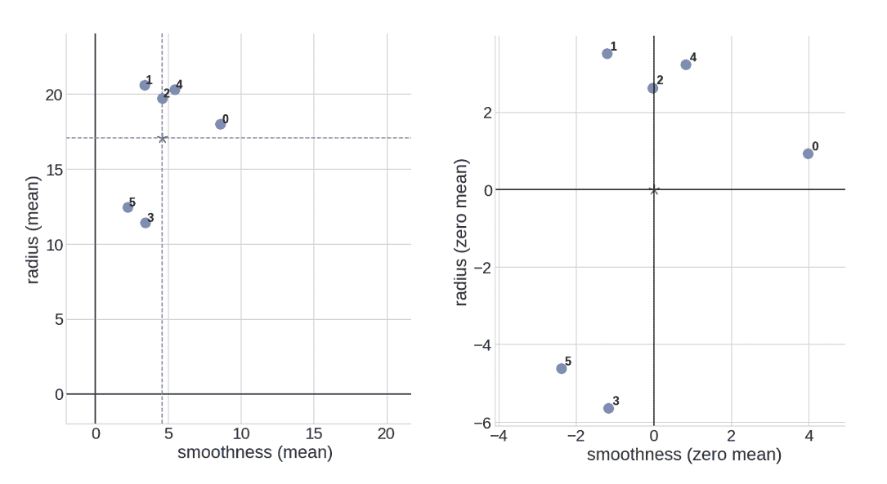
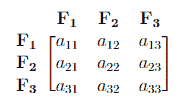
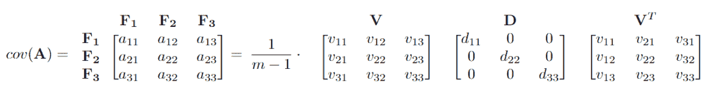

# 主成分分析（PCA）

> 原文：[`cs357.cs.illinois.edu/textbook/notes/pca.html`](https://cs357.cs.illinois.edu/textbook/notes/pca.html)

## 学习目标

+   理解为什么主成分分析是分析数据集的重要工具

+   了解 PCA 的优缺点

+   能够实现 PCA 算法

## 什么是 PCA？

***PCA***，或***主成分分析***，是一种在不丢失重要信息的情况下减少大数据集的算法。***PCA***被定义为一种正交线性变换，它将数据转换到一个新的坐标系，使得数据通过某个标量投影的最大方差位于第一个坐标（称为***第一主成分***），第二个最大方差位于第二个坐标，依此类推。

简单来说，它检测最大方差的方向，并将原始数据集投影到一个低维子空间（直到基的变化），该子空间仍然包含大部分重要信息。

+   优点：只省略了“最不重要的”变量，保留了更有价值的变量。此外，创建的新变量是相互独立的，这对于线性模型是必不可少的。

+   缺点：新创建的变量将与原始数据集的含义不同。（解释性丢失）

### 示例

考虑一个包含 $m$ 个样本和 30 个不同细胞特征的大的数据集。有许多变量彼此高度相关。我们可以创建一个 $m \times$30 的矩阵 $\bf A$，其中列 $\bf F_i$ 代表不同的特征。

$$A = \begin{bmatrix} \vdots & \vdots & \vdots \\ F_1 & \cdots & F_{30} \\ \vdots & \vdots & \vdots \end{bmatrix}$$

现在假设我们想要降低特征空间。一种方法是直接删除一些特征变量。例如，我们可以忽略最后 20 个特征列，以获得一个降低的数据矩阵 $\bf A^*$。这种方法简单且保持了特征变量的解释性，但我们已经丢失了删除列的信息。

$$A = \begin{bmatrix} \vdots & \vdots & \vdots \\ F_1 & \cdots & F_{30} \\ \vdots & \vdots & \vdots \end{bmatrix} \implies A^{*} = \begin{bmatrix} \vdots & \vdots & \vdots \\ F_1 & \cdots & F_{10} \\ \vdots & \vdots & \vdots \end{bmatrix}$$

另一种方法是使用 PCA。我们通过原始变量的特定线性组合创建“新的特征变量”$\bf F_i^*$。PCA 之后的所有新变量都是相互独立的。现在，我们能够使用更少的变量，但仍然包含所有特征的信息。这里的缺点是我们已经失去了新特征变量的“有意义的”解释。

$$A = \begin{bmatrix} \vdots & \vdots & \vdots \\ F_1 & \cdots & F_{30} \\ \vdots & \vdots & \vdots \end{bmatrix} \implies A^{*} = \begin{bmatrix} \vdots & \vdots & \vdots \\ F_1^{*} & F_2^{*} & F_3^{*} \\ \vdots & \vdots & \vdots \end{bmatrix}$$ $$F_1^{*} = \sum_{i=1}^n a_i F_i$$

## 数据中心化

主成分分析（PCA）的第一步是**数据中心化**。我们对数据集 $\bf A$ 的数据列进行平移，使得每一列的平均值为 0。对于 $\bf A$ 的每个特征列 $\bf F_i$，我们计算均值 $\bar{F_i}$，并从列 $\bf F_i$ 的每个条目中减去 $\bar{F_i}$。我们对每一列执行此过程，直到我们获得一个新的中心化数据集 $\bf A$。

### 示例

这是 2 维坐标空间中 6 个数据点数据中心化的一个例子：

$$p_0 = (8.6, 18.0), p_1 = (3.4, 20.6), p_2 = (4.6, 19.7), p_3 = (3.4, 11.4), p_4 = (5.4, 20.3), p_5 = (2.2, 12.4)$$

我们首先计算均值点 $\bar{p} = (4.6, 17.1)$，然后平移所有数据点，使得新的均值点 $\bar{p}' = (0, 0)$ 位于中心。

## 协方差矩阵

对于我们**中心化**的数据集 $\bf A$，其维度为 $m \times n$，其中 $m$ 是数据点的总数，$n$ 是特征的数目，**协方差矩阵**被定义为

$$Cov({\bf A}) = \frac{1}{m-1} {\bf A}^T {\bf A}.$$

$Cov({\bf A})$ 的对角元素解释了每个特征如何与其自身相关，对角元素之和被称为问题的**总体变异性（总方差）**。

### 示例

考虑以下形式的协方差矩阵。从这个矩阵中，我们可以得到：

+   $a_{ii}$ = 每个 $\bf F_i$ 的方差（$\bf F_i$ 与其自身的相关性）。这里 $i = 1, 2, 3$。

+   $a_{11} + a_{22} + a_{33}$ = 总体变异性（总方差）。

+   $\frac{a_{ii}}{a_{11} + a_{22} + a_{33}} \cdot$ 100% = 由 $\bf F_i$ 解释的总方差百分比。这里 $i = 1, 2, 3$。

## 对角化与主成分

PCA 用新的变量替换原始特征变量，这些新变量称为**主成分**，它们是正交的（即它们之间没有协方差）并且方差按降序排列。为了实现这一点，我们将使用协方差矩阵的对角化。

$$Cov({\bf A}) = \frac{1}{m-1} {\bf A}^T {\bf A} = \frac{1}{m-1} {\bf V D} {\bf V}^T.$$

这里 ${\bf V}$ 的列是 ${\bf A}^T {\bf A}$ 的特征向量，相应的特征值是对角矩阵 ${\bf D}$ 的对角元素。协方差矩阵的最大特征值对应于数据集的最大方差，相关的特征向量是最大方差的方向，称为**第一主成分**。

### 示例

对于上述示例中的相同协方差矩阵，我们可以将其写成对角化形式。在这里，$\frac{1}{m-1} \cdot (d_{11} + d_{22} + d_{33})$的总和等于 $a_{11} + a_{22} + a_{33}$，这代表总体变异性。矩阵 ${\bf V}$ 的第一列是**第一主成分**，它代表最大方差的方向 $\frac{1}{m-1} \cdot d_{11}$。在这里，第一主成分占问题变异性的 $\frac{d_{11}}{d_{11} + d_{22} + d_{33}} \cdot$ 100%。

## SVD 和数据转换

我们知道 ${\bf A}^T {\bf A}$ 的特征向量是 ${\bf A}$ 的右奇异向量，或者是 ${\bf A}$ 的奇异值分解（SVD）中的 ${\bf V}$ 的列（或者是 ${\bf V}$ 转置的行）。因此，我们不需要计算协方差矩阵和求解特征值问题，而是直接得到 SVD 的简化形式！

从

$${\bf A} = {\bf U \Sigma V}^T,$$

我们可以通过 ${\bf A}$ 的最大奇异值的平方来获得**最大方差**，即 ${\sigma ² _{max}}$，这是 ${\bf \Sigma}$ 的最大平方项，以及**第一主成分**（最大方差的方向）作为 ${\bf V}$ 的对应列。

最后，我们可以根据主成分的方向转换我们的数据集：

$${\bf A}^* := {\bf A V = U \Sigma}.$$

${\bf A V}$ 是数据在主成分上的投影。${\bf A V_k}$ 是在第一个 $k$ 个主成分上的投影，其中 ${\bf V_k}$ 代表 ${\bf V}$ 的前 $k$ 列。

## PCA 算法总结

假设我们给定一个维度为 $m \times n$ 的大数据集 $\bf A$，我们想要将数据集减少到一个较小的数据集 ${\bf A}^*$（维度为 $m \times k$），而不丢失重要信息。我们可以通过以下步骤执行 PCA 算法来实现这一点：

1.  将数据集 $\bf A$ 平移，使其具有零均值：${\bf A} = {\bf A} - {\bf A}.mean()$.

1.  对原始数据集计算**SVD**：${\bf A}= {\bf U \Sigma V}^T$.

1.  注意到数据集的**方差**由 $\bf A$ 的奇异值决定，即 $\sigma_1, ... , \sigma_n$。

1.  注意到 $\bf V$ 的列代表数据集的**主方向**。

1.  我们的新数据集是 ${\bf A}^* := {\bf AV} ={\bf U\Sigma}$。

1.  有时我们想要减少数据集的维度，并且只使用最重要的 $k$ 个主方向，即 ${\bf V}$ 的前 $k$ 列。因此，我们可以将上述方程 ${\bf A}^* = {\bf AV}$ 改为 ${\bf A}^* = {\bf AV_k}$，其中 ${\bf A}^*$ 具有所需的维度 $m \times k$。

注意到数据集的方差对应于奇异值：$({\bf A}^*)^T {\bf A}^*= {\bf V}^T{\bf A}^T{\bf AV}={\bf \Sigma}^T{\bf \Sigma}$，如步骤 3 所示。

## 主成分的替代定义

还有一些其他密切相关的量也被称为***主成分***。我们将主成分称为方差的方向，即 $\bf V$ 的列。在某些其他情况下，***主成分***指的是方差本身，即 $\sigma_1², ... , \sigma_n²$。在这种情况下，方差的方向可能被称为***主方向***。***主成分***的含义应通过上下文变得清晰。

## 更新日志

+   2024 年 4 月 18 日：Dev Singh (dsingh14) — 修复解释中的错误

+   2024 年 4 月 3 日：Bhargav Chandaka (bhargav9) — 对内容进行重大重组，以与幻灯片/视频中的内容相匹配

+   2022 年 4 月 18 日：Yuxuan Chen (yuxuan19) — 添加 PCA 定义、数据中心化、协方差矩阵、对角化、svd、示例、总结、替代定义

+   

查看剩余条目

    +   2020 年 11 月 30 日：Jerry Yang (jiayiy7) — 修复 pca 代码

    +   2020 年 8 月 9 日：Yikai Teng (yikait2) — 概述

## 作者

+   CS 357 课程工作人员
