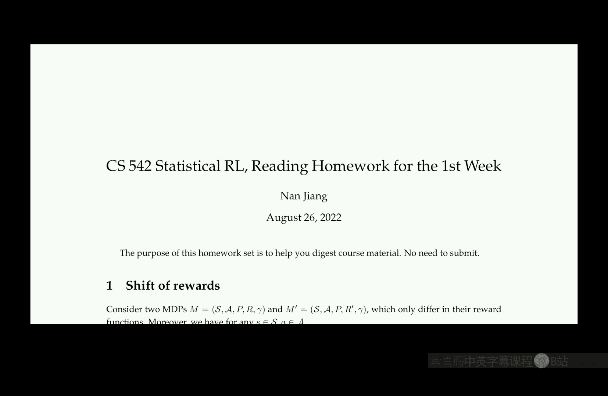
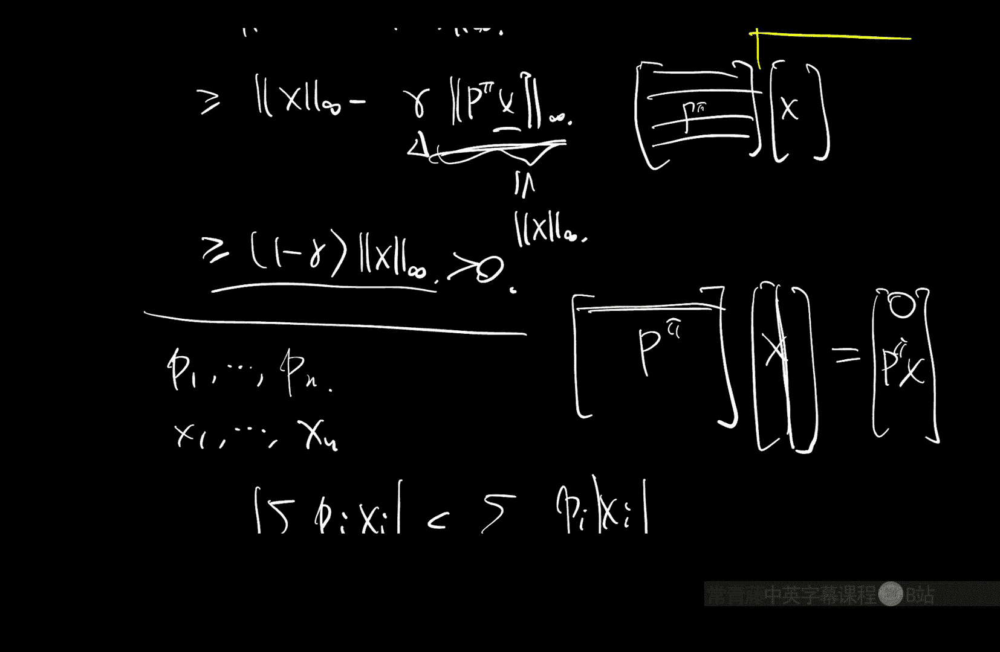
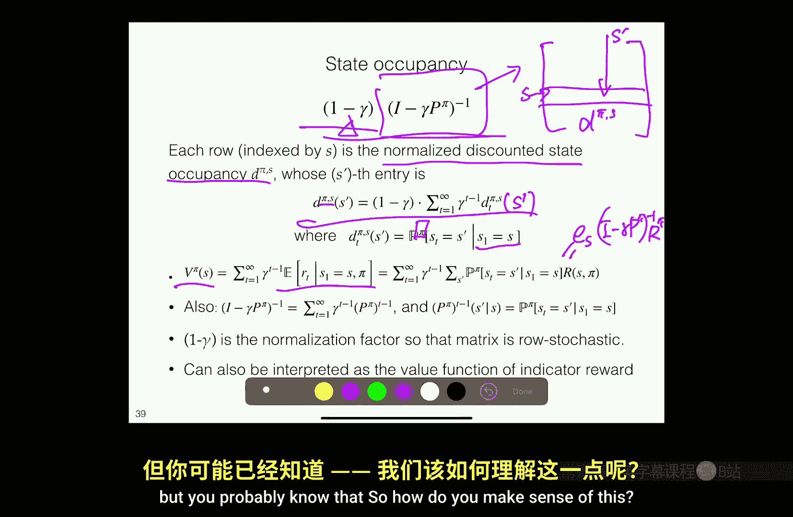
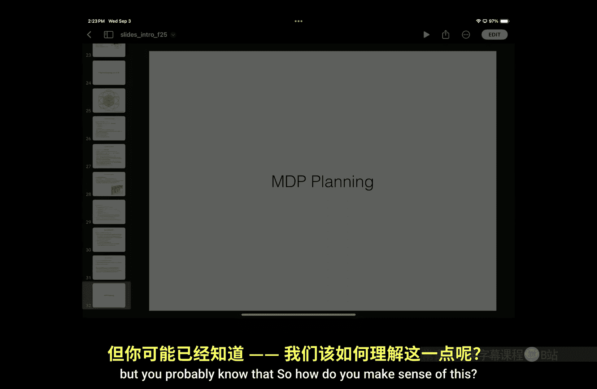
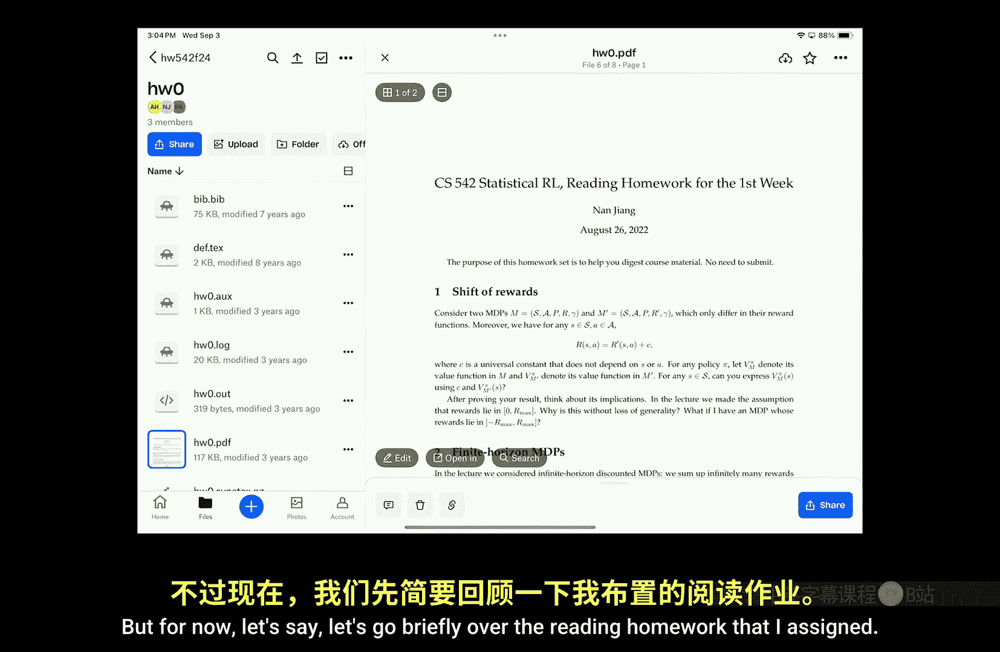
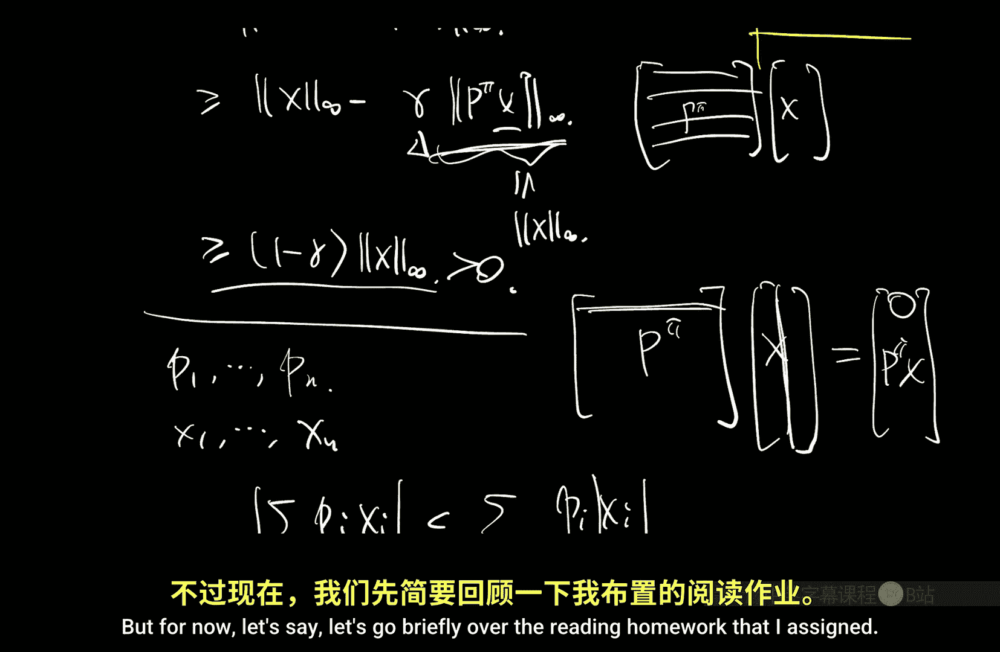
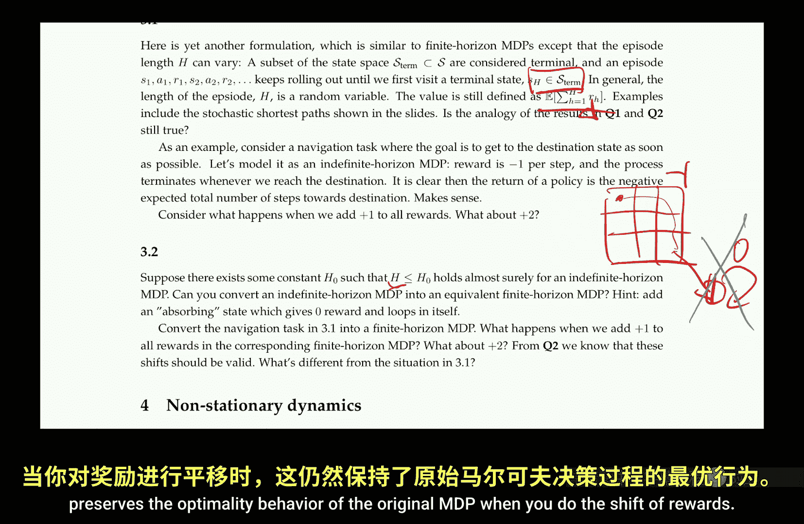

# 003：贝尔曼方程（视角2）📘

在本节课中，我们将继续学习贝尔曼方程，特别是其在策略评估中的应用，并深入探讨其矩阵形式、解的唯一性证明，以及如何将其推广到随机策略。我们还将介绍贝尔曼最优方程，并讨论最优值函数与最优策略之间的关系。

---

## 策略评估的贝尔曼方程回顾

上一节我们介绍了用于策略评估的贝尔曼方程。给定任意策略 π，其值函数 V^π 满足以下方程：
**V^π(s) = R(s, π(s)) + γ Σ_{s'} P(s' | s, π(s)) V^π(s')**

需要注意的是，之前的推导主要考虑了确定性策略，即策略将状态映射到具体的动作。然而，这个方程可以很直接地推广到随机策略的情况。

### 推广至随机策略

对于随机策略，策略 π 在给定状态 s 下会输出一个动作的概率分布。此时，贝尔曼方程的形式非常相似，唯一的区别在于，我们需要对策略给出的动作分布取期望。

具体而言，方程变为：
**V^π(s) = E_{a~π(·|s)} [ R(s, a) ] + γ E_{a~π(·|s), s'~P(·|s,a)} [ V^π(s') ]**

为了简化表示，我们经常使用统一的记号。例如，用 **R(s, π)** 表示在状态 s 下执行策略 π 的期望即时奖励，用 **P(s' | s, π)** 表示相应的状态转移概率。当策略是确定性策略时，这只是上述一般形式的一个特例。

---

## 矩阵形式与解的唯一性

我们可以将贝尔曼方程写成矩阵形式：
**V^π = R^π + γ P^π V^π**

通过移项，可以得到：
**(I - γ P^π) V^π = R^π**

因此，计算值函数 V^π 就转化为求解这个线性方程组。一个关键问题是，矩阵 **(I - γ P^π)** 是否总是可逆的？答案是肯定的。

### 可逆性证明

我们通过证明对于任何非零向量 x，矩阵 **(I - γ P^π)** 作用在 x 上得到的向量也是非零的，从而证明该矩阵可逆。

证明中使用了无穷范数 **||x||_∞ = max_i |x_i|**。P^π 是一个转移概率矩阵，其每一行都是一个概率分布（元素非负且和为1）。

以下是证明的核心步骤：
1.  考虑 **||(I - γ P^π) x||_∞**。
2.  利用三角不等式，得到 **||(I - γ P^π) x||_∞ ≥ ||x||_∞ - γ ||P^π x||_∞**。
3.  关键的一步是证明 **||P^π x||_∞ ≤ ||x||_∞**。这是因为 P^π 的每一行都是对 x 各分量的凸组合（加权平均），而平均值永远不会超过最大值。
4.  结合上述不等式，有 **||(I - γ P^π) x||_∞ ≥ (1 - γ) ||x||_∞ > 0**（因为 γ < 1 且 x 非零）。
5.  因此，**(I - γ P^π) x ≠ 0**，矩阵可逆。

这个证明不仅说明了矩阵可逆，也意味着贝尔曼方程有唯一解。因此，满足贝尔曼方程是值函数的等价定义。

---

## 折扣状态占用分布

在求解贝尔曼方程时，矩阵 **(I - γ P^π)^{-1}** 扮演了核心角色。这个矩阵具有重要的概率解释。

考虑矩阵 **(1-γ)(I - γ P^π)^{-1}** 的每一行。可以证明，每一行都是一个概率分布（元素非负且和为1）。具体来说，对于行索引对应的起始状态 s，这个分布 d^{π,s} 可以写成：
**d^{π,s}(s') = (1-γ) Σ_{t=1}^{∞} γ^{t-1} [P^π]^{t-1}(s' | s)**

其中，**[P^π]^{t-1}(s' | s)** 表示从状态 s 开始，执行策略 π 经过 t-1 步后到达状态 s‘ 的概率分布。

这个分布 **d^{π,s}** 被称为**折扣状态占用分布**。它混合了从状态 s 出发，在不同时间步 t 访问状态 s‘ 的概率，并以 γ^{t-1} 进行折扣加权。与马尔可夫链中通常关注的稳态分布不同，折扣占用分布更强调瞬态行为，因为越未来的状态获得的权重越小。

---

## 贝尔曼最优方程

策略评估告诉我们一个给定策略的好坏。我们的最终目标是找到最优策略。在无限视野折扣马尔可夫决策过程（MDP）中，一个基本结论是：总存在一个**平稳的、确定性的**马尔可夫策略，它对所有起始状态同时是最优的。

我们用 π* 表示这样一个最优策略，并用 V* 表示其对应的值函数，称为**最优值函数**。尽管最优策略可能不唯一，但最优值函数 V* 是唯一的。

### 最优方程的直观推导

最优值函数 V* 满足**贝尔曼最优方程**。其直观推导如下：
假设我们在状态 s，我们想知道从此刻开始最优行为能获得的最大期望总回报。我们可以这样思考：
1.  立即，我们可以选择多个动作 a。
2.  对于每个候选动作 a，假设我们执行它，然后从下一状态 s‘ 开始继续最优行为。
3.  执行动作 a 的期望总回报是：**R(s, a) + γ E_{s'~P(·|s,a)}[ V*(s') ]**。
4.  为了在状态 s 获得最大回报，我们应选择能最大化上述表达式的动作 a。

因此，我们得到贝尔曼最优方程：
**V*(s) = max_{a ∈ A} [ R(s, a) + γ E_{s'~P(·|s,a)}[ V*(s') ] ]**

### Q函数与最优策略

为了更方便地表示方程右边部分，我们定义**最优Q函数**：
**Q*(s, a) = R(s, a) + γ E_{s'~P(·|s,a)}[ V*(s') ]**

Q*(s, a) 表示在状态 s 采取动作 a，然后此后一直遵循最优策略所能获得的期望总回报。有了 Q*，最优方程可以写为：
**V*(s) = max_{a ∈ A} Q*(s, a)**

更重要的是，**最优策略**可以通过 Q* 直接得到：在状态 s，选择使得 Q*(s, a) 最大的动作 a，即 **π*(s) = argmax_{a ∈ A} Q*(s, a)**。当最大值对应多个动作时，选择其中任何一个均可，这解释了最优策略可能不唯一的原因。

### Q函数的贝尔曼方程

我们可以推导出 Q* 自身也满足一个贝尔曼方程。将 **V*(s') = max_{a'} Q*(s', a')** 代入 Q* 的定义式，得到：
**Q*(s, a) = R(s, a) + γ E_{s'~P(·|s,a)}[ max_{a' ∈ A} Q*(s', a') ]**

这是一个自包含的方程，仅涉及 Q*。在规划场景中，由于我们知道模型（R 和 P），可以直接求解这个方程得到 Q*，进而得到最优策略。在强化学习中，我们通常更常处理 Q 函数。

---

## 关于奖励函数的注记

### 奖励平移不变性

考虑一个MDP，其奖励函数为 R(s, a)。如果我们定义一个新的MDP，其奖励函数为 R'(s, a) = R(s, a) + C，其中 C 是一个常数。那么，对于任意策略 π，其在新旧MDP中的值函数满足：
**V'^π(s) = V^π(s) + C / (1-γ)**

这意味着，给所有奖励加上一个常数，不会改变不同策略之间的优劣顺序，也不会改变最优策略。因此，我们可以为了方便，总是假设奖励值在一个非负的范围内（例如 [0, R_max]），只需将原始奖励加上一个足够的常数即可。

### 有限视野与终止状态

在**有限视野**问题中，轨迹长度固定为 H。此时，值函数和策略通常是时间依赖的。类似地，奖励平移不变性仍然成立，因为给每一步奖励加上常数 C，总回报增加 C * H，不改变策略间的相对优劣。

更常见的是**不定视野**问题（或“分幕式”任务），例如棋类游戏或导航到目标点。轨迹会在达到某个终止状态（如目标、游戏结束）时结束，轨迹长度 H 是一个随机变量，取决于策略和运气。

在这种设定下，奖励平移不变性**不一定成立**。一个经典例子是：在网格世界中，每走一步给予 -1 奖励，到达目标给予 0 奖励（或一个正的大奖励）。目标是最小化步数（最大化总奖励，即最小化负数和）。如果我们将所有奖励加上 +1，则每步奖励变为 0，到达目标奖励变为 +1。这完全改变了激励：智能体现在会尽可能拖延到达目标，以累积更多的 +1 奖励。因此，平移改变了最优策略。

然而，如果轨迹长度有一个上界 H0，我们可以通过添加“吸收状态”将不定视野问题转化为等价的有限视野问题。在转化后的问题中，奖励函数不再是一个简单的常数，此时奖励平移的性质又与标准有限视野问题一致了。

---

## 总结

本节课中，我们一起深入探讨了贝尔曼方程。
*   我们首先回顾了策略评估的贝尔曼方程，并将其推广到随机策略。
*   我们证明了贝尔曼方程矩阵形式解的唯一性，并介绍了折扣状态占用分布这一重要概念。
*   接着，我们转向控制问题，介绍了贝尔曼最优方程，它定义了最优值函数 V* 和最优Q函数 Q*。
*   我们了解到，最优策略可以通过对 Q* 取 argmax 获得，并且存在确定性的最优策略。
*   最后，我们讨论了奖励函数的性质，特别是奖励平移在无限/有限视野问题中的不变性，以及在不定视野问题中的特殊性，这有助于我们理解不同MDP建模方式之间的细微差别。

在接下来的课程中，我们将探讨如何实际求解这些贝尔曼方程。