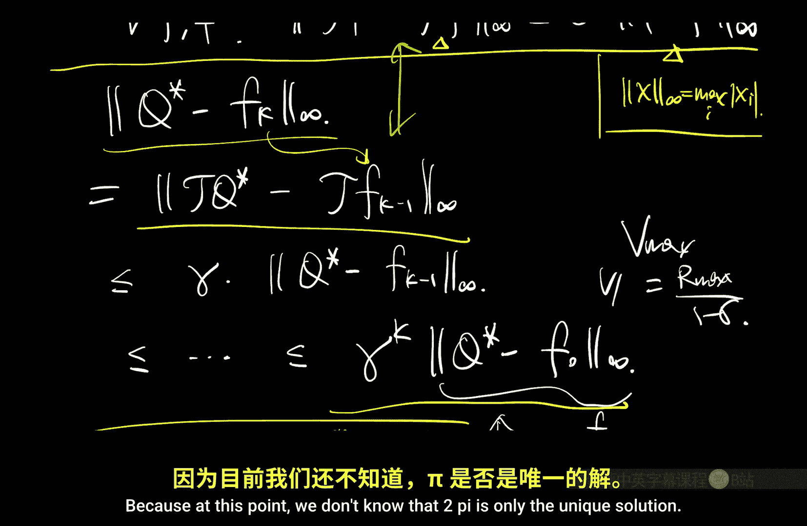

# 005：价值迭代（视角2）🎯

在本节课中，我们将学习如何求解贝尔曼最优方程。我们将引入一个重要的数学工具——贝尔曼算子，并基于它介绍价值迭代算法。我们将证明该算法能够快速收敛到最优状态-动作价值函数 Q*。

## 回顾贝尔曼最优方程

上一节我们介绍了贝尔曼最优方程。对于最优状态价值函数 V*，其方程为：
**V*(s) = max_a [ R(s, a) + γ Σ_{s'} P(s'|s, a) V*(s') ]**

为了直接得到最优策略，我们更常使用最优状态-动作价值函数 Q*，其方程为：
**Q*(s, a) = R(s, a) + γ Σ_{s'} P(s'|s, a) max_{a'} Q*(s', a')**

一旦我们求解出 Q*，最优策略 π* 可以通过贪心策略轻松得到：
**π*(s) = argmax_a Q*(s, a)**

## 引入贝尔曼算子

为了分析和求解上述方程，我们引入一个核心概念：贝尔曼算子 T。

贝尔曼算子 T 是一个映射，它将一个定义在“状态-动作对”上的函数（例如 Q 函数）映射为另一个同类型的函数。具体定义如下：对于任意输入函数 F ∈ ℝ^(|S|×|A|)，算子 T 的输出函数在任意状态-动作对 (s, a) 上的值为：
**(T F)(s, a) = R(s, a) + γ Σ_{s'} P(s'|s, a) max_{a'} F(s', a')**

注意，这里的输入 F 是一个完整的函数（或向量），T 作用于整个函数后，再在具体的 (s, a) 处求值。这种写法强调了算子需要函数在所有状态上的信息。

利用这个算子，贝尔曼最优方程可以被简洁地重写为一个不动点方程：
**Q* = T Q***

这意味着 Q* 是算子 T 的一个不动点。我们的目标就是找到这个不动点。

## 价值迭代算法

求解不动点方程的一个经典方法是迭代法。价值迭代算法正是基于这一思想。

以下是价值迭代算法的步骤：

1.  **初始化**：任意初始化一个函数 F_0，例如设为零函数：F_0(s, a) = 0。
2.  **迭代更新**：对于 k = 1, 2, 3, ...，执行以下更新：
    **F_k = T F_{k-1}**
    即，将上一轮迭代得到的函数 F_{k-1} 代入贝尔曼算子 T，得到新的函数 F_k。

直观上，该算法不断将当前的 Q 值估计通过贝尔曼最优备份进行改进。我们将证明，当迭代次数 k 足够大时，F_k 会收敛到最优 Q* 函数。

## 收敛性证明

为了证明价值迭代的收敛性，我们需要一个关键引理：贝尔曼算子 T 是一个 γ-收缩映射。

### 收缩性引理

对于任意两个函数 F 和 F̃，贝尔曼算子 T 满足以下性质：
**‖T F - T F̃‖_∞ ≤ γ ‖F - F̃‖_∞**

这里 ‖·‖_∞ 表示无穷范数（L∞范数），对于一个函数 G，其定义为：
**‖G‖_∞ = max_{s, a} |G(s, a)|**

这个引理意味着，对任意两个函数应用算子 T 后，它们之间的“最大差距”会至少缩小 γ 倍（γ < 1）。

#### 引理证明概要

我们比较 (T F)(s, a) 和 (T F̃)(s, a) 的差。经过抵消奖励项和提取公因子后，核心在于证明对于任意状态 s‘，下式成立：
**| max_{a'} F(s', a') - max_{a'} F̃(s', a') | ≤ max_{a'} | F(s', a') - F̃(s', a') |**

这个不等式可以通过分析两个函数最大值点的关系来证明。不失一般性，假设 F 的最大值不小于 F̃ 的最大值。设 a* 是 F 的最大值点，则有：
左边 = F(s', a*) - max_{a'} F̃(s', a') ≤ F(s', a*) - F̃(s', a*) ≤ |F(s', a*) - F̃(s', a*)| ≤ 右边

由此，收缩性得证。

### 利用收缩性证明收敛

现在，假设收缩性引理成立，我们来分析价值迭代的误差。定义第 k 次迭代的误差为 ‖Q* - F_k‖_∞。

由于 Q* 是 T 的不动点（Q* = T Q*），且 F_k = T F_{k-1}，我们可以利用收缩性：
**‖Q* - F_k‖_∞ = ‖T Q* - T F_{k-1}‖_∞ ≤ γ ‖Q* - F_{k-1}‖_∞**

这是一个递归关系。不断应用它，直到回溯到初始函数 F_0：
**‖Q* - F_k‖_∞ ≤ γ^k ‖Q* - F_0‖_∞**

由于 γ < 1，当 k → ∞ 时，γ^k → 0，因此误差 ‖Q* - F_k‖_∞ → 0。这意味着 F_k 收敛到 Q*。收敛速度是指数级的（或几何级数），由 γ^k 控制，非常快。

此外，这个证明还隐含地说明了贝尔曼最优方程的解是唯一的。因为迭代算法从一个任意起点出发，总是收敛到同一个极限 Q*。

## 相关概念与扩展

上一节我们介绍了价值迭代的核心，本节我们来看看与之相关的其他重要算子和方程。

### 其他贝尔曼算子

贝尔曼算子的思想可以推广到其他场景：

1.  **最优状态价值算子**：同样可以定义作用于状态价值函数 V 的算子 T，使得 V* = T V*。其价值迭代形式（在状态空间上迭代）具有完全类似的收敛性质。
2.  **策略评估算子 T_π**：对于任意给定的策略 π，可以定义策略评估算子：
    **(T_π V)(s) = R_π(s) + γ Σ_{s'} P_π(s'|s) V(s')**
    其中 R_π(s) = Σ_a π(a|s) R(s, a)， P_π(s'|s) = Σ_a π(a|s) P(s'|s, a)。策略的价值函数 V_π 满足不动点方程 V_π = T_π V_π。T_π 也是一个 γ-收缩映射，这意味着我们也可以用迭代法（而非矩阵求逆）来求解策略评估问题。
3.  **状态-动作价值函数 Q_π**：为了概念的完整性，我们定义在策略 π 下的状态-动作价值函数：
    **Q_π(s, a) = R(s, a) + γ Σ_{s'} P(s'|s, a) V_π(s')**
    它表示在状态 s 下执行动作 a，之后一直遵循策略 π 所能得到的期望回报。它同样满足一个贝尔曼方程，并对应一个收缩算子。

### 方程对比

以下是不同贝尔曼方程的对比，有助于理解其联系与区别：

*   **策略评估方程 (V_π)**：**V_π = R_π + γ P_π V_π**
    *   **性质**：线性方程。
    *   **求解**：可直接线性求解，也可用迭代法。
    *   **算子**：T_π，是仿射变换（线性+平移）。
*   **最优性方程 (Q*)**：**Q* = R + γ P (max Q*)**
    *   **性质**：非线性方程（由于 max 操作）。
    *   **求解**：通常使用迭代法（如价值迭代）。
    *   **算子**：T，是非线性算子。

关键区别在于，最优性方程中包含了一个 `max` 操作，这使其变为非线性，但也正是这个操作使得它能够直接表征最优策略。

## 总结

本节课中我们一起学习了价值迭代算法及其理论基础。

1.  我们首先通过引入**贝尔曼算子 T**，将贝尔曼最优方程 **Q* = T Q*** 表示为不动点问题。
2.  接着，我们介绍了**价值迭代算法**：通过反复应用算子 T（即 **F_k = T F_{k-1}**）来逼近最优 Q* 函数。
3.  我们证明了贝尔曼算子 T 是一个 **γ-收缩映射**，这是分析收敛性的关键。
4.  利用收缩性，我们证明了价值迭代算法能以 **指数级速度（γ^k）** 收敛到唯一的最优解 Q*。
5.  最后，我们扩展了算子的概念，简要介绍了用于策略评估的算子 T_π，并对比了不同贝尔曼方程的特点。

价值迭代是强化学习中最基础、最重要的规划算法之一，它为我们后面理解更复杂的算法（如Q-learning）奠定了坚实的基础。