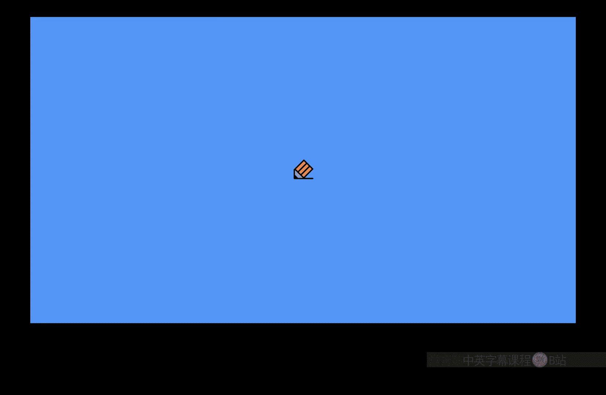
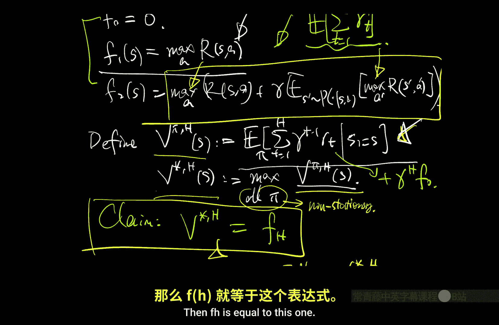

# 007：价值迭代（续）（视角2）🎯

在本节课中，我们将继续探讨价值迭代算法，但会从一个全新的、更直观的视角来分析其收敛性。我们将看到，价值迭代可以被理解为求解一系列有限时域问题的过程，并利用这个视角给出一个不依赖于“收缩映射”概念的初等证明。最后，我们将简要介绍另一种核心规划算法——策略迭代。

---

## 算法回顾与证明动机 🔍

上一节我们介绍了价值迭代算法，它通过反复应用贝尔曼最优算子来求解贝尔曼最优方程。其核心在于利用算子的收缩性质来保证收敛。

本节中，我们来看看一个完全不同的证明策略。这个证明虽然在某些步骤上不那么严格，但它非常直观且基础，甚至不需要引入“收缩”的概念。我们将针对价值函数 $V^*$ 的版本进行分析（$Q^*$ 版本的证明类似）。

价值迭代算法（$V^*$ 版本）定义如下：
*   初始化：$f_0 = 0$（零函数）。
*   迭代：对于 $k \ge 1$，计算 $f_k = T f_{k-1}$。

其中，贝尔曼最优算子 $T$ 定义为：对于任意定义在状态上的实值函数 $f$，
$$(T f)(s) = \max_{a} \left[ R(s, a) + \gamma \mathbb{E}_{s‘ \sim P(\cdot|s,a)}[f(s’)] \right]$$

我们的目标是证明 $f_k$ 在 $L_\infty$ 范数下以指数速度收敛到 $V^*$。

---

## 新视角：有限时域近似 🔬

为了理解这个新证明，我们首先写出前几次迭代的具体形式：
*   $f_0(s) = 0$
*   $f_1(s) = \max_a R(s, a)$
*   $f_2(s) = \max_a \left[ R(s, a) + \gamma \mathbb{E}_{s’} [ \max_{a’} R(s‘, a’) ] \right]$

观察这些表达式，它们实际上具有明确的含义。我们定义一个新的量：对于一个策略 $\pi$，其 **$H$ 步有限时域价值** 为：
$$V_\pi^H(s) = \mathbb{E}_\pi \left[ \sum_{t=1}^{H} \gamma^{t-1} R_t \mid S_1 = s \right]$$
即从状态 $s$ 开始，执行策略 $\pi$，只累计前 $H$ 步的折扣奖励。

接着，定义 **$H$ 步最优价值**：
$$V^{*, H}(s) = \max_{\pi} V_\pi^H(s)$$
这里的 $\pi$ 可以是非平稳策略（即策略可以随时间变化）。对于有限时域问题，最优策略通常是时间依赖的。

**核心观察**：价值迭代中得到的 $f_H$ 恰好等于 $H$ 步最优价值 $V^{*, H}$。
*   $f_0 = V^{*, 0}$：零步剩余，价值为0。
*   $f_1 = V^{*, 1}$：一步剩余，最优选择是最大化即时奖励。
*   $f_2 = V^{*, 2}$：两步剩余，需要考虑当前奖励和下一步的最优奖励，这正是动态规划（逆向归纳）的思想。

因此，价值迭代的过程可以解读为：依次求解 $H=0,1,2,…$ 的有限时域问题，并将 $H$ 步最优价值作为对无限时域最优价值 $V^*$ 的近似。

---

## 收敛性证明 📈

基于上述观察，我们可以建立一个“夹逼”论证来证明收敛性。

首先，对于任意平稳策略 $\pi$（包括最优无限时域策略 $\pi^*$），显然有：
$$V_\pi^H \le V^{*, H} = f_H$$
因为 $f_H$ 是 $H$ 步问题的最优价值。

其次，由于奖励的非负性（这是一个不失一般性的假设），增加累计步数不会减少价值，因此：
$$f_H = V^{*, H} \le V^*$$
这里 $V^*$ 是无限时域最优价值。这给出了 $f_H$ 的一个上界：$f_H \le V^*$。

现在我们需要 $f_H$ 的下界。考虑无限时域最优策略 $\pi^*$ 在 $H$ 步目标下的表现：
$$f_H = V^{*, H} \ge V_{\pi^*}^H$$
因为 $\pi^*$ 只是所有可能策略中的一个，不一定在 $H$ 步目标下最优。

将 $V_{\pi^*}^H$ 拆解：
$$V_{\pi^*}^H(s) = \mathbb{E}_{\pi^*} \left[ \sum_{t=1}^{\infty} \gamma^{t-1} R_t \mid S_1=s \right] - \mathbb{E}_{\pi^*} \left[ \sum_{t=H+1}^{\infty} \gamma^{t-1} R_t \mid S_1=s \right]$$
$$= V^*(s) - \gamma^H \mathbb{E}_{\pi^*} \left[ \sum_{t=1}^{\infty} \gamma^{t-1} R_{t+H} \mid S_1=s \right]$$

由于奖励有界 $|R| \le R_{\text{max}}$，右边期望项的绝对值不超过 $\frac{R_{\text{max}}}{1-\gamma}$。因此我们得到下界：
$$f_H(s) \ge V^*(s) - \gamma^H \cdot \frac{R_{\text{max}}}{1-\gamma}$$

结合上下界，我们得到：
$$V^*(s) - \gamma^H \cdot \frac{R_{\text{max}}}{1-\gamma} \le f_H(s) \le V^*(s)$$

这意味着在 $L_\infty$ 范数下：
$$\| f_H - V^* \|_\infty \le \gamma^H \cdot \frac{R_{\text{max}}}{1-\gamma}$$

这与之前收缩映射证明得到的收敛速率一致。这个证明的优点在于其直观性：价值迭代之所以有效，是因为当 $H$ 很大时，有限时域最优价值 $V^{*, H}$ 与无限时域最优价值 $V^*$ 的差异仅来自于 $H$ 步之后那些被严重折扣（因子为 $\gamma^H$）的奖励，而这些奖励的总和是有限的。

---

## 从值函数到策略：性能保证 ⚙️

在实际应用中，我们运行有限 $K$ 步价值迭代后，得到一个近似函数 $f \approx Q^*$。我们需要将其转化为策略。最自然的方式是“贪心化”：
$$\pi_f(s) = \arg\max_a f(s, a)$$

一个关键问题是：如果 $f$ 接近 $Q^*$，那么策略 $\pi_f$ 的性能是否接近最优？

答案是肯定的。有以下性能保证引理：对于任意函数 $f$，如果满足 $\| f - Q^* \|_\infty \le \epsilon$，那么其贪心策略 $\pi_f$ 的价值满足：
$$\| V^* - V^{\pi_f} \|_\infty \le \frac{2\gamma}{1-\gamma} \epsilon$$

这个引理表明，贪心化操作是“稳健”的：值函数估计中的小误差，只会导致策略性能有限程度的下降，而不会造成灾难性失败。这为价值迭代等算法提供了理论保障：我们可以在达到所需的精度 $\epsilon$ 后停止迭代，并保证得到的策略是近似最优的。

**重要概念区分**：这里需要仔细区分两类函数：
1.  **MDP 内在的价值函数**：如 $V^*, Q^*, V^\pi$。它们是通过在 MDP 中执行某个策略所获得的期望回报，其值域受奖励和折扣因子约束。
2.  **任意的代理函数**：如价值迭代中产生的 $f_k$，或引理中的 $f$。它们只是对状态或状态-动作对的评分，可能没有任何策略能实现这个评分，其值也可以任意。

贪心化操作可以将任意代理函数 $f$ 映射为一个合法的策略 $\pi_f$。当在 MDP 中执行 $\pi_f$ 时，产生的是内在价值函数 $V^{\pi_f}$。$f$ 和 $V^{\pi_f}$ 通常是不同的对象。

---

## 策略迭代算法简介 🔄

除了价值迭代，策略迭代是另一种经典的规划算法。其核心思想是直接迭代改进策略，而非值函数。

策略迭代算法步骤如下：
1.  **初始化**：任意选择一个初始策略 $\pi_0$。
2.  **迭代**（对于 $k=1,2,…$）：
    *   **策略评估**：计算当前策略 $\pi_{k-1}$ 的 $Q$ 函数 $Q^{\pi_{k-1}}$。
    *   **策略改进**：通过贪心化得到新策略 $\pi_k = \pi_{Q^{\pi_{k-1}}}$（即在每个状态选择使 $Q^{\pi_{k-1}}(s, a)$ 最大的动作）。

策略迭代具有 **单调改进** 的性质：对于所有状态 $s$，有 $V^{\pi_k}(s) \ge V^{\pi_{k-1}}(s)$。只要旧策略不是最优的，至少在一个状态上会有严格改进。由于确定性马尔可夫策略的总数是有限的（$|A|^{|S|}$），策略迭代保证在有限步内收敛到最优策略。

策略迭代是许多现代强化学习算法（如 Actor-Critic 框架）的理论原型。其中，“策略评估”对应“评论家”（Critic）评估策略价值，“策略改进”对应“执行者”（Actor）更新策略。

---

## 总结 🎓

本节课中我们一起学习了：
1.  **价值迭代的新视角**：将价值迭代理解为求解一系列有限时域问题，并利用这个视角给出了一个直观的收敛性证明，无需依赖收缩映射理论。
2.  **近似值函数的策略化**：证明了即使值函数估计存在误差，其贪心策略的性能损失也是可控的，这为实际算法的停止准则提供了依据。
3.  **策略迭代算法**：介绍了另一种通过交替进行策略评估和改进来直接优化策略的算法框架，并指出了其与后续高级算法的联系。

这两种算法——价值迭代和策略迭代——构成了解决马尔可夫决策过程规划问题的基础。在接下来的课程中，我们将深入探讨策略迭代的性质及其与价值迭代的联系。