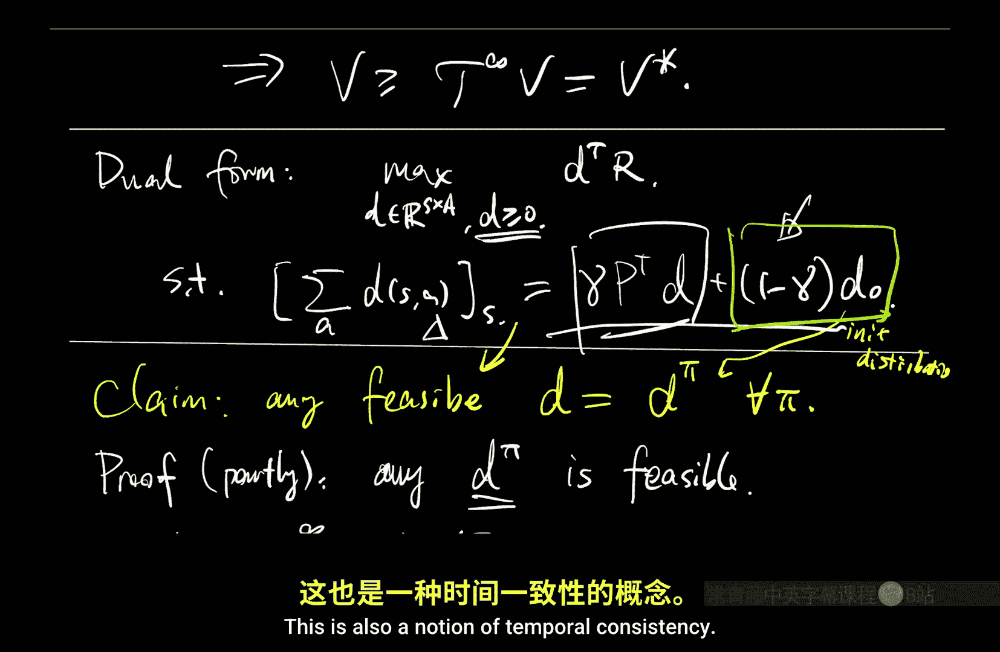
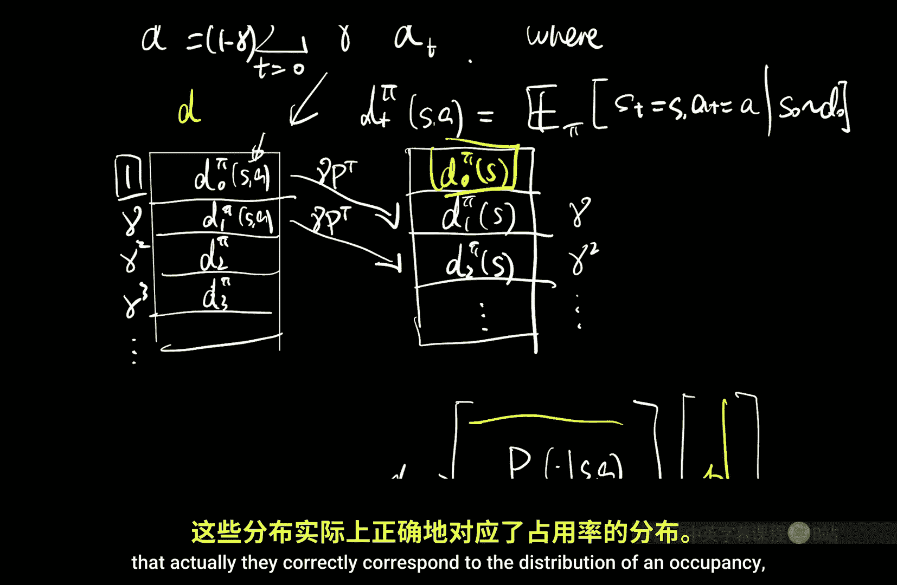
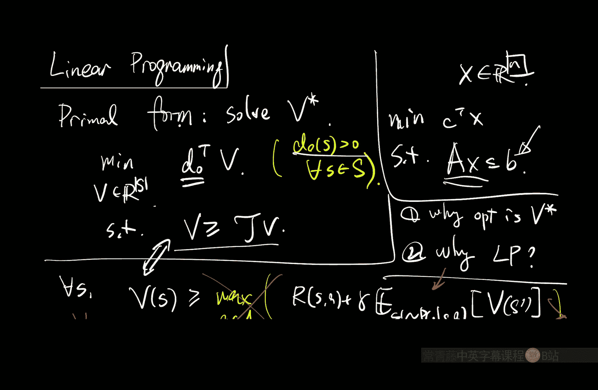
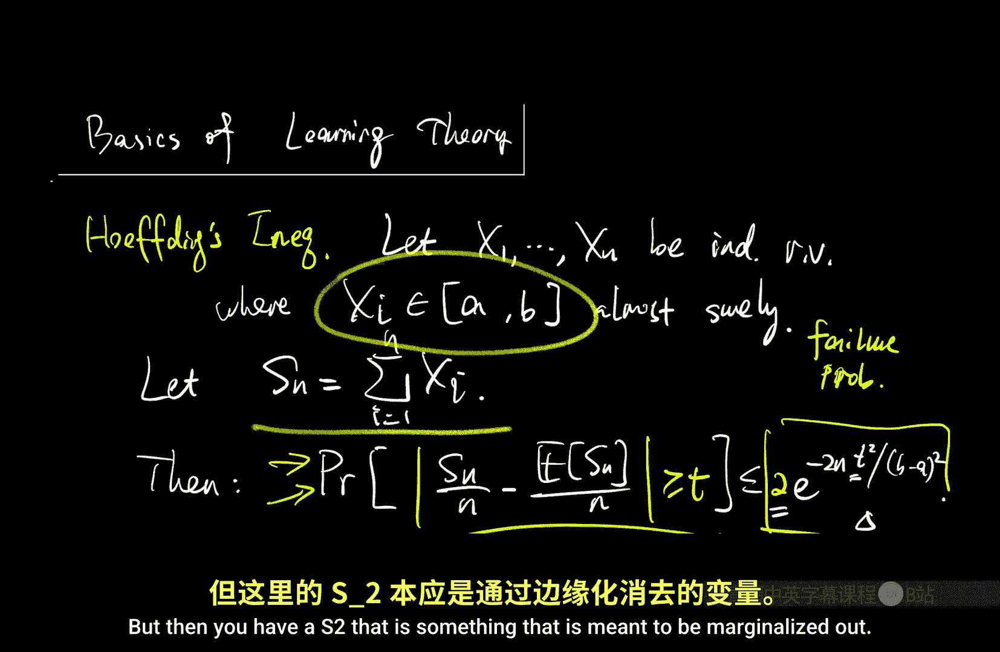

# 011：线性规划（视角2）📊

在本节课中，我们将学习如何将马尔可夫决策过程（MDP）的求解问题转化为一个线性规划问题。这是一种计算上求解MDP的基础算法，虽然在实际应用中不如值迭代或策略迭代常见，但其对偶形式提供了深刻的洞见，并为一些现代算法提供了灵感。

## 线性规划简介

线性规划是一种优化方法，其目标是最大化或最小化一个线性目标函数，同时满足一组线性等式或不等式约束。其标准形式可以表示为：

**最小化**：`c^T x`
**约束条件**：`A x ≤ b`， `D x = e`

其中，`x` 是决策变量向量，`c`、`b`、`e` 是已知向量，`A` 和 `D` 是已知矩阵。可行解空间是由这些线性约束定义的凸多面体。线性规划是一个研究非常成熟的领域，存在多种多项式时间求解算法。

## MDP的线性规划（原始形式）

我们的目标是将求解最优值函数 `V*` 的问题写成一个线性规划。其原始形式如下：

**最小化**：`d_0^T V`
**约束条件**：`V ≥ T V`

这里：
*   `V` 是我们的决策变量，是一个 `|S|` 维向量，代表状态值函数。
*   `d_0` 是一个在所有状态上严格为正的向量（例如，均匀分布），它提供了将 `V` 压缩为一个标量目标的权重。
*   `T` 是贝尔曼最优算子。

这个形式看起来有些反直觉：我们通常希望最大化长期回报，但这里却在最小化 `V`。此外，约束 `V ≥ T V` 是非线性的，因为它包含了 `max` 操作。

### 将约束线性化

为了解决非线性问题，我们将每个状态 `s` 的约束 `V(s) ≥ max_a [ R(s,a) + γ Σ_{s'} P(s'|s,a) V(s') ]` 展开。这等价于为每个状态 `s` 和每个动作 `a` 都写一个约束：

`V(s) ≥ R(s,a) + γ Σ_{s'} P(s'|s,a) V(s')`， 对所有 `s`, `a` 成立。

现在，约束的右边是 `V` 的线性函数（因为期望是 `V` 与转移概率向量的点积加上常数奖励）。这样我们就得到了一个真正的线性规划：有 `|S|` 个决策变量和 `|S| * |A|` 个线性约束。

### 为什么最优解是 V*？

我们需要证明，上述线性规划的最优解确实是 `V*`。关键在于以下单调性引理和约束条件。

**引理（单调性）**：对于任意两个值函数向量 `V` 和 `V'`，如果 `V ≥ V'`（逐点大于等于），那么 `T V ≥ T V'`。

**证明**：`T` 算子由取 `max`、加常数奖励和与转移概率的线性期望组成，所有这些操作都保持顺序。

现在，对于任何满足约束 `V ≥ T V` 的可行解 `V`，我们可以应用单调性引理：
1.  由 `V ≥ T V`，应用 `T` 算子得到 `T V ≥ T(T V)`。
2.  结合 `V ≥ T V`，得到 `V ≥ T^2 V`。
3.  重复此过程，对于任意 `n`，有 `V ≥ T^n V`。

当 `n → ∞` 时，根据值迭代的收敛性，`T^n V` 收敛到 `V*`。由于不等式在极限下仍然成立，我们得到 `V ≥ V*`。这意味着所有可行解都逐点大于等于 `V*`。同时，`V*` 本身满足 `V* = T V*`，因此它也是一个可行解（取等号）。由于目标函数 `d_0^T V` 是求最小化（且 `d_0 > 0`），它会将 `V` 向下推，直到达到可行域的下界 `V*`。因此，最优解就是 `V*`。

## 对偶形式及其解释

上一节我们介绍了求解MDP的原始线性规划形式。本节中，我们来看看它的对偶形式，这能提供更直观的理解。

每个线性规划都有一个对应的对偶规划。通过对原始形式应用标准的对偶变换，我们得到以下对偶线性规划：

**最大化**：`d^T r`
**约束条件**：`Σ_a d(s,a) = (1-γ) d_0(s) + γ Σ_{s',a'} P(s|s',a') d(s',a')`， 对所有 `s` 成立。
**且**：`d(s,a) ≥ 0`

这里：
*   `d` 是决策变量，是一个 `|S| * |A|` 维向量。
*   `r` 是将奖励函数 `R(s,a)` 向量化后的已知向量。

### 对偶变量的解释

`d(s,a)` 可以被解释为**折扣状态-动作占用度量**。具体来说，如果 `d` 是由某个策略 `π` 和初始状态分布 `d_0` 生成的折扣占用度量 `d^π`，那么：
*   `d^T r` 恰好是该策略 `π` 下的期望折扣总回报。
*   约束条件被称为 **贝尔曼流方程**。它描述了占用度量的时间一致性：在状态 `s` 的占用（左边）必须等于从初始分布直接到达 `s` 的部分 `(1-γ)d_0(s)`，加上从所有其他状态-动作对 `(s',a')` 转移过来的部分 `γ Σ_{s',a'} P(s|s',a') d(s',a')`。

因此，这个对偶规划是在所有可能的（由任何策略产生的）折扣占用度量 `d` 中，寻找能使回报 `d^T r` 最大化的那个。而最优解 `d*` 就是最优策略 `π*` 下的占用度量 `d^{π*}`。

### 从对偶解恢复最优策略

一旦我们求解对偶规划得到最优的 `d*(s,a)`，如何得到最优策略 `π*` 呢？由于 `d*(s,a)` 代表了在最优策略下，访问状态 `s` 并采取动作 `a` 的折扣频率，最优策略可以通过简单的条件概率得到：

`π*(a|s) = d*(s,a) / Σ_{a'} d*(s, a')`

这给出了在状态 `s` 选择动作 `a` 的概率。

## 学习理论工具：集中不等式

在结束规划部分并开始学习部分之前，我们需要一个关键的理论工具来分析有限样本下的算法性能：集中不等式。

### 从渐近到有限样本

在统计学中，我们知道独立同分布随机变量的样本均值会收敛到真实均值（大数定律）。中心极限定理进一步描述了收敛的分布形状。然而，这些都是渐近结论。在强化学习的理论分析中，我们需要**非渐近的、适用于有限样本的严格保证**。

霍夫丁不等式提供了这样的保证。设 `X_1, ..., X_n` 是独立的随机变量（不一定同分布），且对于每个 `i`，几乎必然有 `a ≤ X_i ≤ b`。令 `S_n = Σ_{i=1}^n X_i` 为其和。那么，对于任意 `t > 0`，有：

`P( |S_n/n - E[S_n]/n| ≥ t ) ≤ 2 exp( -2n t^2 / (b-a)^2 )`

### 高概率陈述

我们更常用的形式是所谓的“高概率”陈述。通过设定上述不等式右边等于 `δ` 并解出 `t`，我们可以说：

**以至少 `1 - δ` 的概率**，有 `|S_n/n - E[S_n]/n| ≤ (b-a) * sqrt( log(2/δ) / (2n) )`。

这意味着，只要样本量 `n` 足够大，经验均值以极大的可能性接近真实均值。`δ` 被称为失败概率。

### 结合联盟界

在实际分析中，我们经常需要多个“好事件”同时发生。每个好事件可以由一个集中不等式以高概率保证。为了确保它们全部发生，我们使用**联盟界**：

对于任意事件 `A` 和 `B`，有 `P(A ∪ B) ≤ P(A) + P(B)`。

应用方法是：
1.  定义我们关心的多个好事件 `G_1, G_2, ...`。
2.  它们的补集（坏事件）`B_1, B_2, ...` 的概率可以由集中不等式分别界定为很小的 `δ_1, `δ_2, ...`。
3.  那么，任何坏事件发生的概率 `P(∪_i B_i) ≤ Σ_i δ_i`。
4.  因此，所有好事件同时发生的概率至少为 `1 - Σ_i δ_i`。

通过精心设置每个 `δ_i`（例如，令所有 `δ_i = δ / k`，其中 `k` 是好事件的数量），我们可以确保整体失败概率不超过 `δ`。这是后续分析学习算法样本复杂度的基础技术。

---

本节课中我们一起学习了：
1.  **MDP的线性规划求解法**：通过将贝尔曼最优不等式展开，可以将求解 `V*` 的问题转化为一个线性规划（原始形式）。
2.  **对偶形式的深刻洞见**：对偶规划直接优化折扣状态-动作占用度量 `d`，其约束是贝尔曼流方程，最优解 `d*` 对应最优策略的占用，并可从中恢复出最优策略。
3.  **集中不等式基础**：霍夫丁不等式为有限样本下的统计学习提供了非渐近的理论保证，结合联盟界，它是分析强化学习算法理论性能的基石工具。

至此，我们完成了MDP“规划”部分的内容。从下一次课开始，我们将正式进入“学习”部分，在未知环境模型的情况下探索最优策略。