# 014：表格分析（视角2） 📊

在本节课中，我们将学习强化学习理论中最基础且最具代表性的分析之一：表格设定下的模型估计与分析。我们将从一个简单的数据收集协议开始，分析一个基于最大似然估计（MLE）的算法，并最终给出其性能保证。我们将重点关注样本复杂度，即性能如何随数据量增加而提升。

---

## 数据收集协议 📥

上一节我们介绍了集中不等式，它们是分析的核心工具。本节中，我们来看看如何将这些工具应用于一个具体的强化学习问题。

我们考虑一个具有有限状态和动作空间的马尔可夫决策过程（MDP）。为了专注于估计和规划本身的挑战，我们暂时规避探索的难题。我们假设一个非常理想化的数据收集协议，有时也称为“模拟器”或“生成模型”设定。

以下是数据收集过程：
*   对于状态-动作空间中的每一个 `(s, a)` 对，独立地抽取 `n` 个样本。
*   每个样本包含一个从真实奖励分布 `R(s,a)` 中抽取的奖励 `r`，以及一个从真实转移分布 `P(s,a)` 中抽取的下一状态 `s‘`。

这样，我们为每个 `(s, a)` 对都获得了一个包含 `n` 个 `(奖励， 下一状态)` 对的微型数据集 `D_{s,a}`。总样本数为 `n * |S| * |A|`。这个设定允许我们均匀地覆盖整个状态-动作空间。

---

## 算法：确定等价性估计 🧠

有了数据之后，我们需要一个算法来利用这些数据。我们将使用一个极其简单的算法，它被称为“确定等价性”估计，本质上就是表格设定下的最大似然估计（MLE）。

该算法分为两步：
1.  **构建估计的MDP (`M_hat`)**：利用数据估计奖励函数 `R_hat` 和转移概率 `P_hat`。
2.  **规划**：在估计的MDP `M_hat` 中，计算最优策略 `π_M_hat^*`，并将其作为输出。

我们假设规划步骤（例如，通过值迭代或策略迭代找到 `M_hat` 中的最优策略）是精确可行的。我们的主要兴趣在于分析第一步中估计的准确性如何影响最终策略在真实MDP中的性能。

接下来，我们具体定义估计量：
*   **奖励估计**：对于每个 `(s, a)`，估计的奖励是所观察到的 `n` 个奖励样本的均值。
    `R_hat(s, a) = (1/n) * Σ_{i=1}^{n} r_i`
*   **转移估计**：对于每个 `(s, a)`，估计的转移概率是所观察到的 `n` 个下一状态样本的经验频率。
    `P_hat(s‘ | s, a) = (1/n) * Σ_{i=1}^{n} I(s‘_i == s‘)`
    其中 `I` 是指示函数。`P_hat` 是一个有效的概率分布。

---

## 性能保证目标 🎯

我们的目标是证明，随着每个 `(s,a)` 对的样本数 `n` 增加，输出策略 `π_M_hat^*` 在真实MDP中的性能会接近最优性能。

我们想要的形式化陈述是：以至少 `1 - δ` 的概率，有
`V_M^*(s) - V_M^{π_M_hat^*}(s) ≤ f(n, δ, |S|, |A|, γ)`
其中函数 `f` 随着 `n` 增大而减小。我们不仅关心其随 `n` 衰减的速率（例如 `1/√n`），也关心其与状态数 `|S|`、动作数 `|A|` 等问题的关键参数之间的依赖关系。

---

## 分析蓝图：三步走战略 🗺️

整个分析可以分解为三个逻辑部分：
1.  **单步集中性分析**：利用集中不等式（如Hoeffding不等式）来界定估计误差 `R_hat - R` 和 `P_hat - P`。
2.  **误差传播分析**（模拟引理）：证明单步的估计误差如何传播并影响长期价值函数的估计。这是MDP多步决策特性带来的独特挑战。
3.  **评估误差到决策损失的转换**：将价值函数的估计误差最终转化为策略性能的次优性差距。

我们将使用一个关键的引理——**模拟引理**——来连接第1步和第3步。

---

## 步骤一：定义单步误差度量 📏

为了量化估计模型的准确性，我们定义两个误差项：
*   **奖励误差**：`ε_R = max_{s,a} | R_hat(s,a) - R_bar(s,a) |`
    其中 `R_bar(s,a)` 是真实奖励的期望。我们取所有状态-动作对上的最大绝对误差。
*   **转移误差**：`ε_P = max_{s,a} || P_hat(·|s,a) - P(·|s,a) ||_1`
    我们使用L1范数（或等价的Total Variation距离）来衡量两个概率分布之间的差异。在表格分析中，这是最合适的度量。

---

## 步骤二：模拟引理及其证明（经典方法） 🔧

模拟引理将单步误差与长期价值函数差异联系起来。其表述如下：
对于任意策略 `π`，有
`|| V_M^π - V_{M_hat}^π ||_∞ ≤ ε_R + (γ * ε_P * V_max) / (1 - γ)`
其中 `V_max = R_max / (1 - γ)` 是任何价值函数的上界。

**证明（经典方法）**：
经典证明的核心是利用贝尔曼方程进行单步展开，然后递归处理。
1.  固定一个状态 `s`，我们考察 `V_M^π(s) - V_{M_hat}^π(s)`。
2.  对两者分别应用贝尔曼方程：
    `V_M^π(s) = R(s, π(s)) + γ * Σ_{s‘} P(s‘|s,π(s)) * V_M^π(s‘)`
    `V_{M_hat}^π(s) = R_hat(s, π(s)) + γ * Σ_{s‘} P_hat(s‘|s,π(s)) * V_{M_hat}^π(s‘)`
3.  将两式相减，并加减中间项 `γ * Σ_{s‘} P(s‘|s,π(s)) * V_{M_hat}^π(s‘)`，得到：
    `差值 = [R - R_hat] + γ * [ (P - P_hat) · V_{M_hat}^π ] + γ * [ P · (V_M^π - V_{M_hat}^π) ]`
4.  分别界定这三项：
    *   第一项由 `ε_R` 界定。
    *   第二项利用霍尔德不等式：`|(P - P_hat) · V| ≤ ||P - P_hat||_1 * ||V||_∞ ≤ ε_P * V_max`。
    *   第三项可以放缩为 `γ * ||V_M^π - V_{M_hat}^π||_∞`。
5.  将不等式整理，得到关于 `||V_M^π - V_{M_hat}^π||_∞` 的递归关系：
    `||V_M^π - V_{M_hat}^π||_∞ ≤ ε_R + γ * ε_P * V_max + γ * ||V_M^π - V_{M_hat}^π||_∞`
6.  将右边的 `γ * ||...||_∞` 项移到左边，解得：
    `||V_M^π - V_{M_hat}^π||_∞ ≤ (ε_R + γ * ε_P * V_max) / (1 - γ)`
    通过更精细的分析（利用 `P` 和 `P_hat` 都是分布，其与常数向量的点积之差为零），分母上的 `γ` 可以替换为 `γ/2`，从而得到引理中更紧的界。

这个证明清晰地展示了“误差传播”的过程：当前时刻的误差（前两项）会影响到下一时刻的价值估计（第三项），并通过折扣因子 `γ` 进行递归累积。

---

## 步骤三：从评估误差到决策损失 📉

现在我们利用模拟引理来最终界定我们关心的性能差距。

我们希望界定 `V_M^* - V_M^{π_M_hat^*}`。推导如下：
1.  对于任意状态 `s`：
    `V_M^*(s) - V_M^{π_M_hat^*}(s) = [V_M^{π_M^*}(s) - V_{M_hat}^{π_M^*}(s)] + [V_{M_hat}^{π_M^*}(s) - V_M^{π_M_hat^*}(s)]`
2.  对于第一个中括号项，由于 `π_M^*` 是 `M` 下的一个特定策略，我们可以直接应用模拟引理进行界定。
3.  对于第二个中括号项，注意到在 `M_hat` 中，`π_M_hat^*` 是最优策略，因此 `V_{M_hat}^{π_M_hat^*}(s) ≥ V_{M_hat}^{π_M^*}(s)`。所以，
    `V_{M_hat}^{π_M^*}(s) - V_M^{π_M_hat^*}(s) ≤ V_{M_hat}^{π_M_hat^*}(s) - V_M^{π_M_hat^*}(s)`
    而这又可以应用模拟引理（将 `M` 与 `M_hat` 角色互换，注意误差定义对称）进行界定。
4.  结合两者，我们得到：
    `V_M^*(s) - V_M^{π_M_hat^*}(s) ≤ 2 * [ε_R + (γ * ε_P * V_max) / (1 - γ)]`
    这就是最终的决策损失界。其中的因子 `2` 是从评估误差转换到决策损失时，在没有额外假设下通常需要付出的代价。

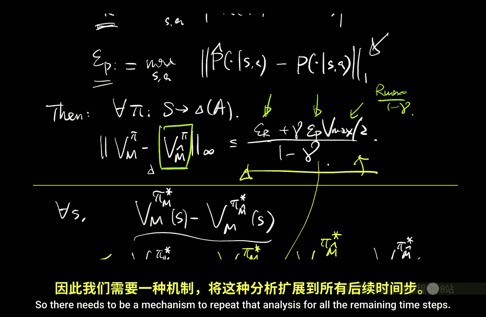

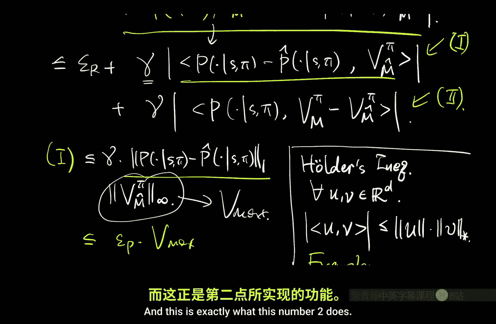

---

## 步骤四：单步误差的集中性界定 🔬

最后，我们需要将 `ε_R` 和 `ε_P` 与样本量 `n` 和置信参数 `δ` 联系起来。这通过集中不等式完成。

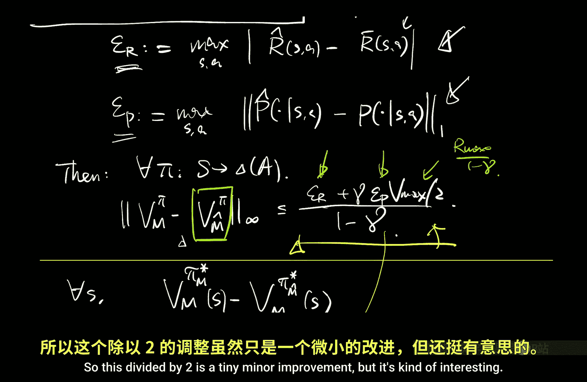

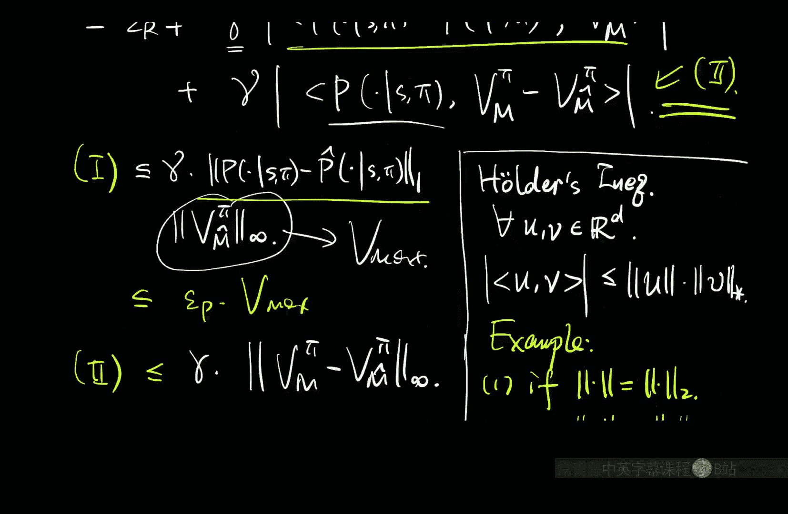

*   **奖励误差 `ε_R`**：对于固定的 `(s,a)`，`R_hat(s,a)` 是 `n` 个独立有界随机变量（奖励）的均值。应用Hoeffding不等式和Union Bound（对所有 `|S||A|` 个 `(s,a)` 对取最大），可以得到以高概率 `1 - δ/2`，
    `ε_R ≤ O( √( (R_max^2 * log(|S||A|/δ)) / n ) )`
*   **转移误差 `ε_P`**：对于固定的 `(s,a)`，`P_hat` 是一个多项分布的经验频率。衡量其与真实分布 `P` 的L1误差更复杂，但可以利用类似的方法（例如，利用每个状态坐标上的Hoeffding bound再结合Union Bound）得到，以高概率 `1 - δ/2`，
    `ε_P ≤ O( √( (|S| * log(|S||A|/δ)) / n ) )`

将这两个界代入最终的决策损失界，我们就得到了一个完整的样本复杂度保证：性能差距以 `O( 1/√n )` 的速率下降，并且与状态空间大小 `|S|` 和动作空间大小 `|A|` 存在依赖关系（通常以 `√(|S| log|S||A|)` 的形式出现）。

---

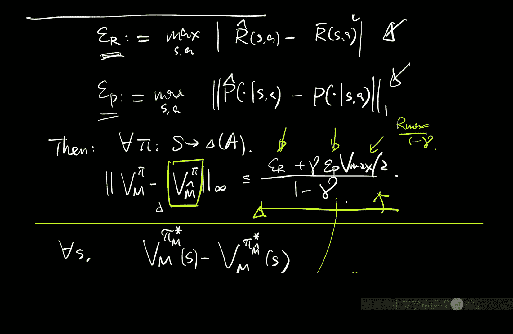

## 现代证明方法简介 🚀

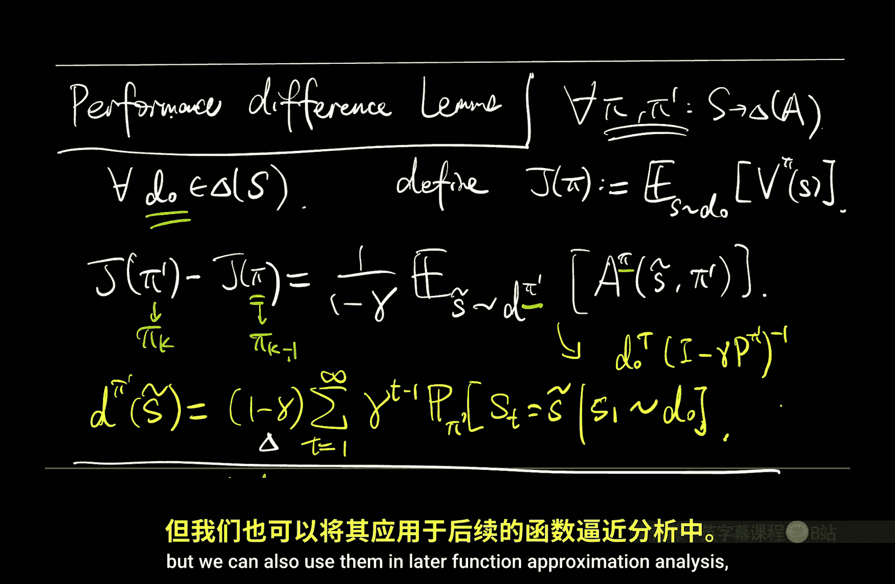

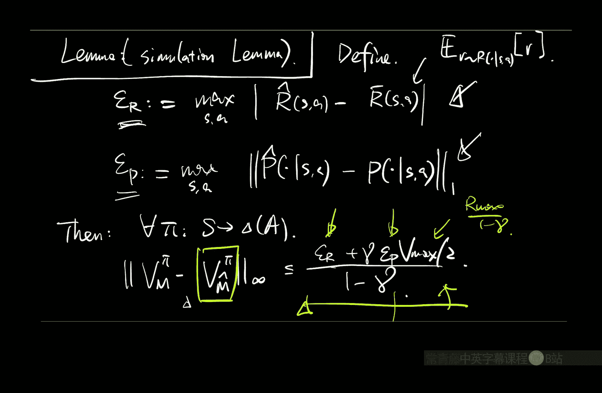

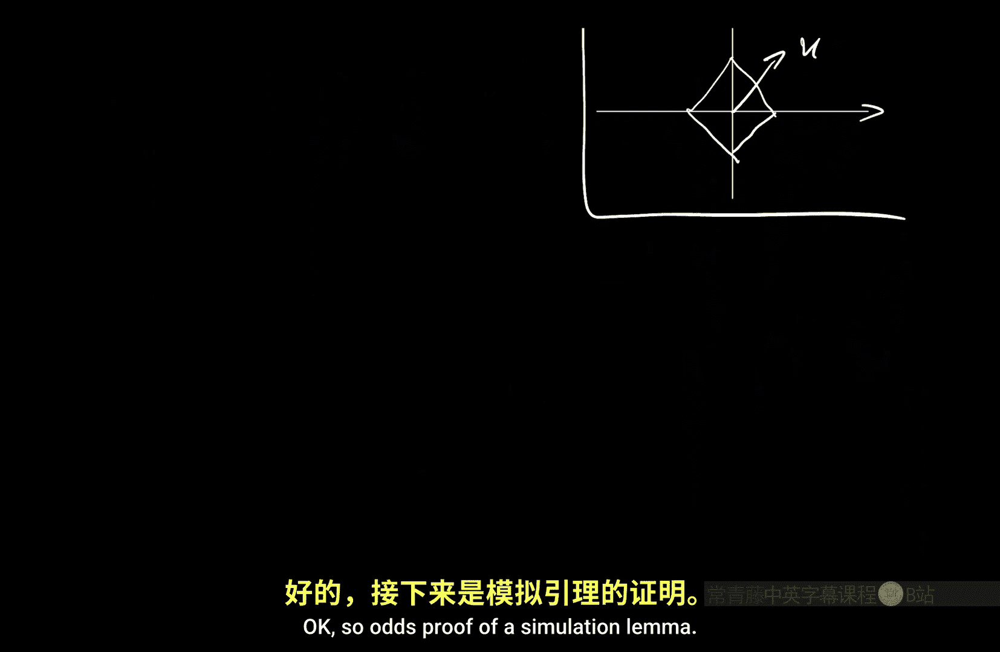

上述经典证明依赖于无穷范数（`L_∞`）和递归展开。在现代分析中，更流行使用一种基于**性能差引理**变体的方法，它更直接地关联了分布上的平均误差。

其核心思想是使用一个更一般的恒等式：对于任意函数 `F`，策略 `π` 在初始分布上的真实性能 `J(π)` 与用 `F` 预测的性能之差，等于 `F` 的贝尔曼误差在策略 `π` 的折扣占用度量下的期望，再乘以一个 `1/(1-γ)` 因子。

利用这个恒等式，并令 `F = V_{M_hat}^π`，我们可以将 `V_M^π - V_{M_hat}^π` 的差异直接表达为关于 `R_hat - R` 和 `P_hat - P` 的期望形式，从而绕过递归展开，并自然地得到关于特定分布（占用度量）的误差界。这种方法在后续处理函数逼近的扩展时更为强大和灵活。

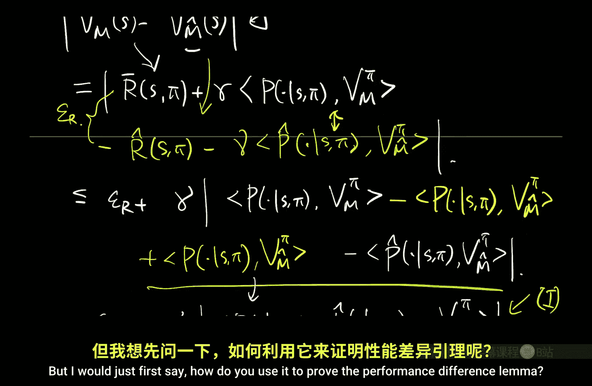

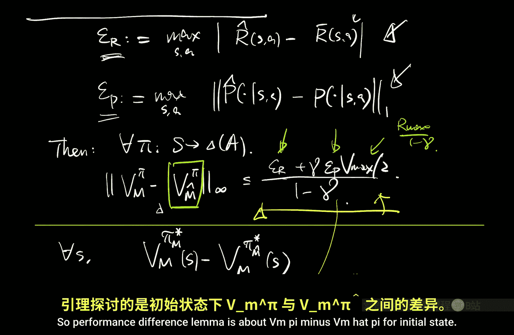

---

## 总结 📝

本节课中我们一起学习了表格强化学习的基础分析框架。
1.  我们从一个理想化的均匀数据收集协议出发。
2.  我们分析了基于最大似然估计的“确定等价性”算法。
3.  分析分为三步：单步集中性分析、误差传播分析（模拟引理）、评估误差到决策损失的转换。
4.  我们详细展示了经典版本的模拟引理证明，它通过贝尔曼方程展开和递归来处理多步误差累积。
5.  我们最终得到了输出策略的次优性界，该界以 `O(1/√n)` 的速率收敛，并依赖于MDP的规模参数。
6.  我们还简要介绍了更现代的证明方法，它通过性能差引理提供了另一种更分布敏感的视角。

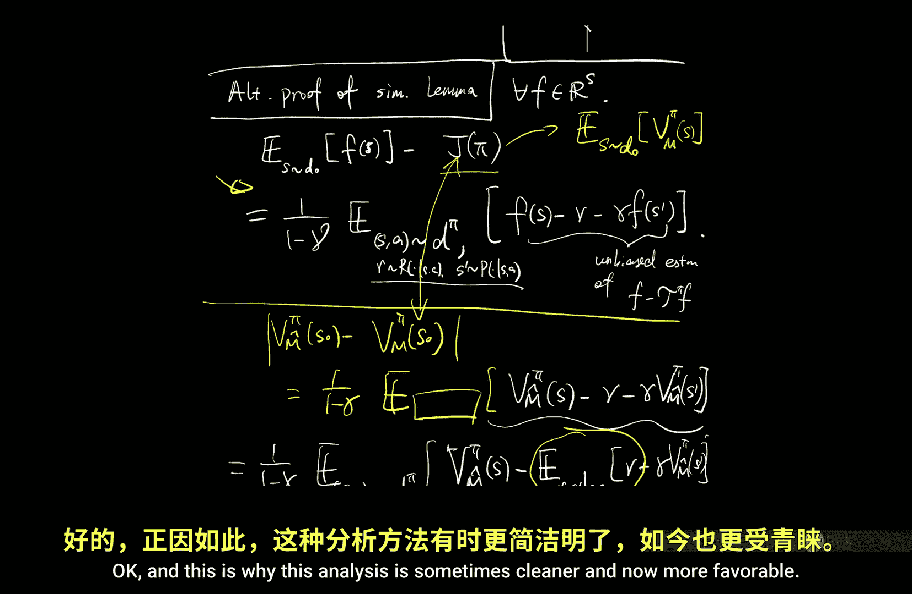

这个分析是许多更高级强化学习理论的基础模板，后续关于函数逼近、在线探索等主题的分析都将建立在此基础之上。