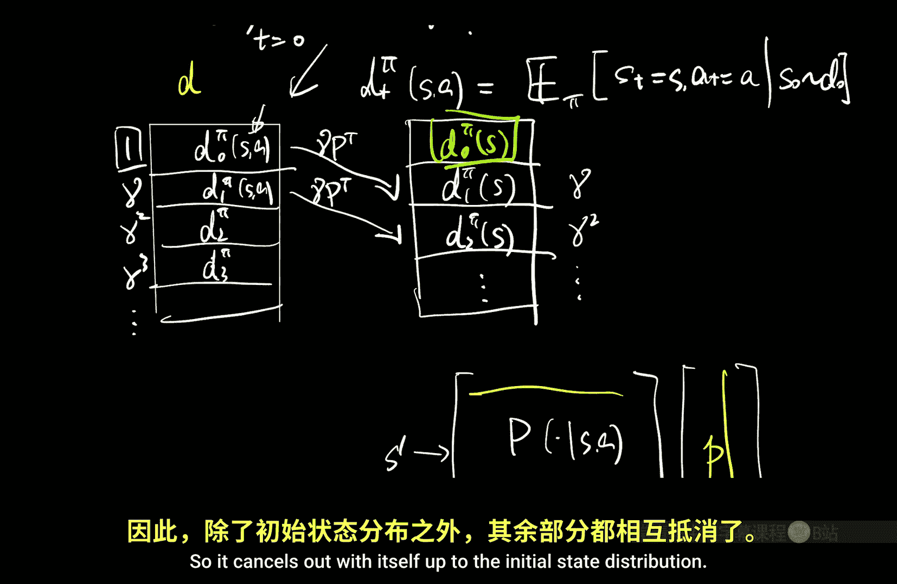
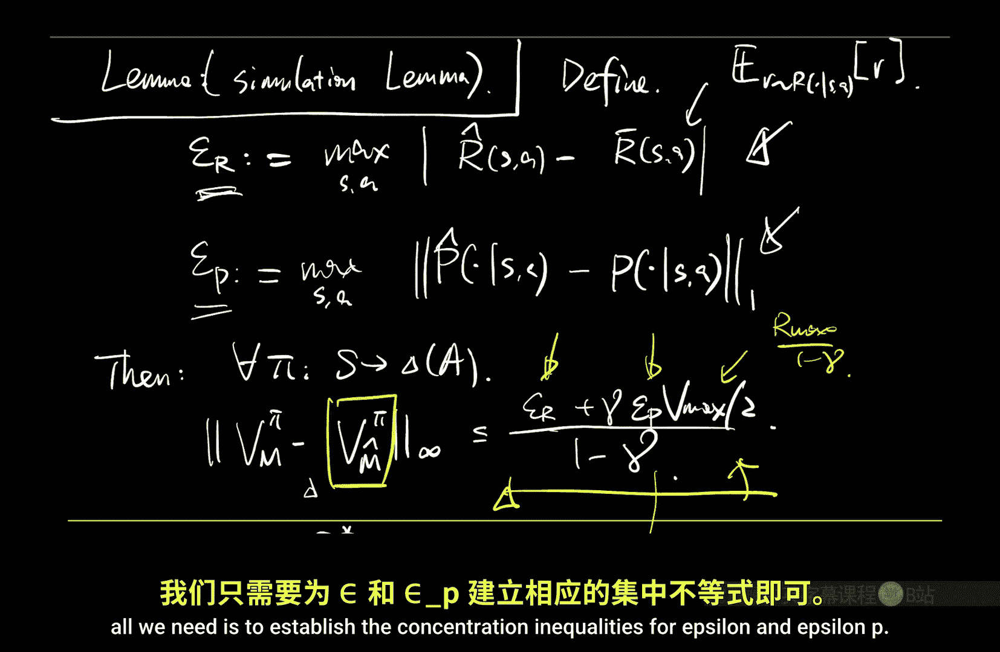
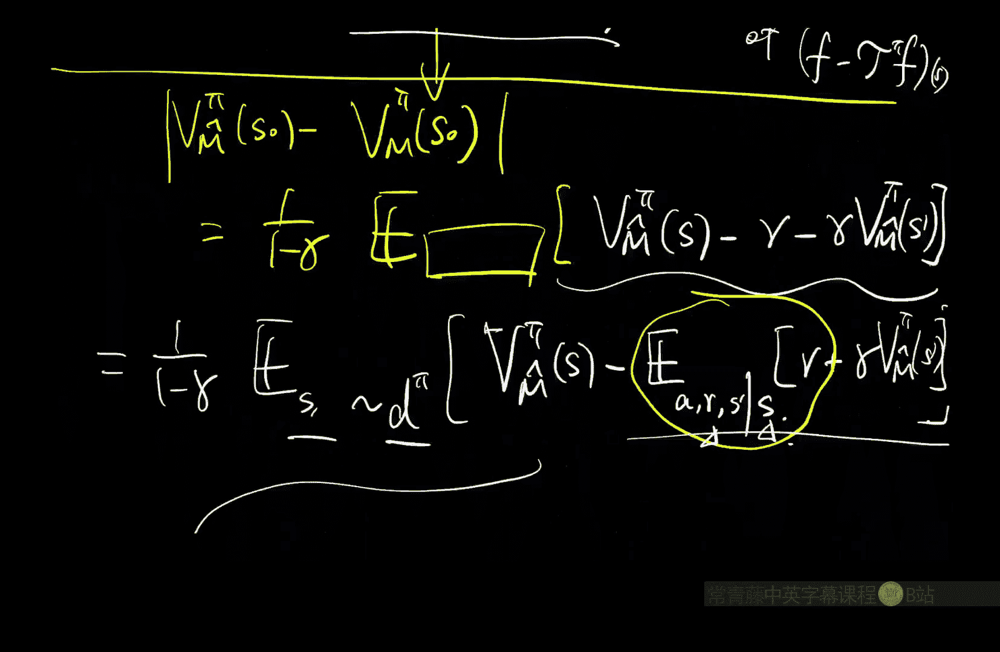
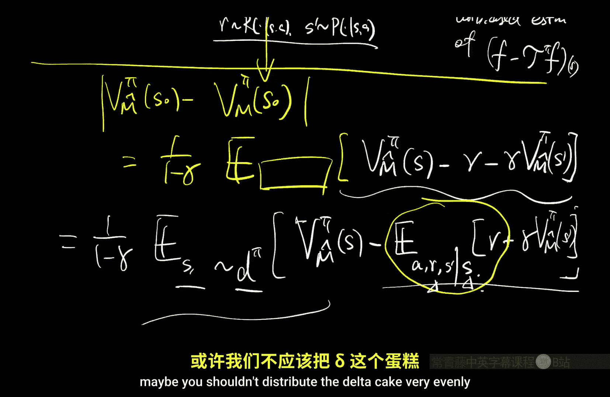
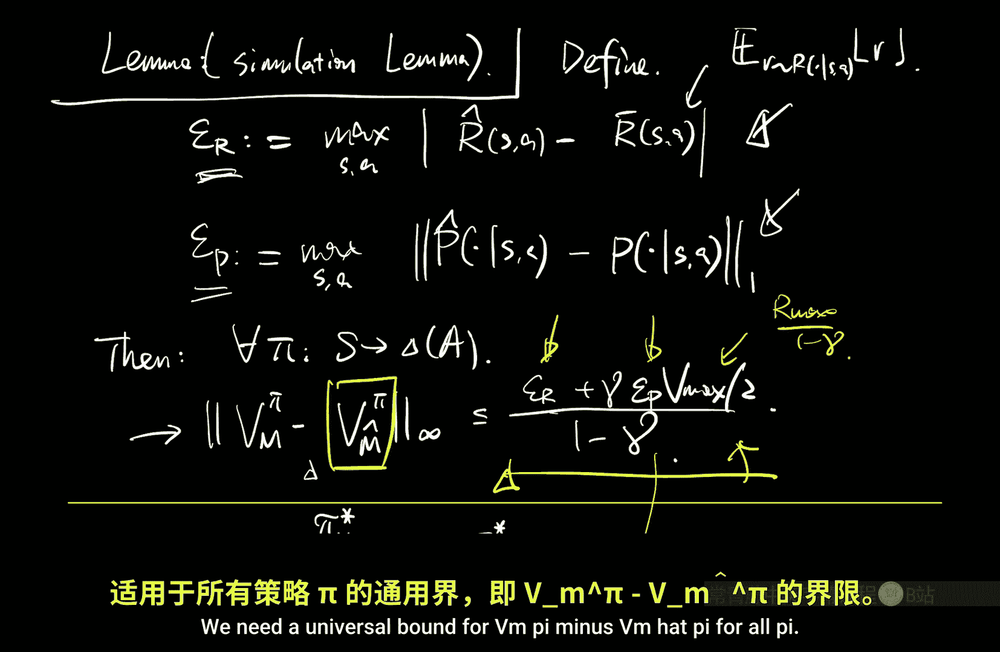
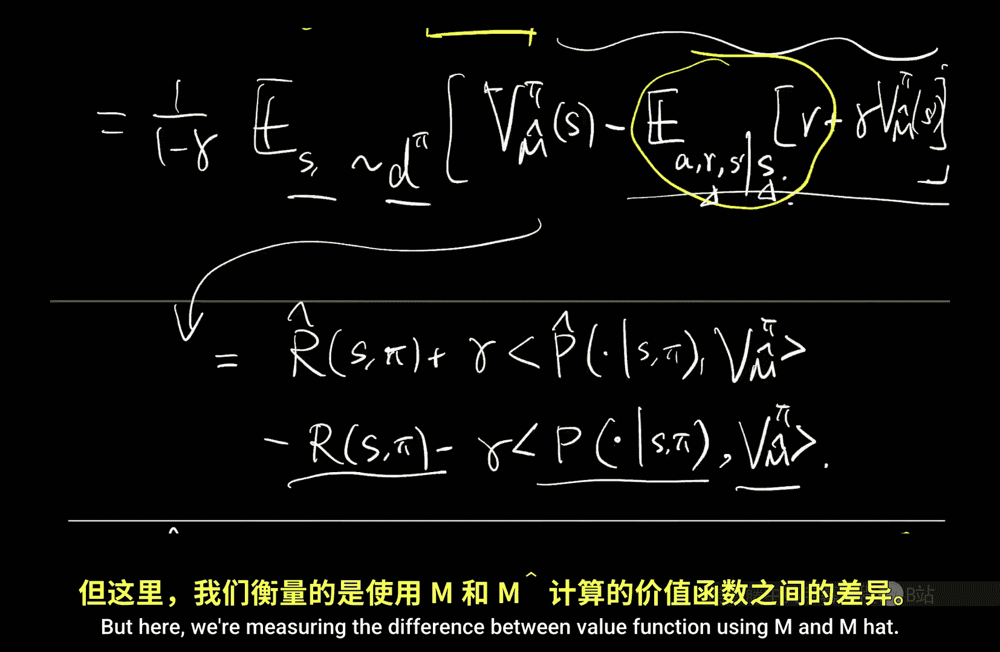
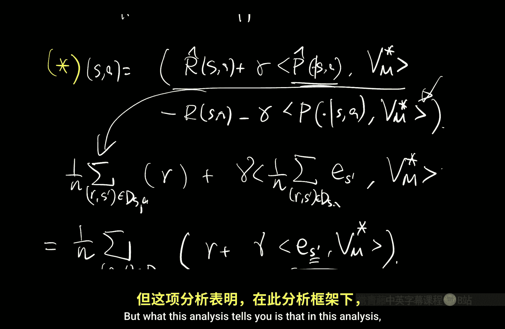

# 016：表格分析（续）（视角2）

在本节课中，我们将继续学习表格化强化学习的分析。我们将完成一个更现代的“模拟引理”的证明，并利用它来建立奖励和转移概率的估计误差边界。最后，我们将探讨一种不依赖于状态空间大小的替代分析方法。

## 模拟引理证明

上一节我们介绍了模拟引理，它用于分析在真实MDP和估计MDP中评估同一策略时的价值函数差异。本节中，我们来证明这个更现代的版本。

该引理陈述如下：对于任意策略 π 和任意函数 F（定义在状态空间上），有：

\[
\mathbb{E}_{s \sim d_0}[F(s)] - J^\pi = \frac{1}{1-\gamma} \mathbb{E}_{(s,a) \sim d^\pi} [F(s) - r - \gamma F(s')]
\]

其中，\( J^\pi \) 是策略 π 在真实MDP中的期望回报，\( d^\pi \) 是折扣占用度量。

以下是证明步骤：

1.  我们从等式右边开始，利用折扣占用度量的定义将其展开为按时间步加权的期望和。
2.  我们将每个时间步的期望重新解释为从初始分布 \( d_0 \) 开始、遵循策略 π 生成的轨迹上的期望。
3.  将求和符号移入期望内部，我们得到一个关于轨迹的期望，其内部是时间步的求和。
4.  展开这个求和，我们会发现一个漂亮的“望远镜”消去现象。
5.  最终，只有初始状态的价值函数期望 \( \mathbb{E}_{s \sim d_0}[F(s)] \) 和轨迹上的累计折扣回报期望 \( J^\pi \) 保留下来，从而完成证明。

这个证明巧妙地利用了贝尔曼流方程的性质，展示了价值函数和占用度量之间的对偶关系。

## 通过集中不等式界定误差

证明了模拟引理后，我们的任务就简化为界定奖励误差 \( \epsilon_R \) 和转移概率误差 \( \epsilon_P \)。这些误差定义为：

\[
\epsilon_R = \max_{s,a} |\hat{r}(s,a) - \bar{r}(s,a)|
\]
\[
\epsilon_P = \max_{s,a} \|\hat{P}(\cdot|s,a) - P(\cdot|s,a)\|_1
\]

其中，\( \hat{r} \) 和 \( \hat{P} \) 是从数据中得到的最大似然估计（即样本平均和经验频率）。

### 奖励误差边界

对于固定的状态-动作对 (s, a)，奖励估计是 N 个独立同分布随机变量的平均值。我们可以直接应用霍夫丁不等式：

\[
|\hat{r}(s,a) - \bar{r}(s,a)| \leq R_{\text{max}} \sqrt{\frac{1}{2N} \log\left(\frac{2}{\delta}\right)}
\]

这里 \( R_{\text{max}} \) 是奖励的取值范围，它必须出现在边界中以保证量纲正确。

### 转移概率误差边界

转移概率的估计更具挑战性，因为我们需要处理一个分布（向量）的估计。目标是界定 L1 范数误差。一个朴素的方法是针对每个下一个状态 \( s' \) 分别应用标量集中不等式，然后利用关系 \( \| \cdot \|_1 \leq S \cdot \| \cdot \|_\infty \) 进行合并。但这种方法会引入一个多余的 \( \sqrt{S} \) 因子。

更紧致的分析是将 L1 范数用其对偶范数（L∞ 范数）表示：

\[
\|P - \hat{P}\|_1 = \max_{u \in \{\pm1\}^S} u^\top (P - \hat{P})
\]

这个最大值在所有由 +1 或 -1 组成的 S 维向量中取得。对于任意一个固定的向量 \( u \)，点积 \( u^\top P \) 可以解释为函数 \( u \) 在分布 \( P \) 下的期望。而 \( u^\top \hat{P} \) 是同一函数在经验分布下的平均值。因此，对于每个固定的 \( u \)，我们可以再次应用霍夫丁不等式来界定这个标量差。

为了得到一个一致的边界（对所有 \( u \) 同时成立），我们需要对所有可能的 \( 2^S \) 个 \( u \) 向量进行联合界。取对数后，这会在边界中引入一个 \( O(\sqrt{S}) \) 的因子，而不是朴素方法中的 \( O(S) \) 因子。

最后，我们需要对所有 \( S \times A \) 个状态-动作对进行联合界，将总的失败概率 \( \delta \) 合理分配。

### 最终边界

将上述所有部分组合起来，并代入模拟引理导出的策略次优性边界，我们可以得到最终的高概率边界：

\[
\|V_M^* - V_M^{\hat{\pi}^*}\|_\infty \leq O\left( \frac{R_{\text{max}}}{1-\gamma} \sqrt{\frac{S}{N}} + \frac{R_{\text{max}}}{(1-\gamma)^2} \sqrt{\frac{S}{N}} \right)
\]

（这里的大O符号隐藏了对数因子和常数。）

**重要提示**：在分析中显式保留 \( R_{\text{max}} \) 而非常规化奖励到 [0,1]，有助于保持量纲清晰，并更容易发现推导错误（例如边界中不应出现 \( R_{\text{max}}^2 \) 这样的项）。

## 替代分析：独立于状态空间大小的样本复杂度

上述分析要求每个 (s,a) 对的样本数 N 与状态数 S 成比例，以确保能较好地估计整个转移分布。然而，存在一种更巧妙的替代分析，其样本复杂度可以独立于 S。

核心思想是直接分析最优策略的价值差异，而不是分析所有策略的模拟误差。我们考虑以下关系：

\[
V_M^* - V_M^{\hat{\pi}^*} \leq \frac{2}{1-\gamma} \|Q_{\hat{M}}^* - Q_M^*\|_\infty
\]

这里，\( \hat{\pi}^* \) 是在估计MDP \( \hat{M} \) 中的最优策略。因此，问题转化为界定两个不同MDP中最优Q函数的差异。

通过展开贝尔曼最优方程并利用收缩性质，我们可以将 \( Q_{\hat{M}}^*(s,a) - Q_M^*(s,a) \) 的误差，主要控制为以下“模型误差”项：

\[
\left| \left( \hat{r}(s,a) + \gamma \hat{P}(\cdot|s,a)^\top V_M^* \right) - \left( r(s,a) + \gamma P(\cdot|s,a)^\top V_M^* \right) \right|
\]

关键观察在于：对于每个 (s,a)，括号内的表达式 \( r + \gamma V_M^*(s') \) 是一个**标量**随机变量（其中 \( s' \sim P(\cdot|s,a) \)）。我们的经验估计 \( \hat{r}(s,a) + \gamma \frac{1}{N} \sum_{i} V_M^*(s_i') \) 正是这个标量随机变量样本的平均值。

因此，我们可以直接对这个标量应用霍夫丁不等式。由于 \( V_M^* \) 是固定的（虽然未知），每个样本 \( V_M^*(s_i') \) 是独立同分布的。这样，我们得到的误差边界形式为 \( O(R_{\text{max}} / \sqrt{N}) \)，其中**没有显式依赖于状态数 S**。S 的影响被隐含地吸收在 \( V_M^* \) 的方差中，但通过集中不等式，我们无需为恢复整个分布支付 \( O(S) \) 的样本成本。

这种分析表明，对于寻找一个近似最优策略这个目标而言，我们并不需要精确估计整个转移概率分布。我们只需要能够准确估计**在真实最优价值函数 \( V_M^* \) 视角下**的期望下一步回报即可。这是一种更高效、更专注于最终目标的学习方式。

## 总结

本节课中我们一起学习了：
1.  完成了现代版“模拟引理”的证明，该引理将策略评估误差与单步贝尔曼误差联系起来。
2.  通过集中不等式，详细推导了如何界定奖励和转移概率的估计误差，并讨论了获得紧致边界的技术细节。
3.  介绍并剖析了一种替代分析方法，该方法表明，为了获得近似最优策略，所需的样本复杂度可以独立于状态空间的大小，这为我们设计更高效的强化学习算法提供了重要洞见。