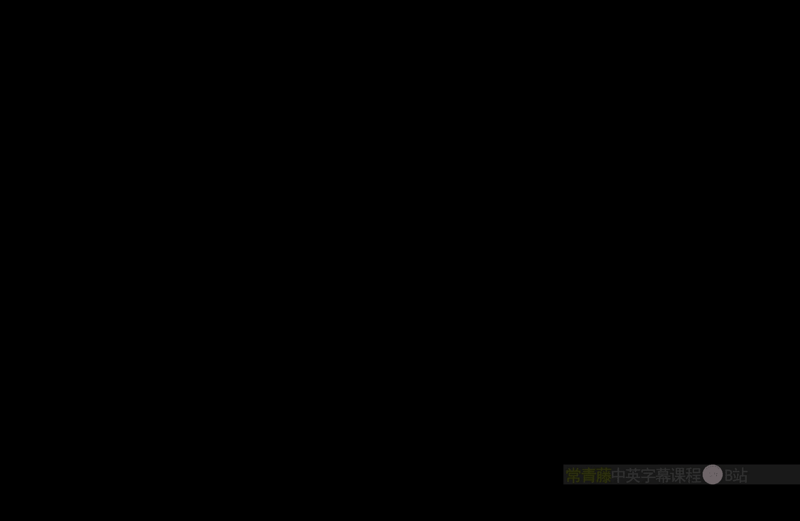
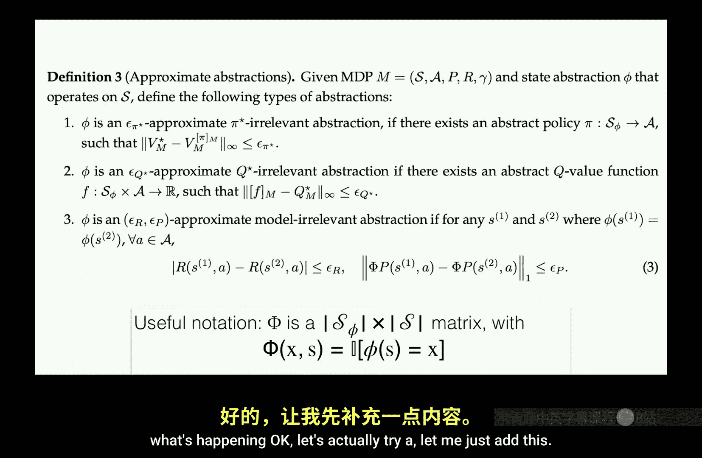
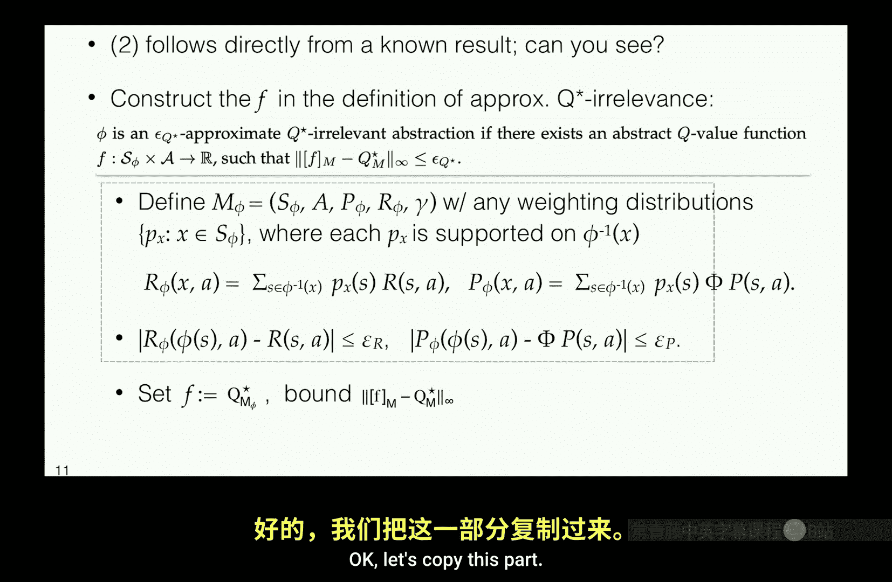
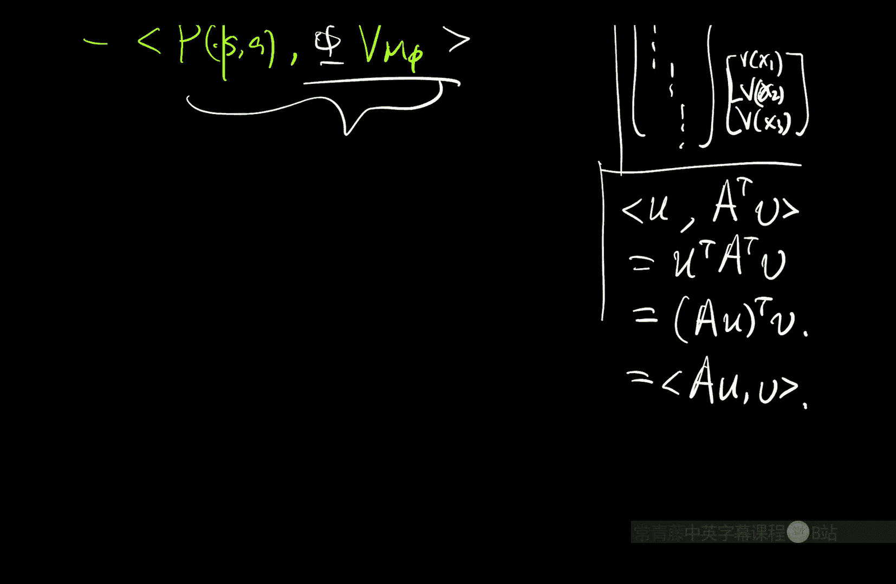

# 018：状态抽象（视角2） 🧠

在本节课中，我们将学习状态抽象的核心概念。这是一种介于表格化设置与通用函数逼近之间的中间学习框架。我们将探讨如何通过聚合或划分状态空间来实现泛化，并深入研究在强化学习中定义“状态相似性”的复杂性。

---

## 课程概述 📋

上一讲我们完成了表格化情况的分析。然而，长期以来，强化学习理论分析大多集中于表格化方法，这在理论与实践之间造成了巨大鸿沟。在实践中，从2014-2015年左右开始，深度强化学习兴起，例如DeepMind、AlphaGo以及在Atari游戏上实现超人性能的《自然》论文等。

鉴于这一巨大差距，我们最终需要处理复杂函数逼近以及大型甚至可能是连续的状态空间（有时是动作空间）问题。因此，在接下来的几周里，我们将朝着这个方向前进，逐步深入，最终解决大型状态空间的问题。

本周，我们将讨论一个中间概念或学习设置，它介于表格化设置和通用函数逼近之间，即**状态抽象**。

---

## 状态抽象：一种简单的泛化方案 🔄

从函数变换的角度来看，状态抽象是一种相当朴素和简单的泛化方案。但正是由于其简单性，它使我们能够深入思考在马尔可夫决策过程中，不同状态之间泛化的真正含义。与监督学习中可提出的分析问题相比，这个问题变得极其复杂和微妙。

我认为，这是许多其他强化学习课程不会教授的部分，但可能是你从强化学习理论中学到的最有价值的东西之一，即使你更关注应用方面。

### 问题设置

和往常一样，我们考虑一个MDP `(S, A, P, R, γ)`。现在，我们假设动作空间仍然是有限且可管理的。但从现在开始，默认情况下，我们将考虑非常大的状态空间，大到甚至无法通过计算枚举，例如连续状态空间或图像输入等。

因此，表格化方法将不再适用，尤其是在学习设置中。正如我们在介绍性幻灯片中提到的，这必然需要某种形式的泛化。每当你收到关于一个状态的数据时，你不能只使用这些数据来学习这个特定状态，你必须将这些知识泛化到在某种意义上与你所见到的确切状态相似的其他状态。

### 状态抽象的定义

状态抽象本质上是一种聚合或划分。给定原始状态空间 `S` 非常大，我们可以写下状态空间的一个划分。在每个部分内，我们假装所有状态都是相同的。

一个简单的例子：假设我有一个连续状态空间 `S = R^d` 或欧几里得空间 `R^d` 中的一个有界盒子。我能做的最简单的事情就是将连续状态空间网格化。现在我们得到有限数量的小网格，每个网格内实际上有无限多个状态，但我将假装所有这些状态都是相同的。

实际上，每当我获得数据时，例如在两个不同点获得数据，我会将这些原始状态映射到网格ID，并假装我实际看到的只是作为离散状态的网格ID。

这样做的好处是，如果你进行这种简单的转换，你可以假装自己处于一个表格化问题中。在算法上，你可以应用所有表格化算法和分析（分析部分我们稍后讨论）。至少，这给了你一个可行的起点。

### 核心问题

现在，真正的问题是：如果你任意地将状态空间网格化，你基本上是在声称所有被聚合到一个抽象状态中的状态是等价的或至少是相似的，但这可能与实际的MDP不一致。

因此，我们想问的问题是：如果我任意地写下一个聚合方案（我们称之为状态抽象方案），即一个将原始状态映射到某些抽象状态的映射 `φ`，这真的是一个好的抽象吗？当我们聚合状态时，被聚合的状态真的彼此相似吗？

一个类比是监督学习中的回归问题，特别是直方图回归。你将输入空间网格化为一些网格，在每个网格内，你将所有东西视为相同。如果你在一个网格内有多个点，你只需取它们的平均值作为预测标签。显然，这里有一个简单的概念来判断你是否正确地划分了空间：只要函数在每个网格内变化不大，你的离散化就是好的。相反，如果函数在一个网格内变化很大，但你将它们都视为相同，那么你就是在做一个糟糕的近似。

但在强化学习中，我们没有“输出值”这个概念。那么，我们应该如何定义状态的相似性呢？

---

## 状态抽象的候选标准 🎯

以下是几个候选答案：

1.  **最优动作相同**：如果两个状态共享相同的最优动作，则它们从MDP的角度来看是等价的或相似的。
2.  **最优值函数相同**：如果两个状态共享相同的最优值函数值，则它们是相似的。
3.  **奖励和动态相似**：只有当两个状态的奖励函数和转移动态（转移函数）相似时，它们才是真正相似的。

在强化学习中，由于我们拥有这个非常丰富和灵活的动态系统框架，它给这个看似简单的问题增加了许多复杂性。我们有多层不同的、看似合理的答案。

在本讲中，我们将首先将这些直观的、非正式的答案形式化为精确的数学陈述。然后，我们将研究当你提出的抽象满足这些不同标准时，关于学习算法的保证你能说些什么。

---

## 抽象层次结构的定义 📊

给定任意映射 `φ: S -> S_φ`，其中 `S_φ` 是抽象状态空间。我们将定义不同的标准来判断这个映射是否“好”。

### 1. π* 相关性 (π*-Relevance)

这对应于“所有被聚合的状态共享相同的最优动作”这一条件。

**数学定义**：存在一个原始MDP的最优策略 `π_M*`，使得对于任意 `s1, s2 ∈ S`，如果 `φ(s1) = φ(s2)`，则有 `π_M*(s1) = π_M*(s2)`。

一个细微差别是：在MDP中可能存在多个最优策略。这里我们只需要找到一个满足此条件的最优策略就足够了。否则，考虑一个奖励处处为0或常数的平凡MDP，每个策略都是最优的。根据此标准的精神，我们应该能够将所有状态聚合在一起。但如果你要求所有可能的最优策略都满足此条件，你将无法进行任何聚合。

### 2. Q* 相关性 (Q*-Relevance)

抽象 `φ` 被称为 **Q* 相关**，如果对于任意动作 `a`，MDP中的最优Q函数 `Q_M*(s, a)` 在任意两个被聚合的状态 `s1, s2`（即 `φ(s1) = φ(s2)`）上总是给出相同的值。

**数学定义**：对于任意 `s1, s2 ∈ S`，如果 `φ(s1) = φ(s2)`，则对于所有 `a ∈ A`，有 `Q_M*(s1, a) = Q_M*(s2, a)`。

### 3. 模型相关性 / 双模拟 (Model-Relevance / Bisimulation)

这个概念（有时称为双模拟）与理论计算机科学中的有限自动机理论有一些有趣的联系。其思想是：只有当抽象 `φ` 保留了奖励和转移动态时，它才是好的。

*   **奖励条件**：对于任意动作 `a`，每当两个状态 `s1, s2` 被聚合时（`φ(s1) = φ(s2)`），它们的奖励函数必须相同：`R(s1, a) = R(s2, a)`。
*   **转移条件**：这里是有趣的部分。我们不是看转移到下一个原始状态 `s'` 的原始概率，而是看从每个原始状态 `s` 出发，给定动作 `a`，到达下一个**抽象状态** `x' ∈ S_φ` 的概率。这个概率是原始转移概率对所有映射到 `x'` 的原始状态 `s'` 的求和。

**形式化定义**：对于任意 `s1, s2 ∈ S`，如果 `φ(s1) = φ(s2)`，则对于所有 `a ∈ A`：
1.  `R(s1, a) = R(s2, a)`
2.  对于所有 `x' ∈ S_φ`，有 `∑_{s' : φ(s')=x'} P(s' | s1, a) = ∑_{s' : φ(s')=x'} P(s' | s2, a)`

这个定义有点递归的味道，因为为了检查 `φ` 是否是一个好的抽象，`φ` 本身也进入了判断标准。

---

## 抽象层次结构定理 🏗️

这三个标准实际上形成一个严格的层次结构：

**定理**：模型相关性（双模拟）是最严格的条件，Q* 相关性次之，π* 相关性是最宽松的。具体来说：
*   如果 `φ` 满足模型相关性，那么它必然满足 Q* 相关性。
*   如果 `φ` 满足 Q* 相关性，那么它必然满足 π* 相关性。

因此，这是一个层次结构。你可以将抽象 `φ` 的集合想象成一个空间：模型相关性是最小的圆，Q* 相关性是更大的圆，π* 相关性是最大的圆。

第二个箭头（Q* 相关性 ⇒ π* 相关性）是显而易见的，因为 `π*` 是关于 `Q*` 的贪婪策略。如果 `Q*` 在每个聚合内对所有动作总是具有完全相同的值，那么只要以一致的方式处理平局，你就可以构造出一个满足 π* 相关性条件的最优策略。

第一个箭头（模型相关性 ⇒ Q* 相关性）的证明不那么平凡，我们稍后会进行证明。

---

## 为什么双模拟的定义如此设计？ 🤔

我们为什么使用那个更复杂的、先将分布坍缩到抽象状态空间再进行比较的定义，而不是直接比较原始状态空间上的转移概率？

考虑以下例子：我们有一个通用的MDP，其状态变量为 `X`。我们人工地将其扩展为一个更大的MDP，状态空间为 `S = (X, Z)`，其中 `Z` 是一个与原始过程同步演化的、独立的马尔可夫链。这个 `Z` 链与奖励无关，也不影响 `X` 的动态。

直觉上，`Z` 是无关的（例如，清洁机器人任务中电视上播放的图像）。一个自然的抽象是 `φ(X, Z) = X`，即丢弃 `Z` 因子。这似乎是一个完美的抽象。

然而，如果我们尝试使用“原始转移概率必须相同”的标准来验证，它会失败。因为对于相同的 `X` 但不同的 `Z1` 和 `Z2`，由于 `Z` 链的动态，原始的下一个状态分布 `P((X', Z') | (X, Z1), a)` 和 `P((X', Z') | (X, Z2), a)` 是不同的。

双模拟的定义通过先对要忽略的因子（这里是 `Z'`）进行边缘化来解决这个问题。当我们对 `Z'` 求和时，`∑_{Z'} P(Z' | Z) = 1`，我们得到的结果只依赖于 `X`。因此，双模拟条件允许我们认识到 `φ(X, Z) = X` 是一个好的抽象。

这个定义非常强大：即使你的动作可以影响那个无关的因子 `Z`（例如，机器人不小心按了遥控器换了台），但只要 `Z` 不影响核心过程 `X`，丢弃 `Z` 在双模拟下仍然是有效的。

---

## 抽象MDP模型 🧩

给定一个满足双模拟的抽象 `φ`，它可以隐式地诱导出一个定义在抽象状态空间 `S_φ` 上的**抽象MDP模型** `M_φ`。

这个模型不仅在概念上存在，而且实际上就是你将在规划或学习设置中使用的东西。

*   **规划设置**：如果你知道MDP并想节省计算成本，你可以使用映射 `φ` 来计算这个抽象MDP，然后在这个更小的抽象MDP中运行任何规划算法（如动态规划）。
*   **学习设置**：每当你从原始MDP获得转移数据 `(s, a, r, s')`，你可以将它们处理为 `(φ(s), a, r, φ(s'))`，使其看起来像是来自抽象状态空间的表格数据。随着数据量的增加，你学习的模型将恰好是这个更小的抽象MDP `M_φ`。

**抽象MDP `M_φ` 的定义**：
*   状态空间：`S_φ`
*   动作空间：`A`（与原始相同）
*   折扣因子：`γ`（与原始相同）
*   奖励函数：`R_φ(x, a) = R(s, a)` 对于任意 `s` 使得 `φ(s) = x`（由双模拟的奖励条件保证此定义一致）。
*   转移函数：`P_φ(x' | x, a) = ∑_{s': φ(s')=x'} P(s' | s, a)` 对于任意 `s` 使得 `φ(s) = x`（由双模拟的转移条件保证此定义一致）。

双模拟的一个关键含义是它保留了最优Q函数。也就是说，在抽象MDP `M_φ` 中计算出的最优Q函数 `Q_{M_φ}*`，通过提升操作（`[Q_{M_φ}*]_φ(s, a) = Q_{M_φ}*(φ(s), a)`）后，等于原始MDP的最优Q函数 `Q_M*`。类似的性质也适用于任何“抽象兼容”的策略（即其动作分布仅依赖于抽象状态 `φ(s)` 的策略）的值函数。

---

## 扩展到动作抽象与同态 🔄

上述框架可以自然地扩展到包含动作聚合和置换。典型的例子是一个对称的网格世界。如果地图沿对角线对称，那么状态A和状态B是镜像对称的，直觉上应该可以聚合。

但是，如果你检查双模拟条件，它可能不成立。例如，从A向下走可能碰到障碍物，而从B向下走可能进入空闲格子。问题在于，在对称意义上，从A“向下”的动作实际上对应于从B“向左”的动作。

解决这个问题的扩展称为 **MDP同态 (MDP Homomorphisms)**。它稍微修改了双模拟的定义，允许动作置换以及状态-动作对的聚合。这更符合我们对语义对称性的直觉。

这个例子告诉我们，即使MDP有一个通用的动作空间，我们也不应默认认为符号相同的动作在整个状态空间中意义相同。

---

## 近似抽象与层次结构证明思路 📐

在实际中，严格的相等条件可能太强。因此我们定义**近似版本**的抽象标准，其中允许小的误差 `ε_R`, `ε_P`, `ε_Q*`, `ε_π*`。当这些误差参数趋于0时，我们就恢复了之前的精确定义。

一个关键的证明目标是建立近似版本下的层次结构定理：

**定理（近似版本）**：如果 `φ` 是一个 `(ε_R, ε_P)`-近似双模拟，那么它也是一个 `ε_Q*`-近似 Q* 相关抽象，其中 `ε_Q*` 是 `ε_R` 和 `ε_P` 的函数，并且当 `ε_R, ε_P → 0` 时，有 `ε_Q* → 0`。

**证明思路**：
1.  **构造抽象模型**：对于近似双模拟，我们不能再唯一定义抽象模型，因为被聚合的状态给出的奖励和转移分布只是相近而非相同。我们可以通过在被聚合的状态上取任意加权平均来定义一个近似的抽象MDP `M_φ`。由于被平均的量彼此接近，得到的抽象奖励 `R_φ` 和转移 `P_φ` 与任何原始状态对应的坍缩分布也接近。
2.  **定义目标函数**：令 `F` 为抽象MDP `M_φ` 的最优Q函数 `Q_{M_φ}*`。我们的目标是证明，将 `F` 提升到原始状态空间后得到的函数 `[F]_φ`，与原始最优Q函数 `Q_M*` 在无穷范数意义下接近。
3.  **利用贝尔曼方程**：比较 `[F]_φ(s,a)` 和 `Q_M*(s,a)`。将它们分别用各自MDP的贝尔曼方程展开，会得到包含 `R_φ`, `P_φ`, `R`, `P` 的项。
4.  **误差分解**：利用近似双模拟的条件（`R_φ` 接近 `R`，`P_φ` 接近坍缩后的 `P`）以及提升算子的性质，可以将差值分解为几部分。其中一部分是瞬时误差（由 `ε_R` 和 `ε_P` 控制），另一部分递归地包含 `[F]_φ` 与 `Q_M*` 的差值本身。
5.  **求解递归不等式**：通过类似压缩映射论证的技巧，可以从递归不等式中解出 `|| [F]_φ - Q_M* ||_∞` 的上界，该上界是 `ε_R` 和 `ε_P` 的函数，并且当 `ε_R, ε_P → 0` 时趋于0。

证明中的一个有用技巧是将抽象映射 `φ` 表示为一个矩阵 `Φ ∈ {0,1}^{|S_φ| × |S|}`，其中 `Φ(x, s) = 1` 当且仅当 `φ(s) = x`。那么：
*   将原始分布 `p` 坍缩到抽象空间的操作可以表示为 `Φ p`。
*   将抽象值函数 `v` 提升到原始空间的操作可以表示为 `Φ^T v`。

这个矩阵表示简化了许多计算。

---

## 总结 🎓

本节课我们一起学习了状态抽象的核心思想：

1.  **动机**：为了将表格化方法扩展到大型或连续状态空间，我们需要泛化。状态抽象通过聚合“相似”状态来实现泛化。
2.  **关键问题**：在强化学习中定义“状态相似性”比监督学习更复杂，我们探讨了三种候选标准：基于最优动作（π*相关性）、基于最优值（Q*相关性）、基于模型动态（双模拟/模型相关性）。
3.  **抽象层次结构**：这三种标准形成一个严格的层次：**双模拟 ⇒ Q*相关性 ⇒ π*相关性**。双模拟是最严格但能提供最强保证的条件。
4.  **抽象模型**：一个好的抽象（尤其是双模拟）可以诱导出一个更小的、定义在抽象状态空间上的MDP。在这个小模型上进行规划或学习，其结果可以有效地提升回原始问题。
5.  **近似与扩展**：我们讨论了这些标准的近似版本，以及如何将框架扩展到包含动作抽象（同态）。

状态抽象虽然是一种简单的泛化形式，但它迫使我们去形式化强化学习中关于表示和泛化的深刻问题，为理解更复杂的函数逼近方法奠定了基础。