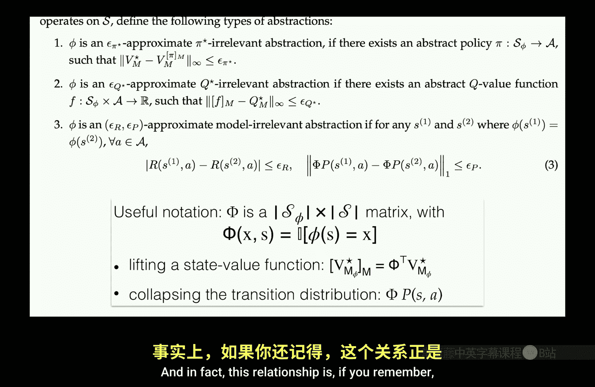
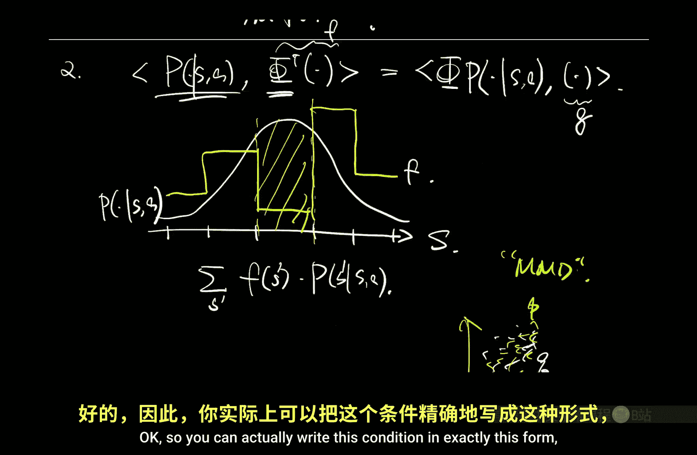
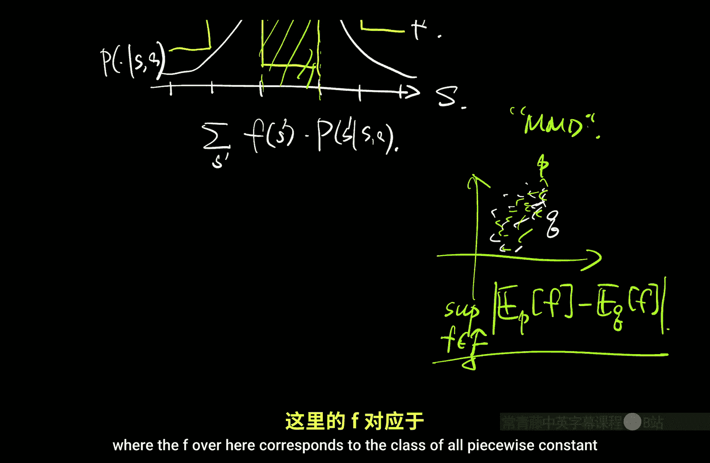
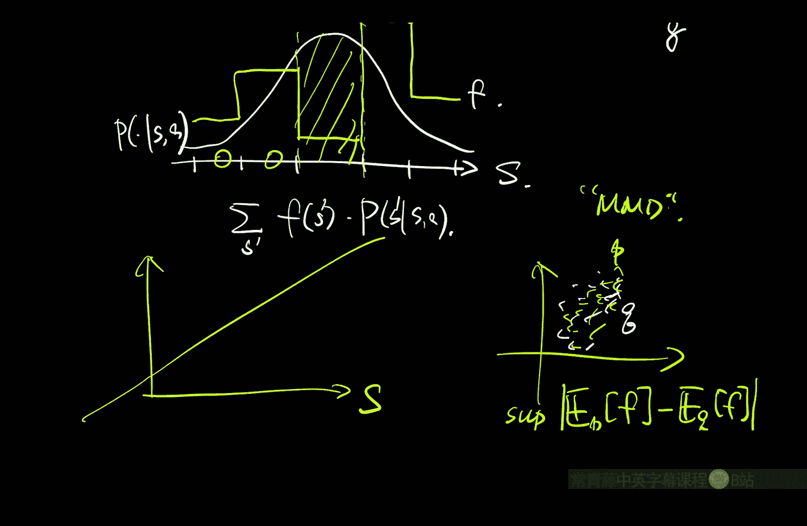
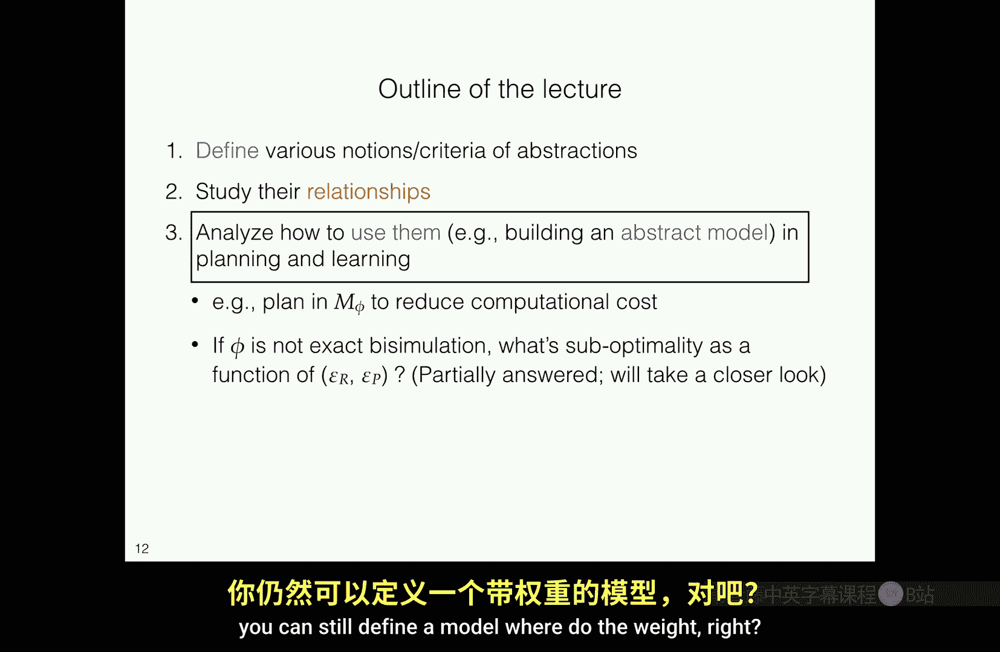
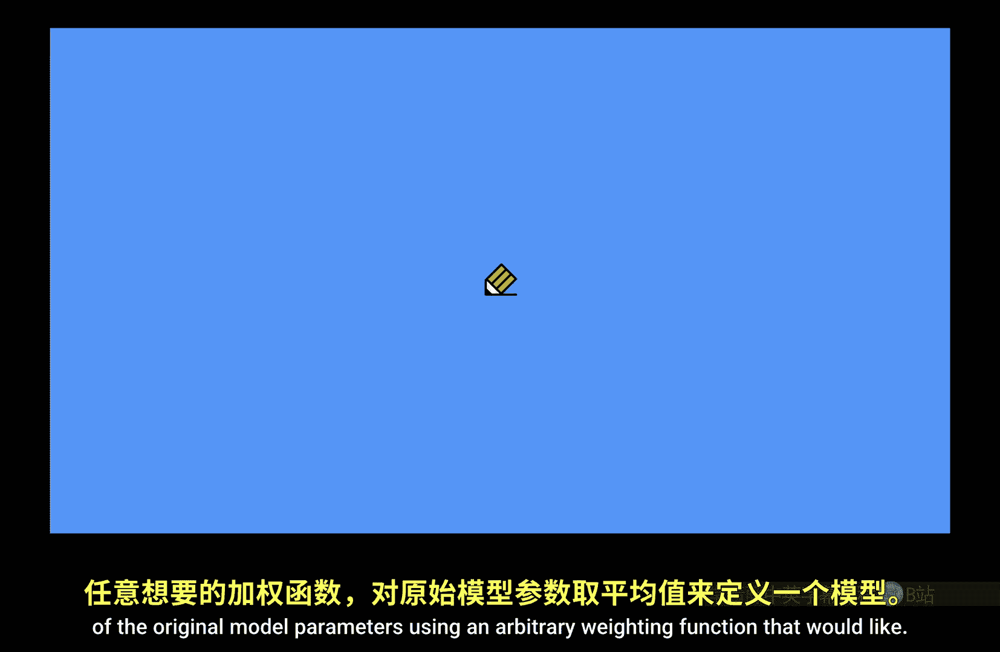
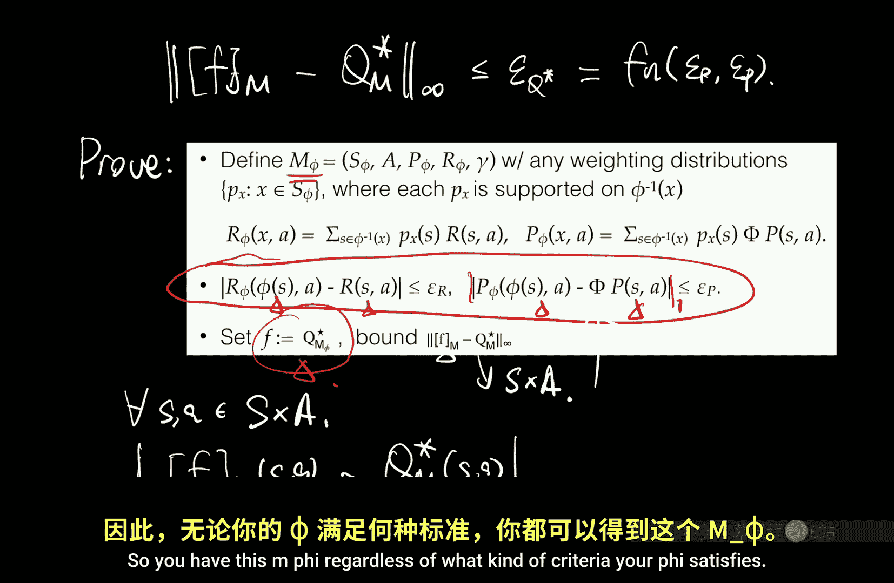
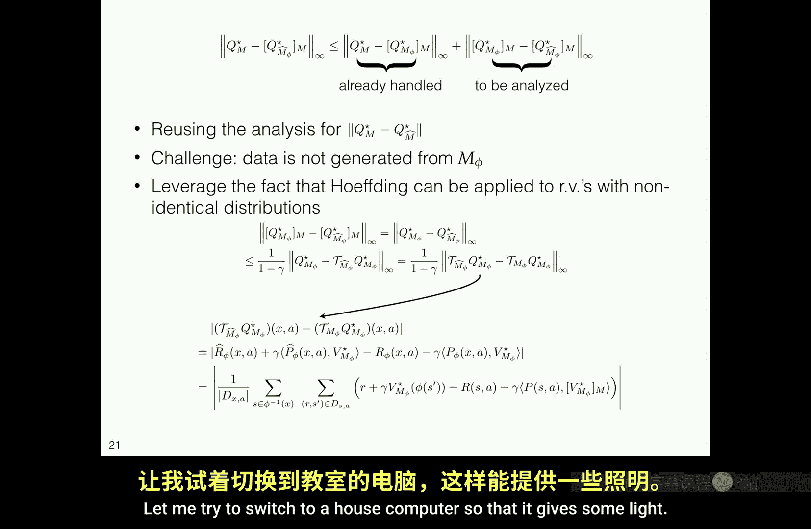

# 020：P20 状态抽象（续）（视角2）📚

在本节课中，我们将继续深入探讨状态抽象，特别是从“视角2”来理解抽象模型与原始模型之间的关系。我们将回顾并深化对“双向模拟”概念的理解，探讨不同抽象标准（如Q*相关性和π*相关性）下的模型构建与规划效果，并简要介绍在抽象模型中进行学习的思路。

---

## 课程公告与回顾 📢

在进入正题之前，有两个简短的课程公告。

*   **作业2**：现已发布，大约两周后（下下周三上课前）截止。助教计划在截止前一天安排一次答疑时间。
*   **项目提案**：大约在作业2截止后10天（即本月25、26日左右）提交。现在是开始思考项目选题的好时机。我已更新了项目参考文献列表，其中包含了去年以来我注意到的最新论文。这份列表旨在提供选题方向和范围参考，但**不限制**你的选择。如果你选择的论文风格与该列表中的论文差异很大，建议提前与我讨论。项目提案**不是最终承诺**，后续可以更改，其主要目的是让我检查并提供建设性反馈。

---

## 回顾：状态抽象与双向模拟 🔄

上一节我们介绍了状态抽象，核心问题是：**判断一个给定抽象是否合理的标准是什么？**

我们建立了一个抽象标准的层次结构：π*相关性、Q*相关性和模型相关性（即双向模拟）。前两者更直观，而我们重点讨论了**双向模拟**作为合理定义的原因。

一旦定义了双向模拟，它会自然地诱导出一个定义在抽象状态空间上的**抽象模型**。这个模型对于今天的课程内容至关重要。

我们还介绍了近似版本和**Φ矩阵**，这是一种方便的线性代数表示法：
*   给定原始状态空间上的一个分布，左乘Φ矩阵相当于将其**边缘化**到抽象状态空间。
*   给定抽象模型上的一个价值函数（低维向量），右乘Φ的转置（Φᵀ）相当于将其**拉伸**回原始状态空间，成为一个分段常数向量。

因此，Φ矩阵便于我们在原始状态空间和抽象状态空间之间来回转换。这揭示了价值函数和状态分布之间的一种**对偶关系**：Φ负责将状态分布从原始空间边缘化到抽象空间，而Φᵀ则对价值函数起着反向作用。

---

## 深入证明：精确双向模拟的替代视角 🔍

现在，我们更深入地审视关于双向模拟的证明，并提供一个替代证明，它能展示更强的结果，并帮助我们理解证明为何能成立。

我们考虑**精确双向模拟**的情况（即近似参数 ε_R = ε_P = 0）。这意味着对于任意被映射到同一抽象状态（φ(s₁) = φ(s₂)）的原始状态 s₁ 和 s₂，以及任意动作 a，都有：
*   **奖励相同**：R(s₁, a) = R(s₂, a)
*   **转移分布等价**：在边缘化到抽象空间后，P(s₁, a) 和 P(s₂, a) 产生的分布相同（即 ΦP(s₁, a) = ΦP(s₂, a)）。

我们的目标是证明：基于此抽象诱导出的抽象模型 M_φ，在其上进行规划得到的 Q* 函数，经提升（lift）回原始状态空间后，**完全等于**原始 MDP 的 Q* 函数。

之前的证明（包括近似版本）在概念上处理了 Q*。现在，我们考虑**价值迭代**这一具体计算 Q* 的算法，来展示一个更强的结论：**双向模拟不仅保留了最终的 Q*，实际上精确地复现了整个价值迭代过程**。

**证明思路如下**：
1.  在原始 MDP M 中运行价值迭代：Q₀ → Q₁ = T_M Q₀ → Q₂ = T_M Q₁ → ... → Q_∞ = Q_M*
2.  在抽象 MDP M_φ 中也运行价值迭代：G₀ → G₁ = T_{M_φ} G₀ → G₂ = T_{M_φ} G₁ → ... → G_∞ = Q_{M_φ}*
3.  我们**任意选择**抽象空间上的初始函数 G₀，并设定原始空间上的初始函数 Q₀ 为 G₀ 的提升版本：Q₀(s, a) = G₀(φ(s), a)。
4.  关键在于证明：**如果 Q_k 是 G_k 的提升版本，那么经过一次贝尔曼更新后，Q_{k+1} 也必然是 G_{k+1} 的提升版本**。
5.  通过归纳法，整个迭代序列将保持同步。最终，当 k→∞ 时，提升后的 Q_{M_φ}* 就等于 Q_M*。

**证明的核心步骤**在于展示 T_M (提升的 G_k) = 提升的 (T_{M_φ} G_k)。这依赖于双向模拟的定义以及一个关键的线性代数引理（涉及 Φ 和 Φᵀ 的移动）。这个证明不仅更简洁，而且表明了抽象模型与原始模型在动态规划过程中的**完全等价性**。

---

## 关键洞见：与分布测试和IPM的联系 🧠

上述证明中的一个关键步骤揭示了状态抽象与机器学习其他领域（如**分布测试**）的深刻联系。

考虑一个一般性问题：如何判断两个分布 P 和 Q 是否“接近”？在状态抽象中，我们并不要求从不同状态出发的转移分布完全相同，只要求它们在**边缘化到抽象空间后**相同。

这引出了**积分概率度量（IPM）** 的概念。IPM 通过一个函数族 F 来度量两个分布的距离：
`距离(P, Q) = sup_{f ∈ F} | E_{x∼P}[f(x)] - E_{x∼Q}[f(x)] |`
其思想是：如果下游任务只关心分布关于某些函数 f 的期望，那么只要 P 和 Q 对这些 f 给出相同的期望，它们对于该任务就是等价的。

在强化学习的背景下，**下游任务就是动态规划（如价值迭代）**。我们的分析表明，对于双向模拟抽象，唯一需要关心的函数族 F 正是那些在给定抽象划分下的**分段常数函数**。只要两个转移分布对所有这些分段常数函数给出相同的期望，它们在价值迭代中就是不可区分的。

因此，状态抽象标准（双向模拟）可以重新表述为一个 IPM 条件：对于任意被聚合的状态和任意动作，其转移分布在**分段常数函数类**这个测试函数族下是等价的。这为抽象提供了一个基于**下游任务需求**的坚实解释。

---

## 不同抽象标准下的规划效果 ⚖️

之前我们过于关注双向模拟。现在探讨：如果使用仅满足 **Q* 相关性**（甚至 π* 相关性）的抽象来构建模型并规划，会发生什么？

这里存在一个明显的权衡：任何抽象 Φ 都能压缩状态空间，构建一个更小的模型 M_φ，从而降低规划成本。即使 Φ 不满足双向模拟（即 ε_R, ε_P 可能很大），我们仍然可以定义 M_φ（例如，通过对被聚合状态的奖励和转移取平均），并进行规划。

一个反直觉且强大的理论结果是：**即使你用一个仅满足 Q* 相关性的抽象（它可能严重违反双向模拟）构建出一个看起来“荒谬”的模型，在这个模型上进行规划，然后将最优策略提升回原始空间，你仍然能得到一个接近最优的策略！**

**直觉上的悖论**：Q* 相关性只要求长期最优回报相同的状态被聚合。例如，一个股票交易员和一个渔夫，如果他们一年都能赚1万美元，他们就被聚合。由此构建的抽象模型可能会预测：交易员卖出股票后，第二天有50%概率继续交易，50%概率突然跳到海上钓鱼。这显然不合理。然而，规划在这个“荒谬”模型上却行得通。

**原因在于证明的关键**：在证明中，当我们检查抽象模型的贝尔曼方程时，**我们只将原始的最优价值函数 V* 应用于转移分布**。而 Q* 相关性的定义保证了，对于那些被聚合的状态，V* 是相同的。因此，尽管模型在局部细节上是错误的，但它关于 V* 的“平均”行为却是正确的，足以固定出正确的 Q*。

这个性质是**状态抽象所特有的**，难以推广到一般的函数近似（如线性近似或神经网络）。在一般函数近似中，对应的算子可能没有唯一不动点，导致此类证明失效。

---

## 抽象模型中的学习 📈

到目前为止，我们讨论的都是**规划**（已知模型或抽象）。现在简要探讨**学习**场景。

在表格型强化学习中，样本复杂度通常与状态数 |S| 成正比。使用抽象的一个明显好处是，我们可以假装在一个小得多的抽象状态空间 |X| 中学习，从而显著降低样本需求。

**基本算法**：
1.  给定抽象 Φ 和收集到的数据 `(s, a, r, s')`。
2.  将数据压缩：`(φ(s), a, r, φ(s'))`。
3.  像估计一个普通表格型 MDP 一样，用数据估计抽象模型 M̂_φ。
4.  在 M̂_φ 中进行规划，得到策略，然后提升回原始空间。

**误差分解**（与经典机器学习中的偏差-方差权衡类似）：
`误差 ≤ (规划在理想抽象模型 M_φ 中的误差) + (用有限数据估计 M_φ 产生的误差)`
*   **第一项（偏差/近似误差）**：即使有无限数据，由于抽象本身的信息损失，这部分误差也不会消失。这正是我们前面几节所分析的，与抽象标准（如 ε_Q*）和折扣因子 γ 有关。
*   **第二项（方差/估计误差）**：随着数据增多而减小。其收敛速率与**每个抽象状态-动作对 (x, a) 拥有的平均样本数**有关，通常按 1/√n 缩放。

**粒度权衡**：
*   **更精细的抽象**（如接近恒等映射）：近似误差小，但每个抽象状态-动作对的样本数少，估计误差大。
*   **更粗糙的抽象**：近似误差大，但数据聚合效果好，每个抽象状态-动作对的样本数多，估计误差小。

这自然导出了一个关于抽象粒度选择的偏差-方差权衡。

---

## 总结 🎯

本节课我们一起深入学习了状态抽象：

1.  **回顾与深化**：我们回顾了状态抽象的层次标准，并通过价值迭代的视角，为精确双向模拟提供了一个更深入的替代证明，展示了抽象模型与原始模型在动态规划过程中的完全等价性。
2.  **核心洞见**：我们揭示了状态抽象与积分概率度量（IPM）的联系。抽象的有效性可以通过其在下游任务（价值迭代）所需的**测试函数族（分段常数函数）** 上的表现来理解。
3.  **不同标准的规划**：我们探讨了反直觉的理论结果：即使使用仅满足 Q* 相关性（而不满足双向模拟）的抽象来构建模型，在其上进行规划仍然能得到接近最优的策略。这凸显了强化学习理论中基于任务目标的分析力量。
4.  **学习场景**：我们简要介绍了在抽象模型中进行学习的框架，并分析了其误差分解，指出了在抽象粒度选择上存在的偏差-方差权衡。

状态抽象为我们提供了在大型状态空间中进行高效规划和学习的工具。下一周，我们将开始探讨更一般的**函数近似**方法，这将使我们能够处理无法显式枚举甚至无法清晰划分状态的复杂问题。