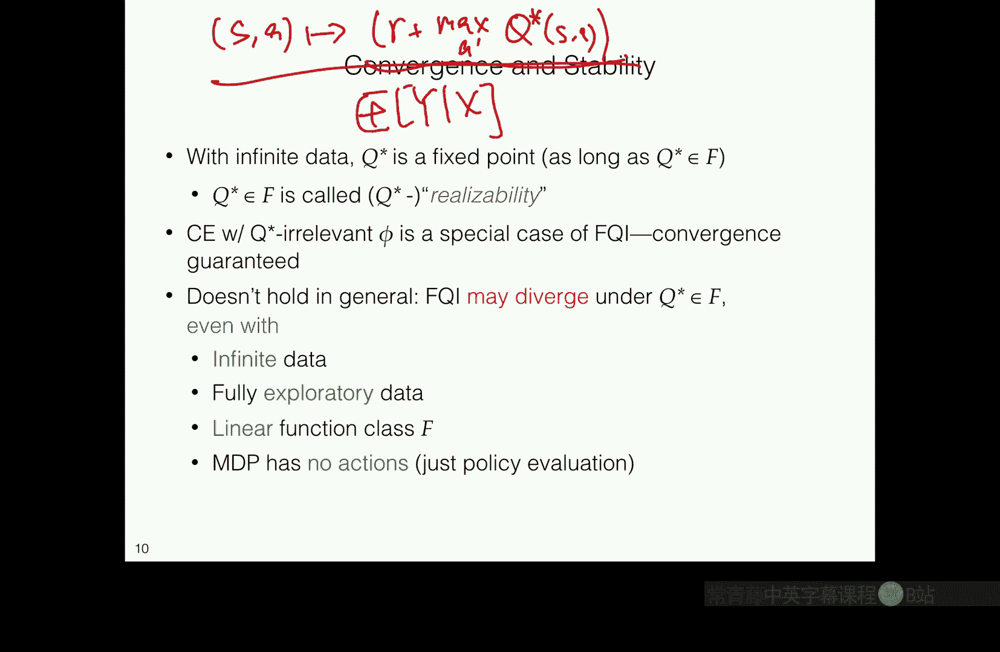

# 022：拟合Q算法（视角2） 🧠


## 概述
在本节课中，我们将学习如何将强化学习问题转化为监督学习问题，并介绍一种名为“拟合Q迭代”的核心算法。我们将看到，即使拥有无限数据，简单的函数逼近也可能导致算法发散，并探讨确保算法成功所需的关键假设。

---

## 从值迭代到监督学习

上一节我们讨论了表格化方法和抽象方法。本节中，我们来看看如何利用监督学习的强大能力来解决强化学习问题。

我们希望将强化学习“约简”为监督学习问题，使其看起来像分类或回归任务。这样，我们就可以将其视为黑箱，并使用任何我们喜欢的监督学习工具来解决它。

让我们从经典的**值迭代算法**开始。为了逼近最优动作值函数 **Q***，我们从任意函数 **F₀** 开始，并重复应用贝尔曼算子 **T**：
```
F_{k} = T F_{k-1}
```
经过多次迭代后，它将收敛到 **Q***。类似地，如果我们使用策略特定的算子 **T^π**，迭代将收敛到 **Q^π**。

现在，让我们推导如何将其转化为回归问题。标准的贝尔曼算子可以写成：
```
(T F)(s, a) = E[ R(s, a) + γ * max_{a'} F(s', a') | s, a ]
```
根据期望的线性性质，我们可以将其重写为：
```
(T F)(s, a) = E[ R(s, a) | s, a ] + γ * E[ max_{a'} F(s', a') | s, a ]
```
进一步，我们可以将其视为一个条件期望：
```
(T F)(s, a) = E[ R + γ * max_{a'} F(s', a') | s, a ]
```
这里的关键洞察是：**值迭代的每一步，本质上都是在逼近一个条件期望函数**。

---

## 拟合Q迭代算法

基于上述洞察，我们可以设计**拟合Q迭代**算法。该算法将值迭代的每一步都转化为一个监督学习回归问题。

以下是算法的步骤：

1.  **初始化**：从任意函数 **F₀** 开始。
2.  **迭代**：对于每次迭代 **t = 1, 2, ...**：
    *   使用当前函数 **F_{t-1}** 和数据集 **D = {(s, a, r, s')}** 创建新的回归数据集。
    *   对于数据集中的每个转移元组 **(s, a, r, s')**，计算回归标签 **y**：
        ```
        y = r + γ * max_{a'} F_{t-1}(s', a')
        ```
    *   现在，我们有了输入-输出对 **( (s, a), y )**。我们解决以下平方损失回归问题：
        ```
        F_t = argmin_{f ∈ F} Σ_{(s,a,y)} ( f(s, a) - y )^2
        ```
    *   这里，**F** 是我们选择的函数类（例如，线性函数、神经网络）。

**算法核心**：在每次迭代中，我们调用一个监督学习“黑箱”来解决一个回归问题。输入 **(s, a)** 不变，但标签 **y** 随着每次迭代而更新。

---

## 与已有方法的联系

拟合Q迭代是一个通用框架，我们之前学过的方法都是它的特例。

*   **表格化方法**：如果函数类 **F** 是所有定义在有限状态-动作对上的函数的集合，那么FQI就等价于在估计的表格模型上运行值迭代。
*   **抽象方法**：如果 **F** 是由某个状态抽象诱导的所有分段常数函数，那么FQI就等价于在估计的抽象模型上运行值迭代。

因此，FQI允许我们超越这些简单的函数类，使用更强大的逼近器，如线性模型或深度神经网络。

---

## 实现细节：从FQI到Q学习

在实际实现中，我们通常不会在每次迭代中都精确求解回归问题（直到收敛）。相反，我们可能会使用随机梯度下降来优化损失函数。

如果我们对FQI的每次回归步骤应用SGD，并“即时”更新目标网络（而不是等到回归收敛），我们就得到了经典的**Q学习算法**。在深度强化学习中，为了稳定训练，通常会使用“目标网络”，即冻结用于计算标签的网络参数一段时间，这实际上正是FQI所建议的“分阶段”更新方式。

---

## 挑战：为什么函数逼近会失败？

一个自然的猜想是：只要我们的函数类 **F** 能够表示真实的最优函数 **Q***（即可实现性假设），并且拥有无限数据，FQI就应该收敛到 **Q***。

**然而，这个猜想是错误的。**

即使使用最简单的**线性函数逼近**，并且满足可实现性和充分探索的假设，FQI也可能**发散**。书中给出了一个反例：一个只有两个状态、一个动作、确定性转移且奖励全为0的MDP。尽管真实值函数为0，并且线性函数类可以完美表示它，但FQI/TD更新会导致参数指数级增长至无穷大。

---

## 深入理解：一个直观的反例

为了更直观地理解问题所在，考虑一个有限时域问题：一条长度为10的状态链，从状态1开始，每步转移到下一个状态，中间无奖励，只有在状态10以0.5概率获得奖励1。真实值函数在每个状态都是0.5。

现在，我们模拟FQI，但对函数类施加限制来模拟函数逼近：
*   在状态10，你只能预测0.5或0.501。
*   在状态9，你只能预测0.5或0.502。
*   ...
*   在状态1，你只能预测0.5或一个更大的数（比如0.512）。

假设从数据中计算的状态10的奖励经验平均是0.501。在第一次迭代（对应最后一步）的回归中，你会选择0.501作为状态10的预测值，因为它更接近经验平均。

在第二次迭代（对应倒数第二步），对于状态9，回归标签是 `0（即时奖励） + 0.501（下一状态值） = 0.501`。但你的函数类只允许预测0.5或0.502。0.501到两者的距离相等，通过某种打破平局的规则，你可能会选择0.502。

错误就这样**传播并放大了**。每一步，你都被迫选择一个与理想回归目标略有偏差的值，因为你的函数类不够表达。这种误差可能会反向传播并指数级增长，导致初始状态的预测值误差巨大。

---

## 关键假设：贝尔曼完备性

上述反例揭示了问题的根源：FQI的每一步都在解决一个回归问题，其最优目标是 **T F_{t-1}**（对上一轮函数的贝尔曼更新）。要使FQI成功，我们不仅需要 **F** 包含 **Q***，还需要 **F** 在贝尔曼算子下是**封闭**的。

这就引出了**贝尔曼完备性**（或贝尔曼闭包）假设：
```
对于所有 f ∈ F，都有 T f ∈ F。
```
换句话说，对函数类中的任何函数应用贝尔曼算子后，得到的新函数仍然属于这个函数类。这个假设保证了FQI每一步要解决的回归问题都是“定义良好”的（即真实回归函数位于函数类中），从而算法可以稳定运行。

---

## 总结

本节课中我们一起学习了：
1.  **拟合Q迭代**的核心思想：将值迭代的每一步转化为一个监督学习回归问题。
2.  FQI是一个通用框架，表格化和抽象方法是其特例。
3.  即使满足可实现性和无限数据，简单的函数逼近（如线性）也可能导致FQI发散。
4.  通过一个直观的反例，我们看到了误差在时间步中传播和放大的机制。
5.  为了保证FQI的成功，我们需要比可实现性更强的条件——**贝尔曼完备性**假设，它要求函数类在贝尔曼更新下是封闭的。



理解这些挑战和关键假设，是设计和分析具有函数逼近的强化学习算法的基石。下一讲我们将继续探讨基于这些理论保证的算法分析。