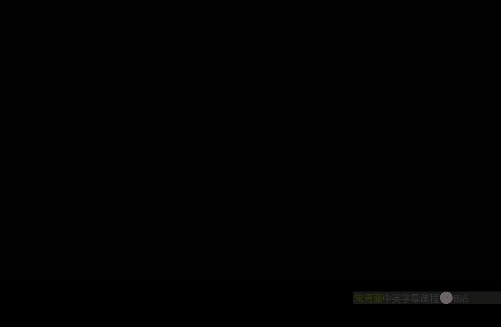
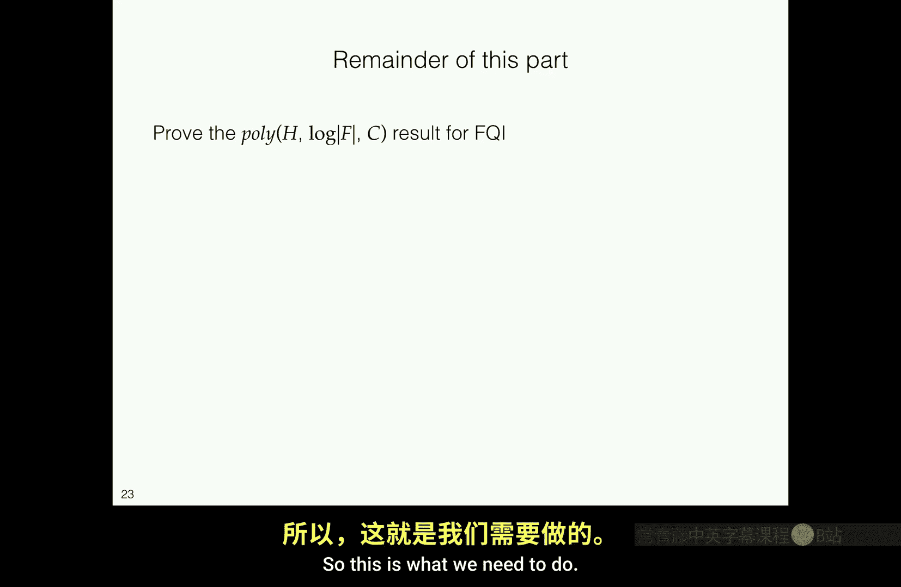
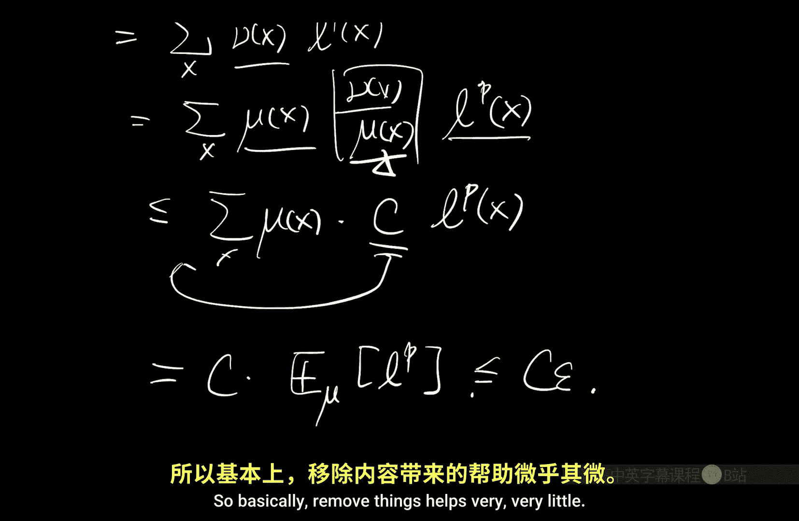

# 024：拟合Q算法（续）（视角2）🎯



在本节课中，我们将继续深入探讨拟合Q迭代算法，分析其潜在的收敛性问题，并引入贝尔曼完备性这一关键假设。我们还将探讨如何为价值函数学习构建一个固定的优化目标，并理解在函数逼近和大状态空间下，数据覆盖性假设的重要性。

## 算法回顾与问题引入 🔍

上一节我们介绍了拟合Q迭代算法，并看到了一个反例：即使在函数类可实现、数据无限且充分探索、函数类为线性的简单策略评估场景下，算法也可能发散。

FQI本质上是在运行一系列回归问题，以模仿真实的值迭代过程。对于每个回归问题，其最优预测器是前一次迭代函数的贝尔曼更新值，即 **T F_{k-1}**。我们希望函数类能够表示这个函数。但当函数类无法表示它时，迭代就会失败，因为我们最终只能输出函数类中的某个函数，而 **T F_{k-1}** 可能不在该类中，导致无法准确逼近真实价值函数。

## 贝尔曼完备性：一个关键假设 🧩

为了分析这些适用于大状态空间的算法，现代强化学习理论文献通常需要引入**贝尔曼完备性**假设。

该假设要求：对于函数类 **F** 中的任意函数 **f**，其贝尔曼更新 **T f** 仍然在函数类 **F** 中。这保证了每个回归问题中，函数类始终是“设定正确”的。在回归问题中，我们的目标是预测 **Y = R + γ max_{a'} f(S', a')**。函数类设定正确意味着最优预测器 **E[Y | S, A] = (T f)(S, A)** 位于函数类中。

从损失分解的角度看，运行平方回归时，损失总可以分解为**不可约的固有标签噪声**，加上**到最优预测器的距离**。我们当然希望函数类能包含或近似捕获这个最优预测器。在FQI的语境下，这就导出了贝尔曼完备性假设。

另一种理解FQI操作的方式是将其视为一种**投影**。我们试图在函数类中找到与真实贝尔曼备份最接近的函数，这类似于将一个点投影到一个子空间上。投影操作通常是非扩张的：将两个不同的原始点投影到同一子空间后，它们之间的距离不会增加。

这里似乎存在一个矛盾：我们知道贝尔曼算子 **T** 在无穷范数下是一个系数为 **γ < 1** 的压缩映射。而投影算子在L2范数下是非扩张的。如果将两者组合，似乎应该仍得到一个压缩映射。然而，由FQI（在无限数据下）定义的**投影贝尔曼算子**整体上可能是一个扩张映射，这正是我们在反例中看到指数发散的原因。

问题的关键在于**范数不匹配**。投影（隐含在使用平方损失的FQI或任何TD类算法中）使用的是L2范数下的投影，它在L2范数下是非扩张的，但在无穷范数下可能是扩张的。而贝尔曼算子 **T** 仅在无穷范数下是压缩映射。将两者组合后，无法保证其性质。

## 特殊函数类与等价性 ✨

有趣的是，存在一些特殊的函数类 **F**，使得（基于回归的）投影操作在无穷范数下也是非扩张的。

一个例子是**分段常数函数类**。当将任意函数投影到分段常数函数类时，在每个分段内进行的是加权平均。可以证明，投影后函数的无穷范数误差（即各分段平均值的最大差异）不会超过原始函数间的最大差异。这解释了之前提到的反直觉结果：使用Q*相关抽象时，即使模型给出的抽象动态没有意义，算法仍然收敛并能提供很好的保证。

另一个重要事实是：对于**有限函数类**，贝尔曼完备性假设本身就意味着**可实现性**（即 **Q\*** 在函数类中）。可以通过反证法证明：如果Q*不在类中，由于函数类有限，存在一个到Q*的最佳逼近，其具有固定的无穷范数误差。但根据完备性，从类中任意函数开始进行概念上的值迭代，可以生成无限接近Q*的函数序列，这与最佳逼近误差的下界矛盾，因此Q*必须在函数类中。

此外，对于**分段常数函数类**，贝尔曼完备性等价于**双模拟**条件。这留作课后习题进行证明。

## 收敛性与目标函数构建 🔄

即使加入了贝尔曼完备性假设，算法在数值上也不一定收敛到一个固定点（可能振荡）。但完备性能保证在经过足够多次迭代后，结果会合理地接近真实的 **Q\***。

FQI的诸多困难源于其**迭代性质**。在函数逼近设定下，我们需要在贝尔曼更新（一个良好的压缩映射）中插入对应于回归的投影操作，这可能引发各种发散和不稳定性。这与标准机器学习不同，后者通常有一个可从数据估计并直接最小化的固定目标函数。

因此，一个自然的想法是：能否为学习价值函数构建一个**固定的目标函数**？一个很自然的选择是**贝尔曼误差**，因为 **Q\*** 是贝尔曼算子的不动点，即 **Q = T Q**。我们可以检查候选函数 **f** 在多大程度上违反贝尔曼方程，并将其转化为损失函数。

我们希望基于数据最小化这个损失。一个直接的尝试是使用其无偏估计，即最小化 **E_{(S,A) ~ data} [ (f(S,A) - [R + γ max_{a'} f(S', a')] )^2 ]**。注意，这与正确实现FQI时需要在前一项 **f(S', a')** 处**停止梯度**不同，这里梯度会同时流过两项。

对这个损失进行分解：
```
E[ (f(S,A) - [R + γ max f(S',a')] )^2 ] = E[ (f(S,A) - (T f)(S,A) )^2 ] + E[ Var( R + γ max f(S',a') | S,A ) ]
```
第一项正是我们关心的**贝尔曼误差**（在数据分布上的加权L2范数）。第二项是**固有标签噪声**，它依赖于 **f**。

在标准监督学习中，我们可以忽略固有噪声项，因为它在优化时是常数。但在这里，由于“标签” **Y = R + γ max f(S',a')** 依赖于我们正在优化的 **f**，第二项不再是常数，因此不能忽略。最小化总损失并不等价于最小化我们真正关心的贝尔曼误差。

## 解决方案：双重采样与极小极大目标 🛠️

在**确定性转移**的环境中，这个问题不存在，因为下一状态是确定的，噪声项不依赖于 **f**。在一般的随机环境中，有两种解决方案。

第一种方案是**双重采样**。对于数据中的每个 **(S, A)**，我们请求两个独立同分布的 **(R, S')** 副本。构造损失时，用一个副本计算目标值，用另一个副本评估函数值，从而在期望上消除掉讨厌的第二项。但这通常需要模拟器，并且在某些情况下（如如何“重置”到某个状态）会引发复杂问题。

第二种方案是显式估计并减去第二项。我们引入第二个函数类 **G**，用它来拟合最优预测器 **T f**。具体地，我们构建如下**极小极大目标**：
```
min_{f in F} max_{g in G} E[ (f(S,A) - [R + γ max f(S',a')] )^2 - (g(S,A) - [R + γ max f(S',a')] )^2 ]
```
当 **G** 能够完美拟合 **T f** 时，内层的 **max** 操作会给出第二项的一个估计，从总损失中减去它，就得到了对贝尔曼误差的估计。这要求对于所有 **f in F**，都有 **T f in G**。如果我们令 **G = F**，那么这个条件就变回了**贝尔曼完备性**假设。

## 数据覆盖性：另一个核心假设 📊

在标准监督学习中，除了函数类的容量假设（如VC维），我们通常不需要其他假设。但在强化学习中，我们还需要一个与函数类无关的关键假设——**数据覆盖性**。

在表格设定中，我们假设每个状态-动作对都有均匀的样本。但在大状态空间下，这是不可能的。我们需要一个更一般的概念来刻画数据分布 **μ** 对可能访问到的状态的覆盖程度。

考虑我们关心的初始状态分布 **d_0**，以及任何候选策略 **π** 运行 **t** 步后得到的占用分布 **d_t^π**。覆盖性要求对于所有 **t** 和 **π**，密度比 **d_t^π(s,a) / μ(s,a)** 的上界是一个常数 **C**。这意味着，任何策略可能以较高概率访问的状态-动作对，在我们的数据分布 **μ** 中也有足够的概率质量。如果数据完全缺失了某些关键区域，我们将无法可靠地评估相关策略的价值。

这种覆盖性假设统一了我们之前的分析。在表格均匀采样的设定下，**μ** 是均匀分布（每个状态-动作对的概率为 **1/(|S||A|)**），而任何分布 **d_t^π** 在单个点上的概率质量不超过1。因此，覆盖系数 **C** 的一个粗略上界就是 **|S||A|**。之前表格设定下的误差界形式为 **√(|S||A|/N)**，这与我们将在新框架下得到的形式 **√(C/N)** 是一致的。

## 覆盖性引理 📐

覆盖性假设的一个重要作用是帮助进行分布转移下的泛化分析。考虑一个更一般的形式：设 **μ** 和 **ν** 是空间 **X** 上的两个分布，**L(x) ≥ 0** 是某个损失函数。如果我们知道在数据分布 **μ** 下的期望损失很小，即 **E_{x~μ}[L(x)^p] ≤ ε**，那么覆盖性允许我们推断在目标分布 **ν** 下的表现：
```
E_{x~ν}[L(x)^p] = Σ_x ν(x) L(x)^p = Σ_x [ν(x)/μ(x)] μ(x) L(x)^p ≤ C * E_{x~μ}[L(x)^p] ≤ Cε
```
取 **p** 次根后，我们得到 **ν** 下的损失被 **C^{1/p}** 倍的 **μ** 下损失所控制。对于常用的平方损失 (**p=2**)，这意味着误差界会有一个 **√C** 的因子。这正是在强化学习分析中，样本复杂度通常出现 **√C** 项的原因。



## 总结 📝

本节课我们一起深入探讨了拟合Q迭代算法在函数逼近下的理论问题。
*   我们理解了算法可能发散的根源在于函数类无法表示迭代中产生的贝尔曼备份，从而引入了**贝尔曼完备性**这一关键假设来保证回归问题的设定正确性。
*   我们探讨了为价值学习构建固定目标函数时遇到的**双重采样**问题，并看到了贝尔曼完备性假设如何自然地出现在其解决方案中。
*   最后，我们认识到在大状态空间下，除了对函数类的假设，还需要关于**数据覆盖性**的假设，以确保从数据分布到任何策略访问分布的泛化能力。覆盖系数 **C** 概括了数据质量，并将之前表格设定下的结果作为特例包含在内。



这些概念和假设为我们在下一节进行严格的理论分析奠定了坚实的基础。