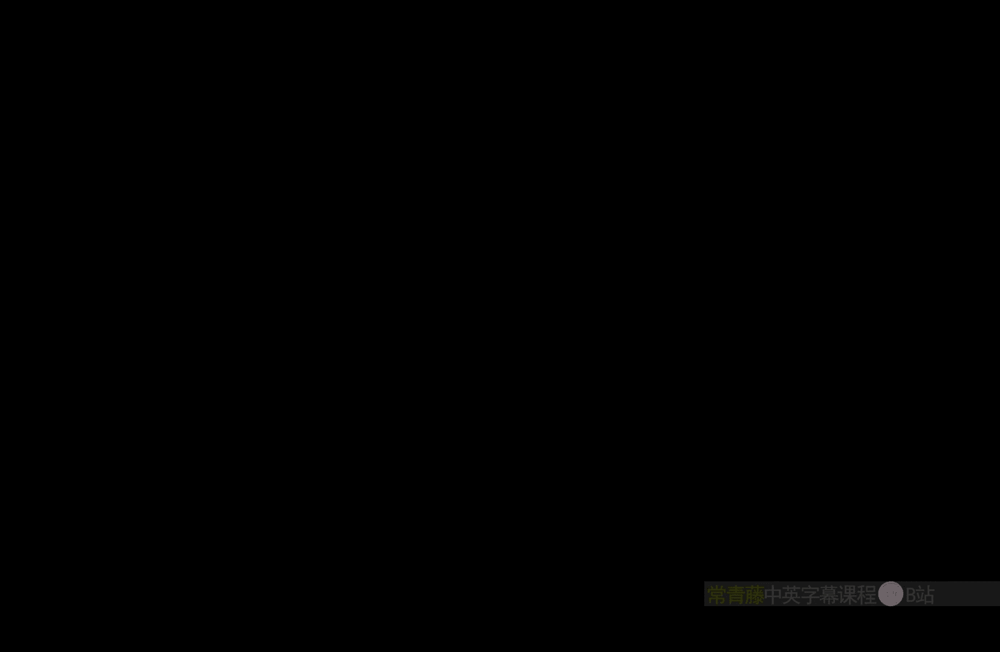
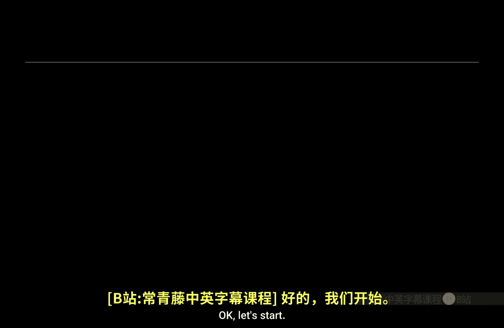
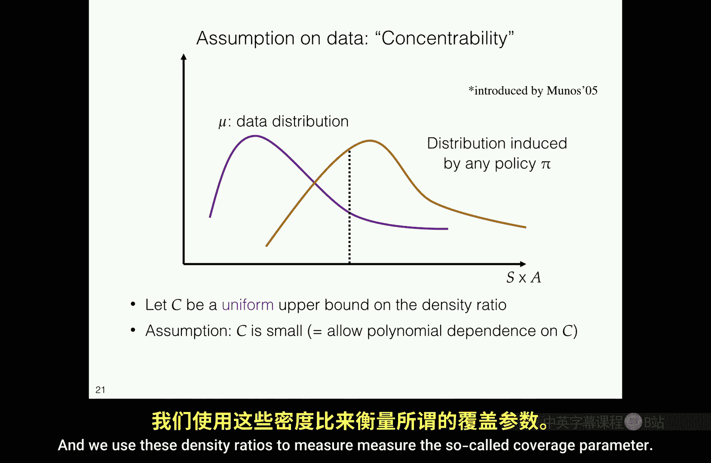
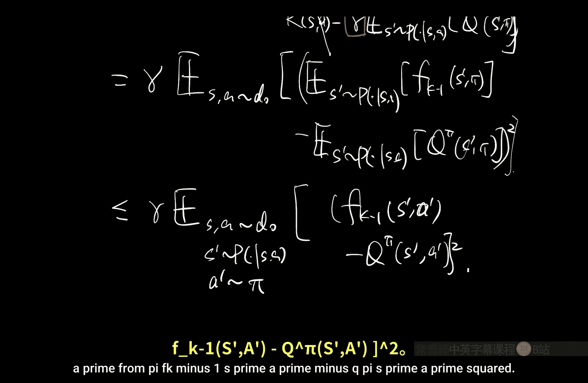
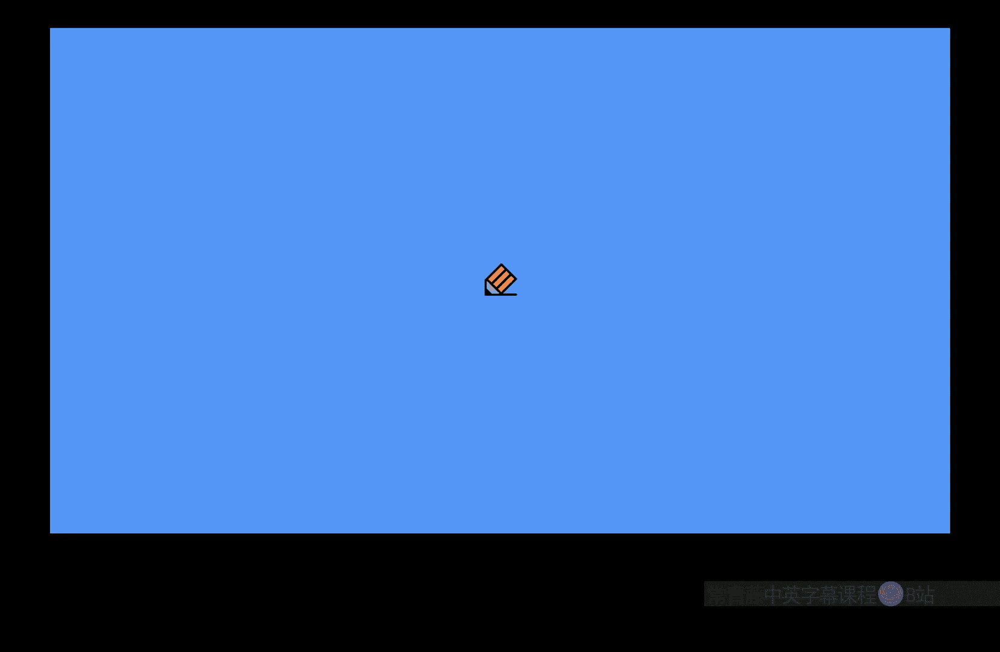
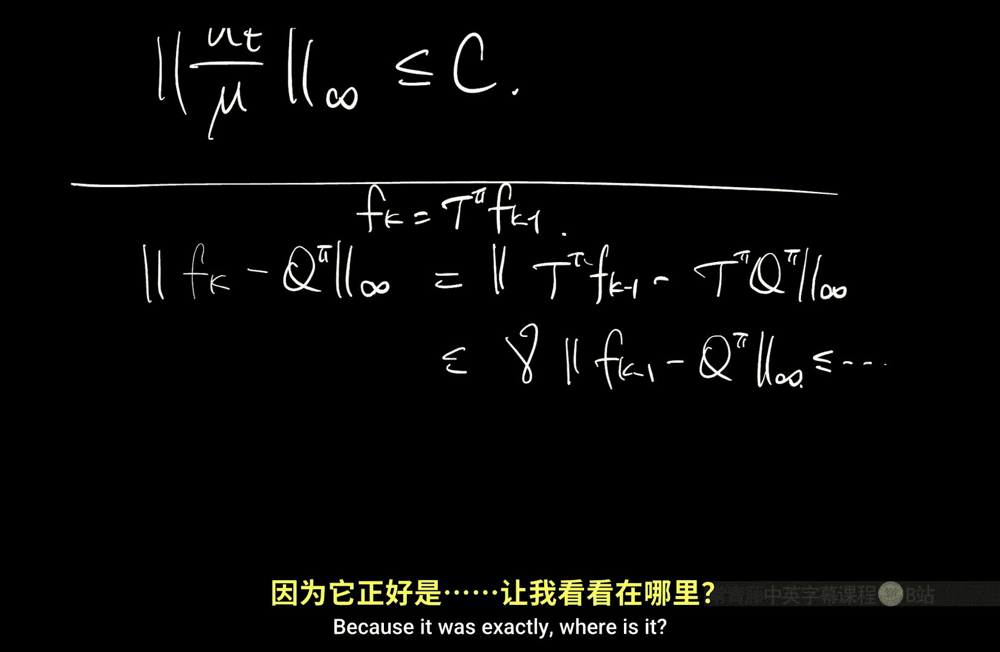
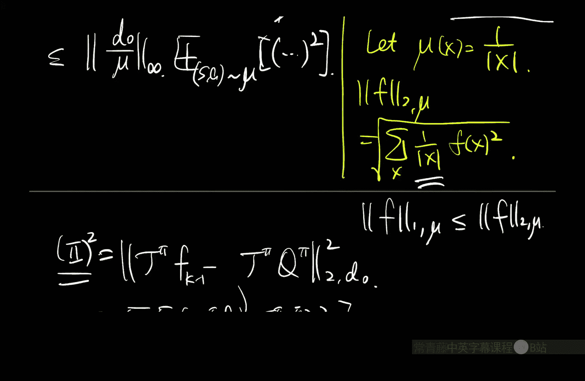
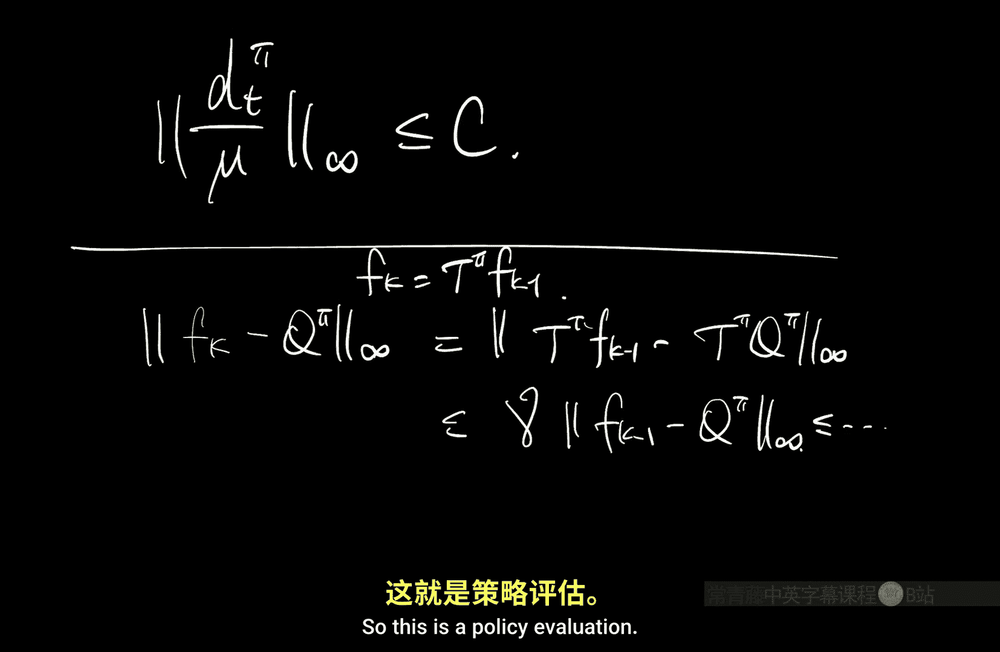
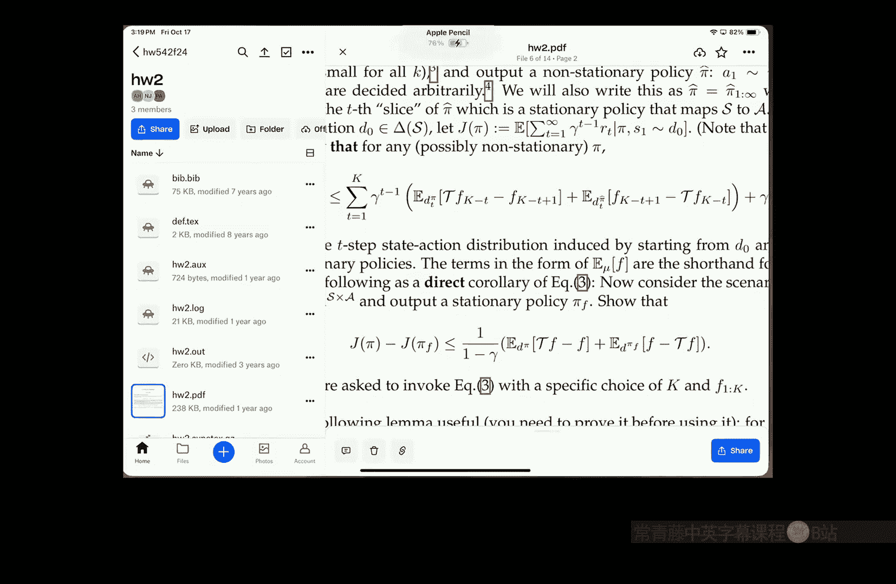

# 026：误差传播（视角2）🎯







在本节课中，我们将学习在函数近似设定下，分析拟合Q评估（FQE）和拟合Q迭代（FQI）算法的误差传播过程。我们将看到，为了确保学习到的价值函数在目标分布上表现良好，数据分布必须对目标策略诱导的占用度量具有良好的“覆盖性”。

---

## 概述 📋

上一节我们介绍了贝尔曼完备性假设和数据覆盖性假设的重要性。本节中，我们将通过分析FQE和FQI算法，具体展示这些假设如何在误差传播分析中发挥作用。核心在于，我们通过回归在数据分布上控制单步误差，然后利用覆盖性系数将这些误差的保证推广到我们关心的目标分布上。

---

## 拟合Q评估（FQE）算法分析 🔍

FQE算法的目标是，给定一个策略π和一个函数类F，从数据中学习其动作价值函数Qπ。

### 算法设定

我们拥有数据集 **D**，其中包含由某个数据分布 **μ** 采样的转移元组 `(s, a, r, s')`。算法迭代进行，在每次迭代k中，我们通过最小化以下经验损失来更新函数：
```math
L_D(f, f_{k-1}) = \frac{1}{|D|} \sum_{(s,a,r,s') \in D} \left( f(s, a) - [r + \gamma f_{k-1}(s', \pi)] \right)^2
```
然后令 `f_k = \arg\min_{f \in F} L_D(f, f_{k-1})`。这可以看作是用一个数据依赖的算子 `\hat{T}^\pi_F` 来近似真实的贝尔曼算子 `T^\pi`。

### 第一步：浓度分析（单步误差控制）

我们的第一个目标是证明，对于任意函数 `f' ∈ F`，由算法产生的近似贝尔曼备份 `\hat{T}^\pi_F f'` 在数据分布 μ 下接近真实的贝尔曼备份 `T^\pi f'`。

**关键分解**：利用平方损失的标准分解，我们可以将真实期望损失 `L_μ(f, f')` 写为：
```math
L_\mu(f, f') = \mathbb{E}_{(s,a) \sim \mu} \left[ (f(s,a) - T^\pi f'(s,a))^2 \right] + \mathbb{E}_{(s,a) \sim \mu} \left[ \text{Var}(r + \gamma f'(s', \pi) | s, a) \right]
```
第二项是固有噪声，与f无关。因此，最小化 `L_\mu` 等价于最小化第一项，即让 `f` 接近 `T^\pi f'`。

**均匀收敛**：通过集中不等式（如霍夫丁不等式结合覆盖数），我们可以证明，对于所有 `f, f' ∈ F`，经验损失 `L_D` 与其期望 `L_μ` 是接近的，即 `|L_D(f, f') - L_\mu(f, f')| ≤ ε'`。

**结合算法**：算法选择的 `f_k` 在经验损失上是最优的，因此有 `L_D(f_k, f_{k-1}) ≤ L_D(T^\pi f_{k-1}, f_{k-1})`。利用贝尔曼完备性假设（`T^\pi f_{k-1} ∈ F`）和均匀收敛性，我们可以推导出：
```math
\mathbb{E}_{(s,a) \sim \mu} \left[ (\hat{T}^\pi_F f_{k-1}(s,a) - T^\pi f_{k-1}(s,a))^2 \right] \leq 2\varepsilon'
```
这证明了在数据分布 μ 下，我们的近似单步贝尔曼备份是准确的。

### 第二步：误差传播与覆盖性假设

现在，我们希望控制最终输出函数 `f_K` 与真实 `Q^π` 在我们关心的某个初始状态-动作分布 `d_0` 下的误差。

**引入加权范数**：为了便于使用三角不等式，我们定义加权L2范数：对于分布 `d` 和函数 `g`，`\|g\|_{2,d} = \sqrt{\mathbb{E}_{(s,a) \sim d}[g(s,a)^2]}`。

**误差分解**：我们可以将总误差分解为单步近似误差和贝尔曼算子应用误差：
```math
\|f_K - Q^\pi\|_{2,d_0} \leq \|\hat{T}^\pi_F f_{K-1} - T^\pi f_{K-1}\|_{2,d_0} + \|T^\pi f_{K-1} - T^\pi Q^\pi\|_{2,d_0}
```

1.  **处理第一项（单步近似误差）**：我们在第一步中已经在分布 `μ` 下控制了该项的平方。为了将其转换到分布 `d_0` 下，我们需要**覆盖性假设**。具体来说，我们需要假设密度比 `d_0(s,a) / μ(s,a)` 是有界的（即 `\|d_0/\mu\|_\infty ≤ C`）。这样，我们有：
    ```math
    \|\hat{T}^\pi_F f_{K-1} - T^\pi f_{K-1}\|_{2,d_0} \leq \sqrt{C} \cdot \|\hat{T}^\pi_F f_{K-1} - T^\pi f_{K-1}\|_{2,\mu} \leq \sqrt{2C\varepsilon'}
    ```

2.  **处理第二项（贝尔曼收缩）**：展开 `T^\pi` 的定义并利用琴生不等式，我们可以得到：
    ```math
    \|T^\pi f_{K-1} - T^\pi Q^\pi\|^2_{2,d_0} \leq \gamma^2 \mathbb{E}_{(s,a) \sim d_0, s'\sim P(\cdot|s,a), a'\sim\pi(\cdot|s')} \left[ (f_{K-1}(s',a') - Q^\pi(s',a'))^2 \right]
    ```
    注意到 `(s', a')` 的分布正是策略 π 从 `d_0` 出发一步后诱导的分布，我们称之为 `d_1^\pi`。因此，这一项变成了 `γ \|f_{K-1} - Q^\pi\|_{2, d_1^\pi}`。

**递归与覆盖性需求**：现在，我们对 `\|f_{K-1} - Q^\pi\|_{2, d_1^\pi}` 重复上述分析过程。在每一步 `t`，我们都需要用数据分布 `μ` 去覆盖当前步骤的分布 `d_t^\pi`，并支付一个覆盖系数 `C_t`。最终，经过K步递归后，总误差会被一个几何级数所控制，并包含一个 `γ^K` 的残差项（对应于有限迭代的误差）。

**结论**：为了确保在初始分布 `d_0` 下 `f_K` 能很好地近似 `Q^\pi`，我们需要数据分布 `μ` 能够覆盖策略 π 从 `d_0` 出发所诱导的所有 `t=0,1,...,K-1` 步的状态-动作分布 `d_t^\pi`。这就是**策略评估所需的覆盖性假设**。

---

## 从FQE到拟合Q迭代（FQI）⚡

FQI与FQE的分析框架非常相似，但目标变为近似最优价值函数 `Q^*`，算子变为 `T`（取max的贝尔曼最优算子）。

### 核心引理



分析依赖于一个关键的性能误差分解引理（已在作业中出现）。该引理表明，FQI输出策略 `\hat{\pi}`（关于最终价值函数 `f_K` 的贪婪策略）与最优策略 `\pi^*` 的性能差距，可以被一系列单步贝尔曼备份误差项所控制。




以下是该引理的核心表述：
设 `f_0, ..., f_K` 是FQI迭代产生的函数，`\hat{\pi}_K` 是相对于 `f_K` 的贪婪策略。那么，对于任意初始状态分布 `d_0`，存在某个分布序列 `{d_t}`（与策略 `\pi^*` 和 `\hat{\pi}_K` 的占用度量相关），使得性能差距满足：
```math
V^{\pi^*}(d_0) - V^{\hat{\pi}_K}(d_0) \leq \frac{2\gamma}{(1-\gamma)^2} \max_{t, f} \| T f - \hat{T}_F f \|_{2, d_t}
```
其中 `\hat{T}_F f` 是算法在数据上对 `T f` 的近似。

### 覆盖性假设的作用

在这个分解中，每个误差项 `\| T f - \hat{T}_F f \|_{2, d_t}` 都需要被控制。和FQE分析一样，我们首先在数据分布 `μ` 下控制这些误差。然后，为了将其与性能差距联系起来，我们需要假设数据分布 `μ` 能够覆盖引理中出现的所有分布 `d_t`。这些 `d_t` 既包括最优策略 `\pi^*` 诱导的分布，也包括算法产生的中间策略 `\hat{\pi}_k` 诱导的分布。

由于我们无法预知算法会产生哪些中间策略，一个充分（但可能更强）的假设是：数据分布 `μ` 能够覆盖**所有可能策略**在若干步内诱导的分布。这就是我们之前提到的**强覆盖性假设**。





### 结合分析

将浓度分析（证明在 `μ` 下单步误差小）与上述误差分解引理结合，并利用覆盖性系数将 `μ` 下的误差界转移到各个 `d_t` 分布上，我们最终可以证明：在适当的覆盖性和贝尔曼完备性假设下，FQI输出的策略是接近最优的。

---

## 总结与直观理解 🎓




本节课我们一起学习了函数近似下基于动态规划的RL算法的误差传播分析。

1.  **分析模式**：分为两步。首先是**浓度分析**，证明在训练数据分布 `μ` 上，我们的函数近似能够准确执行单步贝尔曼备份。其次是**误差传播分析**，研究这些单步误差如何累积并影响最终的价值函数估计或策略性能。
2.  **覆盖性的核心作用**：误差传播分析会引入一系列我们关心的目标分布（如策略π的占用度量）。**覆盖性假设**（密度比有界）是连接“在训练分布 `μ` 上误差小”和“在目标分布上误差小”的桥梁。没有覆盖性，算法在未见过的状态-动作对上可能产生任意大的误差。
3.  **不稳定的“致命三角”**：分析揭示了导致值函数近似不稳定的三个因素：**自举（Bootstrapping）**、**函数近似**和**异策略（Off-policy）数据**。我们的分析正是在努力克服后两者结合带来的分布偏移挑战。
4.  **加权范数的实用性**：使用分布加权的L2范数 `\|·\|_{2,d}` 代替无穷范数，使得分析更贴合平均性能，并避免了与状态空间大小相关的维度依赖，是现代理论分析中的常用工具。




通过本节课，你应该理解为何在函数近似RL中，单纯的最小化平方误差并不足够，以及为何数据的覆盖性对于算法的理论保证至关重要。