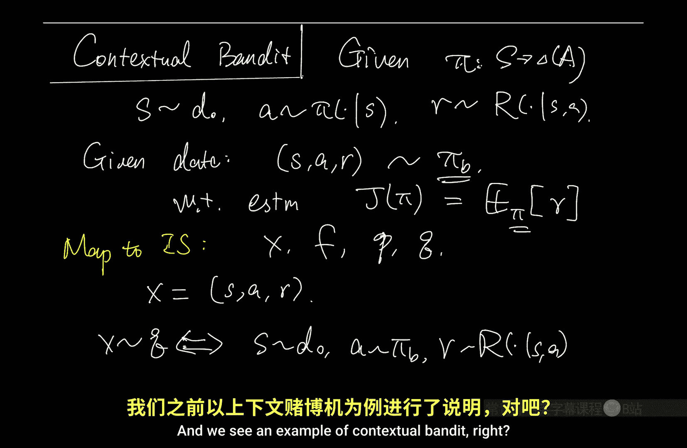
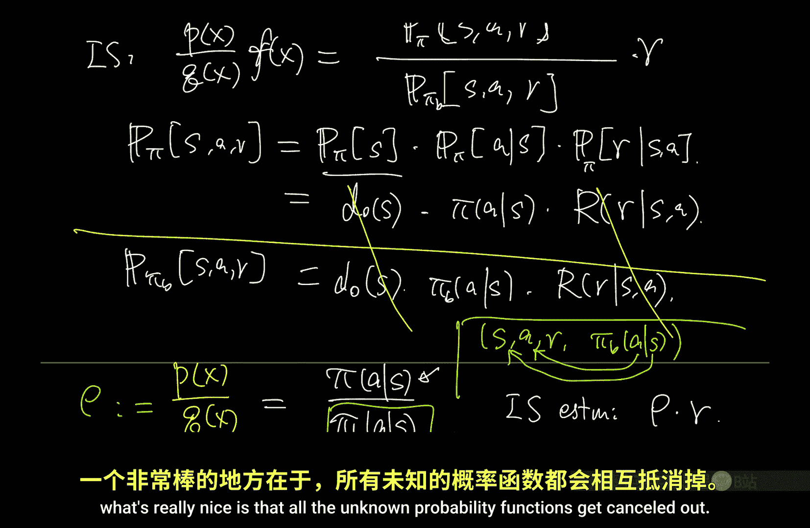
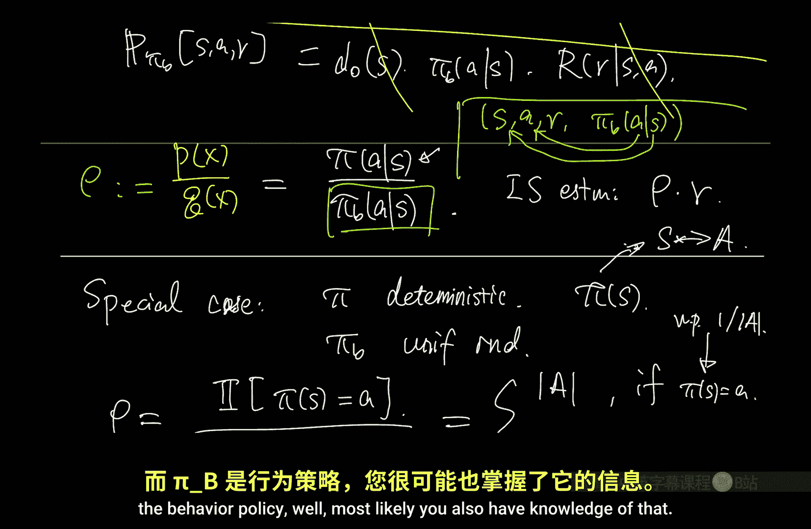
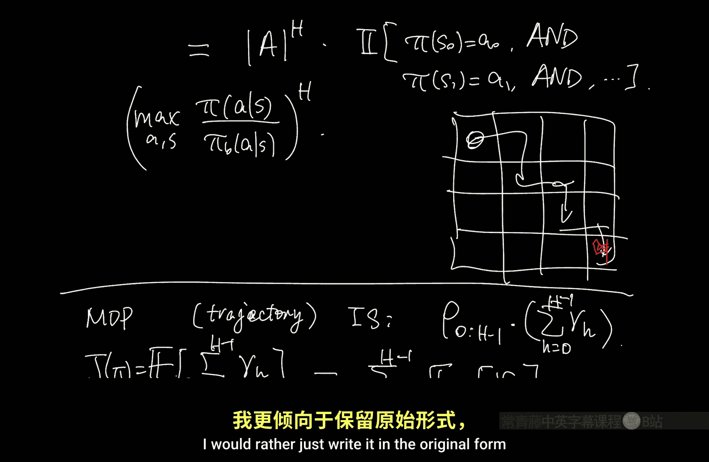

# 030：重要性采样（续）（视角2）🎯

在本节课中，我们将继续深入探讨重要性采样，特别是其在多步决策问题（如马尔可夫决策过程）中的应用。我们将从回顾重要性采样的核心思想开始，然后分析其在特定情况下的行为，并介绍几种改进方法，如加权重要性采样和控制变量法，最后将其扩展到序列决策场景。

## 概述 📋

重要性采样是一种强大的技术，它允许我们利用从一个分布（行为策略）中采样的数据，来估计在另一个分布（目标策略）下的期望值。其核心在于通过重要性权重来校正分布间的差异。我们将首先回顾其在上下文赌博机问题中的应用，然后探讨其方差特性，并引入改进方法以减少方差。最后，我们将把重要性采样推广到有限时域的序列决策问题中。

## 重要性采样回顾 🔄

上一节我们介绍了重要性采样的基本框架。其核心公式可以总结为：

**公式：** `E_{x~P}[f(x)] = E_{x~Q}[(P(x)/Q(x)) * f(x)]`

这里，`P` 是目标分布，`Q` 是采样分布，`f(x)` 是我们关心的函数。重要性权重 `ρ = P(x)/Q(x)` 用于校正分布差异。

在上下文赌博机问题中，我们评估一个目标策略 `π`，但数据来自行为策略 `π_B`。一个关键的优势是，未知的动态和奖励函数在计算重要性权重时会相互抵消，最终权重简化为两个策略概率的比值：`ρ = π(a|s) / π_B(a|s)`。由于策略通常是我们已知或可以建模的，这使得重要性采样变得可行。

## 特定情况下的行为分析 🔍

为了直观理解重要性采样估计器的行为，我们分析一个特殊情况：目标策略 `π` 是确定性的，而行为策略 `π_B` 是在动作空间上均匀随机的。

在这种情况下，重要性权重具有一个特点：它会“丢弃”所有行为策略选择的动作与目标策略指定动作不匹配的数据点。粗略来说，只有大约 `1/|A|`（`|A|` 是动作数量）比例的数据是“有用”的。

我们进一步考虑一个更特殊的子情况：在上述设定基础上，假设奖励 `R` 始终是一个常数 `c`。令人惊讶的是，最朴素的重要性采样估计器（即 `ρ * R` 的均值）的方差为零，尽管直觉上它似乎只是丢弃了一些数据点并对剩余点求平均。

当我们写出在整个数据集上的估计器时，会发现它并非简单地对匹配的数据点求平均。其形式为：将所有匹配数据点的奖励求和，然后除以匹配数据点数量的**期望值**（即 `N/|A|`），而不是实际观测到的匹配数量。这种归一化方式在理论上保证了估计的无偏性。

## 改进方法一：加权重要性采样 ⚖️

那么，如何改进朴素的重要性采样呢？一个直观的改进是使用实际观测到的匹配数量进行归一化，而不是其期望值。

**改进后的估计器：** `( Σ_{i: π(s_i)=a_i} r_i ) / ( |{i: π(s_i)=a_i}| )`

在奖励恒定的特殊情况下，这个估计器同样具有零方差。然而，在有限样本情况下，这个估计器是有偏的。例如，如果没有任何数据点匹配，分母为零，估计器无法定义；如果只有一个匹配点，估计值就是该点的奖励，放弃了任何加权校正。

尽管如此，当数据量很大时，实际匹配比例会依概率收敛到期望比例 `1/|A|`，因此这个估计器是**相合**的。

我们可以将这个思想推广到更一般的情况，不局限于确定性和均匀策略。

**一般形式的加权重要性采样：**
原始估计器：`(1/N) * Σ_{i=1}^{N} ρ_i * r_i`
加权版本：`( Σ_{i=1}^{N} ρ_i * r_i ) / ( Σ_{i=1}^{N} ρ_i )`

由于 `E[ρ] = 1`，当 `N` 很大时，`Σ ρ_i ≈ N`，因此加权版本在大样本下表现相似。加权版本的优势在于，其最终估计值始终是观测奖励的凸组合（因为所有权重 `ρ_i / Σ ρ_j` 之和为1），这保证了估计值不会超出奖励的实际范围，避免了原始估计器因个别极大权重而产生异常预测的问题。

这种方法在统计学中也被称为**逆概率加权**。值得注意的是，重要性采样有时可以主动设计采样分布（如分层抽样）来降低方差，而不仅仅是被动地校正已知的数据偏差。

## 改进方法二：控制变量法（及双重稳健估计）🎲

现在让我们再次审视在确定性目标策略、均匀行为策略和恒定奖励这一特殊情况下，朴素重要性采样的方差表达式。方差的大小与奖励的幅度有关。这表明，在进行重要性采样时，将奖励中心化（即减去一个常数基线）以降低其幅度，可能对减少方差非常有益。

这引出了第二个改进方法：**控制变量法**。其核心思想是构造一个与原估计器相关但均值为零的辅助随机变量，通过将其加入原估计器来抵消部分方差。

具体步骤如下：
1.  定义一个新问题，其奖励为原始奖励减去一个常数 `c`：`R' = R - c`。
2.  在新问题上应用重要性采样，得到无偏估计 `E_{π}[R']` 的估计值。
3.  由于 `E_{π}[R] = E_{π}[R'] + c`，我们将 `c` 加回到新问题的估计值上，就得到了原始问题期望的无偏估计。

展开后的估计器为：`ρ * R + (1 - ρ) * c`。可以看到，我们在原始估计器 `ρ * R` 的基础上，添加了一个项 `(1-ρ)*c`。由于 `E[ρ]=1`，因此添加项的期望为零，不改变无偏性。在奖励接近常数 `c` 的情况下，新添加项的噪声与原始估计器的噪声负相关，从而有效降低了总体方差。

我们可以进一步推广，不使用常数 `c`，而是使用一个依赖于状态和动作的奖励预测模型 `R̂(s,a)`。

**双重稳健估计器：**
`ρ * (R - R̂(s,a)) + E_{a'~π(·|s)}[ R̂(s, a') ]`

这个估计器是**无偏**的，无论奖励模型 `R̂` 是否准确（因为 `ρ*(R - R̂)` 和后续项的期望会相互抵消）。同时，如果 `R̂` 是对真实奖励均值的良好近似，那么方差会显著降低。

之所以称为“双重稳健”，是因为只要**两者之一**正确，估计就是无偏的：
*   如果重要性权重 `ρ` 计算正确（即行为策略已知），则估计器无偏。
*   如果奖励模型 `R̂` 正确（等于真实期望奖励），那么 `R - R̂` 是零均值的噪声，即使 `ρ` 不准确，估计器仍然无偏。

在实践中，可以将加权重要性采样和双重稳健估计结合使用，以获得更稳定、更高效的离策略评估方法。

## 扩展到序列决策问题（有限时域MDP）🔄➡️

现在，我们将重要性采样从单步的赌博机问题扩展到多步的有限时域马尔可夫决策过程。

**问题设定：**
我们有一个时域为 `H` 的MDP。数据轨迹形式为：`τ = (s_0, a_0, r_0, s_1, a_1, r_1, ..., s_{H-1}, a_{H-1}, r_{H-1})`，由行为策略 `π_B` 生成。目标是评估目标策略 `π` 的期望回报 `J(π) = E_π[ Σ_{h=0}^{H-1} r_h ]`。

**轨迹级别重要性采样：**
类比重要性采样公式，我们将整个轨迹 `τ` 视为随机变量 `X`，函数 `f(τ)` 是轨迹上的累计奖励，分布 `P` 和 `Q` 分别是由 `π` 和 `π_B` 诱导出的轨迹分布。轨迹的重要性权重是每一步重要性权重的乘积：

**公式：** `ρ_{0:H-1} = Π_{h=0}^{H-1} ρ_h`，其中 `ρ_h = π(a_h|s_h) / π_B(a_h|s_h)`

那么，朴素的重要性采样估计器为：`ρ_{0:H-1} * ( Σ_{h=0}^{H-1} r_h )`。

**方差挑战与“水平诅咒”：**
在目标策略确定、行为策略均匀随机的特殊情况下，轨迹权重 `ρ_{0:H-1}` 只有在**整个轨迹**的每一个动作都与目标策略匹配时才非零。这导致“有效样本量”以 `(1/|A|)^H` 的速率指数级衰减，估计器方差可能爆炸式增长。这种现象常被称为“水平诅咒”。一般来说，累积重要性权重的范围上界是每步最大重要性比的 `H` 次幂，除非两个策略非常接近，否则会导致指数级问题。

这也凸显了基于值函数的方法（如Fitted Q）的优势：它们利用MDP的马尔可夫性，通过拟合状态分布或值函数来避免这种对轨迹的指数依赖，从而克服“水平诅咒”，但代价是引入了函数近似的假设和误差。

## 改进：逐步（按决策）重要性采样 📈

我们可以对轨迹级别重要性采样进行改进。注意到期望回报可以写成各时间步奖励期望之和：`J(π) = Σ_{h=0}^{H-1} E_π[ r_h ]`。我们可以为每个 `E_π[ r_h ]` 分别构造无偏估计，然后求和。

对于时间步 `h` 的奖励，其估计只需要校正到该步为止的动作分布，而不需要校正之后的动作。因为 `h` 时刻之后的动作无法影响 `h` 时刻已获得的奖励。因此，`E_π[ r_h ]` 的一个无偏估计是 `E_{π_B}[ ρ_{0:h} * r_h ]`，其中 `ρ_{0:h}` 是到步 `h` 为止的累积重要性权重。

**逐步重要性采样估计器：** `Σ_{h=0}^{H-1} ρ_{0:h} * r_h`

这个估计器相比轨迹级别版本有所改进。对于早期非零的奖励，我们不再需要乘以整个轨迹的巨大权重，而只需乘到该时刻为止的权重。然而，对于最后时刻的奖励，我们仍然需要完整的累积权重，因此“水平诅咒”问题在长期回报中依然存在，但程度有所减轻。

## 逐步估计器的递归视角与双重稳健扩展 🧠

逐步估计器可以递归地重写，这为理解其原理和扩展双重稳健方法提供了新视角。

我们可以将估计器视为从最后一步开始递归构建的：
1.  最后一步（`h=H-1`）后，估计值为0（因为没有未来）。
2.  对于步骤 `h`，我们有一个对 `Q^π(s_h, a_h)` 的估计（来自下一步的递归估计加上当前奖励 `r_h`）。
3.  由于当前动作 `a_h` 来自 `π_B`，为了得到 `V^π(s_h)` 的无偏估计，我们需要用重要性权重 `ρ_h` 校正 `Q^π(s_h, a_h)` 与 `V^π(s_h)` 之间的差异。

这种递归视角自然地引出了如何将双重稳健估计融入逐步重要性采样。在每个时间步 `h`，我们面临一个类似于赌博机的问题：用 `π_B` 采样的动作 `a_h` 来估计 `V^π(s_h)`，而“奖励”是 `r_h + V_{h+1}`（其中 `V_{h+1}` 是下一步值函数的估计）。我们可以使用一个预测的 `Q` 函数 `Q̂(s,a)` 作为控制变量。

**逐步双重稳健估计器（递归形式）：**
`V_h^{DR} = ρ_h * ( r_h + V_{h+1}^{DR} - Q̂(s_h, a_h) ) + E_{a'~π(·|s_h)}[ Q̂(s_h, a') ]`

从 `h=H-1` 到 `h=0` 递归计算，最终 `V_0^{DR}` 就是对 `J(π)` 的一个双重稳健估计。同样，只要重要性权重 `ρ` 或 `Q` 函数估计 `Q̂` 其中之一是准确的，该估计器就是无偏的。

## 总结 🎓

本节课我们深入学习了重要性采样在强化学习中的应用与改进。

*   **核心回顾**：重要性采样通过重要性权重 `ρ = π/π_B`，利用行为策略数据评估目标策略。
*   **方差分析**：在确定性目标策略和均匀行为策略下，朴素估计器可能只利用一小部分数据，但在恒定奖励下可能有零方差的特殊情况。
*   **改进方法一（加权重要性采样）**：用重要性权重的和归一化，保证估计是奖励的凸组合，提高数值稳定性，大样本下相合。
*   **改进方法二（控制变量/双重稳健）**：通过减去一个基线（如奖励预测值）并加回其期望，来减少方差。双重稳健估计器在重要性权重或奖励模型之一正确时即保持无偏。
*   **扩展到序列决策**：在有限时域MDP中，轨迹级别重要性采样的权重是每步权重的乘积，可能导致指数级方差（“水平诅咒”）。
*   **序列改进（逐步重要性采样）**：为每个时间步的奖励单独估计，只需乘到该步为止的累积权重，缓解但未完全消除“水平诅咒”。
*   **递归与双重稳健扩展**：逐步估计器可递归解释，并自然地扩展为逐步双重稳健估计器，适用于序列决策的离策略评估。

理解这些方法的优缺点、假设和适用场景，对于在实际强化学习问题中选择合适的离策略评估技术至关重要。