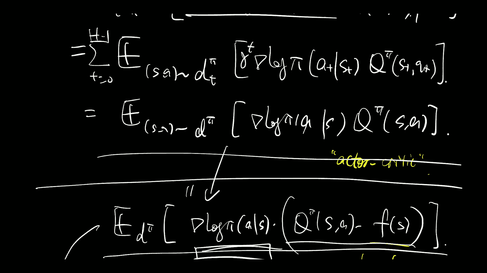

统计强化学习：P32：策略梯度（视角2）🎯

在本节课中，我们将学习策略梯度方法的第二种视角。我们将从期望回报的梯度公式出发，推导出策略梯度的另一种表达形式，并理解其背后的数学原理。

上一节我们介绍了策略梯度的基本概念，本节中我们来看看如何从期望回报的梯度公式中推导出策略梯度。

首先，我们定义期望回报 \( J(\theta) \) 为：
\[
J(\theta) = \mathbb{E}_{\tau \sim p_{\theta}(\tau)} \left[ R(\tau) \right]
\]
其中，\( \tau \) 表示一条轨迹，\( p_{\theta}(\tau) \) 是由策略参数 \( \theta \) 决定的轨迹分布，\( R(\tau) \) 是轨迹的总回报。

我们的目标是最大化 \( J(\theta) \)，因此需要计算其关于参数 \( \theta \) 的梯度：
\[
\nabla_{\theta} J(\theta) = \nabla_{\theta} \mathbb{E}_{\tau \sim p_{\theta}(\tau)} \left[ R(\tau) \right]
\]

根据期望的定义，我们可以将梯度写为：
\[
\nabla_{\theta} J(\theta) = \int \nabla_{\theta} p_{\theta}(\tau) R(\tau) d\tau
\]

这里，我们遇到了对概率分布 \( p_{\theta}(\tau) \) 求梯度的问题。为了处理这个梯度，我们使用一个重要的数学技巧——对数导数技巧（Log-Derivative Trick）。该技巧基于以下恒等式：
\[
\nabla_{\theta} p_{\theta}(\tau) = p_{\theta}(\tau) \nabla_{\theta} \log p_{\theta}(\tau)
\]

将这个恒等式代入梯度公式中，我们得到：
\[
\nabla_{\theta} J(\theta) = \int p_{\theta}(\tau) \nabla_{\theta} \log p_{\theta}(\tau) R(\tau) d\tau
\]

这个积分式恰好是另一个期望的形式：
\[
\nabla_{\theta} J(\theta) = \mathbb{E}_{\tau \sim p_{\theta}(\tau)} \left[ \nabla_{\theta} \log p_{\theta}(\tau) R(\tau) \right]
\]

至此，我们得到了策略梯度定理的核心表达式。这个公式表明，期望回报的梯度，可以通过在当前策略下采样的轨迹，计算 **轨迹概率的对数梯度** 与 **轨迹回报** 的乘积的期望来估计。

接下来，我们需要进一步分解 \( \nabla_{\theta} \log p_{\theta}(\tau) \)。一条轨迹的概率可以分解为：
\[
p_{\theta}(\tau) = p(s_0) \prod_{t=0}^{T-1} \pi_{\theta}(a_t | s_t) p(s_{t+1} | s_t, a_t)
\]
其中，\( p(s_0) \) 是初始状态分布，\( \pi_{\theta}(a_t | s_t) \) 是策略，\( p(s_{t+1} | s_t, a_t) \) 是环境的状态转移概率。

对其取对数：
\[
\log p_{\theta}(\tau) = \log p(s_0) + \sum_{t=0}^{T-1} \left[ \log \pi_{\theta}(a_t | s_t) + \log p(s_{t+1} | s_t, a_t) \right]
\]

然后计算梯度。需要注意的是，初始状态分布 \( p(s_0) \) 和环境动态 \( p(s_{t+1} | s_t, a_t) \) 与策略参数 \( \theta \) 无关，因此它们的梯度为零。所以，对数概率的梯度简化为：
\[
\nabla_{\theta} \log p_{\theta}(\tau) = \sum_{t=0}^{T-1} \nabla_{\theta} \log \pi_{\theta}(a_t | s_t)
\]

将这个结果代回策略梯度公式，我们得到最终的实用形式：
\[
\nabla_{\theta} J(\theta) = \mathbb{E}_{\tau \sim p_{\theta}(\tau)} \left[ \left( \sum_{t=0}^{T-1} \nabla_{\theta} \log \pi_{\theta}(a_t | s_t) \right) R(\tau) \right]
\]

这个公式就是著名的 **REINFORCE 算法** 的基础。它非常直观：为了提升期望回报，我们沿着使得高回报轨迹出现概率更大的方向更新策略参数。

以下是基于此公式的策略梯度估计的步骤：
1.  使用当前策略 \( \pi_{\theta} \) 采样若干条轨迹 \( \tau \)。
2.  对于每条轨迹，计算其总回报 \( R(\tau) \)。
3.  对于每条轨迹中的每个时间步 \( t \)，计算策略对数概率的梯度 \( \nabla_{\theta} \log \pi_{\theta}(a_t | s_t) \)。
4.  将每个时间步的梯度相加，再乘以该轨迹的总回报 \( R(\tau) \)。
5.  对所有轨迹的上述结果取平均，作为对策略梯度 \( \nabla_{\theta} J(\theta) \) 的估计。
6.  使用梯度上升法更新参数：\( \theta \leftarrow \theta + \alpha \nabla_{\theta} J(\theta) \)。

本节课中我们一起学习了策略梯度的第二种推导视角。我们从期望回报的梯度出发，利用对数导数技巧，推导出了不依赖于环境动态的策略梯度表达式 \( \nabla_{\theta} J(\theta) = \mathbb{E}_{\tau} \left[ \left( \sum_{t} \nabla_{\theta} \log \pi_{\theta}(a_t | s_t) \right) R(\tau) \right] \)。这个公式是许多策略梯度算法（如 REINFORCE）的理论基石，它允许我们仅通过策略本身和获得的回报来优化策略，而无需知道环境模型。