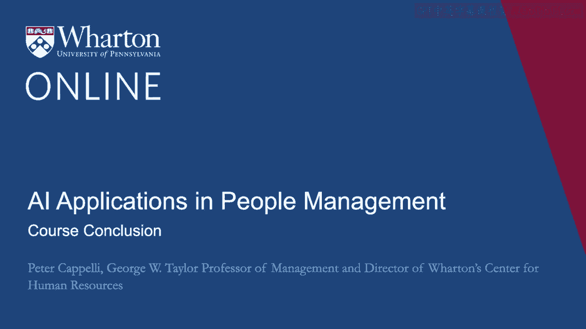
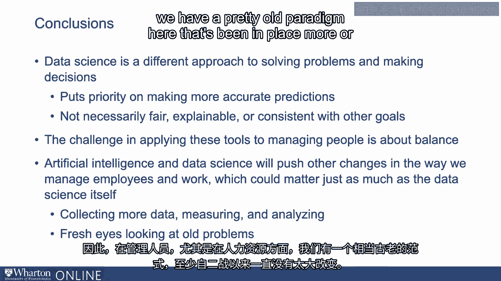

# 沃顿商学院《AI For Business（AI用于商业：AI基础／市场营销+财务／人力／管理）》（中英字幕） - P100：37_课程总结.zh_en - GPT中英字幕课程资源 - BV1Ju4y157dK

 Well folks， we've come to the end of our four module program here and the four plus hours。

 or so you've spent with us， so we spent a long time together。

 I remember years ago there was a study of a typical American family that said that they。

 talk to each other only about 20 minutes per week。 So if that's true。

 we are like a family that has been together for a couple of months here。

 so we appreciate you spending the time with us。 And we're going to try to just spend a couple of minutes here wrapping up and reminding you。

 of the big themes that we've been talking about over the course of this program。

 We are at the cusp of some reasonably big changes that data science is in the process of bringing。

 It is a quite different approach to solving problems and making decisions。

 That's the first thing to remember。 It puts priority on making accurate decisions。

 which can be a very good thing。 Because many of the decisions we're making now in the workplace are not particularly。

 good ones， particularly about hiring。 We don't hire very carefully。

 We're not necessarily getting the best people and the way we're doing it has a fair amount。

 of bias built into it。 The thing to remember of course about data science is those decisions。

 optimizing decisions， don't necessarily meet tests of fairness。

 They don't necessarily meet tests of explainability that is being able to tell a person。

 why the decision was made as it was in a way that they understand。

 Nor are these decisions necessarily consistent with other goals about fairness， for example。

 So the challenge in applying these tools to managing people is about balance。

 We have these optimization tools from data science， which can really provide a lot of， guidance。

 We also have all these other concerns when it comes to managing people， which are not。

 there when we're applying data science to machines。 There's always a demand for simple rules。

 And there's always a demand for just treating people along the same lines as machines。

 This goes back as we said at the very beginning， a hundred years or so in the US to Frederick。

 Taylor's work in scientific management。 The problem is we've demonstrated more or less consistently over the last hundred years。

 or so， particularly over the last sixty or seventy， that it doesn't work well。

 That engaging employees really does matter。 Engaging them means involving them in some of the decision processes。

 In our context， maybe this is going to mean involving them in the data science exercises。

 that lead to the advice on how to make decisions。 There's a theme here as well though。

 and the theme is that artificial intelligence and。

 right now data science is likely to push other changes in the way we manage employees and， work。

 which could matter just as much as the data science itself。 And here are two examples。

 The first one is we have to collect more data。 In order to do these data science exercises。

 we need more data。 And the data are things we probably should have known all along。

 like let's try to measure， the performance of people。

 And let's try to measure maybe on more than one dimension。

 Let's see if we can collect information on people's training to try to see whether it， really works。

 And once we start collecting data and once we start measuring things， it leads us toward。

 trying to actually analyze and trying to see whether our decisions are good ones or not。

 And the last approach that is important that comes out of data science is a good thing。

 is that this isn't like fresh eyes looking at old problems。

 So in managing people in human resources in particular， we have a pretty old paradigm。

 here that's been in place more or less unchanged except for tweaking since at least World War。

 II。 And when data science people come in to the workplace， one of the best things that they。

 do is simply ask， why are you doing it this way？ And that can lead to a lot of change even if they don't generate a new algorithm that。

 provides the perfect solution to the problem。 So in conclusion。

 I think the very good news for us is that with data science we are on。

 the cusp of some big changes in the workplace。 Some of them driven by data science per se。

 Some of them driven simply by the organization change process of thinking differently about。

 some of these questions。 And we wish you the very best luck in trying to navigate your path through these。

 Thank you very much for being with us。 [BLANK_AUDIO]。

