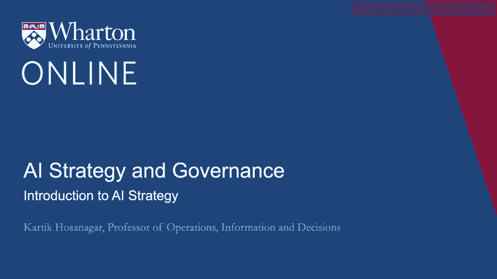
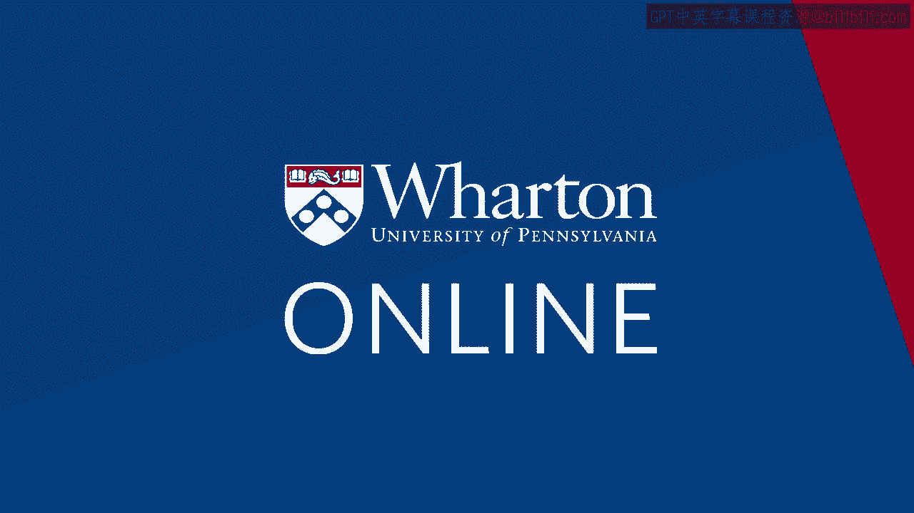

# 沃顿商学院《AI For Business（AI用于商业：AI基础／市场营销+财务／人力／管理）》- P101：0_AI战略简介.zh_en - GPT中英字幕课程资源 - BV1Ju4y157dK

这是一门关于人工智能战略和治理的课程。

我们将首先讨论以人工智能驱动的商业转型。

我们将谈论为何一些公司早期的人工智能倡议失败。

我们该如何应对。具体来说，我们将查看成功公司的策略。

利用人工智能获得竞争或商业优势。

这些包括发展长期项目组合和短期项目的想法。

我们还将讨论机器学习的民主化如何降低各企业使用人工智能的障碍。

特别是，我的同事桑尼·坦贝将讨论企业中使用人工智能的众多输入。

这包括软件、人员、计算和数据。

以及公司应如何考虑这四个输入以正确的方式结合起来。

我还将讨论人工智能在组织结构中的作用。具体而言。

当前成功应用人工智能的组织有哪些行为模式？接下来。

我的同事林吴教授将讨论人工智能与变革管理。

特别是人工智能在业务流程重组中的重要角色。

我们将讨论人工智能面临的一些挑战。我们将谈论人工智能算法可能失败的方式。

以及这些失败带来的风险及对公司的影响。

我们将以讨论公司如何建立治理框架作为结束。

以保护自己免受人工智能失败的影响。

我的同事们，凯文·伍尔巴克教授和桑尼·坦贝教授将讨论人工智能伦理的原则。

关于人工智能可解释性和法律的问题。[空白音频]。

