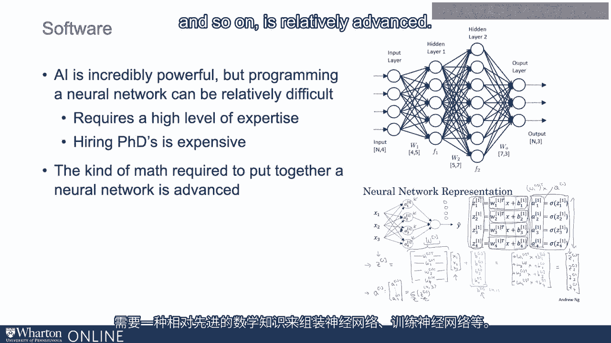
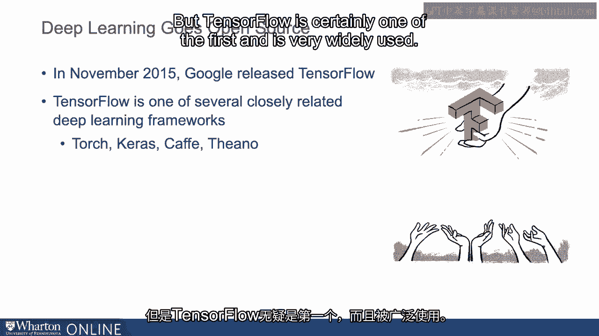
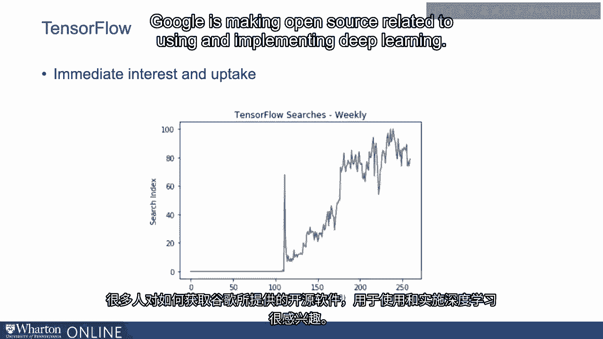
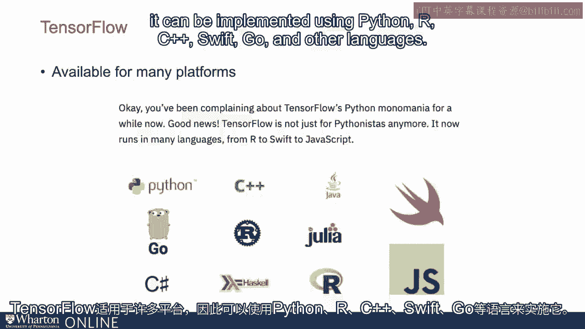
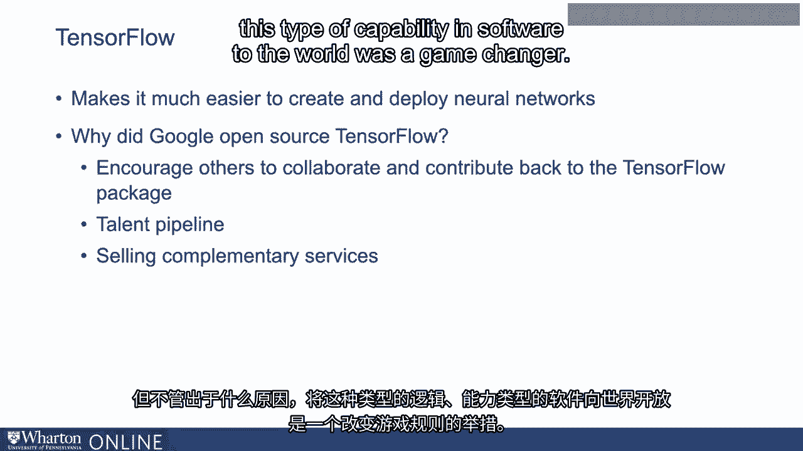

# 沃顿商学院《AI For Business（AI用于商业：AI基础／市场营销+财务／人力／管理）》（中英字幕） - P105：4_AI软件的经济学.zh_en - GPT中英字幕课程资源 - BV1Ju4y157dK

 When we think about how AI interacts with economics， with competition， and so on， it's。

 important to consider some of the key inputs to AI。

 So these include the software you need for machine learning and AI， the skills you need。

 to implement them， the computational resources you need to build and run models， and the。

 data you need to train the models。 So let's talk about how some of the costs of these inputs。

 the inputs themselves are evolving， and what that might mean for the economics of AI going forward and what AI might mean。

 for competition。 So let's start with the first which is software。

 So AI of course is an incredibly powerful tool。 Machine learning is very。

 very powerful in terms of what it can do。 But programming， a neural net for instance。

 is relatively difficult。 That requires a high level of expertise， hiring PhDs is expensive。

 the kind of math required， to put together a neural network。

 train a neural network and so on is relatively advanced。

 Lots of math required to make predictions using a neural network。

 And so the commercial impact of AI in some ways has been limited in part by a relatively， high。

 which you might call price， and that's expensive to be able to put together the software。

 required for a prediction model based in deep learning。

 A big shift occurred a few years ago in terms of a drop in price and that is that deep learning。

 went open source。 And what I mean by that is that several companies。

 Google was among the first of them， made their， deep learning infrastructure at the code level available to anyone who wanted to use it through。

 open source software channels。 So if open source is turned that's new to you。

 it's when software is made available for free， on the web for you to download。

 use and potentially contribute to。 So one of the first examples of this was Google releasing TensorFlow in November of 2015。

 And TensorFlow was a package， a software package that encoded a lot of what Google knew about。

 machine learning， about deep learning。 Now we're using TensorFlow as one of several closely related deep learning frameworks。

 You may also hear of Torch， Keras， Cafe， others that are basically include much of the same。

 type of intelligence in them。 But TensorFlow is certainly one of the first and is very widely used。

 So TensorFlow is released by Google。 There is immediate interest and uptake in the TensorFlow package。

 Lots of people interested in how they could get their hands on the software that Google。

 is making open source related to using and implementing deep learning。

 TensorFlow is available for many platforms so it can be implemented using Python， RC++， Swift。

 Go and other languages。

 And what it does is it just makes it much easier to create and deploy neural networks。

 So it essentially changes it from what you might think of as a PhD level task。

 It's not an easy task by any means but it requires less training than it might require。

 to deploy a neural network from scratch。 So it still requires some code but essentially it makes it much easier。

 Somebody with a master level education can put together a deep learning network in a。

 way that's much quicker and easier than it was before。 Question arises of course。 Why did Google。

 why did other companies that have done the same thing？ Why do they open source TensorFlow？

 Why do they make it available to others including competitors？

 And lots of potential answers to this。 It might have been to encourage others to collaborate and communicate and contribute。

 back to the TensorFlow package itself。 It might have to do with a talent pipeline。

 Sometimes companies make software open source in an effort to attract people who want to。

 work with good code bases。 They may be interested in selling services that are complementary。

 But for whatever reason， the availability of this type of logic or this type of capability。

 in software to the world was a game changer， has been a game changer in terms of making。

 it easier for anybody else to take this kind of software and use that as a springboard to。

 develop their own deep learning engines for their own applications。

 In the next video we'll talk about what this means for the skill profile required to develop。

 deep learning applications。 [BLANK_AUDIO]。

