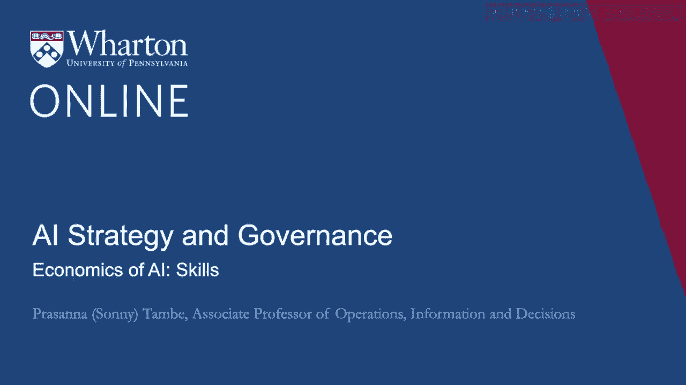
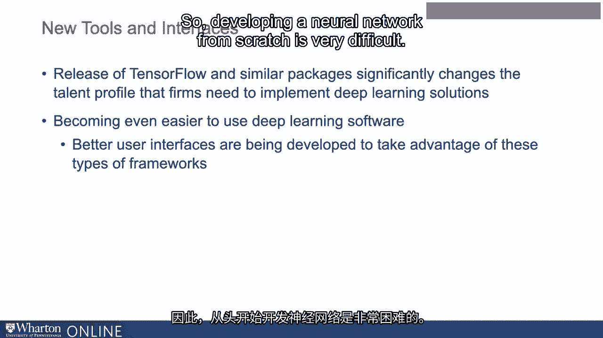
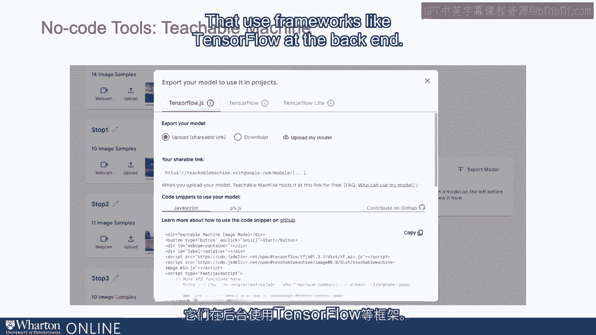
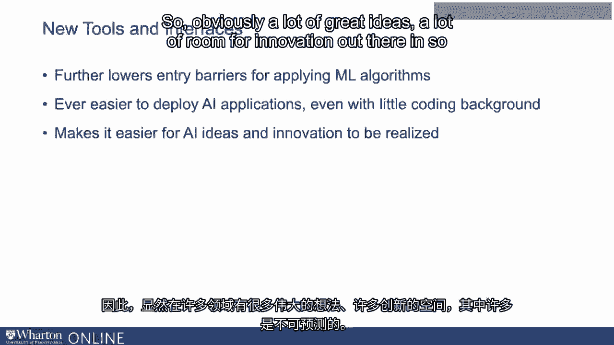
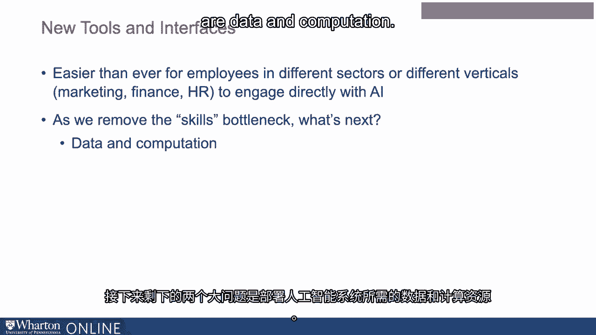

# 沃顿商学院《AI For Business（AI用于商业：AI基础／市场营销+财务／人力／管理）》（中英字幕） - P106：5_AI技能的经济学.zh_en - GPT中英字幕课程资源 - BV1Ju4y157dK

 The release of TensorFlow and similar packages。

 significantly changes the talent profile， that firms need to implement deep learning solutions。

 Moreover， it's becoming even easier， to use these types of software。

 because better and better user interfaces， are being developed to take advantage。

 of these types of frameworks。 So developing a neural network from scratch， is very difficult。

 These packages make it much easier， to access through code， but new interfaces are being developed。

 that allow people to access these types of frameworks， sometimes without even using code。

 There are a variety of no code tools， like Google's Teachable Machine。

 that are being developed and worked on， and introduced to the world。

 that use frameworks like TensorFlow at the backend。

 but that make it very， very easy， for people to build basic machine learning frameworks。

 that can be used to do different tasks， and to deploy them。

 And this is in turn even going to further lower， the entry barriers for applying machine learning backgrounds。

 It becomes ever easier to deploy these applications， even for people who have relatively little。

 or even no coding background at all。 One of the great things about this。

 is it makes it easier for AI ideas， and innovation to be realized。

 So obviously a lot of great ideas， a lot of room for innovation out there。

 and in so many sectors， many of which are unanticipated。 A big bottleneck historically of course。

 has been that going from idea to realization， and the machine learning world requires extensive software。

 and skills and the new tools that are being made available。

 the new frameworks that are being made available， make it easier than ever to go directly from idea。

 to actually realizing the value of these ideas。 It'll also be easier than ever for employees。

 in different sectors， different verticals， marketing， finance， HR to engage directly with AI。

 This removes important bottlenecks， and brings it closer to the goal of being for everyone。

 Makes things closer to the goal of making it available， for all different tasks at the firm。

 So as we remove the skills bottleneck， as the software becomes easier to use。

 as it requires less skill to use the software， what's next， the two big things that are left。

 for deploying AI systems are data and computation。

 We'll talk about those next。 [ Silence ]。

