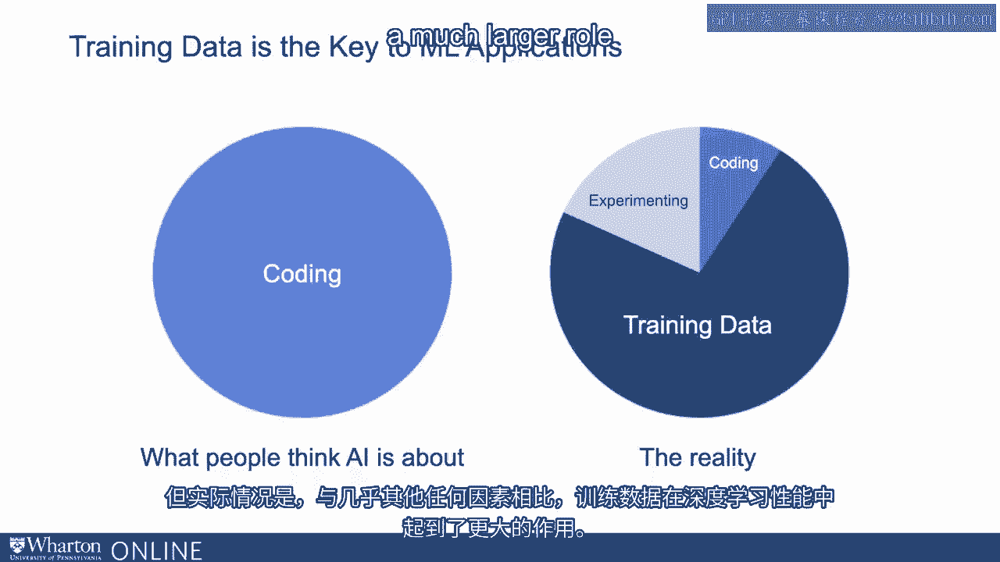
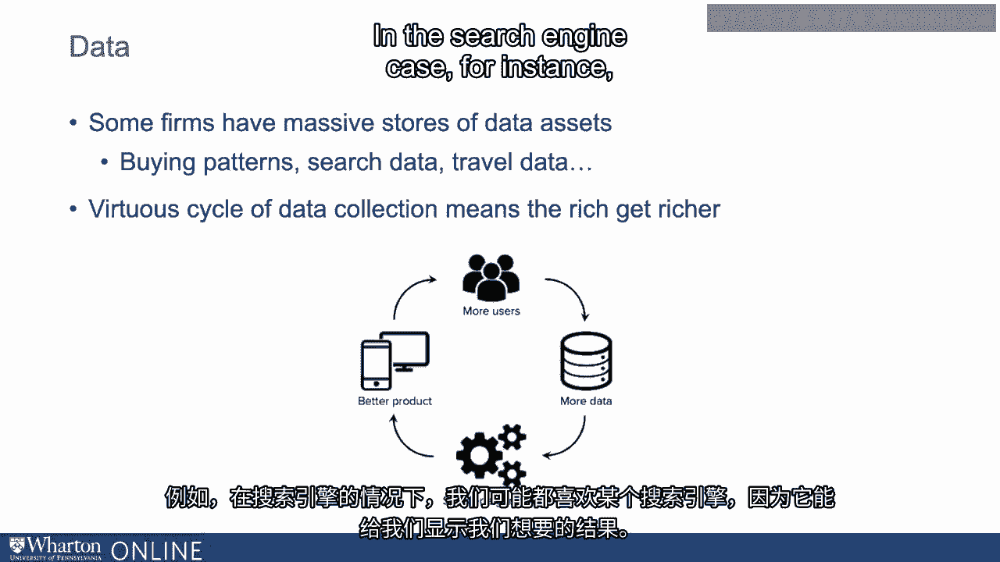

# 沃顿商学院《AI For Business（AI用于商业：AI基础／市场营销+财务／人力／管理）》（中英字幕） - P108：7_AI数据的经济学.zh_en - GPT中英字幕课程资源 - BV1Ju4y157dK

我们讨论过软件技能计算。

机器学习的最后一个关键输入是数据。而训练数据确实是机器学习应用的关键。

所以有一种普遍的观点认为，编码和这些其他输入确实有很大的关系。

结合差异化应用。但现实是，训练数据在深度学习性能中扮演着更重要的角色。

与几乎其他任何东西相比。因此，当我们思考时，数据的获取真的是一个关键差异化因素。

在机器学习领域的性能。与数据相关的一个细微差别是。

与深度学习和其他类型的机器学习一起。

事实证明，随着数据规模的增加，对于大多数传统的机器学习模型。

浅层机器学习模型，性能虽然提升，但在某个层面会达到瓶颈。

深度学习在这一层面上处于非常不同的状态。

事实证明，对于深度复杂的神经网络应用，性能是持续提升的。

数据规模上升已持续了很长很长时间。这意味着，对于依赖复杂深度学习网络的应用。

因此，拥有大量数据有着巨大的优势，这就是为什么你可能会听到这个词。

数据是新的石油。对于复杂的应用，例如自动驾驶汽车。

有些公司一直在收集关于如何使用这些输入数据进行自动驾驶的数据。

汽车决策已经很长时间以来都在收集大量数据。从某种意义上说。

数据是新的石油，因为它可以为这些预测提供价值。

以一种无法被许多其他公司轻易复制的方式。

所以有些公司拥有大量关于从购买到其他一切的数据资产。

模式，如果你是一个在线网站或信用卡公司，自然会搜索旅行数据。

数据。所以这些庞大的数据资产已经非常有价值。

随着数据的使用变得越来越容易，它们只会变得越来越有价值。

在机器学习的意义上做出预测。通常可以看到围绕数据收集的良性循环。

本质上，富者愈富。我指的是你拥有的数据越多。

你能构建的产品越好，构建的产品就越好。

你能开始收集的数据越多。所以在搜索引擎的案例中，例如。

我们都可能更喜欢某个特定的搜索引擎，因为。

它展示了我们想要的结果，但我们越使用，它们就能提供更多的数据。

收集数据。所以这导致了一个良性循环，在数据驱动的经济中，往往是这样的。

数据丰富的那些继续变得越来越富有，逐渐拉开与那些没有数据的人的差距。

有很多数据，但在开始和收集数据资产方面很困难。

他们需要构建出同样质量的算法。谢谢。[沉默]。

