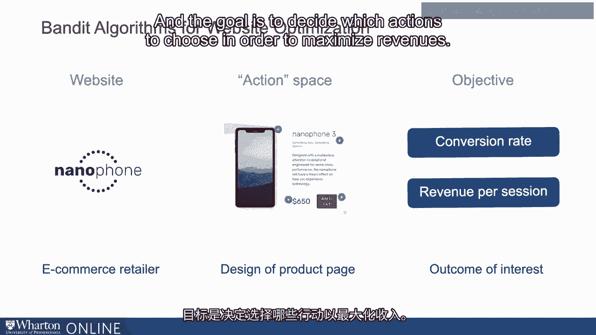
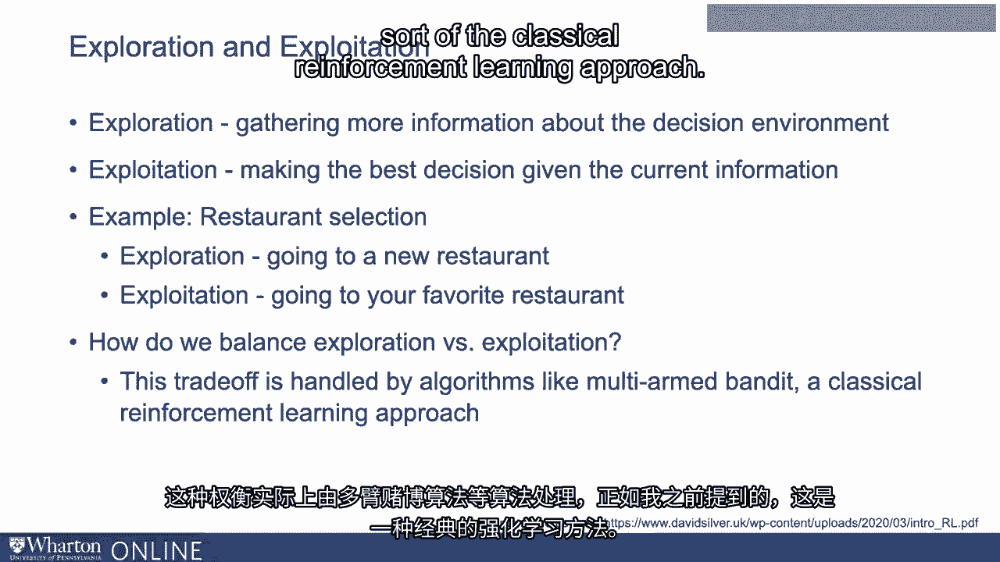
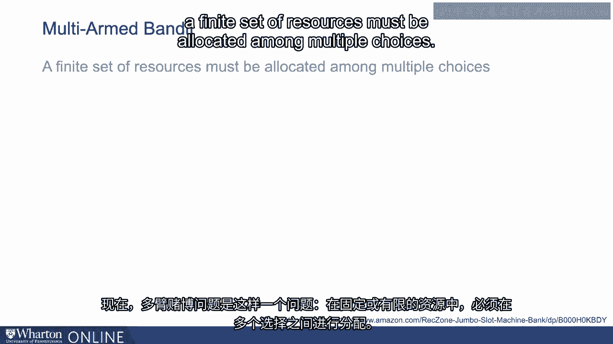
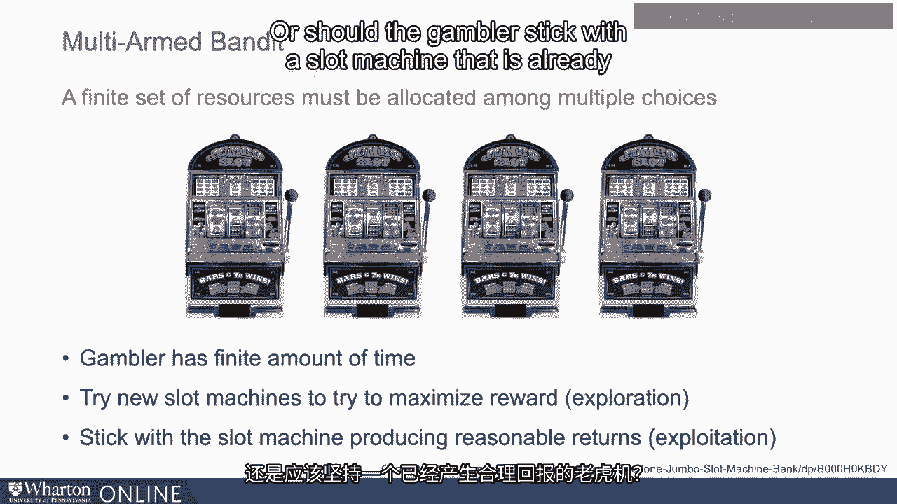
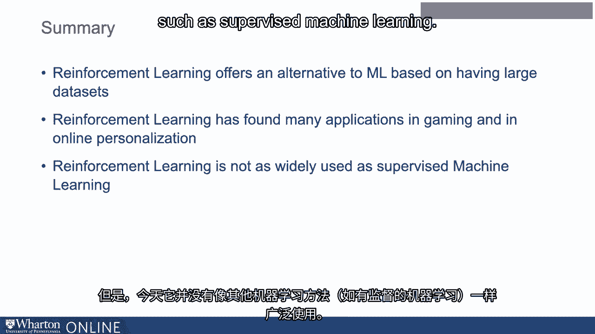

# 沃顿商学院《AI For Business（AI用于商业：AI基础／市场营销+财务／人力／管理）》（中英字幕） - P10：9_强化学习.zh_en - GPT中英字幕课程资源 - BV1Ju4y157dK

 Let's next look at reinforcement learning and in particular multi-ambanded algorithms。

 more closely。 These algorithms are a powerful tool when you have continuous data coming in and we can。

 learn from the data to improve decisions。 For example。

 consider a media website like a news media website that would like to personalize。

 the website to its users or determine， for example， which of thousands of different news。

 articles to profile at the top of its homepage。 Or consider an e-commerce retailer。

 Let's call it Nanophone， which is a retailer of， let's say， mobile phones。

 When a consumer logs into the website， Nanophone needs to decide how to personalize the product。

 page to the consumer。 They might have to decide which of 10 different images of the phone to show to the consumer。

 They might have to decide which product features to emphasize to the consumer。 For example。

 should they focus on the battery life for the phone？

 Or should they focus on the sleek design or some other product attribute？

 They might want to decide on which of several different discounts to offer to these consumers。

 Zero percent discount， five percent discount， ten percent discount。

 They might have multiple calls to actions。 And they might have to choose which call to action to use。

 So the action space or the set of decisions or the set of choices available to the marketer。

 in this context is really very large。 And the goal is to decide which actions to choose in order to maximize revenues。

 At the heart of this problem is the question of how much do we explore and how much do， we exploit。

 And what we mean by that is exploration is all about gathering more information about。

 the decision environment。 For example， asking the question。

 what might happen if I choose not to emphasize the battery。

 life as much and instead choose to focus on the sleek design of the phone。 In contrast。

 exploitation is about making the best decision given the current information。

 Simply based on the current information， we believe the marketing message that most attracts。

 the consumer is a message that emphasizes the battery power。

 So should we go with that or should we try something new？

 Now we routinely use the ideas of exploration and exploitation in our everyday lives。 For example。

 suppose you are going to a restaurant。 Do you go to a completely new restaurant which is the equivalent of exploration？

 Or do you go to your favorite restaurant which you've been to many times and you know it's。

 tried and tested？ That is exploitation。 And there are times at which you might choose to go to your favorite restaurant that is。

 choose to exploit。 And there are times at which you might say let's try something new and learn about the。

 restaurant。 Even if it risks the possibility that we might not enjoy the food or the experience。

 And that's exploration。 The question at the heart of these kinds of decision problems is how do we balance exploration。

 versus exploitation？ How do we decide when to try a completely new marketing message or a completely new。

 web page to the consumer versus when do we use something that has worked reasonably well。

 in the past。 And this tradeoff is what is really handled by algorithms like multi-ambanded algorithms。

 which as I mentioned earlier is sort of the classical reinforcement learning approach。

 Now multi-ambanded problem is a problem in which a fixed or a finite set of resources。

 must be allocated among multiple choices。

 So for example imagine a gambler in a casino faced with a row of slot machines。

 And the gambler must decide which slot machines to pull and the gambler only has a finite amount。

 of time in the casino and can therefore get only 100 or 200 pulls and different slot machines。

 So they must decide at any given time whether to try a completely new slot machine and see。

 if it's associated with a much higher probability of getting high rewards or should the gambler。

 stick with a slot machine that is already producing reasonable returns。

 Now there are many algorithms that can be used to balance this exploration and exploitation。

 And indeed there are many algorithms for multi-ambanded problems。

 For example a strategy called Epsilon first is essentially a heuristic in which we tend。

 to experiment early that is explore a lot early and then once we have learnt a little。

 bit then we start exploiting。 So in the context of personalizing the website for nano-phone what we might do is during the。

 first few weeks we might choose to explore and try many different marketing messages。

 many different images and so on。 And once we've learnt what we wanted to learn then we choose to exploit that is allocate。

 100% of the traffic to the best performing variant that we discovered in the first few。

 weeks of exploration。 Another algorithm available is Thompson sampling。

 What Thompson sampling might do for the problem that nano-phone faces is that it might initially。

 allocate the traffic， the web traffic coming into the website equally to all the different。

 choices that the company is considering。 Meaning the choices like should we emphasize messages and visuals that show the battery。

 Should we use visuals and messages that talk about the sleek design？

 Should we instead use visuals and messages that talk about the app store of the phone， and so on。

 And Thompson sampling will initially allocate traffic to each of these choices with equal。

 probability。 But as more and more data comes in Thompson sampling will choose the alternatives that。

 are producing higher or better results。 It will choose them with higher probability。

 So if for example the message and visuals that emphasize the app store is the one that。

 slowly but steadily producing better results than the probability with which that choice。

 is chosen will keep going up。 Qualitatively speaking that's what the algorithm does。

 Obviously the details of how the algorithm works is probably not of most interest given。

 our focus is to talk about the business applications of AI but hopefully you get a sense of the。

 intuition behind these approaches。 In summary while we assume that machine learning is based on having access to large data sets。

 reinforcement learning offers an alternative that relies less on training data but more。

 on dynamic experimentation to learn which strategies are doing better and to use those more and。

 more。 Reinforcement learning has found many applications in gaming and in online personalization。

 That said today is not as widely used as other machine learning approaches such as supervised。

 machine learning。 Given how pervasive supervised machine learning is especially in business settings we will。

 now deep dive into the world of supervised machine learning methods。 [BLANK_AUDIO]。

