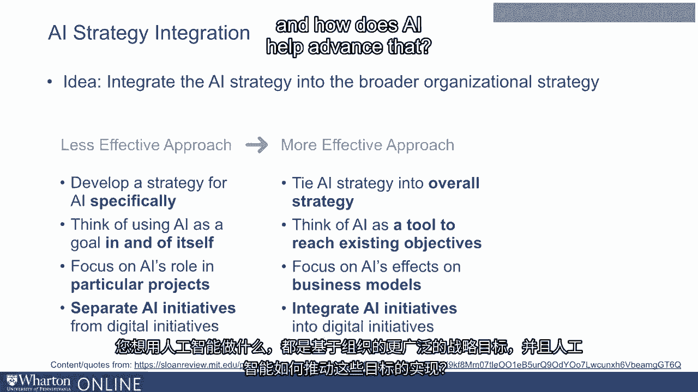
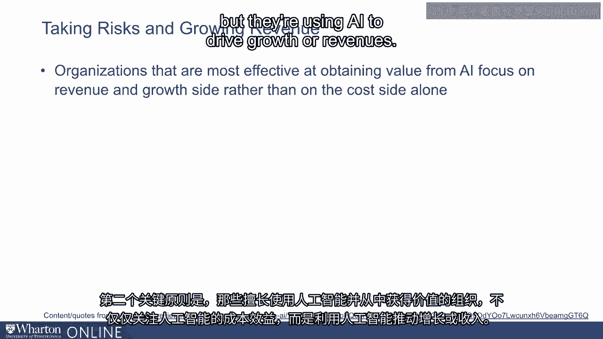
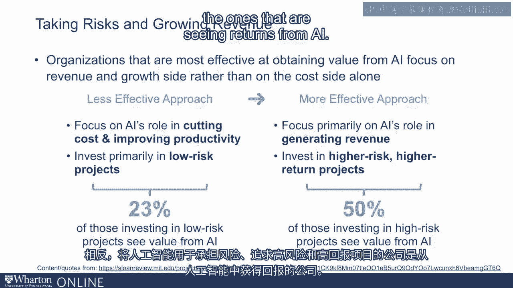
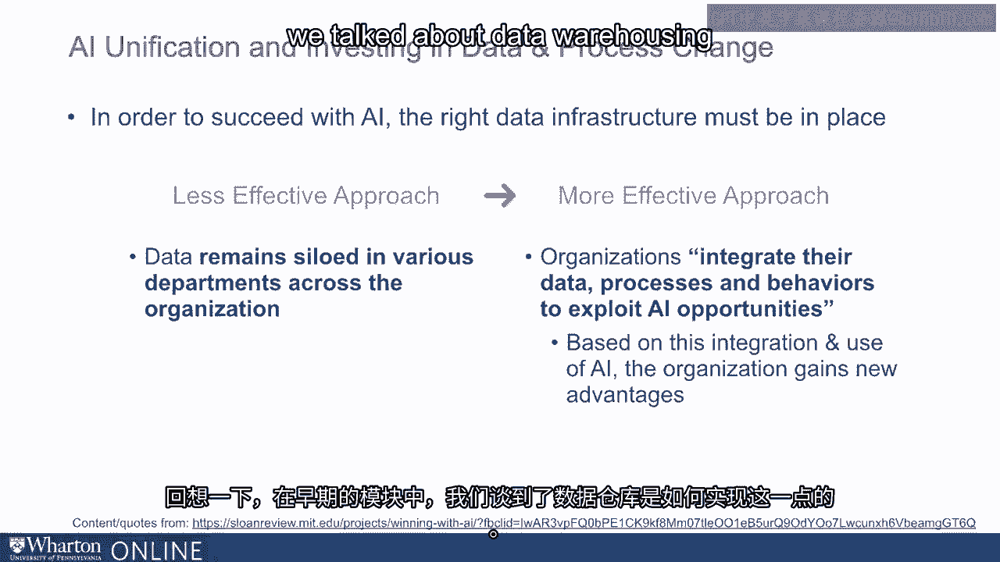
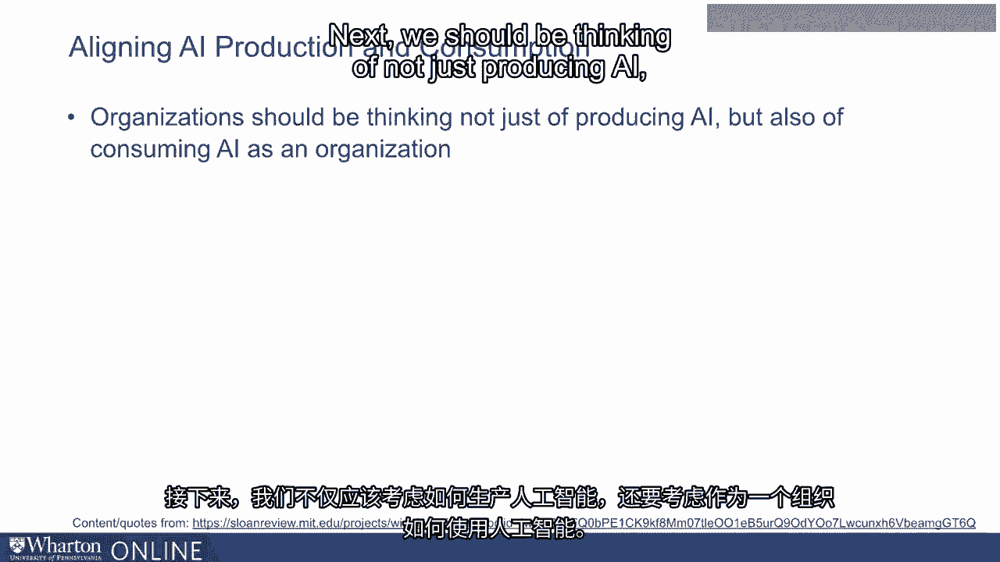
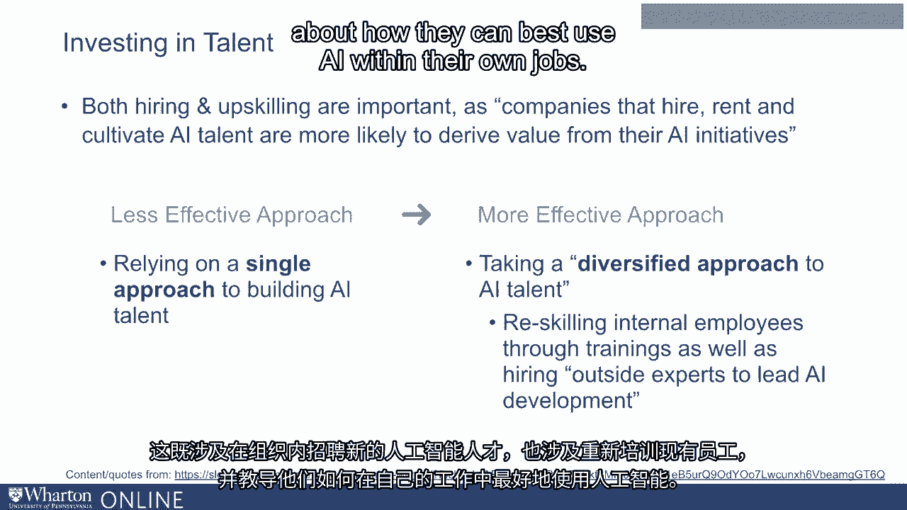
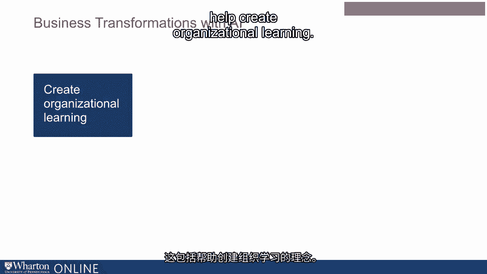
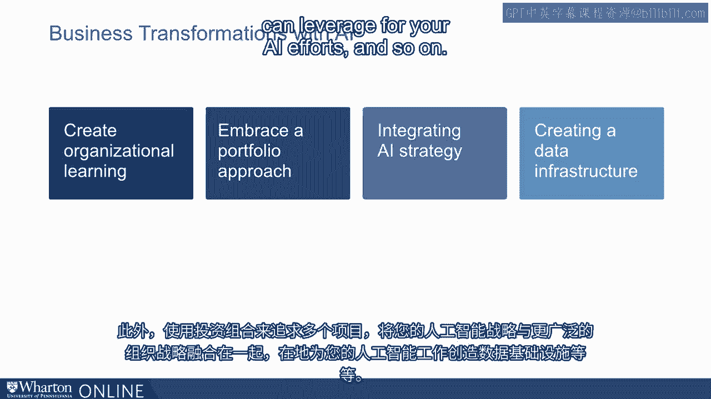
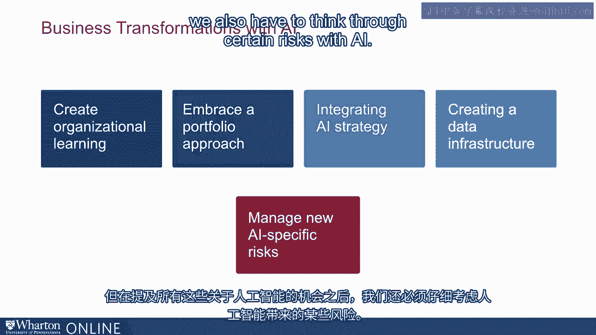

# 沃顿商学院《AI用于商业：AI基础／市场营销+财务／人力／管理》（中英字幕） - P113：12_组织架构中的AI.zh_en - GPT中英字幕课程资源 - BV1Ju4y157dK

我们已经谈到构建投资组合是AI策略的重要组成部分。

作为他们AI策略的一部分，管理者还能做哪些事情？在本讲座中。

我们将探索一些这些策略。BCG和MIT对高管进行了调查，询问他们的AI策略。

特别是，他们询问了那些从AI投资中获得成果的公司。

他们做了哪些事情？以下是一些似乎对这个群体有效的策略。

第一个原则是AI策略整合，即你可以整合。

将AI策略融入更广泛的组织战略中。

许多公司为AI单独制定了策略。换句话说。

他们将使用AI视为一个独立的目标。相比之下。

更有效的策略是将AI概念化并设想在。

在更广泛的组织战略背景下。所以无论你想用AI做什么，都基于更广泛的战略目标。

组织以及AI如何帮助推动这一进程。

当然，现在重要的是意识到，尽管我们希望长期内实现整合。

对于公司而言，从不太整合和不太雄心勃勃的目标开始是可以的。

在短期内作为建立共识和获取一些AI技能的方式。

所以在短期内拥有其中一些是可以的，但即便如此你也希望有一些。

与整体长期策略相整合或对齐的长期倡议。

作为一个组织。第二个关键原则是，能够有效利用AI并获得收益的组织。

从AI中获得价值的公司不仅关注AI的成本效益，而是利用AI来推动。

增长或收入。因此，不太有效的策略就是仅仅将AI视为降低成本的工具。

相比之下，利用AI承担风险的公司追求更高的风险和更高的。

回报项目是那些从AI中看到回报的项目。

同样，另一个非常重要的想法是，为了在AI上取得成功，你需要。

拥有合适的基础设施至关重要。而最重要的基础设施是数据基础设施。

真正考虑在多个部门整合数据资产的公司。

在组织内拥有多个产品和多个数据源的公司才是那些。

正在取得成效。换句话说，如果你的数据仍然孤立，并且被个别部门孤立使用。

如果各部门孤立运作，整个组织不太可能从AI中获得显著收益。

相比之下，那些在AI上取得成功的公司是那些努力进行整合的公司。

他们的数据。请回忆在早期模块中，我们谈到过数据仓储作为其中的一种方式。

是可以完成的。数据仓储涉及将来自不同来源的数据整合到一个单一的存储库中。

这是一个容易访问的分析应用程序。这是一个非常重要的练习。

投资数据基础设施是一个非常重要的练习，因为没有它。

否则你只能获得一个非常分散的客户或组织本身的视图。接下来。

我们不仅应该考虑生产 AI，还应该考虑作为一个组织如何使用 AI。

我们的意思是，虽然拥有数据科学家和机器学习专家很重要。

正在创造新的机器学习能力的专家，我们也希望有消费者。

在业务中利用 AI，这意味着经理们将消耗这些洞察。

机器学习的数据科学并从中做出管理决策。

为了做到这一点，你需要有数据基因的经理。

所以并不是所有经理都有这种素质。这可能也涉及一定程度的再培训。

你需要与数据科学家紧密合作并努力的经理。

理解数据分析的结果，挑战数据分析的对象，以及谁。

他们将自己的领域知识带入数据分析中。

所有这些都是必要的，以便你不仅有数据科学家在内部创造 AI。

组织中有经理在消费数据科学和 AI 的洞察。接下来。

投资人才非常重要。这个原则我之前提到过。

但是如果你有一个孤立的四到五个数据科学家的团队，我们就无法在 AI 上取得成功。

你需要在整个组织中拥有 AI 知识、理解和洞察力。

这既包括在组织内招聘新的 AI 人才，也包括重新培训现有的人才。

员工以及教他们如何在自己的工作中最佳利用 AI。

所以我提到了一些帮助转型组织所需的不同原则。

关于 AI 的思考。这包括帮助创造组织学习的想法。

还使用投资组合来。

追求多个项目，将你的 AI 战略与更广泛的组织战略结合起来。

建立一个数据基础设施，以便你可以利用它进行 AI 努力等等。

但是在提到所有这些 AI 机会的同时，我们也必须考虑某些。

AI 的风险。在接下来的几节课中，我们将讨论这些 AI 特有的风险，以及如何创建。

一个治理框架来管理这些风险。[BLANK_AUDIO]。
