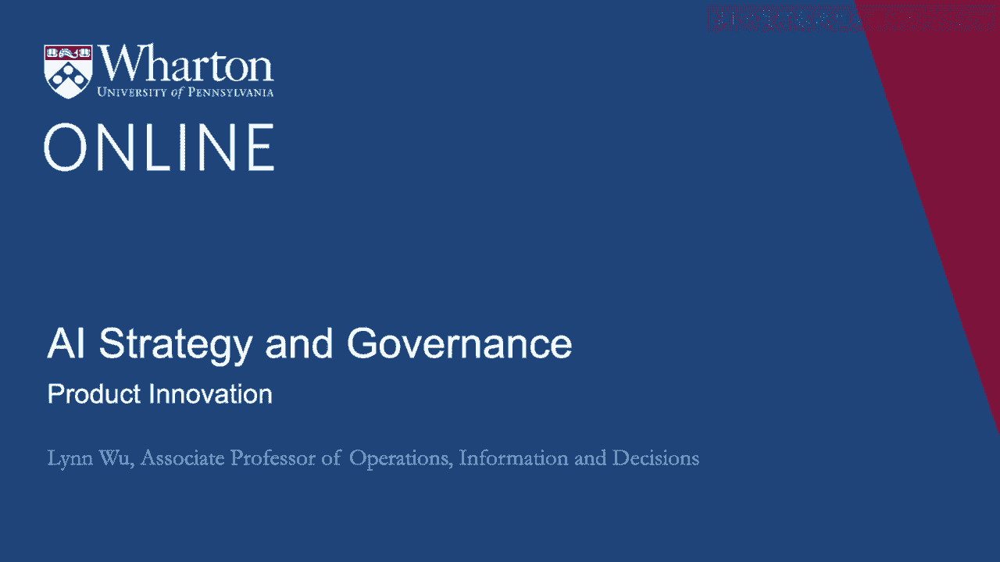
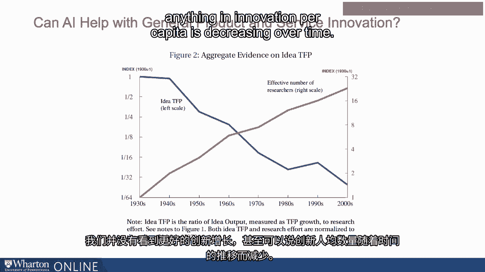
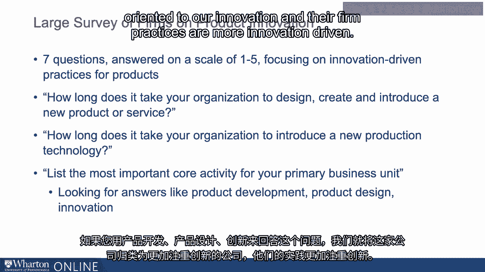
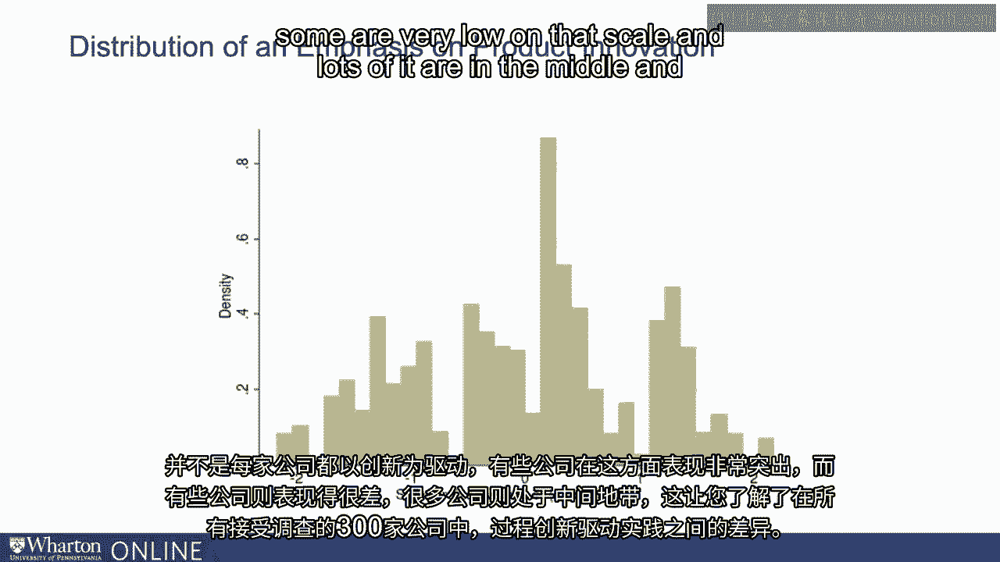
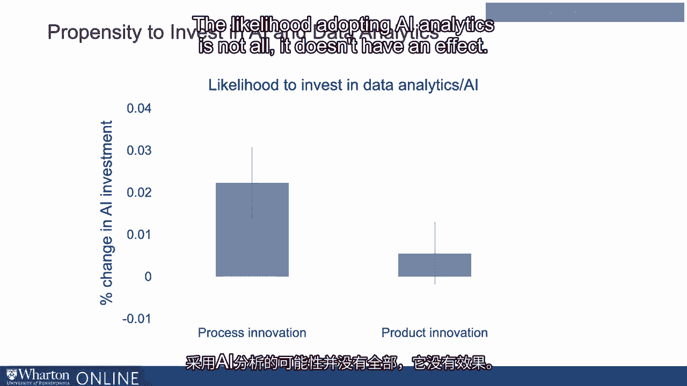
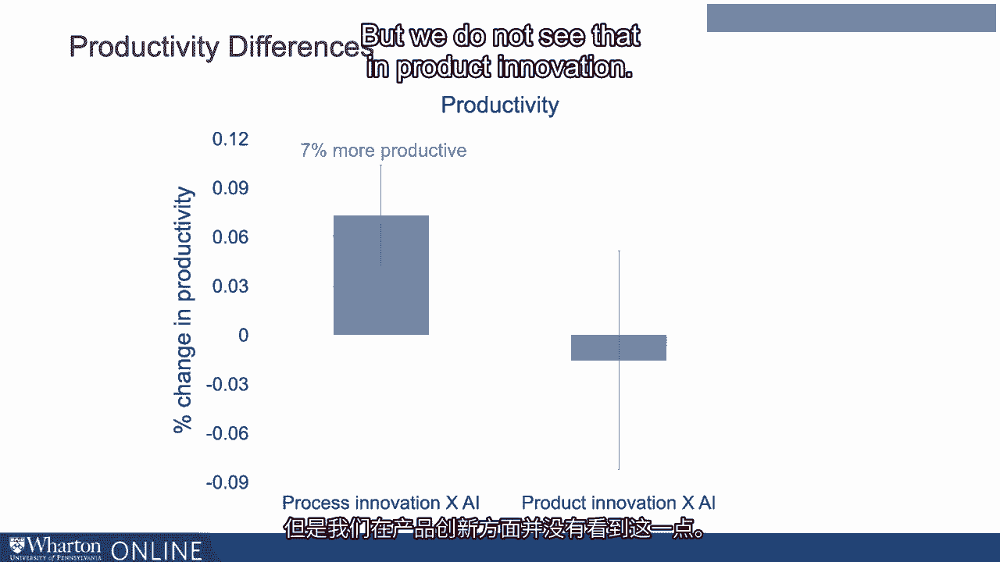
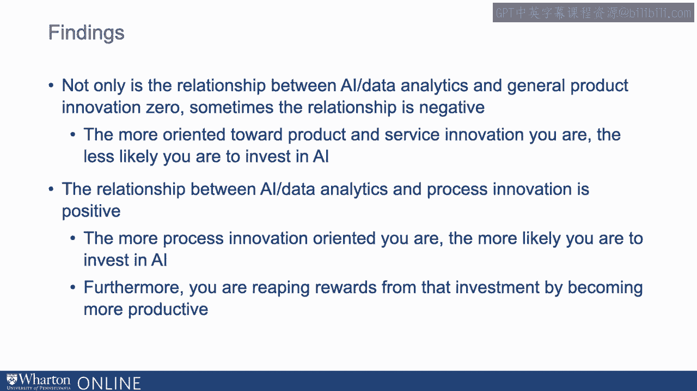

# 沃顿商学院《AI For Business（AI用于商业：AI基础／市场营销+财务／人力／管理）》（中英字幕） - P117：16_产品创新.zh_en - GPT中英字幕课程资源 - BV1Ju4y157dK

 In the last video， we talked about process innovation。

 In this one， we're gonna talk about product innovation， or specifically how AI and data analytics。

 can help you affirm， innovate new products and services。

 Remember that innovation paradox we mentioned earlier。

 that we've seen a growing investment in AI and data Linux。

 and yet we do not see innovation statistics showing up。 In a sense。

 we do not see a growth in better innovation， or more innovation。 If anything。

 innovation per capita is decreasing over time。

 So to understand this， we conduct a large scale survey， to see what's going on。

 In an earlier survey， we showed that AI can help a lot， with process innovation。

 And can we see the same in product and general services？ So again。

 we ask a similar type of question， but here we are really trying to focus。

 on innovation driven practices on products。 So here we ask questions such as。

 how long does your take your organization to design， create， introduce a new product and services？

 Or how long does it take you to innovate， or introduce a new production technology？

 Or what is the most likely core activities， in a primary business unit？ If you answer this question。

 was the answer product development， product design， innovation， we classify this firm as somebody。

 who are more oriented toward innovation， and their firm practices are more innovation driven。

 And again， we see the histogram， not every firm's innovation driven。

 And some firms are very high on that scale， and some are very low on that scale。

 and lots of it are in the middle。

 And just gave you an idea about the difference， between process innovation driven practices。

 among all the 300 firms we surveyed。 This is a graph showing the distribution。 So on the x-axis。

 we have process oriented practices， as we shown earlier。 And on y-axis。

 we see innovation related practices。 You can see that it's distributed across all four quadrants。

 Some firms are high on both， some firms are low on both， and there's mixed match。

 some are more process oriented， and less concerned about innovation。

 and some are more concerned about innovation， and less concerned about processes。

 So you do see a heterogeneity where huge spectrums。

 where firms can fit in into this graph。 And this is the likelihood of these firms。

 in investing AI and data analytics in the first place。 So in the first bar。

 we looked at if your firm， is very process oriented。

 how likely are you to invest in data and AI investment？ We see that a standard deviation。

 increase in process innovation。 There are about 2。22% more likely， to adopt AI and data analytics。

 And it affects the very statistically significant。 But if you look at a product innovation。

 on a same scale， a 1。0 deviation increase， in the likelihood of you adopt AI。

 if your product oriented， that affects essentially zero。

 Seems like if the firm is really interested， in product innovation。

 the likelihood of adopting AI analytics is null。 It doesn't have an effect。

 That's really interesting。 That may speak to some of the innovation paradox。

 that we've seen earlier。 Let's also take a look at how does that translate， into productivity。 Okay。

 if you do， if maybe that AI does not help， with productivity and not investing in AI。

 is a right decision。 Here we looked at firms that are interested， in improving product innovation。

 And they also invest in AI and compare that with firms。

 that are process oriented and also invest in AI。 Okay， in this graph we see that。

 when a firm invests in both AI， and they're very oriented in processes， a 1。

0 deviation change neither， associated with a 7% improvement productivity。

 So we seen that in an earlier video。 And it's contrasting that with innovation in products。

 Product innovation and AI basically affirm， that invest in lots of AI skills and products。

 and infrastructure。 And also are really interested in innovating product。

 They actually do not see a productivity gain in there。

 But here we're just measuring all products innovation。

 We haven't distinguished what kind of innovation， within that product category。

 But overall we do see a difference between firms， that are really interested in process orientations。

 and firms that are interested in product orientations。

 A firm that are really interested in improving processes。

 sees significant improvement in using AI and analytics。

 But we do not see that in product innovation。

 So this important finding is that， not only is it relationship between AI and analytics。

 and general product innovation is zero。 And sometimes that relations could even be negative。

 That is the more oriented to our product， and in service image you are。

 they actually less likely for you to invest in AI。

 And we see that relationships is not true for process。 In a sense that the more process innovation。

 your firms more likely to conduct， the more likely you are to invest in data analytics and AI。

 And furthermore， you're also reaping from reward， from that investment by becoming more productive。

 So we do see an innovation divide， in between process and products。 But again。

 that is still a very rough division。 We're gonna take a look at within product innovation。

 what works and what does that in AI in our next video。 (silence)， (buzzer)。

