# 沃顿商学院《AI For Business（AI用于商业：AI基础／市场营销+财务／人力／管理）》（中英字幕） - P119：18_组织因素.zh_en - GPT中英字幕课程资源 - BV1Ju4y157dK

 In our last video， we looked at the relationship between AI analytics and a type of product。

 innovation that the AI is best suited for。 But there might be also many other organization factors out there that may affect that precise。

 relationship。 So in this video， I'm going to talk about how you organize your innovation may mediate。

 that relationship。 Some organization structures are just well suited to support AI driven innovation。

 and， some organization structures are not。 So in this video。

 we'll explore whether organizational factors such as how you organize， your innovation teams。

 team composition， and how the skill set of employees could change。

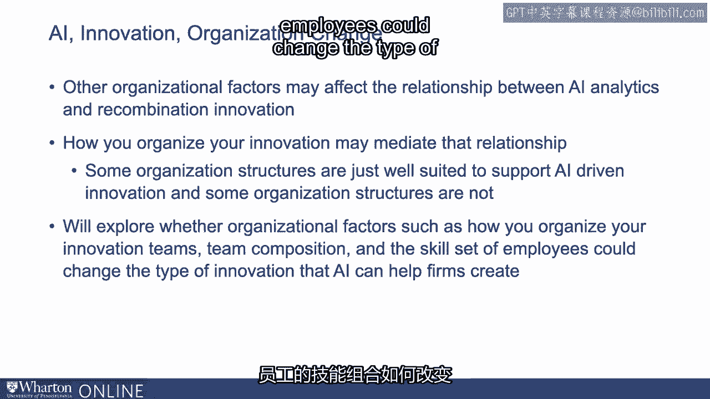

 the type of innovation that AI can help firms create。 In this video。

 we'll focus primarily on the structure side。 Organizations have very different ways of organizing their activities。

 They may organize their general activity in one way， and they may organize their innovations。

 another way。 So it's very important to look at specifically how firms are organizing their activities。

 innovation activities， and also how they compare to the general organization structures。

 In this structure can both vary within industries and also across industries。

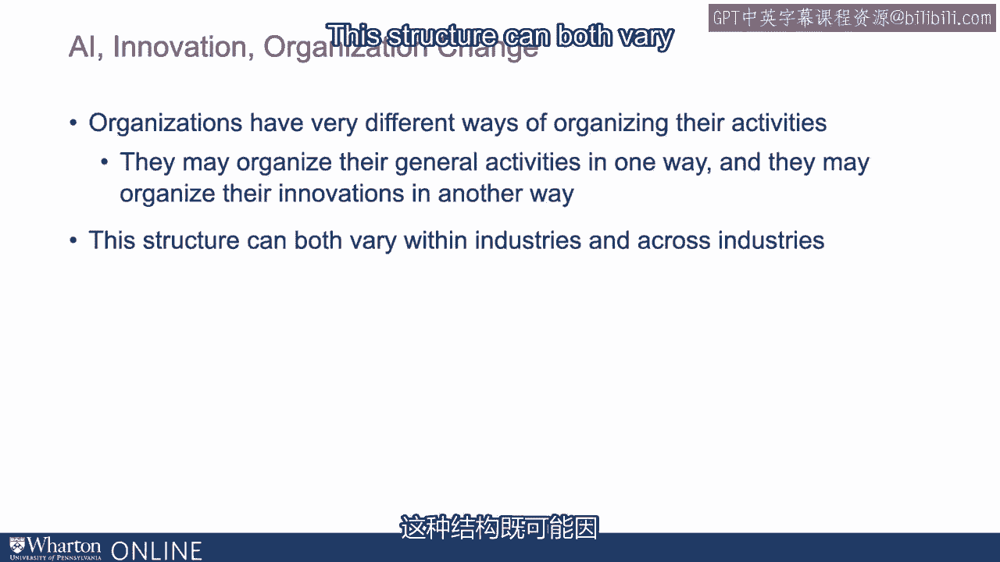

 That means it's not just about industry differences。 For example。

 drug R&D may just organize very differently from automobile R&D。

 Or it could be within the same industry that within drug discovery， one firm decided to。

 organize their activity for innovation in one way， and another firm would choose a different， way。

 So to give you an idea of what I'm talking about， let's see some examples。 These are two firms。

 Google and Apple， and they organize their innovation activities， in a very different way。

 These two are very innovative firms in the technology sector。 And if you look at Google。

 their innovation structure is much more dispersed， whereas。

 on Apple is very much concentrated into a few clusters。 So what are these clusters？

 What are the nodes？ What are the links in this graph？ So the nodes in these graphs are inventors。

 Two nodes are linked when they wrote a patent together。 Okay？ So you can see Google。

 they have a few clusters， but they're pretty much decentralized。 Whereas Apple。

 you see the innovation structure really concentrated in a few clusters。

 The big one is in the center， also another one in the bottom， where Google is much more， dispersed。

 So this is a way how firm naturally organize themselves。 It could be many different reasons。

 Could be historical reasons。 Could be different way of thinking about organizations。

 think about innovations。 So many factors， we don't really know why they organize them the way it is。

 But that's not the most important points， but I just want to show you that firms organize。

 innovation differently。 And these structures once formed are actually difficult to change。

 because it's kind of， harder to change the innovation relationship。

 a formal structure by fiat or changing the， CEO or changing the research R&D head。

 It's not necessarily going to change that structure quickly。

 But analytics and AI are changing very quickly。 So can we see the adoption of AI analytics change these firms differently？

 Can these technology help Google type of the world better or the Apple type of the world？

 In a sense， can they help a more dispersed innovation structure more so than a concentrated。

 version or vice versa？ And this is not just the Apple versus Google because they are too famous firm and they。

 are both very innovative and maybe specific to tech sectors where very innovative firms。

 You see the same thing in various other industries as well。 This is two firms， Cenofe and Roche。

 These are big drug makers。 Again， you see they're very productive drug makers。

 but these pharmaceutical companies， have very different ways of organizing。

 Cenofe is slightly more dispersed where Roche is much more concentrated in the future a。

 few clusters。 So similar question we can ask is that can a little bit of AI help the Google Cenofe of。

 the world or Apple Roche of the world to innovate？

 And they're pros and cons of centralization and decentralization。

 There are many advantages to decentralization in the sense that people are focusing on their。

 specific type of work。 They're very much local to their market and they tend to take sticky knowledge。

 By sticky knowledge， there are things you know and it's hard to move from one group。

 to another because there are lots of tacit knowledge， lots of things you just know amongst。

 each other within a team but it's hard to translate that information to others。

 And when people work together on a specific problem for a long time， they are more likely。

 to identify problems and create autonomous solutions。

 But because they are decentralized it's sometimes difficult to facilitate that cross group coordination。

 They're very good at working with each other within a group but might be a little difficult。

 to translate that knowledge or work with another group who may have very different way of communicate。

 with each other or different way of creating their own lingos or own sticky knowledge。

 On the other hand， centralization can also provide many advantages。

 Centralization tends to create very radical innovation applicable beyond that individual， group。

 In the centralized world， you may be very good at identifying a problem， a solution of your。

 own group but your solution may just work for you but it may not work rightly across， all groups。

 Or centralization can help you do that better。 And centralization also has broad search for external information beyond the individual。

 group that they may decide that certain resources， certain things are just better for the entire。

 organization as opposed to thinking about that individual group。

 Individual group tend to think about， relatively， myopically， what is good for my group without。

 thinking broadly。 So centralization can overcome some of the cross department or the core nations that。

 decentralization doesn't have but decentralization is really good at solving problem locally and。

 then if I novel solutions specific to that business context。

 So there are pros and cons in both cases。 So how do analytics and AI come in？

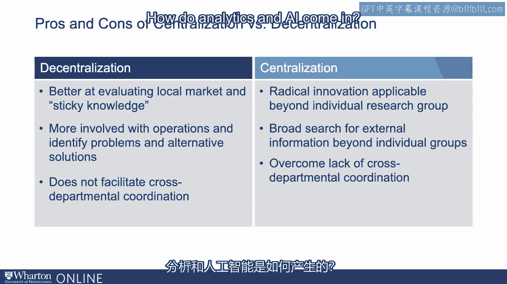

 Do you think analytics， knowing what you know about analytics is going to help centralize。

 organization better or decentralize innovation structure better？

 If you think about what analytics and AI can do， one of the key advantage is that they。

 can conduct broad search for diverse knowledge。 And they。

 by doing that broad search and finding that hidden pattern， hidden relationship that。

 you haven't seen before。 They're also linking existing silos of information in a way that helps decentralize structure。

 So by having a tool that automatically， mine cross different fields and finding hidden patterns。

 it can in some ways mitigate that central weaknesses of decentralization in terms of， coordination。

 It can also solve all the coordination。 That's as impossible。

 But even chipping a little bit of that difficulty that may facilitate these organizations and。

 structures in performing in innovation activities。 And remember in our last video。

 we showed that artificial intelligence， machine learning。

 hidden analytics are especially great at finding that new combination or new diverse combination。

 or new way of using existing technology， existing combination and new way。

 And that is all going to be great for helping decentralize the structure and solving their。

 problem and says， "Oh， it seems like another technology invented somewhere else may be used。

 to help me finding a solution to my problem。"， Again， if I mentioned earlier。

 you think about cancer ontology， PPP3 protein， if you， think of new chassis， art music。

 these are all great new combinations by reusing， using。

 combination and new way or reusing existing technology and new way or finding a diverse。

 combination together。 And that essence can help decentralization by putting that silos of information and silos。

 technology and by combining them in a new way。

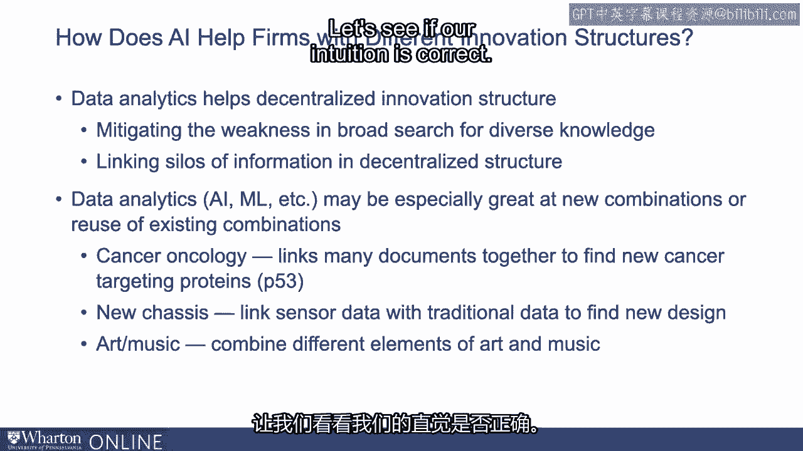

 So let's see if our intuition is correct。 So again。

 we can measure the innovation structure of the firms。

 So here we're using machine learning to understand machine learning。

 Here we're using community detection algorithm on co-authorship network。

 Basically what it does is capture how many groups are there in this graph and how connected。

 they are to each other。 So in a very dispersed crowd in the Google world。

 you'll see a very high measurement， of decentralization and the concentrated apples of the world you see a high value on。

 centralization。 And I want to make a note that this is different from formal hierarchies。

 Number one， they're very difficult to capture。 And number two。

 they may not reflect on what people are really doing。

 Just because you and you another person who has worked together many times before are。

 reworked into different organizations， doesn't mean you won't work with each other anymore。

 You won't think about new patent file。 They may affect to some extent。

 but it won't affect that dramatically。 So here we're actually capturing the real way people are working together。

 the real。

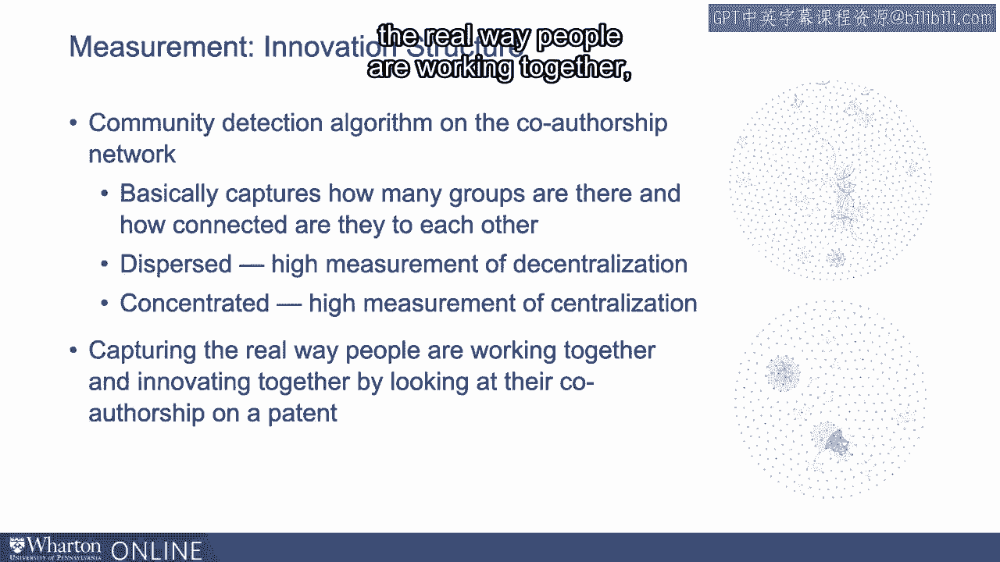

 way people are innovating together。 So I'm looking at their co-authorship on a patent。

 So this is the distribution of dispersion innovation。 So again。

 the high value means you're very dispersed， low value means you're very concentrated。 Again。

 you see a huge spectrum of firms。 Some firms are very dispersed。 Some firms are very concentrated。

 You see a spike of zero here。 I just prefer to never file any patent。 So we just。

 that's zero by default。 But if you need more than zero column。

 you see that dispersion is quite spread out。

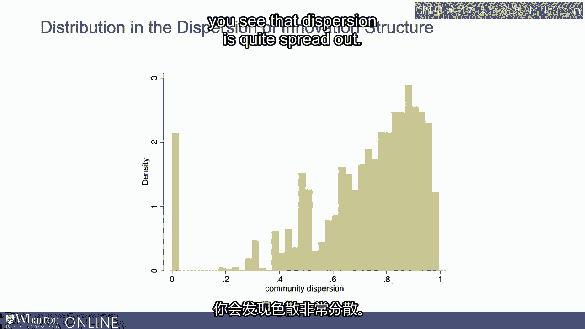

 You can use this measure to gauge your own organization structure。

 You can sort of see how your formal hierarchy of your structure， how that different from。

 the informal collaboration structure was actually being done by the employees themselves。

 And you can， because as you own firm， you don't need to just use public data such as， production。

 you can look at trademarks， potter design teams， white papers， and publication。

 they created together。 All of that can help you measure the actual internal collaboration structure of a firm。

 And you can also see how this structure is different from your competitors。

 You can look at your own patent co-authorship network。 That's your collaboration pattern。

 And compare that with your competitors to see how you organize your activities differently。

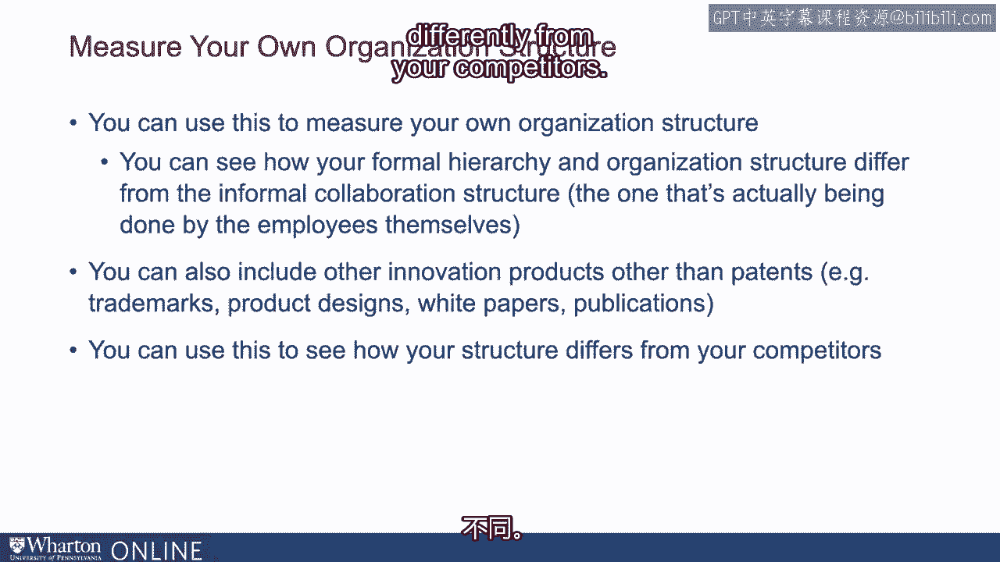

 from competitors。 When you look at data analytics， and if you look at AI investment。

 these technologies， complement decentralized innovation structures in firms。

 That means decentralized innovation structures benefit tremendously by having investment。

 in AI and investment in analytics。 Not only are they more likely to adopt。

 and when they do adopt both together， that means， they invest in both AI and they have decentralized innovation structure。

 They're more productive， and the firm with only AI or only decentralization。

 They are about 3% more productive。 And that's pretty big difference。

 considering how competitive these industries are。 And we look at the fact between the most recent years and the earlier years。

 and that fact， is even stronger in the recent years。

 That's firm learn to know about how to deploy in an analytics， any AI innovation。

 But structures matter dramatically。 Data analytics and AI can help decentralize innovation structure。

 And they can do that better than centralized structure。

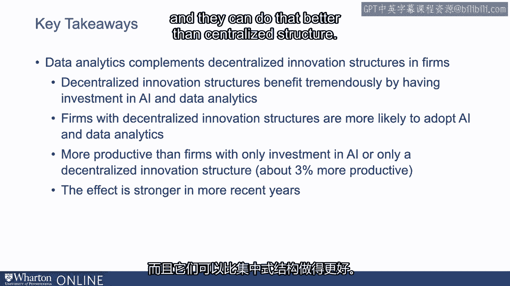

 Okay， so I showed you that AI can support decentralization， better decentralization。 Again。

 there are nuances to that。 It's not going to support all types of innovation。

 It's going to support a specific type of innovation， as I mentioned earlier， that is。

 combinations of existing things in a new way。 Recombination innovation。

 diverse combination innovation。 So again， I mentioned earlier that a new combination is something you combine existing。

 technologies in a new way。 For example， in our earlier example， we have four technologies， A， B， C。

 and A， B。 You can think about new combination will be B， C， combining B and C together， where a。

 diverse combination putting A， B， C together forming A， B， C。 Okay。

 so we can also classify them in a little different way in the sense that we can call， A， B， A， B。

 C new combinations that hasn't existed before。 Okay， or we can see A prime， B prime。

 C prime are just in our slight improvement or refinement， of existing technology， A， B， and C。 Okay。

 so A prime will be an improvement on A， B prime will be an improvement B， and C prime。

 will be an improvement on C。 Okay。 And again， we can also mention D， a brand new technology。

 that hasn't existed before， or a new subclass in patent， it'll be D， it'll be a novel technology。

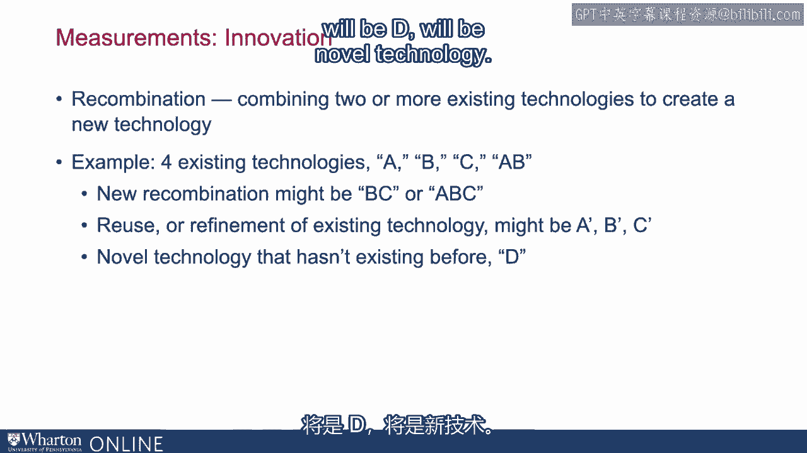

 So again we can classify innovation to three types。 Brand new technology would be like D。

 Or a new combination， like an A， B， B， C， A， B， C。 Or reuse A prime B prime C， prime。

 And we can benchmark the newness against globally， or locally to your firm。 In a sense， we can say。

 are you the first average， to generate a technology called A， B， C？

 And that has never existed in an entire world。 Or we can say。

 although I'm not the first to create A， B， C， but I first want to use it in my own industry。

 You can say local to that particular firm。 So we can measure this three by two combinations， novel。

 new combination， reuse。 And each three can be applied globally and also。

 locally to the specific firm。 Whether it's new， it's global to the entire world。

 and whether it's just local to that firm， to that industry。

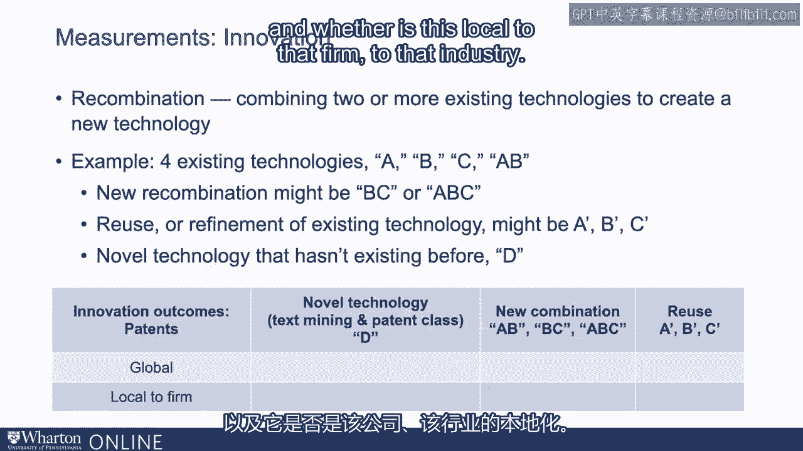

 In this graph， I'm going to show you， how likely is it for AI investment。

 to help decentralized innovation structure， to produce all different six type of innovation。

 So when a firm had decentralization， and they invested in AI， what is the likelihood。

 of trading a new global technology class？ That's the first graph。 Or a new combination globally。

 Or a new combination locally to its firm。 Or are reusing of existing technologies。

 I'll explain each one in term。 The first one is on new technology class。

 So this is how we read this is that when a firm has decentralized。

 innovation structure and they invest in analytics， and they invest in AI。

 do that combination of decentralization， and AI investment help that firm create new global technologies。

 You can see that the fact is almost negative。 But now look at the three graphs。

 They're very-- this score is very high。 But notice what they are。

 The second column is called new technology local。 So what does it mean is that it's a brand new technology class。

 that this firm or industry hadn't seen before。 But that technology class is this elsewhere。

 So again， you're incorporating a brand new technology class， like this elsewhere in the world。

 and bring that into your industry， your own industry， and your own firm。

 And the highest bar is actually called new combination， globally。

 That means you combine technologies in a new way。 And that's the first time ever in the entire world。

 that combination has existed。 And the slightly lower is new combination locally。

 that this combination has happened in other industries， before。

 But you're the first one to do it in your own firm， in your own industry。

 So these three type of innovation， are the key to be benefited from AI and decentralization。

 On average， you look at the middle bar， on the highest bar， on new combinations。

 global combinations。 That's on average four patents per year。 In a sense， if you invest in AI。

 then you have decentralized innovation structure。 So if you have a decentralized innovation structure。

 it seems to really pay off if using， AI to innovate patents that are a combination。

 of existing technology together in a new way， or refinement of existing technology that。

 has happened in other industries already。 Again， bringing outside innovation into your own firm。

 in this three-year-old content in a new way， to solve the problem specific to you。 And next。

 we see reuse。 Reuse are just think about A prime。 Basically， A prime is a slight improvement。

 of existing technology A。 It's still innovation， but it's incremental。 You see the fact it's there。

 but it's not that large。 If you think about it， if you already。

 have a technology that you know pretty well， if you want to create incrementally。

 you probably don't need a heavy-duty AI technology， to help you do that。

 You probably know already what you need to do。 Because in here。

 the search area around that technology， is relatively small， so it doesn't really benefit as much。

 from using AI， whereas global combination， you had to go through two to the end。

 of the components in the number of technologies。 So you have， say， 1，000 technologies。

 you had to go through two to the 1，000， combination to figure out which one works。

 That's a much bigger search space。 And that's where AI is really helping you。

 figuring out which combination is valid， which combination is not。

 And that combination is especially powerful when， you have decentralized innovation structure。

 because that decentralized innovation structure really。

 needed the extra power of expanding a search space， that AI can provide。

 Centralization doesn't need as much， because they already had ability to coordinate a search。

 broadly， to some extent。 But for decentralization， they precisely。

 need that its capability of searching broadly。 Here you see that in our empirical analysis。

 it's really about having analytics， and to create new combinations for decentralized innovation。

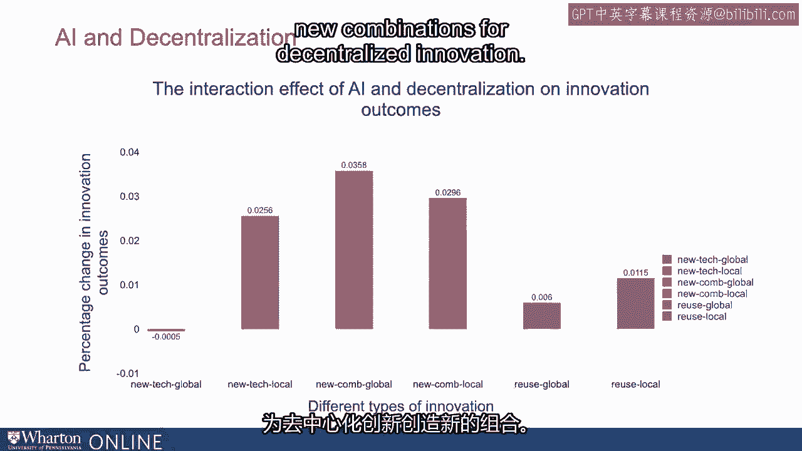

 And this is just not by combination。 We can also examine it outside of the technology class。

 So in the prior measurement， we only， rely on the technology class that patent authorities allocate。

 But here we can look at the citations。 If you believe your patents is very novel。

 you should see that in some of the patent statistics。 So here we look at patent statistics。

 in a sense that in the first one， bar will be 90 to 100。

 It means 100% or 90% of the citation in your patent， are coming for your own firms。

 So here is a entirely incremental of your own existing， innovation。 So 10%， it could be--。

 I only said I cited 10% of my own patent， that firm's own， patent， and 90% are from outside。

 So again， we did an analysis based， looking at AI investment decentralization。

 That's what happens when you have both AI investment。

 and you apply it on the decentralized innovation， structure。 What would outcome be？ Again。

 you see that's really the middle range between 40， to 60 range that see the greatest being of buck。

 And it says that you are not borrowing entirely， from new from outside， but borrowing just enough。

 You cited just enough。 You utilize existing technologies， and you cited just enough from outside。

 not combination in the middle range。 This intermediate novelty seems to be the sweet spot for AI。

 to help decentralized organization structure to innovate。 You notice on the very， very new ones。

 on the very 0% and the very right-hand side of the graph， again， you see a negative effect。 Well。

 small but negative effect。

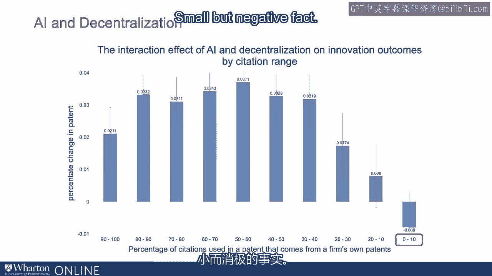

 It's probably because that when it's something so new。

 you may not be able to know how to use it well。 When it's half and half， you sort of。

 know exactly how to apply it some way， to fit your own needs and context。 Once it's brand new。

 completely new， you just bring them outside。 That doesn't seem to be as effective。

 than doing the middle range。 And productivity effects， again， we see the same thing。

 We see that when you invest in AI， and having decentralized innovation。

 you are much more productive。 And this is the effect even stronger in the reason years。

 So in the first bar is for all years。 And the second bar is from 1988 to 2007。

 And the third bar is 2008 to 2013。 You see the biggest effect is really。

 from the reason years between 2008 and 2013， where you see the biggest improvement。

 about 3% more productive。 That is firm that adopt AI and have decentralized innovation。

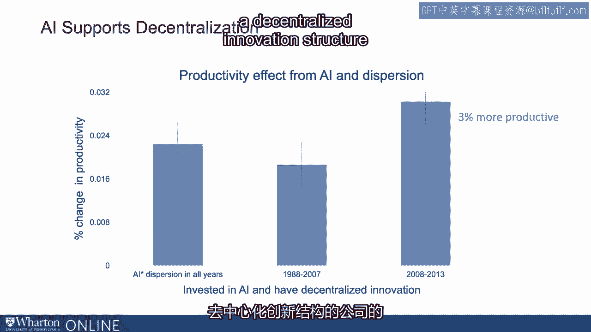

 structure are 3% more productive than other firms。 (buzzing)。

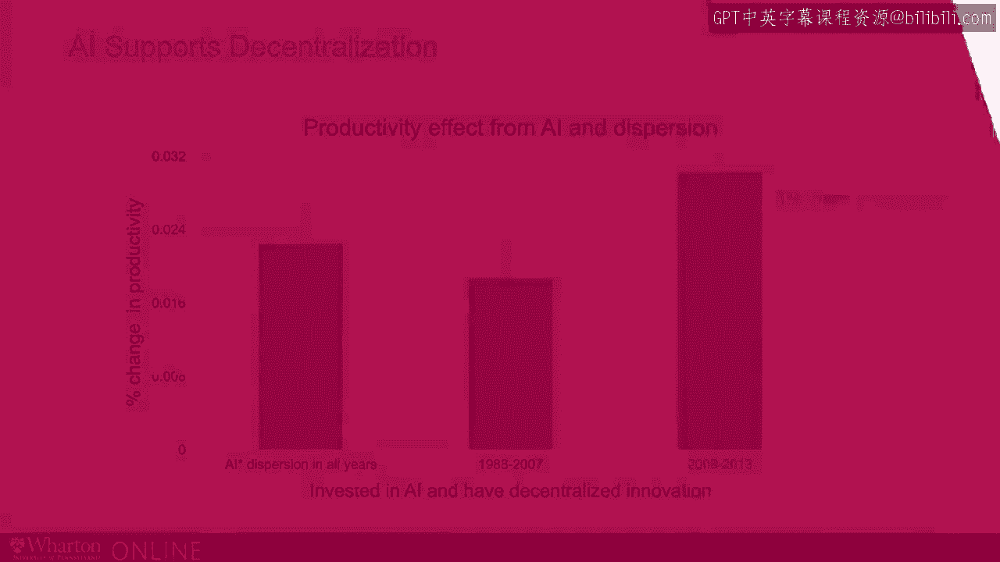

 [ Silence ]。