# 沃顿商学院《AI用于商业：AI基础／市场营销+财务／人力／管理》（中英字幕） - P120：19_员工分散.zh_en - GPT中英字幕课程资源 - BV1Ju4y157dK

在我们最后的视频中，我们学习了有效的人工智能或创新。

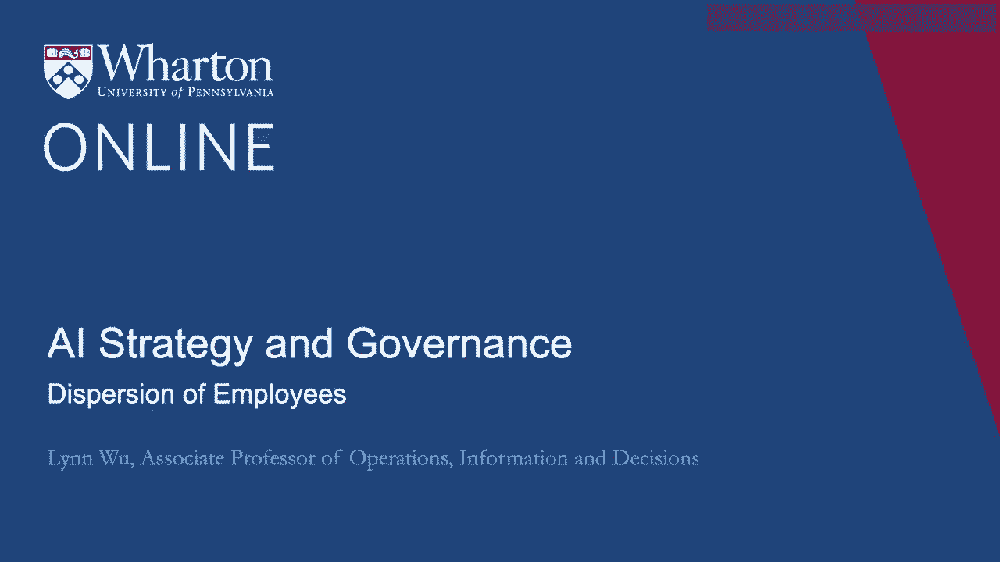

具体而言，我们研究了你的公司应该如何构建创新以获得。

从分析和人工智能中获益最多。我们发现人工智能分析可以补充去中心化创新，提高公司的能力。

创建重组创新。在这个视频中。

我们将讨论公司应关注哪种技能，以便。

这些数据分析技能应来自哪里，以及如何组织这些技能以。

如何最好地促进你公司的创新？一方面。

人工智能技能和数据分析技能需求很高。正如你在前面的幻灯片中看到的那样。

你会看到，人工智能技能和数据技能随着时间的推移显著增加。

特别是在过去10年里。一方面，相应的策略应该很好。

如果人工智能技能对创新很重要，我们应该雇佣更多具备人工智能技能的人，尤其是。

研究人员的人工智能技能在创新和活动中至关重要。

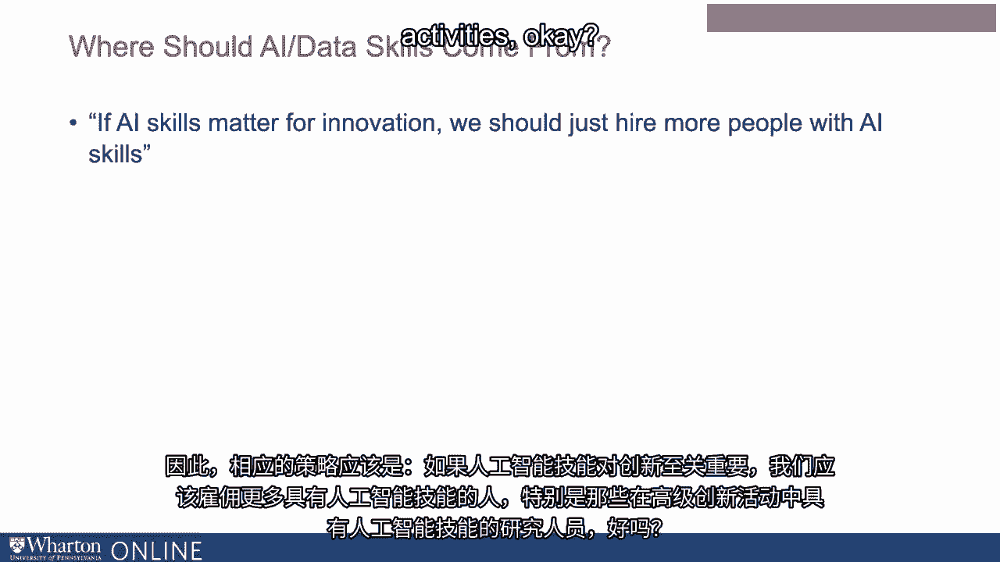

这可能真的很难做到，且非常昂贵。

我们正在招聘一位药物创新专家，同时我们也非常精通人工智能。

这可能很难找到，而且如果你找到他们，可能会非常昂贵。

去雇佣他们。或者你可以雇佣任何具备人工智能技能的人。

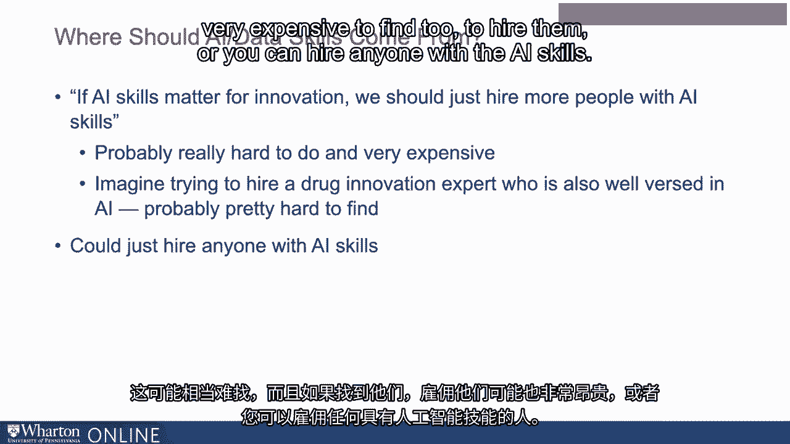

如果是这样，你会把它们放在哪里？那么，拥有人工智能技能的发明者有什么重要性？

或者这并不重要，你可以雇佣任何具备人工智能技能的人，他们可以帮助研究人员。

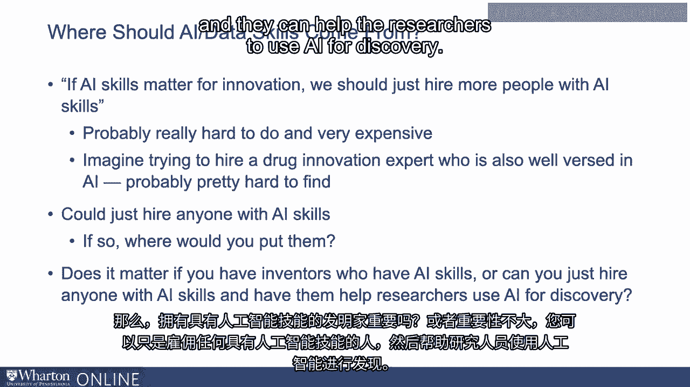

使用人工智能进行发现。所以我们确实对此进行了精确的研究。

在这里我们研究了也具备人工智能技能的发明者。

我们还关注了公司中也具备人工智能技能的一般非发明者。

我们研究了哪种类型的员工对人工智能输出和生产力贡献更大。

有趣的是，你看到，关于人工智能技能和发明者，虽然数量庞大，但实际上很。

而且还很高。因此我们不能真的判断这一事实。

不过好消息是，如果你看看非发明者的人工智能技能，其实相当。

强效，几乎与具备人工智能技能的发明者一样强，但在。

在某种意义上，他们的技能非常低。首先。

我们不能真的判断发明者的人工智能技能是否重要，但。

我们可以明确地说，非发明者的人工智能技能确实很重要。

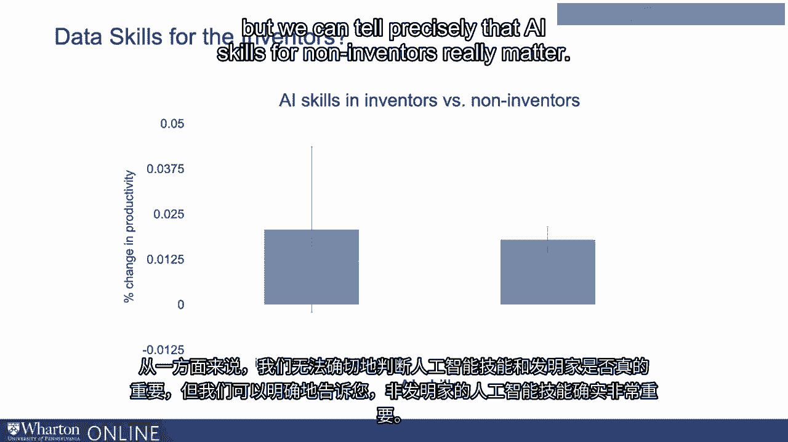

所以好消息是，你不需要雇佣那些同时也是发明者的人工智能技能人员。

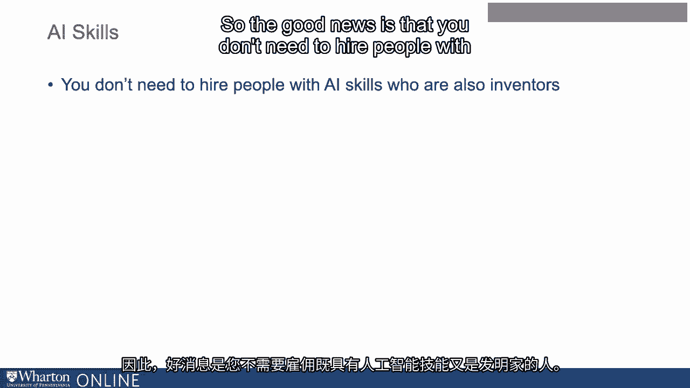

你可以雇佣懂得人工智能技能的人，帮助这些发明者利用人工智能技能。

帮助他们发现需要做的事情，并帮助他们实现创新。

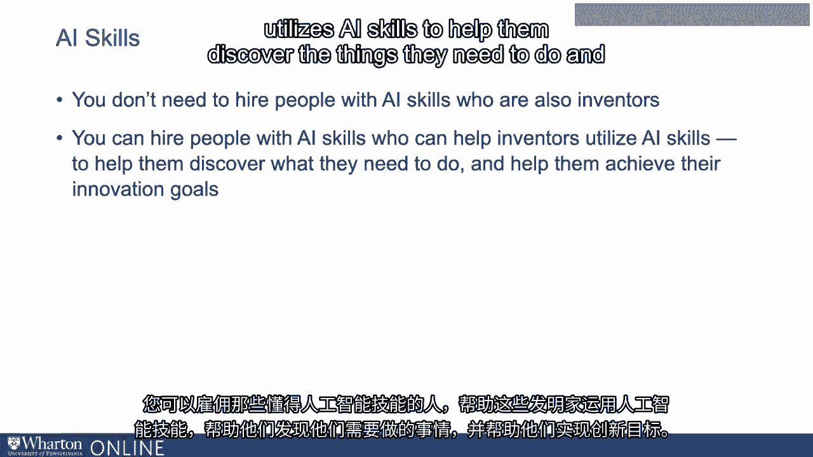

目标。所以好的消息是你可以广泛聘用AI技能。

不一定是研究人员具备强大的双重技能。

AI技能应该集中在一个部门，还是应该嵌入到。

不同的功能部门？这是一个有趣的问题，因为IT，传统上。

信息技术部门通常集中在一个部门内。

是由CIO管理，还是由技术负责人管理？

这通常是公司如何管理其IT资源和IT部门的方式。

应该为应用或管理AI技能使用相同的配置吗？

或者应该让公司去中心化AI技能，将其嵌入到特定功能团队中，具体。

产品团队，特定功能部门？好吧。

这并不是显而易见的答案，因为公司往往会采用两种方式。

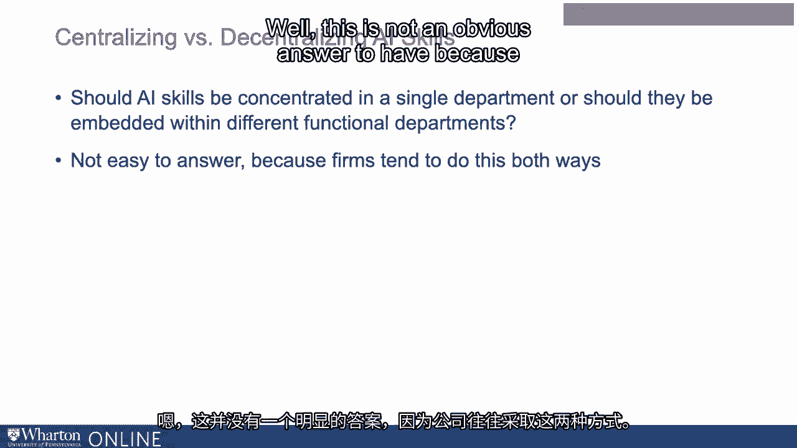

例如，Twitter最初在一个部门内集中其AI技能，就像。

你知道如何组织IT技能。他们创造了许多有趣的工具和产品，他们相信这些工具。

可以帮助Twitter的团队。不幸的是，大多数产品团队实际上并没有找到这些工具。

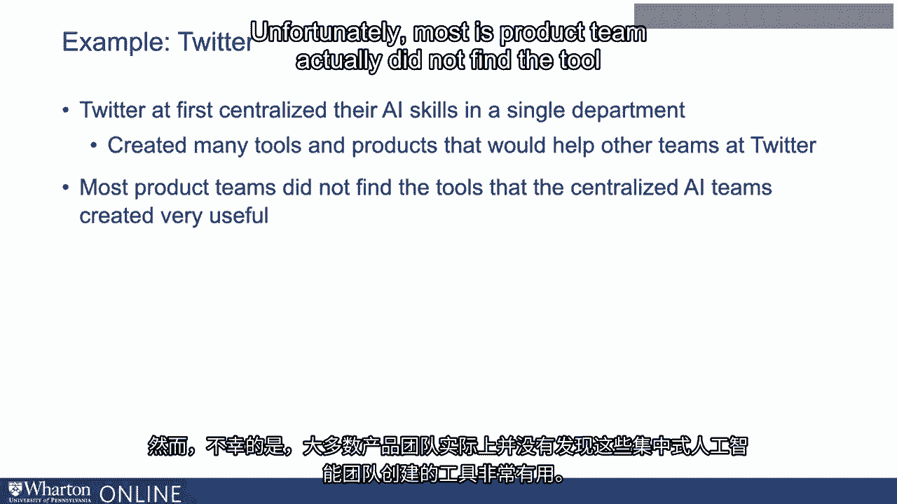

AI，集中化的AI团队被认为非常有用。所以经过几年。

Twitter决定通过嵌入AI技能来去中心化他们的团队。

在功能团队内部帮助每个产品利用AI实现他们的目标。

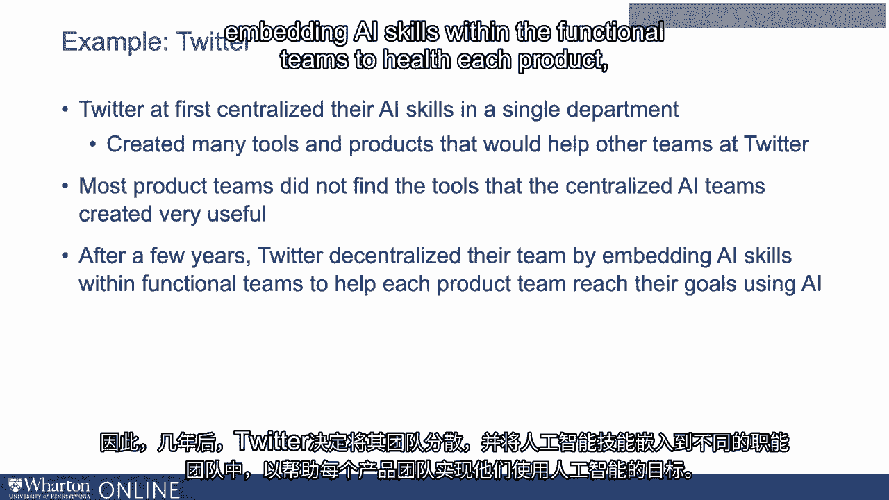

这不仅适用于科技公司，通用电气也经历了类似情况。

在与通用电气的研究主管交谈时，该人士告诉我。

对通用电气而言，将行业专家与某个具备的人员搭配是最优的。

需要高数据和AI技能来启动他们的产品创新。

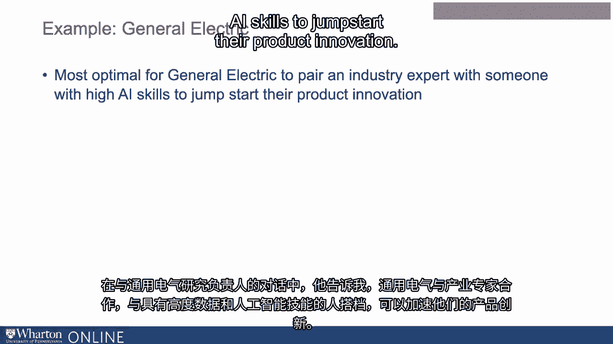

行业专家可以提供直觉和专业知识，以提供足够的背景和。

解决与公司相关的问题。具备AI技能的人可以帮助解决这些问题。

理清要使用什么数据，如何实施。

因此，拥有上下文知识非常重要。AI是一种通用技术。

它可以用来解决问题，但你需要很好地定义问题。所以首先，再次。

通用电气（GE）将AI技能集中化，但发现效果并不好。解决方案。

他们开发的产品很漂亮，但对于他们的产品团队来说并不太实用。

因此后来，GE通过将专家与具备AI的人员搭配来实现配置的去中心化。

技能。

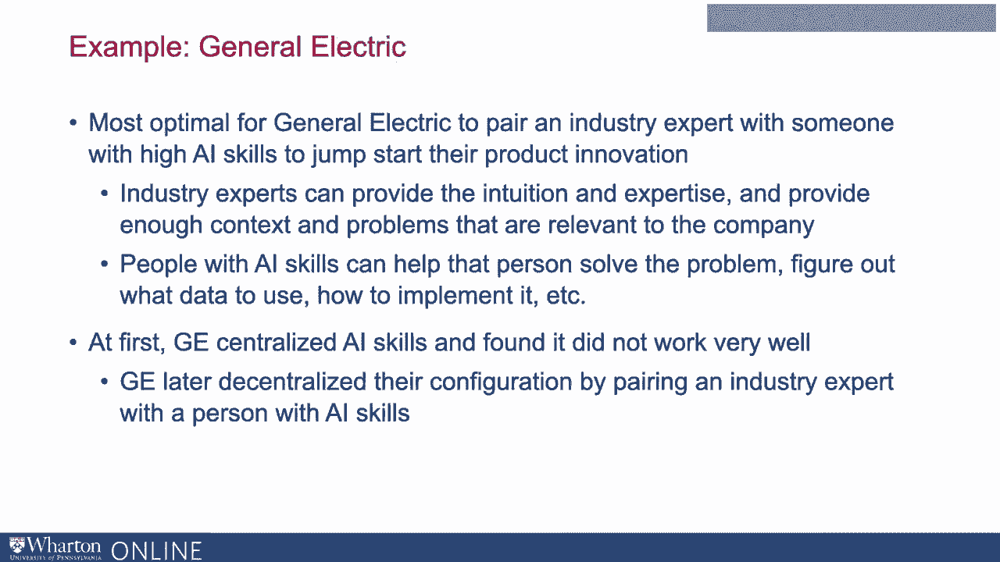

所以我们实际上更深入地观察了这一现象。

所以这只是针对GE或Twitter的特定情况。

我们实际上观察了七个功能组的数据技能分布。

这些功能组在这些服务中是典型的。

我们查看了制造部门、工程、销售和市场、人力资源。

排名第四、第五的是会计和财务，第六是研发，第七是行政。

这七个职能通常出现在所有公司中，我们查看了数据技能的情况。

在七个群体之间分散。我们同时关注了行业内部和跨行业的比较。

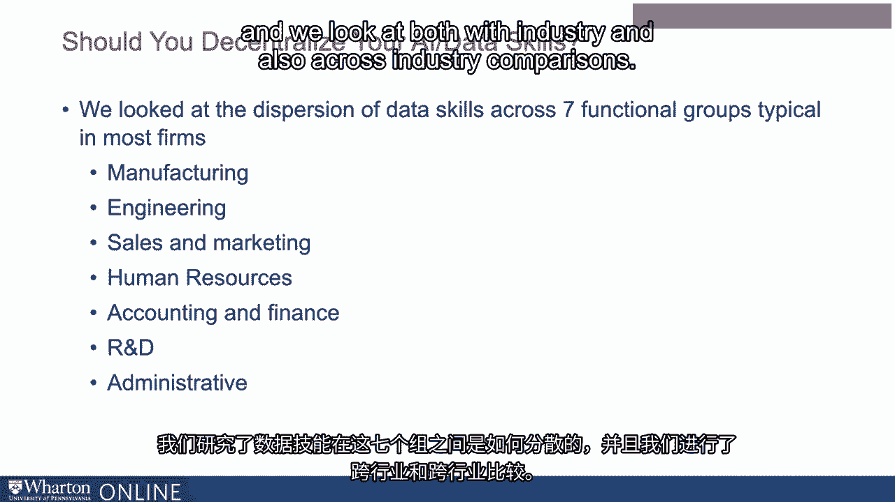

我们一般看一下这些是如何分布的。再次强调。

我们服务约600家公司，并查看了分散问题及其对应的。

调查结果如下。问题是你在以下每个群体中使用数据分析的程度如何？

我们要求他们对七个职能中的每一个说出是频繁还是不频繁。

我们还观察了全球所有公司，或仅美国公司、仅欧洲公司。

仅亚洲公司。你会发现不同国家之间没有显著的异质性。

跨越世界的不同地区。因此，数据技能应该分散、数据应该集中并不是很明显。

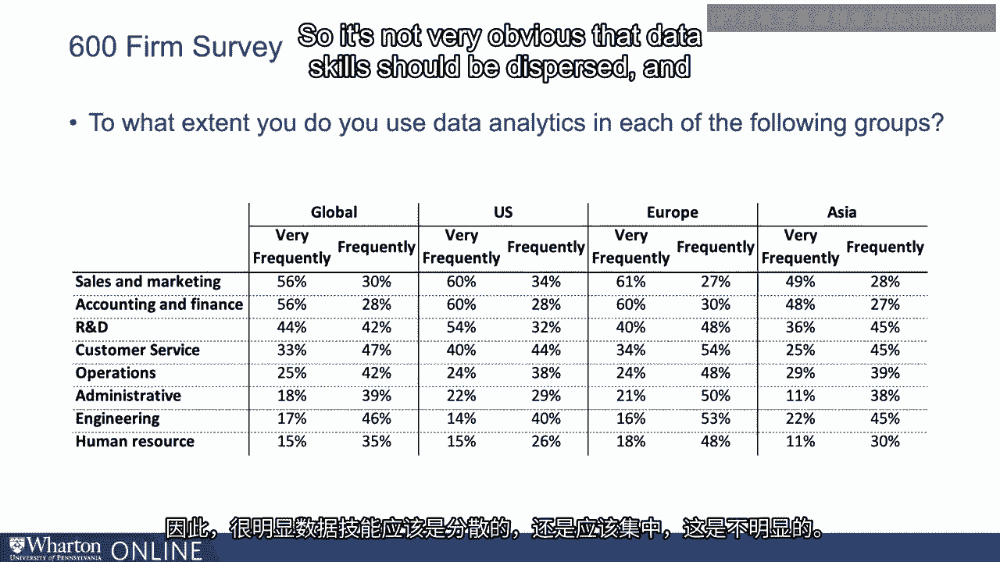

这是按行业划分的分散得分。因此，基本上，如果你有非常高的分散得分。

这意味着你的数据技能在七个职能之间分布得相当均匀。

如果你的分散得分很低，这意味着你高度集中于。

在一个或两个部门中的数据技能。因此，这是按行业划分的中位数数据分散得分。

我们将各种行业分类后进行观察。

最高的是企业管理，86.4%的这些公司存在这种情况。

一个高度分散的得分，意味着数据技能在不同的领域中高度分散。

公司内部的职能。我们发现医疗保健和社会系统行业的得分非常低。

意味着他们的技能或AI技能仍然相对集中在少数部门中。

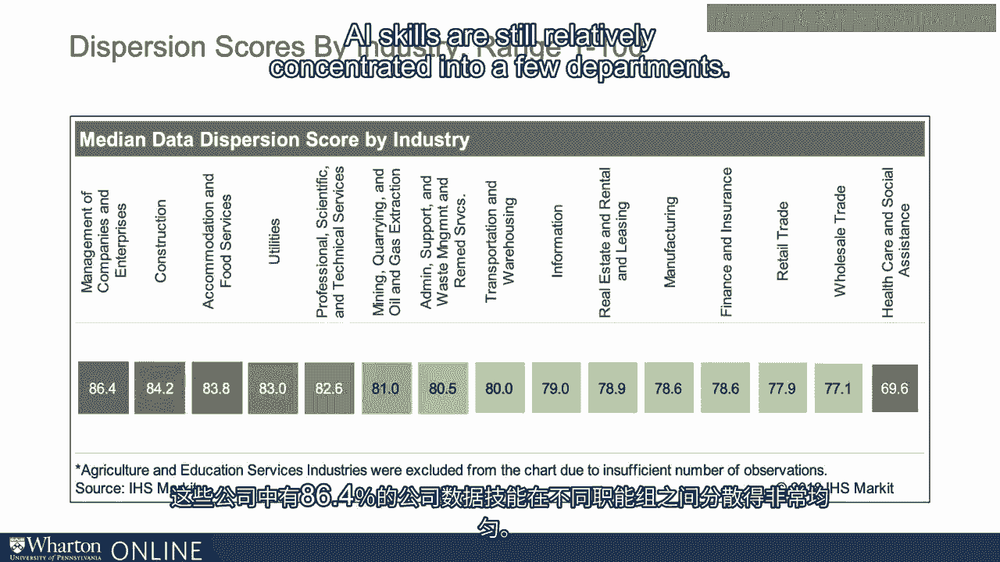

确实存在行业差异。这是按区域划分的得分集聚情况。

你可以看到在中间一列的数据显示，欧洲实际上是。

在美国的分散性更大，而APAP大约在中间。

你还可以看到与资本相关的另一类数据，右侧是与人力相关的数据。

资本在各地区基本相同。而且你可以看到数据决策。

欧洲的得分稍高，而美国的得分稍低。

不同地区和行业之间的得分确实存在集聚现象。

如果你看这些得分，平均值可能是相同的，但它们的方差却非常。

非常大。所以这表明确实存在异质性。

人们尚未完全弄清楚如何组织数据技能。

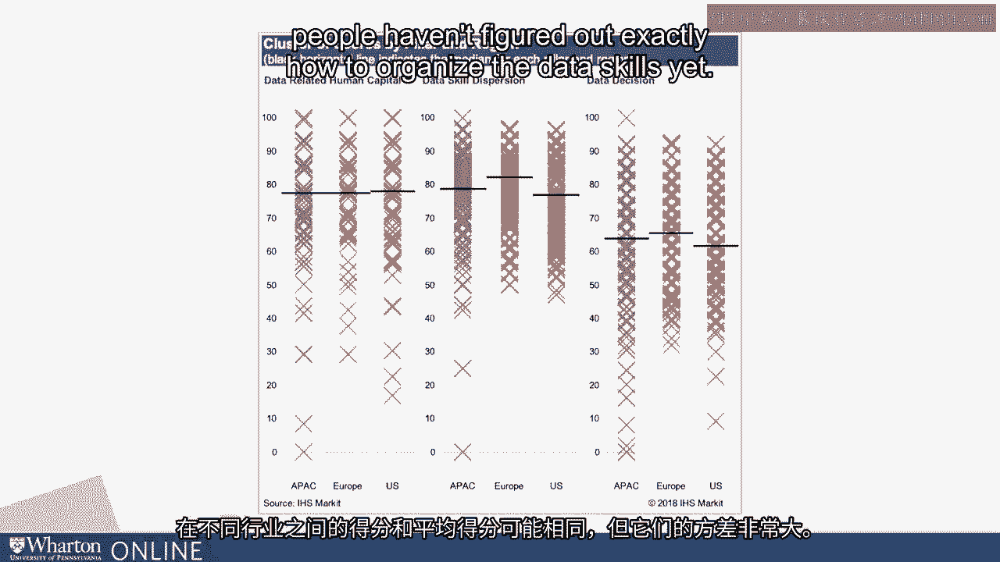

所以我们实际上研究了这一现象，并检查了分散的程度实际上是。

对公司是有利的。所以我们实际上发现，推特和通用电气的典型例子是正确的。

从某种意义上说，当公司将其人工智能和技能分散到不同功能时。

通过将它们嵌入不同的功能或产品团队，这些公司。

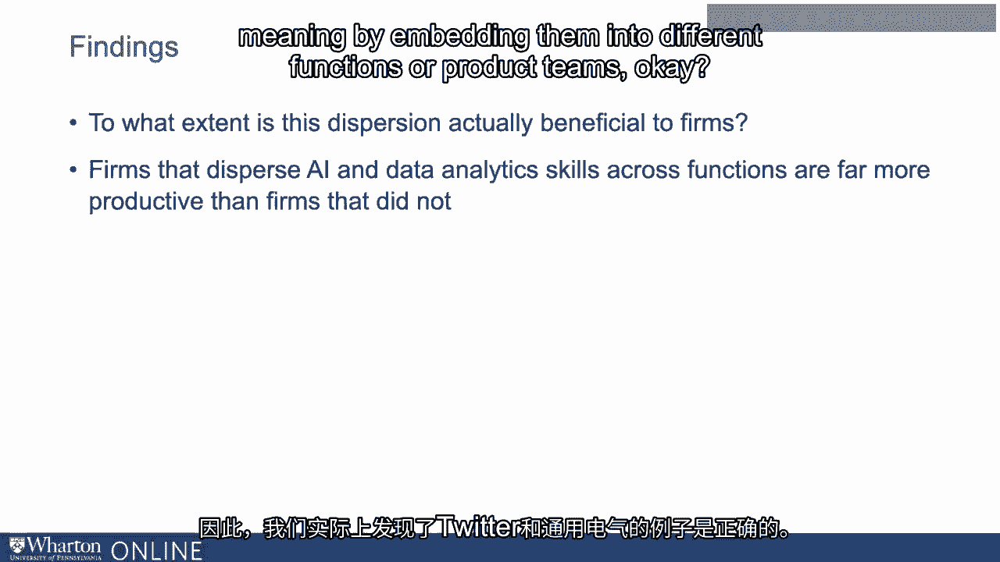

比未这样做的公司要有效得多或生产力更高。

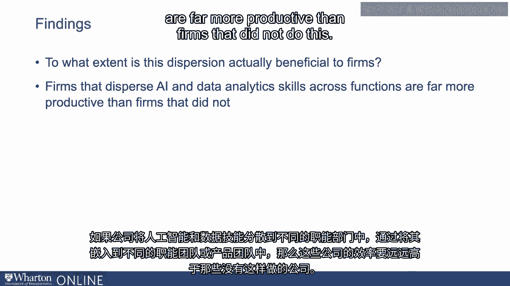

平均来看，一个标准差以上的偏差和离散度得分约为。

企业价值提高3-5%。考虑到样本中这些公司的规模，以及中型企业的3-5%变化。

我们样本中的公司，所以$10.7亿的3-5%变化在320到$534百万之间。

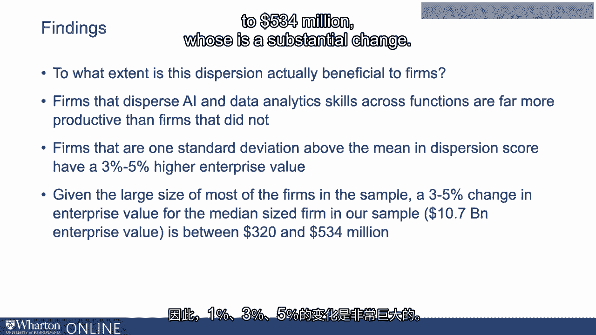

所以这是一个实质性的变化。因此，再次强调，百分比的上升可能较低，但转换为一个大数字。

一个百分点、三个百分点、五个百分点是一个巨大的。 [沉默]。
