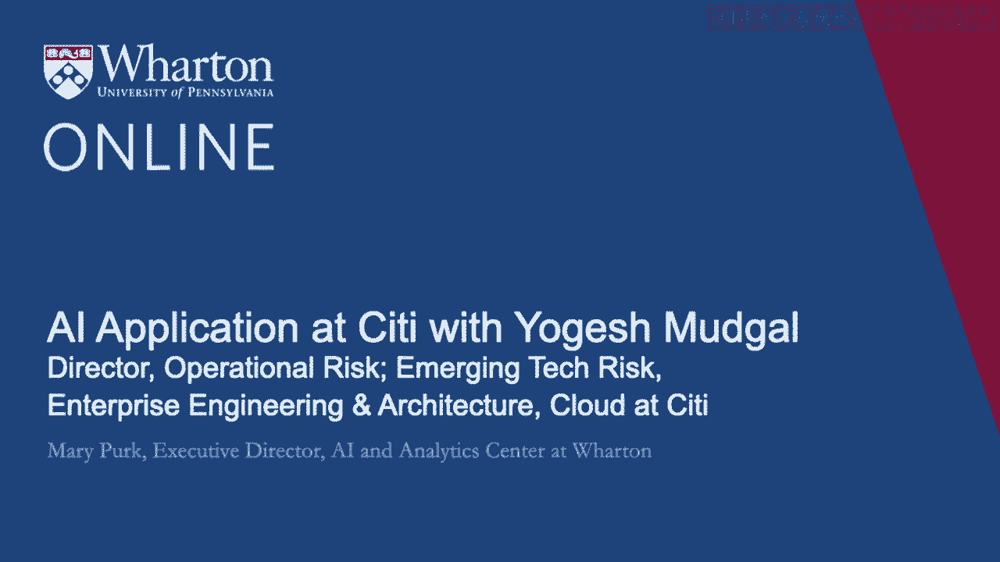

# 沃顿商学院《AI用于商业：AI基础／市场营销+财务／人力／管理》（中英字幕） - P127：26_Yogesh Mudgal访谈.zh_en - GPT中英字幕课程资源 - BV1Ju4y157dK

今天，我邀请到了Yogish Mughal。

Yogish目前在花旗工作，是运营风险管理的主管。在2019年。

Yogish组建了一个名为ERS的非正式团队，成员都是志同道合的专业人士，关注AI风险和安全。

ERS致力于促进、教育和推动金融服务行业的AI和机器学习治理。

通过关注风险的识别、分类和缓解。欢迎你，Yogish。谢谢。

玛丽。谢谢你邀请我。我很高兴在这里见到你。

为了让我们了解你的观点，你能告诉我们你的职业历程以及在花旗的角色吗？

从花旗开始，我负责新兴技术和工程。

在花旗的运营风险架构组中。我的大部分职业生涯都致力于风险管理。

以及信息安全。在过去几年中，我一直在。

更加关注识别和管理风险。

与新兴技术一般，特别是AI。为此。

就像你之前说的，我创立了ERS。2019年，志同道合的专业人士。

代表AI风险和安全，实质上。

尝试看看我们行业能否团结一致，对识别风险有一个共同的看法。

与AI有关，以及如何确保其安全和稳妥地实施。

AI可以被视为对公司的风险。因此，它们可以被视为声誉风险。

运营风险或合规风险。这些不同的风险术语。因此我想知道。

你能描述一下这些风险，特别是哪些风险最令人担忧吗？

根据你的经验？在我看来，任何技术都应该进行风险管理。

或者一系列技术，包括AI。因此，机构与AI相关的风险。

这可能依赖于多种变量，包括AI的实施方式。

现有控制的强度，或机构的风险概况和风险偏好。

正如论文中所述，我们可能还没有提到的。

不过ERS确实通过沃顿发表了一篇论文，在那篇论文中，我们也进行了描述。

AI的各种风险类别。我将在这里强调的一些风险类别。

数据相关的风险、AI攻击、测试与信任以及合规性。因此，在数据相关风险中。

这可能包括子类别，比如学习限制。例如，学习限制。

当然，数据质量也很重要，简而言之，AI系统的有效性通常与数据的质量成正比。

用于训练它以及在训练系统时考虑的各种场景。在AI ML攻击中。

行业内对实时机器学习模型进行的研究，讨论了各种攻击。

包括数据隐私攻击、训练数据中毒、对抗性输入和模型提取。

然后是测试与信任。显然，信任和测试是最常见的。

这是AI领域中讨论的话题，包括偏见和可解释性。

以及与合规相关的事宜，包括内部政策。

以及监管要求。我认为所有这些都是不同的风险。

我们可以总结或分类为AI。在ERS小组中，是否存在？

你对这三个风险领域中的某个特定部分有兴趣吗？

是否有任何人处于更高层级，还是这取决于特定行业或组织？

在控制风险的意愿方面？我很好奇这方面的影响。

是人民、公司还是行业优先考虑这些风险，像是非常。

非常不稳定？是的，你完全正确。这真的取决于AI的实施地点。

如何实施，以及机构的风险偏好。因此我们不能说一刀切。

或者在这种情况下，一个风险适用于所有或主要风险。因此这真的取决于实施。

比如，如果某个人的AI模型在云上运行。

所以AI ML攻击的风险可能会增加，具体取决于暴露程度。

AI模型的外部使用，与在组织内部使用的AI模型相比。

这些攻击的可能性可能更低。

但可能会有更普遍的合规风险。因此这确实取决于用例。

没有一个风险我会说更高或更低。

所以这引导我们进一步剖析这个问题。

因为我们听到更多关于数据和训练的讨论。

使用的数据，以及我们也听说算法。越来越多的讨论。

我们在媒体和会议中听到关于算法透明度的讨论。

和你之前提到的类似。那么在这方面具体是什么？

我们有时听到称其为技术，这可能像是揭示源代码与校准的。

透明度。所以如果你能提供一点背景信息。

我们开始多听到这两个术语。

整体来说，算法需要更加透明。作为领导者，你如何应对？

然后可能作为消费者或投资者，他们如何看待这一点。首先。

我同意很多术语在流传，透明度肯定是其中之一。

因此，关于透明度和可解释性的讨论和对话增加了。

我认为考虑受众很重要，因为这取决于利益相关者。

透明度的水平，或透明度的需求可能会有所不同。例如。

内部审计员与监管者所需的透明度可能不同。

相对于开发者或最终用户，我总是给出的类比是我旅行时坐飞机。

我敢打赌，但我不知道引擎是如何工作的。

我不知道飞行员的水平如何。但这里的重要因素是信任。

我相信系统在运行。我相信飞机运转良好。

我相信我会被送到目的地，最后但并非最不重要。但在这里。

我认为这里的共同点是信任。因此。

我失去了关于AI炒作的陈词滥调，还有一些相关的恐惧。

或者我应该说，与AI相关的伤害尚未完全理解。

所以我认为我们开发信任，建立对AI系统的信任是重要的。

所以我认为这里的透明度或校准透明度是一个重要因素。

在我看来，这是一个信任因素。如果利益相关者在需要了解的基础上，理解了原因。

使用AI系统的方式，以及权衡，例如。

内部审计员与监管者，或最终用户，可以获得透明度。

从而在AI系统中建立信任。所以我们谈到了数据，透明度。

算法，这也可能导致我们潜在。

如果人们请求越来越多地查看源代码，或者揭示源代码。

揭示源代码是否存在问题？如果我们能谈一谈。

因为这可能是人们在想的其他事情。

他们可能如何管理，如果这种情况出现。是的，我认为揭示源代码。

或者在极端情况下，源代码的妥协，无论是AI系统还是非AI系统。

我认为大多数风险保持不变。显然。

知识产权排在首位。还有其他相关内容，包括。

如果你透露源代码，是否也在揭示方法论？

用于构建系统或做出决策？这取决于利益相关者。

你想揭示还是不揭示？源代码是否可以用于植入或嵌入后门？

进入系统？所以涉及各种风险。

当我们谈论揭示源代码时。在某些情况下，这可能必须进行。

由于法律或法律情况的要求。但通常。

我不认为源代码是那么容易被揭示的，或者一般来说。

如果我们的公司不这样做，那就不应该揭示。而且潜在。

这可能是公司需要更好地教育的内容。

就像消费者或客户一样，为什么揭示源代码是坏事。

对他们来说并不是最有利的，因为这揭示了，他们暴露于更多风险。

你之前提到的一些风险。然后你的比喻关于乘坐飞机。

你已经购买了机票以便乘坐飞机。

因为你知道有专家在操控飞机。

这里有一定程度的假设和信任。

在你和航空公司之间发生的事情，你期望他们保留某些内容。

你知道他们必须继续运行，而你不需要确切知道它是如何运行的。

但是当存在一个非常重要的风险时，他们会告诉你。好的。

非常感谢你提供的所有信息，以及今天和我交谈。我很感激。

谢谢你，Yogi。谢谢你，Mary。感谢你们的邀请。[沉默]。

