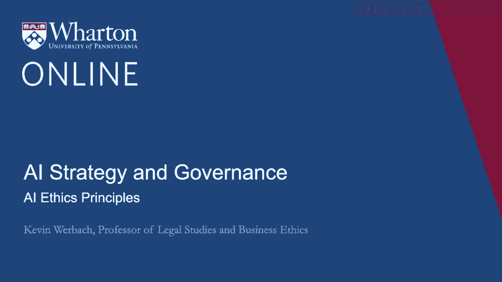
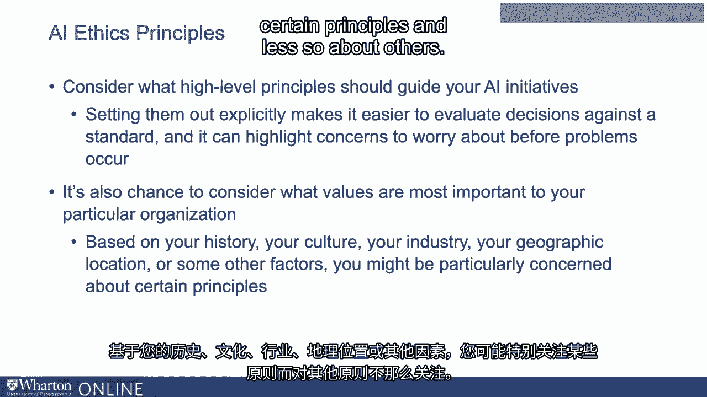
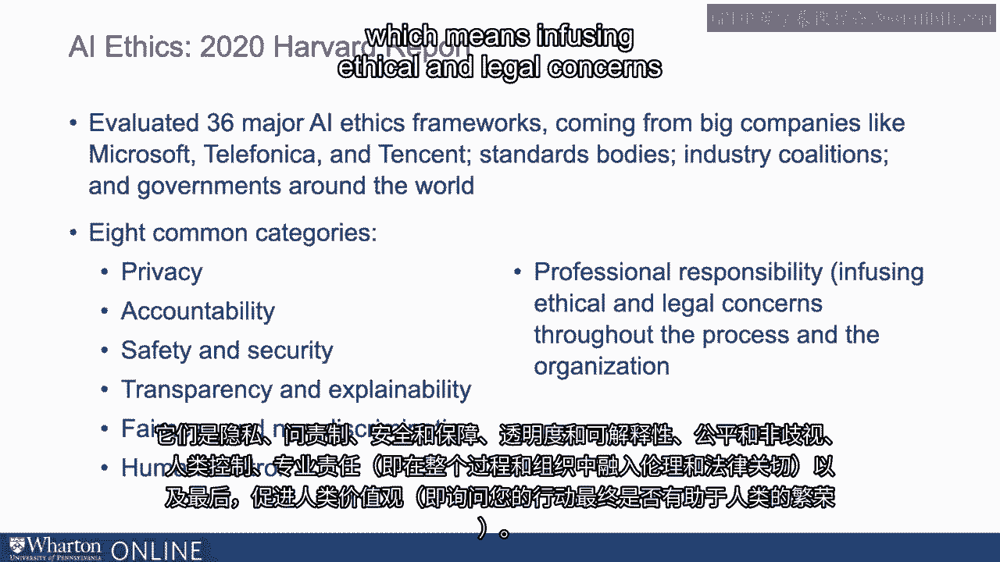
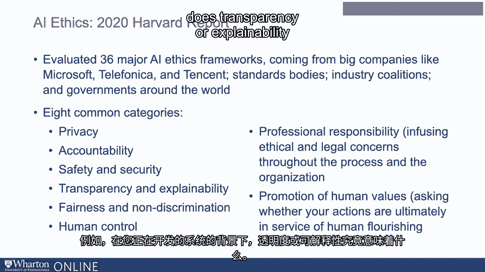
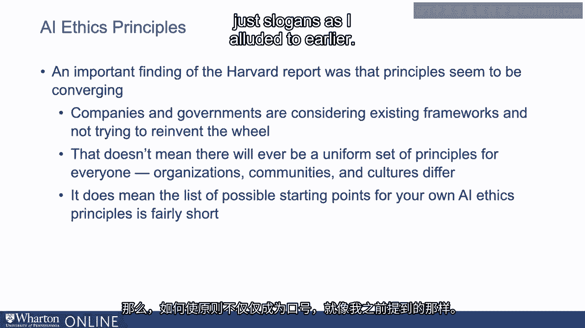
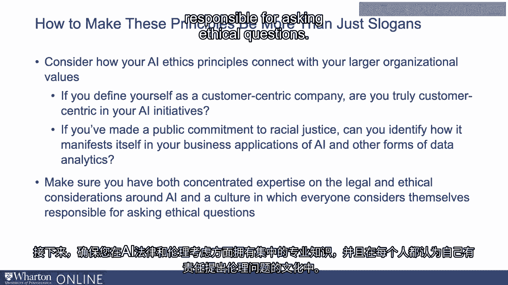

# 沃顿商学院《AI For Business（AI用于商业：AI基础／市场营销+财务／人力／管理）》（中英字幕） - P129：28_AI伦理原则.zh_en - GPT中英字幕课程资源 - BV1Ju4y157dK

 You want to be responsible and ethical in your AI initiatives。

 What principles should guide you？ A growing number of organizations are creating official AI ethics frameworks。

 Whether you want to create a formal document or not will depend on the nature of your organization。

 And what all of these have in common is they are voluntary commitments to ideals。

 They aren't enforceable in some direct legal way。 That of course is both good and bad。

 It leads to more flexibility。 But it also leads to the question about whether having a good looking document or framework。

 actually means the organization is more committed to responsible AI。

 If you're going to go down this road though， you should think about why these are important。

 principles to you and be committed to ensuring that your organization sees the principles。

 as having real meat on them。 It's often helpful to consider at a general level what high level principles should guide。

 your AI initiatives。 Whether or not you reduce them to a formal list。

 Setting out principles explicitly makes it easier to evaluate decisions against a standard。

 And it can highlight concerns that you need to worry about before problems occur。

 It's also a chance to consider what values are most important to your particular organization。

 Every entity is different。 Based on your history， your culture， your industry。

 your geographic location or some， other factors， you might be particularly concerned about certain principles and less so about。

 others。 A Harvard report in 2020 evaluated 36 major AI ethics frameworks coming from big companies。

 like Microsoft， Telefonica and Tencent， standards bodies， industry coalitions and governments。

 around the world。 It identified eight common categories that appeared again and again。

 These are privacy， accountability， safety and security， transparency and explainability。

 fairness and non-discrimination， human control， professional responsibility， which means infusing。

 ethical and legal concerns throughout the process and the organization and finally promotion。

 of human values。 Which means asking whether your actions are ultimately in service of human flourishing。

 Now you don't need to make these your AI ethics principles or necessarily have all of them。

 on the list。 But you should ask yourself whether each of these characteristics make sense in the context。

 of organization and how you would think of them。 What exactly， for example。

 does transparency or explainability mean in the context of the。

 systems you are developing？ An important finding of the Harvard report was that these principles seem to be converging。

 Companies and organizations and governments are considering existing frameworks that are。

 out there and not trying to reinvent the wheel。 More and more certain principles like the ones that I listed are becoming understood as the。

 general foundation for most frameworks。 Now that doesn't mean there will ever be a uniform set of principles for everyone。

 Again， cultures differ， communities differ， countries differ in what's appropriate。

 But it does mean the list of possible starting points for your AI ethics principles is fairly。

 short。 Okay， how do you make principles more than just slogans as I alluded to earlier？

 First， consider how your AI ethics principles connect with your larger organizational values。

 If you define yourself as a customer-centric company， are you truly customer-centric in。

 your AI initiatives？ If you've made a public commitment to racial justice。

 can you identify how it manifests itself， in your business applications of AI and other forms of data analytics？

 Next， make sure you have both concentrated expertise on the legal and ethical considerations。

 around AI and a culture in which everyone considers themselves responsible for asking。

 ethical questions。 Again， principles only matter if they are pervasively considered throughout the organization and。

 throughout the process of developing and implementing an AI-based system。 Thank you。 you。

