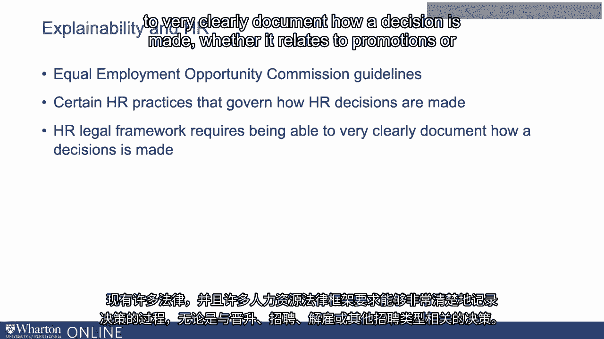
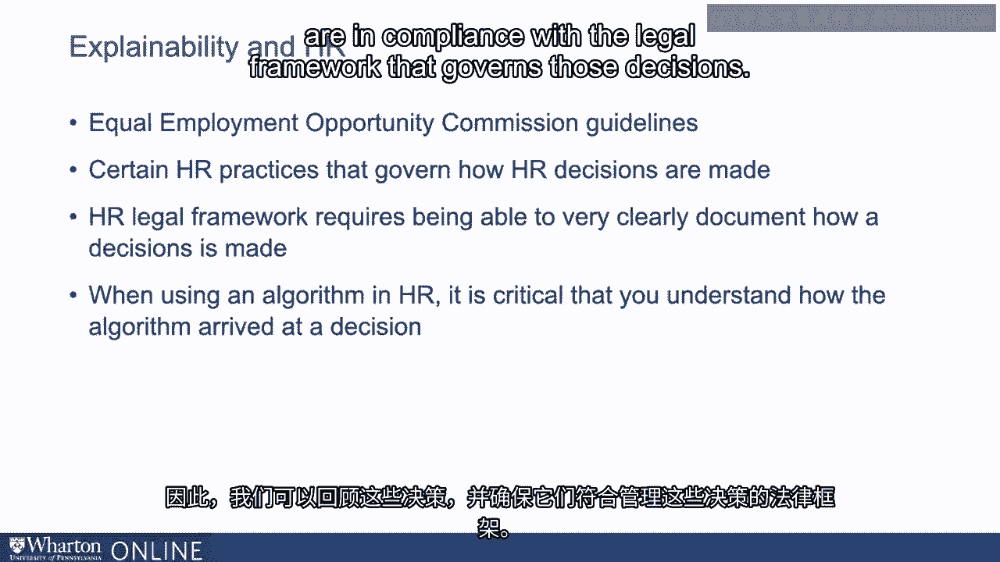

# 沃顿商学院《AI For Business（AI用于商业：AI基础／市场营销+财务／人力／管理）》（中英字幕） - P131：30_解释性重要的例子.zh_en - GPT中英字幕课程资源 - BV1Ju4y157dK

 So explainability， again， is the ability to explain or understand why an algorithm arrives。

 at a particular decision。 Why is it so important？ So let's talk about some examples of where explainability in algorithms may be particularly。

 important。 One example is when applied to areas like medicine or HR where the decisions are being made on。

 people。 There are lots of protections and guidelines around how those decisions can be made。

 So we have to think about how our algorithms fit into that kind of legal framework。

 So consider HR where you have something like an equal employment opportunity commission。

 guideline which governs hiring and the types of hiring firms can do。

 There's certain HR practice that governs how HR decisions are made。 There's many laws in place。

 And a lot of the HR legal framework requires being able to very clearly document how a。

 decision is made。 It relates to promotions or hiring or dismissals or other hiring types of actions。

 And so in instances like that， when you're using an algorithm for say HR， it is critical。

 that you understand very clearly how that algorithm arrives at a decision so we can go back and。

 revisit those decisions and make sure that they are in compliance with the legal framework。

 that governs those decisions。

 Another example is autonomous vehicle systems。 So another big application of AI is in self-driving cars。

 Lots of complex data coming in。

 Lots of decisions being made by vehicles on the road that are meant to be self-driving。

 You can imagine if something goes wrong， if there's an accident or if somebody is injured。

 in a self-driving vehicle context and it's very important for the company to be able to。

 go back and understand exactly what went wrong， what led to the accident occurring， what needs。

 to be fixed but also to be able to explain from a PR perspective what the problem was。

 where it arose。 And for that reason， among others， some of these vehicle companies。

 the self-driving car， companies have become some of the leaders in efforts around explainable AI and making。

 these frameworks more open and making them available to other companies。

 Another example is with data privacy laws。 You may have heard of the GDPR general data protection regulation。

 You may have heard of the CCPA， which is the California Act related to data privacy。

 Some of these new privacy regulations， the GDPR， for instance， stipulate that when an algorithmic。

 decision is made， the logic must be explainable to someone whom the decision pertains to。

 So if a decision， an algorithmic decision is made on something that affects you， you。

 have a right to ask for a meaningful explanation about the logic that was involved。

 And that's only possible if the algorithm being used is an explainable algorithm。

 And so we're thinking about using machine learning algorithms in a context that falls。

 under the global data protection regulation in the EU， then the algorithms that are used。

 there really need to be explainable。 So companies will be in compliance with that kind of legislation。

 A final example is just in terms of customer service。

 You think about financial lending or healthcare or other context for loan processing。

 If you have customers coming in and you're using an algorithm to determine whether or。

 not a customer meets the requirements for a loan or not， clearly it's something that you。

 want to be able to explain， it's not sufficient to just say somebody fails or passes the screening。

 test in terms of loan qualification。 You want to be able to reflect back exactly what it might have been that affected that。

 type of decision。 So lots and lots of context， especially context where decisions are being made that affect。

 humans directly where having the AI system be explainable is really critical for successful。

 adoption。 [BLANK_AUDIO]。

