# 沃顿商学院《AI For Business（AI用于商业：AI基础／市场营销+财务／人力／管理）》（中英字幕） - P134：33_解释性和法律.zh_en - GPT中英字幕课程资源 - BV1Ju4y157dK

透明性是负责任的人工智能中的核心概念之一。

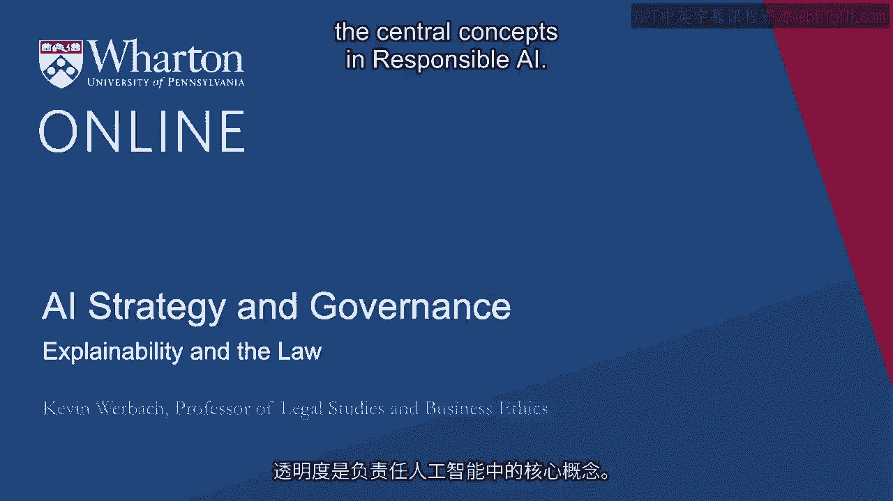

有许多现有和提议的法律框架会要求某种形式的可解释性。

至少在某些情况下。如果人工智能系统是一个黑箱。

没有办法评估，比如说，决策是否基于不合法的因素。

比如某人的种族或性取向。更普遍地说。

很难评估出了什么问题，甚至是否真的出了问题。

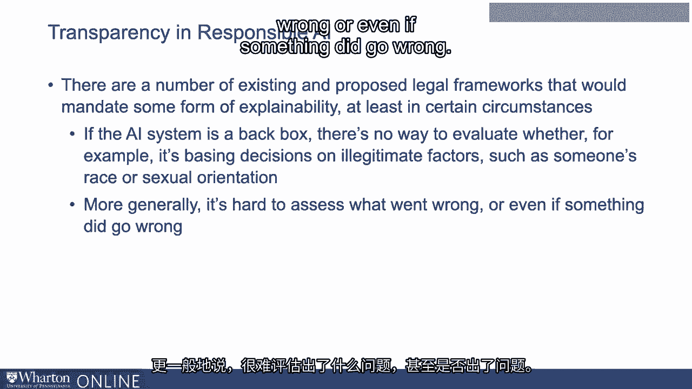

现有的最突出法律可解释性模型是信用报告。

信用局在1960年代发展，是数据分析在经济中首次大规模应用的重大例子之一。

它们迅速成为像美国这样的国家消费者金融市场的必需品。

以及其他如招聘等领域，使用信用报告数据来获取候选人的其他指示。

但很明显，信用报告的权力意味着一个不准确的报告。

或者以歧视性方式使用它，可能会造成严重后果。在没有监管的情况下。

消费者无法评估他们的信用评分如何影响决策。

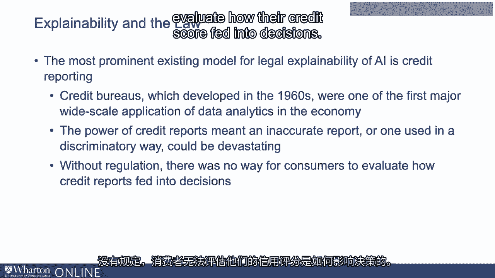

当1970年代美国的两部法律——《平等信贷机会法》（Equal Credit Opportunity Act，E。 Cola）通过时。

《公平信用报告法案》（Fair Credit Reporting Act，Ficro）对信用报告的法律可解释性施加了标准。

具体来说，这意味着企业必须在拒绝某人信用时发出不利行动通知。

这意味着要提供“主要原因”来说明决定。

他们不必列出每一个原因，也不需要给出算法的确切公式。

关于每个因素如何影响结果。但他们确实需要给客户一些指示，说明是什么驱动了不利的决定。

这给消费者提供了他们可以使用的信息，以便如果他们愿意，可以质疑该决定。

在他们认为基于某些错误或不当信息的情况下。

这可以在对公司没有不必要和不合理负担的情况下发生。

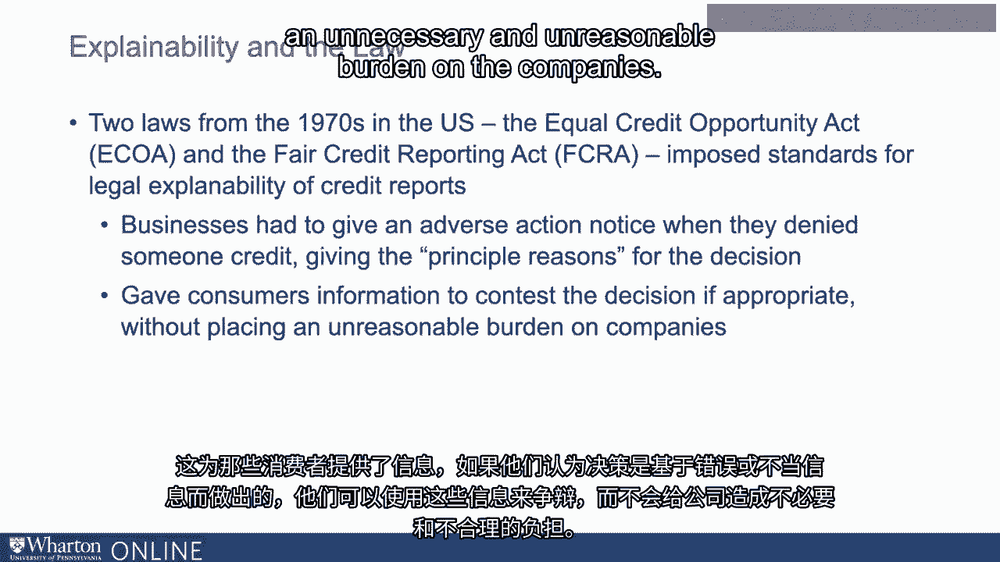

在某些情况下，政府规定具体的披露公式。例如。

美国的信用卡优惠必须包含一个所谓的“shoomer box”，这是要求该立法的参议员赞助的。

它以标准、受监管、易于理解的方式陈述利率和其他条款。

虽然目前尚无类似于人工智能系统的东西。

科技公司正在尝试类似的披露方式。

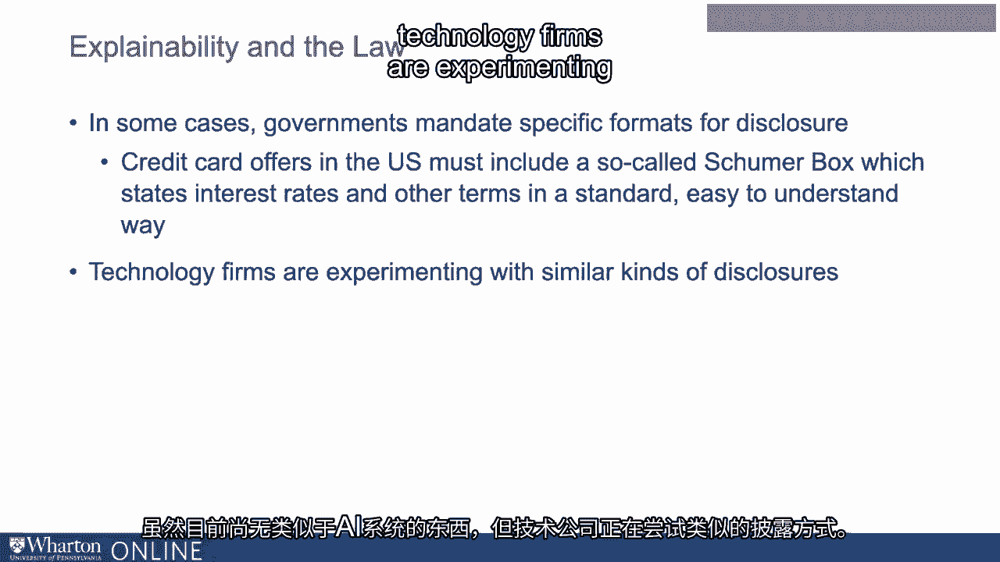

因为这再次给用户，甚至在某些情况下给其他开发者，提供了更容易理解发生了什么的机会。

例如，谷歌引入了一种名为模型卡的东西。

一种标准化的描述机器学习系统模型的方式。

而微软也有类似的叫做“数据集的数据表”。

“这又是一种标准化的信息披露方式，关于数据集的情况。

这些帮助识别源数据和构建模型所涉及的技术。

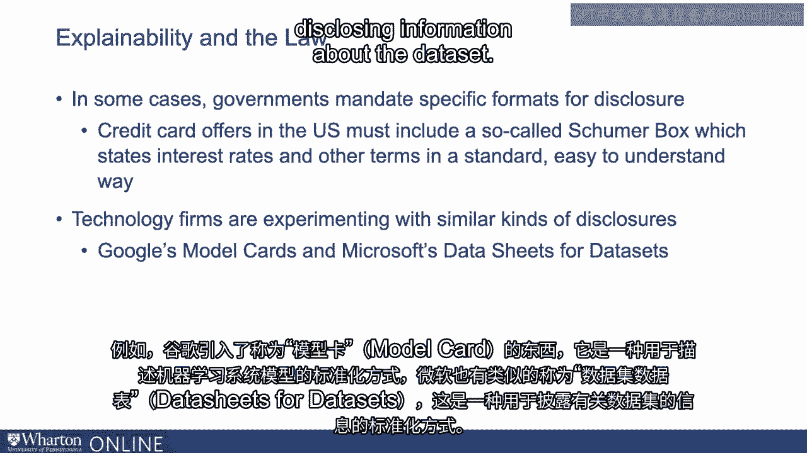

尽管并不一定要为每个内部专有AI系统设立类似机制。

某种标准化报告，至少要有机会向监管者披露。

即使不直接面向消费者，未来主要的AI系统似乎也可能如此。

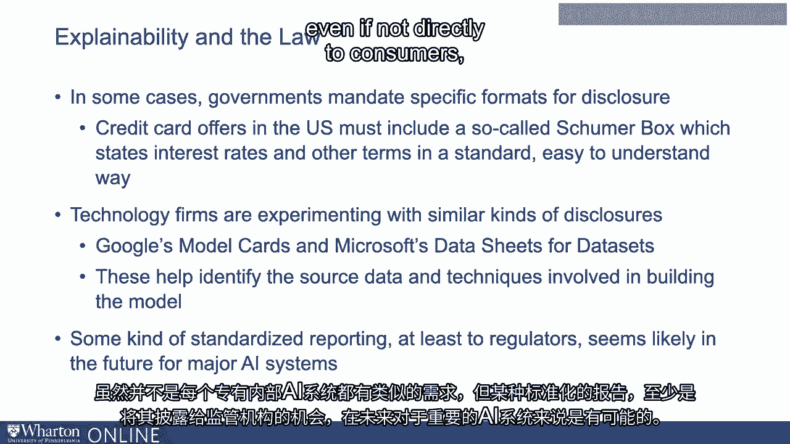

再次强调，如果监管者不知道发生了什么，他们无法判断是否出了问题。

欧洲GDPR，即通用数据保护条例，尽管它主要是一项隐私法。

包括通常所描述的在有限情况下的解释权。

所以如果有完全自动化处理，换句话说。

机器学习或其他算法系统完全决定了一个人所经历的事情。

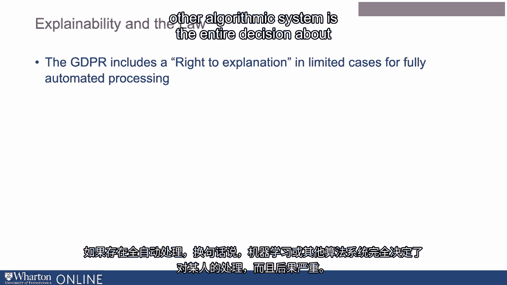

这会带来严重后果。结果可能是某人获得或未获得贷款、工作。

或某种法律后果。这个人会被提前释放吗？如果这些都属实。

然而，GDPR中有一些指示，系统实施者需要提供解释决策所依据的因素的信息。

不幸的是，这在实践中到底意味着什么并不明确。

GDPR中的语言有些笼统，需根据法律进行解释。

而且我们在实践中尚未有显著的案例法。

但它确实暗示了现有的欧洲法律，这同样适用于对任何地方的欧洲人收集的数据。

有一些依据要求提供解释。

而且这在未来可能会扩展。在美国。

至少有一起涉及休斯敦教师的联邦上诉法院案件，他们因基于学生测试分数的黑箱评估算法被解雇。

发现缺乏解释违反了教师们享有的宪法正当程序权利。

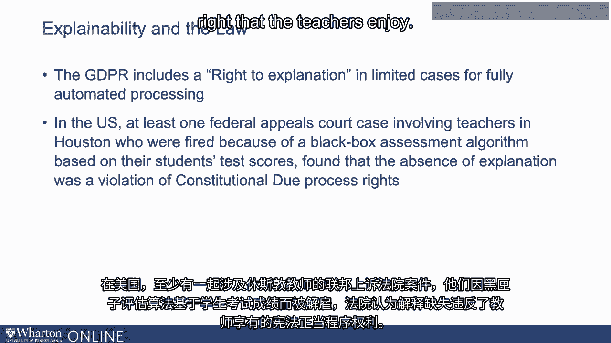

教师们无法挑战他们的解雇，因为他们只是知道这是基于算法的决定。

他们不知道算法是如何处理测试分数的。

这消除了在解雇决定不基于算法时他们所拥有的能力。

因此，法院表示他们的正当程序权利受到了侵犯。

算法必须被披露，或者其使用必须被消除。

这最终是该案件和解的结果。现在这在美国并不是法律。

但这表明在不同法律理论下，对解释要求的运动正在加速。

同样，在任何需要分配法律责任的情况下。

例如，涉及自主车辆的事故。

调查人员通常需要并能够访问计算机视觉系统的数据，以了解确切发生了什么。

系统是如何行为的，为什么？它认为自己在路上看到或没有看到什么？

因此，当发生事故调查后要求解释时，确实需要一种机制。

我之前提到的算法责任法案，是美国的一项提议法案。

欧盟的白皮书以及建议新人工智能立法的文件都提议在高风险人工智能系统部署前，必须提供正式的影响声明。

高风险指的是有可能导致非法歧视的系统。

如果出现问题，可能会导致伤害或重大的财务后果。在这些情况下。

算法影响声明将迫使公司或政府机构明确识别系统的工作方式。

与早期的信用报告法律一样，确切理解这些法律如何实施，以及在充分解释和公司所需灵活性之间找到适当平衡的道路还很漫长，特别是考虑到在技术上很难确切解释发生了什么。

例如，一个深度学习系统。但法律的确在朝这个方向发展。

所以当你有机会在内部更好地理解系统行为的解释时。

你应该尝试这样做。现在，一些关于这些算法影响声明的提案要求向公众披露。

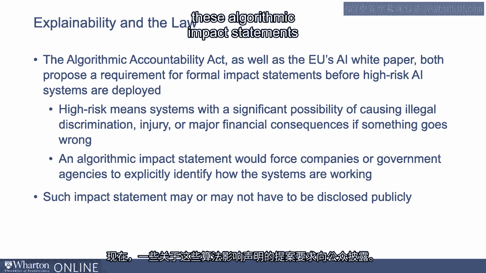

但即使他们不这样做，公司可能仍需向监管机构证明他们采取了必要措施，并在影响评估中评估或解决可能的危害。

所以再次强调，如果可以的话，提前考虑你拥有的可解释性机制是值得的。

这些潜在的法律要求也会推动研究人员和供应商开发更好的可解释人工智能技术和工具。

目前有许多解决方案，但未来会有更多更好的解决方案。

人工智能的一大优势是它能够发现人类无法察觉的联系。然而。

更好地理解人工智能系统如何做出决策以及发生了什么，将惠及所有人。

与您交谈并分享关于人工智能、法律和伦理的见解，我感到非常高兴。

祝你在这个项目的其余部分以及在你的组织中实施这些技术时好运。

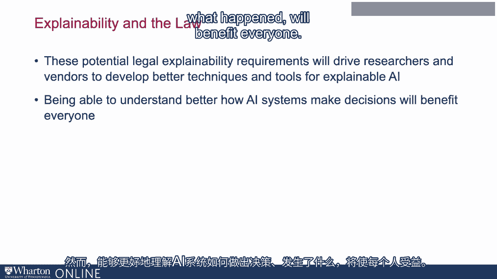

谢谢你。

