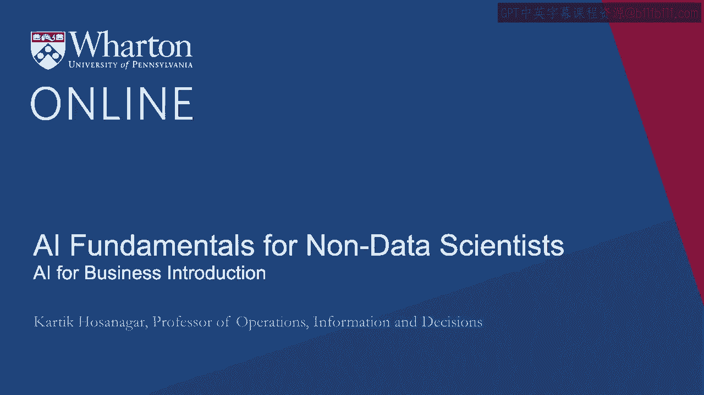
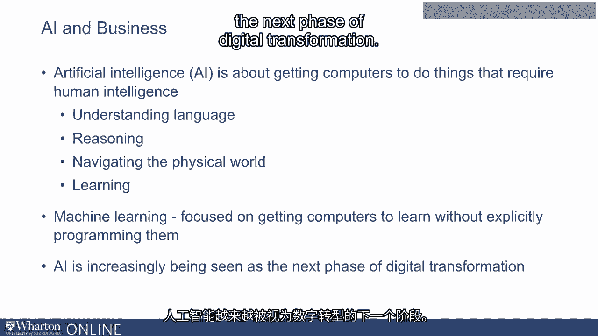
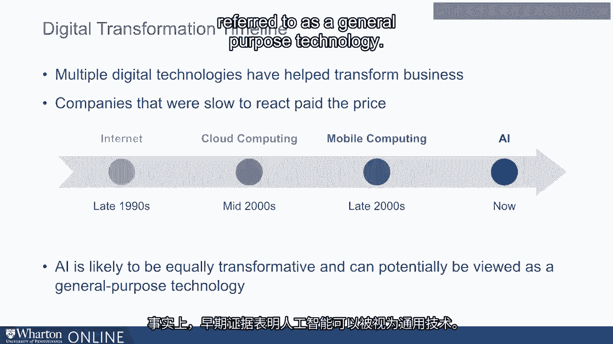
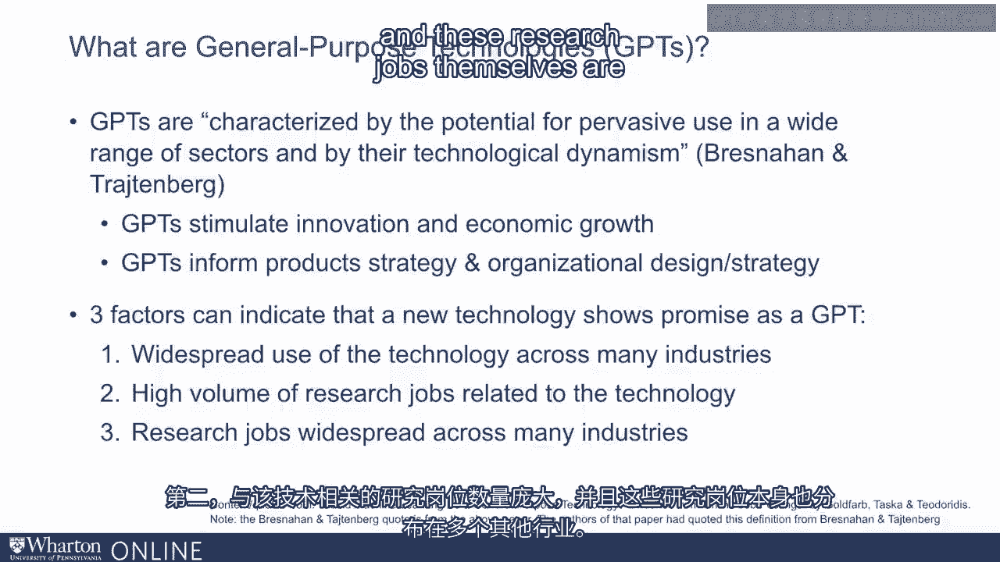
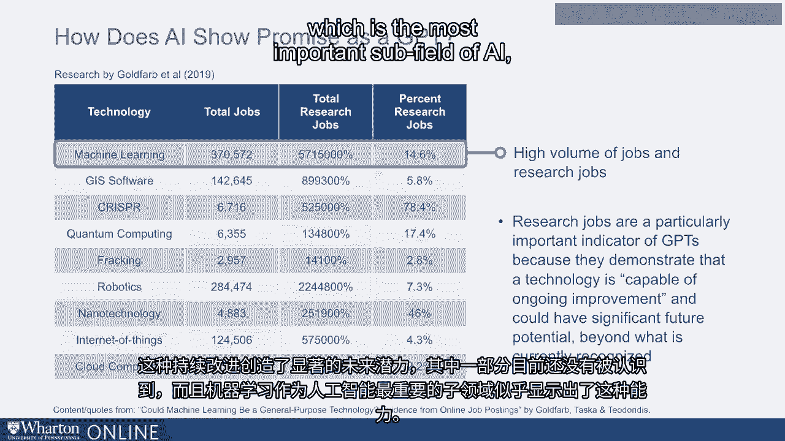
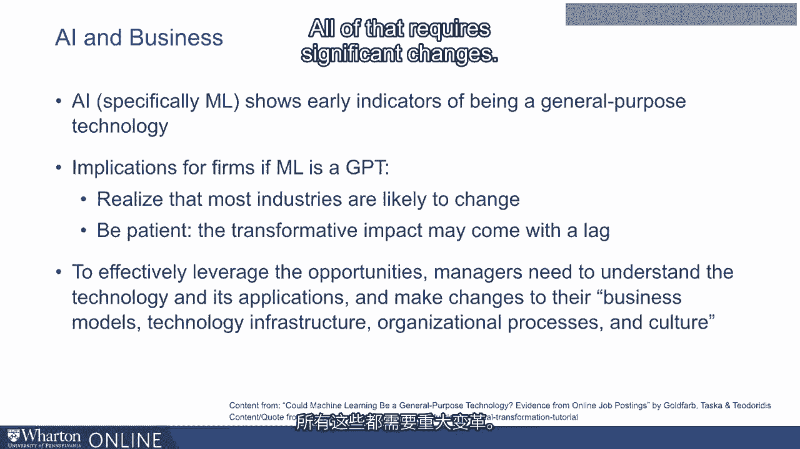

# 沃顿商学院《AI用于商业：AI基础／市场营销+财务／人力／管理》（中英字幕） - P1：0_面向业务的AI简介.zh_en - GPT中英字幕课程资源 - BV1Ju4y157dK

欢迎。这是一门关于商业AI的课程。在这门课程中，我们将从。

从管理的角度来看。我们研究了几个人工智能在商业中的应用案例。

我们将研究一个战略框架，供管理者使用，以获得收益。

从AI投资中获得收益。我是卡尔蒂克·哈萨纳加。我是一名技术与数字。

沃顿商学院的商业研究。我研究的重点是数字经济。因此。

我关注互联网商务、数字媒体、数字营销和基于数据的决策。

我之前是Yodl的联合创始人，这是一种针对小企业的营销平台。

多年来我与许多初创企业和大公司合作，关注。

特别关注人工智能和数据科学在商业中的应用。我也是一名作者。

这本书的名字是《人类的机器智能指南》。

关注使用人工智能的影响。

智能以便在企业内部和外部做出商业决策。

人工智能或AI无处不在。AI旨在让计算机完成。

需要人类智能的各种事情。例如，理解语言、推理。

物理世界、学习等等。机器学习是人工智能的一个子领域，专注于。

关于让计算机在没有明确编程的情况下学习。人工智能正在不断发展。

被视为数字转型的下一个阶段。多年来，各种不同的数字。

技术帮助实现了商业转型。

这是组织或转型的理念，包括公司和活动。

并利用数字技术创造的新机遇。现在。

在90年代末，帮助实现这一转型的技术是互联网。

一些公司开设在线部门以利用这一机会。

不幸的是，一些公司在之后也关闭了这些在线部门。

在互联网泡沫期间。那些坚持的少数公司实际上在长期内受益匪浅。

而没有坚持的公司最终付出了重大代价。在2000年代中期。

云计算同样带来了类似的变化。在这里，许多公司。

开始投资云计算。但再次提到，一些公司在面临挑战时选择退出。

意识到他们早期进入云计算的尝试面临许多相关挑战。

在将数据迁移到云端或遵守监管合规方面的安全问题。但这些。

退出的公司再次付出了代价，而坚持的公司则。

那些在长期内处于良好定位并帮助创造一定收益的公司。

带来商业敏捷性，这在长期内帮助了他们。在2000年代末，移动计算。

帮助创造了类似的变化。那些早期投资于移动计算的公司帮助。

真的创造了以移动为主的产品，并帮助转型企业。

进入一个移动世界。如今，人工智能似乎也将具有同样的变革性。

实际上，有早期证据表明，人工智能可以被视为通常所说的。

作为一种通用技术。现在，通用技术是指在多个不同的行业中。

其在多个行业广泛应用的潜力。而这些通用技术。

技术能够激励创新并推动经济增长。在组织层面上。

它们还可以为产品战略和组织整体设计提供信息。现在。

三个因素被视为技术是否为通用技术的指示。

第一个因素是该技术在多个行业中广泛应用。

第二个因素是与该技术相关的大量研究职位。

而这些研究职位本身也分布在其他多个行业中。

在Goldfarb等人的一项研究中，研究人员探讨了人工智能。

显示出作为通用技术的潜力。因此，他们研究了一些最近的技术。

在媒体上受到关注。例如，机器学习、地理信息。

系统、CRISPR、量子计算、压裂、机器人技术、纳米技术、物联网。

以及云计算。他们还考察了数百万个职位发布，并对这些职位进行了分类。

基于与哪些技术相关。他们评估了机器学习。

作为人工智能的一个子领域，看起来是否不同。正如你在幻灯片中看到的。

研究人员发现，许多职位发布与机器学习有关。

还包括其他一些技术，如机器人技术和云计算。事实上，最多可达14。

6%几乎占所有机器学习相关职位的15%。现在的研究。

相关工作是通用技术的重要指标，因为它们。

帮助展示该技术具有持续改进的能力。

而这种持续的改进，创造了显著的未来潜力。

一些目前尚未被认可的内容。当然，机器学习。

人工智能的最重要子领域似乎展示了这一能力。

研究人员还考察了工作，尤其是机器学习职位是否分布广泛。

他们确实发现机器学习职位可以。

可以在多个不同的行业中看到，主要是在教育服务、专业。

服务、制造业、金融服务等。相比之下。

其他一些技术，如量子计算，主要出现在一两个行业，例如专业服务。

简而言之，似乎机器学习职位在多个行业中可用，并且。

多个行业今天都看到这些技能的价值。接下来，研究人员观察是否。

特别是研究职位在各个行业中也普遍存在。而在这里，研究人员。

发现许多行业，包括制造业、专业服务、信息。

与技术相关的职位，金融、教育，所有这些都需要与之相关的研究职位。

机器学习。并不是所有其他技术都表现出这种广泛性。简而言之，有很多。

这些统计数据确实表明，尤其是机器学习和人工智能总体上可能会。

一种通用技术。这有许多含义。首先是公司。

经理们需要意识到机器学习和人工智能将在广泛。

在各种行业中，仅仅因为你不是技术行业并不意味着你。

免受影响，机器学习的变革性影响。其次，事实上。

很多这些工作是研究职位，这也意味着技术的发展也表明这一点。

经理们需要对技术保持耐心。技术的变革性影响可能。

伴随着缺乏。因此，为了有效利用这些机会。

经理们需要理解技术及其应用。

他们需要对他们的商业模式、技术基础设施进行许多改变。

适应他们的组织流程和文化。

所有这些都需要重大变化。本课程的目的是帮助你。

达到这一点。[BLANK_AUDIO]。

